```mermaid
graph TD;
  AnimationBase:::currentBaseStyle
AnimationBase --> HouseAnimationBase
AnimationBase --> RoadStopAnimationBase
AnimationBase --> IndustryAnimationBase
AnimationBase --> AirportTileAnimationBase
AnimationBase --> ObjectAnimationBase
AnimationBase --> StationAnimationBase

 classDef currentBaseStyle color:#000000,fill:#7CB9F4

%% Swimm:
%% graph TD;
%%   AnimationBase:::currentBaseStyle
%% <SwmToken path="src/newgrf_animation_base.h" pos="43:2:2" line-data="struct AnimationBase {">`AnimationBase`</SwmToken> --> HouseAnimationBase
%% <SwmToken path="src/newgrf_animation_base.h" pos="43:2:2" line-data="struct AnimationBase {">`AnimationBase`</SwmToken> --> RoadStopAnimationBase
%% <SwmToken path="src/newgrf_animation_base.h" pos="43:2:2" line-data="struct AnimationBase {">`AnimationBase`</SwmToken> --> IndustryAnimationBase
%% <SwmToken path="src/newgrf_animation_base.h" pos="43:2:2" line-data="struct AnimationBase {">`AnimationBase`</SwmToken> --> AirportTileAnimationBase
%% <SwmToken path="src/newgrf_animation_base.h" pos="43:2:2" line-data="struct AnimationBase {">`AnimationBase`</SwmToken> --> ObjectAnimationBase
%% <SwmToken path="src/newgrf_animation_base.h" pos="43:2:2" line-data="struct AnimationBase {">`AnimationBase`</SwmToken> --> StationAnimationBase
%% 
%%  classDef currentBaseStyle color:#000000,fill:#7CB9F4
```

This document will cover the <SwmToken path="src/newgrf_animation_base.h" pos="43:2:2" line-data="struct AnimationBase {">`AnimationBase`</SwmToken> class. We will cover:

1. What <SwmToken path="src/newgrf_animation_base.h" pos="43:2:2" line-data="struct AnimationBase {">`AnimationBase`</SwmToken> is.
2. Variables and functions in <SwmToken path="src/newgrf_animation_base.h" pos="43:2:2" line-data="struct AnimationBase {">`AnimationBase`</SwmToken>.
3. Usage example of <SwmToken path="src/newgrf_animation_base.h" pos="43:2:2" line-data="struct AnimationBase {">`AnimationBase`</SwmToken> in `HouseAnimationBase`.



# What is <SwmToken path="src/newgrf_animation_base.h" pos="43:2:2" line-data="struct AnimationBase {">`AnimationBase`</SwmToken>

<SwmToken path="src/newgrf_animation_base.h" pos="43:2:2" line-data="struct AnimationBase {">`AnimationBase`</SwmToken> is a helper class for a unified approach to <SwmToken path="src/newgrf_animation_base.h" pos="56:15:15" line-data="		/* Acquire the animation speed from the NewGRF. */">`NewGRF`</SwmToken> animation in <SwmToken path="src/newgrf_animation_base.h" pos="2:13:13" line-data=" * This file is part of OpenTTD.">`OpenTTD`</SwmToken>. It is a template class that provides functionality to animate tiles based on various specifications and callbacks. This class is used to manage the animation frames, handle callbacks, and update the animation state of tiles in the game.

<SwmSnippet path="/src/newgrf_animation_base.h" line="43">

---

# Variables and functions

The <SwmToken path="src/newgrf_animation_base.h" pos="43:2:2" line-data="struct AnimationBase {">`AnimationBase`</SwmToken> class is defined as a template struct with several template parameters including <SwmToken path="src/newgrf_animation_base.h" pos="58:11:11" line-data="		if (HasBit(spec-&gt;callback_mask, Tbase::cbm_animation_speed)) {">`Tbase`</SwmToken>, <SwmToken path="src/newgrf_animation_base.h" pos="52:9:9" line-data="	static void AnimateTile(const Tspec *spec, Tobj *obj, TileIndex tile, bool random_animation, Textra extra_data = 0)">`Tspec`</SwmToken>, <SwmToken path="src/newgrf_animation_base.h" pos="52:15:15" line-data="	static void AnimateTile(const Tspec *spec, Tobj *obj, TileIndex tile, bool random_animation, Textra extra_data = 0)">`Tobj`</SwmToken>, <SwmToken path="src/newgrf_animation_base.h" pos="52:31:31" line-data="	static void AnimateTile(const Tspec *spec, Tobj *obj, TileIndex tile, bool random_animation, Textra extra_data = 0)">`Textra`</SwmToken>, <SwmToken path="src/newgrf_animation_base.h" pos="59:7:7" line-data="			uint16_t callback = GetCallback(Tbase::cb_animation_speed, 0, 0, spec, obj, tile, extra_data);">`GetCallback`</SwmToken>, and <SwmToken path="src/newgrf_animation_base.h" pos="72:7:7" line-data="		uint8_t frame      = Tframehelper::Get(obj, tile);">`Tframehelper`</SwmToken>.

```c
struct AnimationBase {
```

---

</SwmSnippet>

<SwmSnippet path="/src/newgrf_animation_base.h" line="52">

---

The <SwmToken path="src/newgrf_animation_base.h" pos="52:5:5" line-data="	static void AnimateTile(const Tspec *spec, Tobj *obj, TileIndex tile, bool random_animation, Textra extra_data = 0)">`AnimateTile`</SwmToken> function is used to animate a single tile. It takes parameters such as the specification related to the tile, the object related to the tile, the tile index, a boolean indicating whether to pass random bits to the 'next frame' callback, and custom extra callback data. This function handles the animation speed, frame updates, and callback processing.

```c
	static void AnimateTile(const Tspec *spec, Tobj *obj, TileIndex tile, bool random_animation, Textra extra_data = 0)
	{
		assert(spec != nullptr);

		/* Acquire the animation speed from the NewGRF. */
		uint8_t animation_speed = spec->animation.speed;
		if (HasBit(spec->callback_mask, Tbase::cbm_animation_speed)) {
			uint16_t callback = GetCallback(Tbase::cb_animation_speed, 0, 0, spec, obj, tile, extra_data);
			if (callback != CALLBACK_FAILED) {
				if (callback >= 0x100 && spec->grf_prop.grffile->grf_version >= 8) ErrorUnknownCallbackResult(spec->grf_prop.grffile->grfid, Tbase::cb_animation_speed, callback);
				animation_speed = Clamp(callback & 0xFF, 0, 16);
			}
		}

		/* An animation speed of 2 means the animation frame changes 4 ticks, and
		 * increasing this value by one doubles the wait. 0 is the minimum value
		 * allowed for animation_speed, which corresponds to 30ms, and 16 is the
		 * maximum, corresponding to around 33 minutes. */
		if (TimerGameTick::counter % (1ULL << animation_speed) != 0) return;

		uint8_t frame      = Tframehelper::Get(obj, tile);
```

---

</SwmSnippet>

<SwmSnippet path="/src/newgrf_animation_base.h" line="131">

---

The <SwmToken path="src/newgrf_animation_base.h" pos="131:5:5" line-data="	static void ChangeAnimationFrame(CallbackID cb, const Tspec *spec, Tobj *obj, TileIndex tile, uint32_t random_bits, uint32_t trigger, Textra extra_data = 0)">`ChangeAnimationFrame`</SwmToken> function checks a callback to determine the next animation step and executes that step. This includes stopping and starting animations, updating animation frames, and playing sounds. It takes parameters such as the callback ID, specification, object, tile index, random bits, trigger, and custom extra data.

```c
	static void ChangeAnimationFrame(CallbackID cb, const Tspec *spec, Tobj *obj, TileIndex tile, uint32_t random_bits, uint32_t trigger, Textra extra_data = 0)
	{
		uint16_t callback = GetCallback(cb, random_bits, trigger, spec, obj, tile, extra_data);
		if (callback == CALLBACK_FAILED) return;

		switch (callback & 0xFF) {
			case 0xFD: /* Do nothing. */         break;
			case 0xFE: AddAnimatedTile(tile, false); break;
			case 0xFF: DeleteAnimatedTile(tile); break;
			default:
				bool changed = Tframehelper::Set(obj, tile, callback);
				AddAnimatedTile(tile, changed);
				break;
		}

		/* If the lower 7 bits of the upper byte of the callback
		 * result are not empty, it is a sound effect. */
		if (GB(callback, 8, 7) != 0 && _settings_client.sound.ambient) PlayTileSound(spec->grf_prop.grffile, GB(callback, 8, 7), tile);
	}
```

---

</SwmSnippet>

&nbsp;

*This is an auto-generated document by Swimm AI 🌊 and has not yet been verified by a human*

<SwmMeta version="3.0.0" repo-id="Z2l0aHViJTNBJTNBT3BlblRURC1jb3BpbG90LWRlbW8lM0ElM0Fzd2ltbWlv" repo-name="OpenTTD-copilot-demo"><sup>Powered by [Swimm](/)</sup></SwmMeta>
