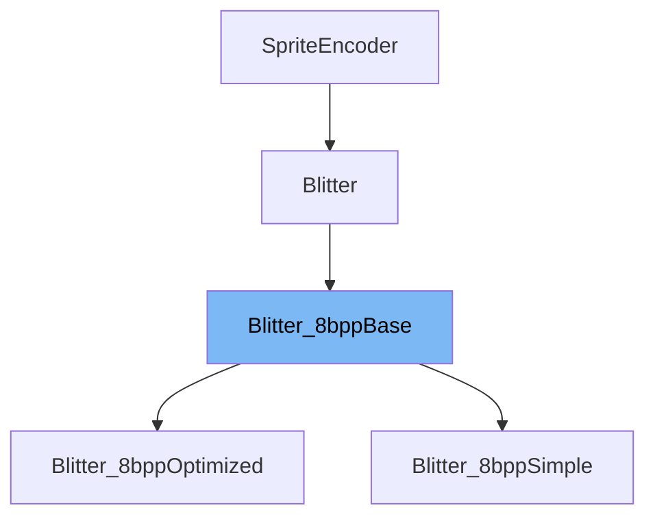

This document will cover the class <SwmToken path="src/blitter/8bpp_simple.hpp" pos="17:10:10" line-data="class Blitter_8bppSimple final : public Blitter_8bppBase {">`Blitter_8bppBase`</SwmToken> in detail. We will cover:

1. What <SwmToken path="src/blitter/8bpp_simple.hpp" pos="17:10:10" line-data="class Blitter_8bppSimple final : public Blitter_8bppBase {">`Blitter_8bppBase`</SwmToken> is.
2. Variables and functions in <SwmToken path="src/blitter/8bpp_simple.hpp" pos="17:10:10" line-data="class Blitter_8bppSimple final : public Blitter_8bppBase {">`Blitter_8bppBase`</SwmToken>.
3. Usage example of <SwmToken path="src/blitter/8bpp_simple.hpp" pos="17:10:10" line-data="class Blitter_8bppSimple final : public Blitter_8bppBase {">`Blitter_8bppBase`</SwmToken> in <SwmToken path="src/blitter/8bpp_simple.hpp" pos="17:2:2" line-data="class Blitter_8bppSimple final : public Blitter_8bppBase {">`Blitter_8bppSimple`</SwmToken>.



# What is <SwmToken path="src/blitter/8bpp_simple.hpp" pos="17:10:10" line-data="class Blitter_8bppSimple final : public Blitter_8bppBase {">`Blitter_8bppBase`</SwmToken>

The <SwmToken path="src/blitter/8bpp_simple.hpp" pos="17:10:10" line-data="class Blitter_8bppSimple final : public Blitter_8bppBase {">`Blitter_8bppBase`</SwmToken> class is a base class for all 8 bits per pixel (bpp) blitters in the <SwmToken path="src/blitter/8bpp_base.hpp" pos="2:13:13" line-data=" * This file is part of OpenTTD.">`OpenTTD`</SwmToken> project. It provides a set of virtual functions that are overridden by derived classes to implement specific blitting operations. This class is essential for handling graphical operations in <SwmToken path="src/blitter/8bpp_simple.hpp" pos="16:6:6" line-data="/** Most trivial 8bpp blitter. */">`8bpp`</SwmToken> mode.

<SwmSnippet path="/src/blitter/8bpp_base.hpp" line="18">

---

# Variables and functions

The function <SwmToken path="src/blitter/8bpp_base.hpp" pos="18:3:3" line-data="	uint8_t GetScreenDepth() override { return 8; }">`GetScreenDepth`</SwmToken> returns the screen depth, which is 8 bits per pixel for this blitter.

```c++
	uint8_t GetScreenDepth() override { return 8; }
```

---

</SwmSnippet>

<SwmSnippet path="/src/blitter/8bpp_base.hpp" line="19">

---

The function <SwmToken path="src/blitter/8bpp_base.hpp" pos="19:3:3" line-data="	void DrawColourMappingRect(void *dst, int width, int height, PaletteID pal) override;">`DrawColourMappingRect`</SwmToken> is used to draw a rectangle with color mapping on the destination surface.

```c++
	void DrawColourMappingRect(void *dst, int width, int height, PaletteID pal) override;
```

---

</SwmSnippet>

<SwmSnippet path="/src/blitter/8bpp_base.hpp" line="20">

---

The function <SwmToken path="src/blitter/8bpp_base.hpp" pos="20:4:4" line-data="	void *MoveTo(void *video, int x, int y) override;">`MoveTo`</SwmToken> moves the video pointer to a specified position (x, y).

```c++
	void *MoveTo(void *video, int x, int y) override;
```

---

</SwmSnippet>

<SwmSnippet path="/src/blitter/8bpp_base.hpp" line="21">

---

The function <SwmToken path="src/blitter/8bpp_base.hpp" pos="21:3:3" line-data="	void SetPixel(void *video, int x, int y, uint8_t colour) override;">`SetPixel`</SwmToken> sets a pixel at the specified position (x, y) with the given color.

```c++
	void SetPixel(void *video, int x, int y, uint8_t colour) override;
```

---

</SwmSnippet>

<SwmSnippet path="/src/blitter/8bpp_base.hpp" line="22">

---

The function <SwmToken path="src/blitter/8bpp_base.hpp" pos="22:3:3" line-data="	void DrawLine(void *video, int x, int y, int x2, int y2, int screen_width, int screen_height, uint8_t colour, int width, int dash) override;">`DrawLine`</SwmToken> draws a line from (x, y) to (x2, <SwmToken path="src/blitter/8bpp_base.hpp" pos="22:28:28" line-data="	void DrawLine(void *video, int x, int y, int x2, int y2, int screen_width, int screen_height, uint8_t colour, int width, int dash) override;">`y2`</SwmToken>) with the specified color, width, and dash pattern.

```c++
	void DrawLine(void *video, int x, int y, int x2, int y2, int screen_width, int screen_height, uint8_t colour, int width, int dash) override;
```

---

</SwmSnippet>

<SwmSnippet path="/src/blitter/8bpp_base.hpp" line="23">

---

The function <SwmToken path="src/blitter/8bpp_base.hpp" pos="23:3:3" line-data="	void DrawRect(void *video, int width, int height, uint8_t colour) override;">`DrawRect`</SwmToken> draws a rectangle with the specified width, height, and color.

```c++
	void DrawRect(void *video, int width, int height, uint8_t colour) override;
```

---

</SwmSnippet>

<SwmSnippet path="/src/blitter/8bpp_base.hpp" line="24">

---

The function <SwmToken path="src/blitter/8bpp_base.hpp" pos="24:3:3" line-data="	void CopyFromBuffer(void *video, const void *src, int width, int height) override;">`CopyFromBuffer`</SwmToken> copies data from a source buffer to the video surface.

```c++
	void CopyFromBuffer(void *video, const void *src, int width, int height) override;
```

---

</SwmSnippet>

<SwmSnippet path="/src/blitter/8bpp_base.hpp" line="25">

---

The function <SwmToken path="src/blitter/8bpp_base.hpp" pos="25:3:3" line-data="	void CopyToBuffer(const void *video, void *dst, int width, int height) override;">`CopyToBuffer`</SwmToken> copies data from the video surface to a destination buffer.

```c++
	void CopyToBuffer(const void *video, void *dst, int width, int height) override;
```

---

</SwmSnippet>

<SwmSnippet path="/src/blitter/8bpp_base.hpp" line="26">

---

The function <SwmToken path="src/blitter/8bpp_base.hpp" pos="26:3:3" line-data="	void CopyImageToBuffer(const void *video, void *dst, int width, int height, int dst_pitch) override;">`CopyImageToBuffer`</SwmToken> copies an image from the video surface to a destination buffer with a specified pitch.

```c++
	void CopyImageToBuffer(const void *video, void *dst, int width, int height, int dst_pitch) override;
```

---

</SwmSnippet>

<SwmSnippet path="/src/blitter/8bpp_base.hpp" line="27">

---

The function <SwmToken path="src/blitter/8bpp_base.hpp" pos="27:3:3" line-data="	void ScrollBuffer(void *video, int &amp;left, int &amp;top, int &amp;width, int &amp;height, int scroll_x, int scroll_y) override;">`ScrollBuffer`</SwmToken> scrolls the buffer by the specified x and y amounts.

```c++
	void ScrollBuffer(void *video, int &left, int &top, int &width, int &height, int scroll_x, int scroll_y) override;
```

---

</SwmSnippet>

<SwmSnippet path="/src/blitter/8bpp_base.hpp" line="28">

---

The function <SwmToken path="src/blitter/8bpp_base.hpp" pos="28:3:3" line-data="	size_t BufferSize(uint width, uint height) override;">`BufferSize`</SwmToken> returns the size of the buffer needed for the specified width and height.

```c++
	size_t BufferSize(uint width, uint height) override;
```

---

</SwmSnippet>

<SwmSnippet path="/src/blitter/8bpp_base.hpp" line="29">

---

The function <SwmToken path="src/blitter/8bpp_base.hpp" pos="29:3:3" line-data="	void PaletteAnimate(const Palette &amp;palette) override;">`PaletteAnimate`</SwmToken> animates the palette.

```c++
	void PaletteAnimate(const Palette &palette) override;
```

---

</SwmSnippet>

<SwmSnippet path="/src/blitter/8bpp_base.hpp" line="30">

---

The function <SwmToken path="src/blitter/8bpp_base.hpp" pos="30:5:5" line-data="	Blitter::PaletteAnimation UsePaletteAnimation() override;">`UsePaletteAnimation`</SwmToken> returns the type of palette animation used.

```c++
	Blitter::PaletteAnimation UsePaletteAnimation() override;
```

---

</SwmSnippet>

# Usage example

The <SwmToken path="src/blitter/8bpp_simple.hpp" pos="17:2:2" line-data="class Blitter_8bppSimple final : public Blitter_8bppBase {">`Blitter_8bppSimple`</SwmToken> class is a derived class that implements the <SwmToken path="src/blitter/8bpp_simple.hpp" pos="17:10:10" line-data="class Blitter_8bppSimple final : public Blitter_8bppBase {">`Blitter_8bppBase`</SwmToken> class. Here is an example of how <SwmToken path="src/blitter/8bpp_simple.hpp" pos="17:10:10" line-data="class Blitter_8bppSimple final : public Blitter_8bppBase {">`Blitter_8bppBase`</SwmToken> is used in <SwmToken path="src/blitter/8bpp_simple.hpp" pos="17:2:2" line-data="class Blitter_8bppSimple final : public Blitter_8bppBase {">`Blitter_8bppSimple`</SwmToken>.

<SwmSnippet path="/src/blitter/8bpp_simple.hpp" line="16">

---

The <SwmToken path="src/blitter/8bpp_simple.hpp" pos="17:2:2" line-data="class Blitter_8bppSimple final : public Blitter_8bppBase {">`Blitter_8bppSimple`</SwmToken> class inherits from <SwmToken path="src/blitter/8bpp_simple.hpp" pos="17:10:10" line-data="class Blitter_8bppSimple final : public Blitter_8bppBase {">`Blitter_8bppBase`</SwmToken> and provides specific implementations for the virtual functions defined in <SwmToken path="src/blitter/8bpp_simple.hpp" pos="17:10:10" line-data="class Blitter_8bppSimple final : public Blitter_8bppBase {">`Blitter_8bppBase`</SwmToken>.

```c++
/** Most trivial 8bpp blitter. */
class Blitter_8bppSimple final : public Blitter_8bppBase {
public:
```

---

</SwmSnippet>

&nbsp;

*This is an auto-generated document by Swimm AI 🌊 and has not yet been verified by a human*

<SwmMeta version="3.0.0" repo-id="Z2l0aHViJTNBJTNBT3BlblRURC1jb3BpbG90LWRlbW8lM0ElM0Fzd2ltbWlv" repo-name="OpenTTD-copilot-demo"><sup>Powered by [Swimm](/)</sup></SwmMeta>
