```mermaid
graph TD;
  BlitterFactory:::currentBaseStyle
BlitterFactory --> FBlitter_32bppSSE4
BlitterFactory --> FBlitter_32bppOptimized
BlitterFactory --> FBlitter_32bppSSE2_Anim
BlitterFactory --> FBlitter_32bppSSE2
BlitterFactory --> FBlitter_8bppSimple
BlitterFactory --> FBlitter_8bppOptimized
BlitterFactory --> FBlitter_Null
BlitterFactory --> FBlitter_32bppSSE4_Anim
BlitterFactory --> FBlitter_40bppAnim
BlitterFactory --> FBlitter_32bppSSSE3
BlitterFactory --> 1[...]

 classDef currentBaseStyle color:#000000,fill:#7CB9F4

%% Swimm:
%% graph TD;
%%   BlitterFactory:::currentBaseStyle
%% <SwmToken path="src/blitter/factory.hpp" pos="58:1:1" line-data="	BlitterFactory(const char *name, const char *description, bool usable = true) :">`BlitterFactory`</SwmToken> --> FBlitter_32bppSSE4
%% <SwmToken path="src/blitter/factory.hpp" pos="58:1:1" line-data="	BlitterFactory(const char *name, const char *description, bool usable = true) :">`BlitterFactory`</SwmToken> --> FBlitter_32bppOptimized
%% <SwmToken path="src/blitter/factory.hpp" pos="58:1:1" line-data="	BlitterFactory(const char *name, const char *description, bool usable = true) :">`BlitterFactory`</SwmToken> --> FBlitter_32bppSSE2_Anim
%% <SwmToken path="src/blitter/factory.hpp" pos="58:1:1" line-data="	BlitterFactory(const char *name, const char *description, bool usable = true) :">`BlitterFactory`</SwmToken> --> FBlitter_32bppSSE2
%% <SwmToken path="src/blitter/factory.hpp" pos="58:1:1" line-data="	BlitterFactory(const char *name, const char *description, bool usable = true) :">`BlitterFactory`</SwmToken> --> FBlitter_8bppSimple
%% <SwmToken path="src/blitter/factory.hpp" pos="58:1:1" line-data="	BlitterFactory(const char *name, const char *description, bool usable = true) :">`BlitterFactory`</SwmToken> --> FBlitter_8bppOptimized
%% <SwmToken path="src/blitter/factory.hpp" pos="58:1:1" line-data="	BlitterFactory(const char *name, const char *description, bool usable = true) :">`BlitterFactory`</SwmToken> --> FBlitter_Null
%% <SwmToken path="src/blitter/factory.hpp" pos="58:1:1" line-data="	BlitterFactory(const char *name, const char *description, bool usable = true) :">`BlitterFactory`</SwmToken> --> FBlitter_32bppSSE4_Anim
%% <SwmToken path="src/blitter/factory.hpp" pos="58:1:1" line-data="	BlitterFactory(const char *name, const char *description, bool usable = true) :">`BlitterFactory`</SwmToken> --> <SwmToken path="src/blitter/40bpp_anim.hpp" pos="48:2:2" line-data="class FBlitter_40bppAnim : public BlitterFactory {">`FBlitter_40bppAnim`</SwmToken>
%% <SwmToken path="src/blitter/factory.hpp" pos="58:1:1" line-data="	BlitterFactory(const char *name, const char *description, bool usable = true) :">`BlitterFactory`</SwmToken> --> FBlitter_32bppSSSE3
%% <SwmToken path="src/blitter/factory.hpp" pos="58:1:1" line-data="	BlitterFactory(const char *name, const char *description, bool usable = true) :">`BlitterFactory`</SwmToken> --> 1[...]
%% 
%%  classDef currentBaseStyle color:#000000,fill:#7CB9F4
```

This document will cover the <SwmToken path="src/blitter/factory.hpp" pos="58:1:1" line-data="	BlitterFactory(const char *name, const char *description, bool usable = true) :">`BlitterFactory`</SwmToken> class. We will cover:

1. What <SwmToken path="src/blitter/factory.hpp" pos="58:1:1" line-data="	BlitterFactory(const char *name, const char *description, bool usable = true) :">`BlitterFactory`</SwmToken> is.
2. Main variables and functions in <SwmToken path="src/blitter/factory.hpp" pos="58:1:1" line-data="	BlitterFactory(const char *name, const char *description, bool usable = true) :">`BlitterFactory`</SwmToken>.
3. Example of how to use <SwmToken path="src/blitter/factory.hpp" pos="58:1:1" line-data="	BlitterFactory(const char *name, const char *description, bool usable = true) :">`BlitterFactory`</SwmToken> in <SwmToken path="src/blitter/40bpp_anim.hpp" pos="48:2:2" line-data="class FBlitter_40bppAnim : public BlitterFactory {">`FBlitter_40bppAnim`</SwmToken>.



# What is <SwmToken path="src/blitter/factory.hpp" pos="58:1:1" line-data="	BlitterFactory(const char *name, const char *description, bool usable = true) :">`BlitterFactory`</SwmToken>

<SwmToken path="src/blitter/factory.hpp" pos="58:1:1" line-data="	BlitterFactory(const char *name, const char *description, bool usable = true) :">`BlitterFactory`</SwmToken> is a class defined in <SwmPath>[src/blitter/factory.hpp](src/blitter/factory.hpp)</SwmPath>. It serves as a base factory that keeps track of all available blitters. Blitters are responsible for rendering graphics in the game, and <SwmToken path="src/blitter/factory.hpp" pos="58:1:1" line-data="	BlitterFactory(const char *name, const char *description, bool usable = true) :">`BlitterFactory`</SwmToken> provides mechanisms to query, register, and manage these blitters.

<SwmSnippet path="/src/blitter/factory.hpp" line="23">

---

# Variables and functions

The variable <SwmToken path="src/blitter/factory.hpp" pos="23:7:7" line-data="	const std::string name;        ///&lt; The name of the blitter factory.">`name`</SwmToken> is used to store the name of the blitter factory.

```c++
	const std::string name;        ///< The name of the blitter factory.
```

---

</SwmSnippet>

<SwmSnippet path="/src/blitter/factory.hpp" line="24">

---

The variable <SwmToken path="src/blitter/factory.hpp" pos="24:7:7" line-data="	const std::string description; ///&lt; The description of the blitter.">`description`</SwmToken> is used to store a longer description of the blitter.

```c++
	const std::string description; ///< The description of the blitter.
```

---

</SwmSnippet>

<SwmSnippet path="/src/blitter/factory.hpp" line="32">

---

The function <SwmToken path="src/blitter/factory.hpp" pos="32:6:6" line-data="	static Blitters &amp;GetBlitters()">`GetBlitters`</SwmToken> returns a map of currently known blitters. It ensures that the map is initialized only once.

```c++
	static Blitters &GetBlitters()
	{
		static Blitters &s_blitters = *new Blitters();
		return s_blitters;
	}
```

---

</SwmSnippet>

<SwmSnippet path="/src/blitter/factory.hpp" line="42">

---

The function <SwmToken path="src/blitter/factory.hpp" pos="42:6:6" line-data="	static Blitter **GetActiveBlitter()">`GetActiveBlitter`</SwmToken> returns the currently active blitter. It ensures that the active blitter is initialized only once.

```c++
	static Blitter **GetActiveBlitter()
	{
		static Blitter *s_blitter = nullptr;
		return &s_blitter;
	}
```

---

</SwmSnippet>

<SwmSnippet path="/src/blitter/factory.hpp" line="58">

---

The constructor <SwmToken path="src/blitter/factory.hpp" pos="58:1:1" line-data="	BlitterFactory(const char *name, const char *description, bool usable = true) :">`BlitterFactory`</SwmToken> initializes the blitter with a name and description and registers it if it is usable. It ensures that no blitter with the same name is already registered.

```c++
	BlitterFactory(const char *name, const char *description, bool usable = true) :
			name(name), description(description)
	{
		if (usable) {
			Blitters &blitters = GetBlitters();
			assert(blitters.find(this->name) == blitters.end());
			/*
			 * Only add when the blitter is usable. Do not bail out or
			 * do more special things since the blitters are always
			 * instantiated upon start anyhow and freed upon shutdown.
			 */
			blitters.insert(Blitters::value_type(this->name, this));
		} else {
			Debug(driver, 1, "Not registering blitter {} as it is not usable", name);
		}
	}
```

---

</SwmSnippet>

<SwmSnippet path="/src/blitter/factory.hpp" line="79">

---

The function <SwmToken path="src/blitter/factory.hpp" pos="79:5:5" line-data="	virtual bool IsUsable() const">`IsUsable`</SwmToken> checks if the blitter is usable with the current drivers and hardware configuration. It returns true if the blitter can be instantiated.

```c++
	virtual bool IsUsable() const
	{
		return true;
	}
```

---

</SwmSnippet>

<SwmSnippet path="/src/blitter/factory.hpp" line="85">

---

The destructor <SwmToken path="src/blitter/factory.hpp" pos="85:3:4" line-data="	virtual ~BlitterFactory()">`~BlitterFactory`</SwmToken> unregisters the blitter and deletes the map of blitters if it is empty.

```c++
	virtual ~BlitterFactory()
	{
		GetBlitters().erase(this->name);
		if (GetBlitters().empty()) delete &GetBlitters();
	}
```

---

</SwmSnippet>

<SwmSnippet path="/src/blitter/factory.hpp" line="96">

---

The function <SwmToken path="src/blitter/factory.hpp" pos="96:6:6" line-data="	static Blitter *SelectBlitter(const std::string_view name)">`SelectBlitter`</SwmToken> finds the requested blitter by name and returns its instance. It sets the active blitter to the newly created instance.

```c++
	static Blitter *SelectBlitter(const std::string_view name)
	{
		BlitterFactory *b = GetBlitterFactory(name);
		if (b == nullptr) return nullptr;

		Blitter *newb = b->CreateInstance();
		delete *GetActiveBlitter();
		*GetActiveBlitter() = newb;

		Debug(driver, 1, "Successfully {} blitter '{}'", name.empty() ? "probed" : "loaded", newb->GetName());
		return newb;
	}
```

---

</SwmSnippet>

<SwmSnippet path="/src/blitter/factory.hpp" line="114">

---

The function <SwmToken path="src/blitter/factory.hpp" pos="114:6:6" line-data="	static BlitterFactory *GetBlitterFactory(const std::string_view name)">`GetBlitterFactory`</SwmToken> returns the blitter factory with the given name. It returns nullptr if no blitter factory with the wanted name is found.

```c++
	static BlitterFactory *GetBlitterFactory(const std::string_view name)
	{
#if defined(DEDICATED)
		const std::string_view default_blitter = "null";
#elif defined(WITH_COCOA)
		const std::string_view default_blitter = "32bpp-anim";
#else
		const std::string_view default_blitter = "8bpp-optimized";
#endif
		if (GetBlitters().empty()) return nullptr;
		const std::string_view bname = name.empty() ? default_blitter : name;

		for (auto &it : GetBlitters()) {
			BlitterFactory *b = it.second;
			if (StrEqualsIgnoreCase(bname, b->name)) {
				return b->IsUsable() ? b : nullptr;
			}
		}
		return nullptr;
	}
```

---

</SwmSnippet>

<SwmSnippet path="/src/blitter/factory.hpp" line="138">

---

The function <SwmToken path="src/blitter/factory.hpp" pos="138:6:6" line-data="	static Blitter *GetCurrentBlitter()">`GetCurrentBlitter`</SwmToken> returns the current active blitter. It is always set by calling <SwmToken path="src/blitter/factory.hpp" pos="96:6:6" line-data="	static Blitter *SelectBlitter(const std::string_view name)">`SelectBlitter`</SwmToken>.

```c++
	static Blitter *GetCurrentBlitter()
	{
		return *GetActiveBlitter();
	}
```

---

</SwmSnippet>

<SwmSnippet path="/src/blitter/factory.hpp" line="149">

---

The function <SwmToken path="src/blitter/factory.hpp" pos="149:5:5" line-data="	static void GetBlittersInfo(std::back_insert_iterator&lt;std::string&gt; &amp;output_iterator)">`GetBlittersInfo`</SwmToken> fills a buffer with information about the blitters. It iterates through the map of blitters and formats their names and descriptions.

```c++
	static void GetBlittersInfo(std::back_insert_iterator<std::string> &output_iterator)
	{
		fmt::format_to(output_iterator, "List of blitters:\n");
		for (auto &it : GetBlitters()) {
			BlitterFactory *b = it.second;
			fmt::format_to(output_iterator, "{:>18}: {}\n", b->name, b->GetDescription());
		}
		fmt::format_to(output_iterator, "\n");
	}
```

---

</SwmSnippet>

<SwmSnippet path="/src/blitter/factory.hpp" line="162">

---

The function <SwmToken path="src/blitter/factory.hpp" pos="162:5:5" line-data="	std::string_view GetName() const">`GetName`</SwmToken> returns the long, human-readable name for the blitter class.

```c++
	std::string_view GetName() const
	{
		return this->name;
	}
```

---

</SwmSnippet>

<SwmSnippet path="/src/blitter/factory.hpp" line="170">

---

The function <SwmToken path="src/blitter/factory.hpp" pos="170:5:5" line-data="	std::string_view GetDescription() const">`GetDescription`</SwmToken> returns a nice description of the blitter class.

```c++
	std::string_view GetDescription() const
	{
		return this->description;
	}
```

---

</SwmSnippet>

<SwmSnippet path="/src/blitter/factory.hpp" line="178">

---

The function <SwmToken path="src/blitter/factory.hpp" pos="178:6:6" line-data="	virtual Blitter *CreateInstance() = 0;">`CreateInstance`</SwmToken> is a pure virtual function that must be implemented by derived classes to create an instance of the blitter class.

```c++
	virtual Blitter *CreateInstance() = 0;
};
```

---

</SwmSnippet>

# Usage example

Here is an example of how to use <SwmToken path="src/blitter/factory.hpp" pos="58:1:1" line-data="	BlitterFactory(const char *name, const char *description, bool usable = true) :">`BlitterFactory`</SwmToken> in <SwmToken path="src/blitter/40bpp_anim.hpp" pos="48:2:2" line-data="class FBlitter_40bppAnim : public BlitterFactory {">`FBlitter_40bppAnim`</SwmToken>.

<SwmSnippet path="/src/blitter/40bpp_anim.hpp" line="18">

---

The class <SwmToken path="src/blitter/40bpp_anim.hpp" pos="48:2:2" line-data="class FBlitter_40bppAnim : public BlitterFactory {">`FBlitter_40bppAnim`</SwmToken> inherits from <SwmToken path="src/blitter/factory.hpp" pos="58:1:1" line-data="	BlitterFactory(const char *name, const char *description, bool usable = true) :">`BlitterFactory`</SwmToken> and implements the <SwmToken path="src/blitter/factory.hpp" pos="101:10:10" line-data="		Blitter *newb = b-&gt;CreateInstance();">`CreateInstance`</SwmToken> function to create an instance of the <SwmToken path="src/blitter/40bpp_anim.hpp" pos="35:16:16" line-data="	std::string_view GetName()  override { return &quot;40bpp-anim&quot;; }">`40bpp`</SwmToken> animated blitter.

```c++
class Blitter_40bppAnim : public Blitter_32bppOptimized {
public:

```

---

</SwmSnippet>

&nbsp;

*This is an auto-generated document by Swimm AI 🌊 and has not yet been verified by a human*

<SwmMeta version="3.0.0" repo-id="Z2l0aHViJTNBJTNBT3BlblRURC1jb3BpbG90LWRlbW8lM0ElM0Fzd2ltbWlv" repo-name="OpenTTD-copilot-demo"><sup>Powered by [Swimm](/)</sup></SwmMeta>
