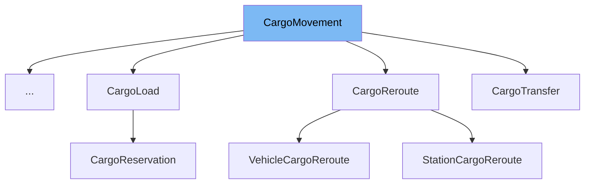

This document will cover the <SwmToken path="src/cargoaction.h" pos="62:1:1" line-data="	CargoMovement(Tsource *source, Tdest *destination, uint max_move) : source(source), destination(destination), max_move(max_move) {}">`CargoMovement`</SwmToken> class in the <SwmPath>[src/cargoaction.h](src/cargoaction.h)</SwmPath> file. We will discuss:

1. What <SwmToken path="src/cargoaction.h" pos="62:1:1" line-data="	CargoMovement(Tsource *source, Tdest *destination, uint max_move) : source(source), destination(destination), max_move(max_move) {}">`CargoMovement`</SwmToken> is.
2. The variables and functions defined in <SwmToken path="src/cargoaction.h" pos="62:1:1" line-data="	CargoMovement(Tsource *source, Tdest *destination, uint max_move) : source(source), destination(destination), max_move(max_move) {}">`CargoMovement`</SwmToken>.
3. An example of how to use <SwmToken path="src/cargoaction.h" pos="62:1:1" line-data="	CargoMovement(Tsource *source, Tdest *destination, uint max_move) : source(source), destination(destination), max_move(max_move) {}">`CargoMovement`</SwmToken> in <SwmToken path="src/cargoaction.h" pos="111:2:2" line-data="class CargoShift : public CargoMovement&lt;VehicleCargoList, VehicleCargoList&gt; {">`CargoShift`</SwmToken>.



# What is <SwmToken path="src/cargoaction.h" pos="62:1:1" line-data="	CargoMovement(Tsource *source, Tdest *destination, uint max_move) : source(source), destination(destination), max_move(max_move) {}">`CargoMovement`</SwmToken>

The <SwmToken path="src/cargoaction.h" pos="62:1:1" line-data="	CargoMovement(Tsource *source, Tdest *destination, uint max_move) : source(source), destination(destination), max_move(max_move) {}">`CargoMovement`</SwmToken> class in <SwmPath>[src/cargoaction.h](src/cargoaction.h)</SwmPath> is an abstract action for moving cargo from one list to another. It is used to facilitate the transfer of cargo between different cargo lists, such as from a vehicle to a station or from one vehicle to another.

<SwmSnippet path="/src/cargoaction.h" line="57">

---

# Variables and functions

The variable <SwmToken path="src/cargoaction.h" pos="57:4:4" line-data="	Tsource *source;    ///&lt; Source of the cargo.">`source`</SwmToken> is a pointer to the source of the cargo. It is defined as a protected member of the <SwmToken path="src/cargoaction.h" pos="62:1:1" line-data="	CargoMovement(Tsource *source, Tdest *destination, uint max_move) : source(source), destination(destination), max_move(max_move) {}">`CargoMovement`</SwmToken> class.

```c
	Tsource *source;    ///< Source of the cargo.
```

---

</SwmSnippet>

<SwmSnippet path="/src/cargoaction.h" line="58">

---

The variable <SwmToken path="src/cargoaction.h" pos="58:4:4" line-data="	Tdest *destination; ///&lt; Destination for the cargo.">`destination`</SwmToken> is a pointer to the destination for the cargo. It is defined as a protected member of the <SwmToken path="src/cargoaction.h" pos="62:1:1" line-data="	CargoMovement(Tsource *source, Tdest *destination, uint max_move) : source(source), destination(destination), max_move(max_move) {}">`CargoMovement`</SwmToken> class.

```c
	Tdest *destination; ///< Destination for the cargo.
```

---

</SwmSnippet>

<SwmSnippet path="/src/cargoaction.h" line="59">

---

The variable <SwmToken path="src/cargoaction.h" pos="59:3:3" line-data="	uint max_move;      ///&lt; Maximum amount of cargo to be moved with this action.">`max_move`</SwmToken> is an unsigned integer that represents the maximum amount of cargo to be moved with this action. It is defined as a protected member of the <SwmToken path="src/cargoaction.h" pos="62:1:1" line-data="	CargoMovement(Tsource *source, Tdest *destination, uint max_move) : source(source), destination(destination), max_move(max_move) {}">`CargoMovement`</SwmToken> class.

```c
	uint max_move;      ///< Maximum amount of cargo to be moved with this action.
```

---

</SwmSnippet>

<SwmSnippet path="/src/cargoaction.h" line="60">

---

The function <SwmToken path="src/cargoaction.h" pos="60:4:4" line-data="	CargoPacket *Preprocess(CargoPacket *cp);">`Preprocess`</SwmToken> takes a <SwmToken path="src/cargoaction.h" pos="60:1:1" line-data="	CargoPacket *Preprocess(CargoPacket *cp);">`CargoPacket`</SwmToken> pointer as a parameter and returns a <SwmToken path="src/cargoaction.h" pos="60:1:1" line-data="	CargoPacket *Preprocess(CargoPacket *cp);">`CargoPacket`</SwmToken> pointer. It is defined as a protected member function of the <SwmToken path="src/cargoaction.h" pos="62:1:1" line-data="	CargoMovement(Tsource *source, Tdest *destination, uint max_move) : source(source), destination(destination), max_move(max_move) {}">`CargoMovement`</SwmToken> class.

```c
	CargoPacket *Preprocess(CargoPacket *cp);
```

---

</SwmSnippet>

<SwmSnippet path="/src/cargoaction.h" line="62">

---

The constructor <SwmToken path="src/cargoaction.h" pos="62:1:1" line-data="	CargoMovement(Tsource *source, Tdest *destination, uint max_move) : source(source), destination(destination), max_move(max_move) {}">`CargoMovement`</SwmToken> initializes the <SwmToken path="src/cargoaction.h" pos="62:6:6" line-data="	CargoMovement(Tsource *source, Tdest *destination, uint max_move) : source(source), destination(destination), max_move(max_move) {}">`source`</SwmToken>, <SwmToken path="src/cargoaction.h" pos="62:12:12" line-data="	CargoMovement(Tsource *source, Tdest *destination, uint max_move) : source(source), destination(destination), max_move(max_move) {}">`destination`</SwmToken>, and <SwmToken path="src/cargoaction.h" pos="62:17:17" line-data="	CargoMovement(Tsource *source, Tdest *destination, uint max_move) : source(source), destination(destination), max_move(max_move) {}">`max_move`</SwmToken> members. It is defined as a public member function of the <SwmToken path="src/cargoaction.h" pos="62:1:1" line-data="	CargoMovement(Tsource *source, Tdest *destination, uint max_move) : source(source), destination(destination), max_move(max_move) {}">`CargoMovement`</SwmToken> class.

```c
	CargoMovement(Tsource *source, Tdest *destination, uint max_move) : source(source), destination(destination), max_move(max_move) {}
```

---

</SwmSnippet>

<SwmSnippet path="/src/cargoaction.h" line="68">

---

The function <SwmToken path="src/cargoaction.h" pos="68:3:3" line-data="	uint MaxMove() { return this-&gt;max_move; }">`MaxMove`</SwmToken> returns the amount of cargo this action can still move. It is defined as a public member function of the <SwmToken path="src/cargoaction.h" pos="62:1:1" line-data="	CargoMovement(Tsource *source, Tdest *destination, uint max_move) : source(source), destination(destination), max_move(max_move) {}">`CargoMovement`</SwmToken> class.

```c
	uint MaxMove() { return this->max_move; }
```

---

</SwmSnippet>

# Usage example

Here is an example of how to use <SwmToken path="src/cargoaction.h" pos="62:1:1" line-data="	CargoMovement(Tsource *source, Tdest *destination, uint max_move) : source(source), destination(destination), max_move(max_move) {}">`CargoMovement`</SwmToken> in <SwmToken path="src/cargoaction.h" pos="111:2:2" line-data="class CargoShift : public CargoMovement&lt;VehicleCargoList, VehicleCargoList&gt; {">`CargoShift`</SwmToken>.

<SwmSnippet path="/src/cargoaction.h" line="111">

---

The <SwmToken path="src/cargoaction.h" pos="111:2:2" line-data="class CargoShift : public CargoMovement&lt;VehicleCargoList, VehicleCargoList&gt; {">`CargoShift`</SwmToken> class extends <SwmToken path="src/cargoaction.h" pos="111:8:8" line-data="class CargoShift : public CargoMovement&lt;VehicleCargoList, VehicleCargoList&gt; {">`CargoMovement`</SwmToken> to shift cargo from one vehicle to another. It initializes the <SwmToken path="src/cargoaction.h" pos="113:6:6" line-data="	CargoShift(VehicleCargoList *source, VehicleCargoList *destination, uint max_move) :">`source`</SwmToken>, <SwmToken path="src/cargoaction.h" pos="113:12:12" line-data="	CargoShift(VehicleCargoList *source, VehicleCargoList *destination, uint max_move) :">`destination`</SwmToken>, and <SwmToken path="src/cargoaction.h" pos="113:17:17" line-data="	CargoShift(VehicleCargoList *source, VehicleCargoList *destination, uint max_move) :">`max_move`</SwmToken> members in its constructor and defines the <SwmToken path="src/cargoaction.h" pos="115:3:5" line-data="	bool operator()(CargoPacket *cp);">`operator()`</SwmToken> function to perform the cargo shift.

```c
class CargoShift : public CargoMovement<VehicleCargoList, VehicleCargoList> {
public:
	CargoShift(VehicleCargoList *source, VehicleCargoList *destination, uint max_move) :
			CargoMovement<VehicleCargoList, VehicleCargoList>(source, destination, max_move) {}
	bool operator()(CargoPacket *cp);
};
```

---

</SwmSnippet>

&nbsp;

*This is an auto-generated document by Swimm AI 🌊 and has not yet been verified by a human*

<SwmMeta version="3.0.0" repo-id="Z2l0aHViJTNBJTNBT3BlblRURC1jb3BpbG90LWRlbW8lM0ElM0Fzd2ltbWlv" repo-name="OpenTTD-copilot-demo"><sup>Powered by [Swimm](/)</sup></SwmMeta>
