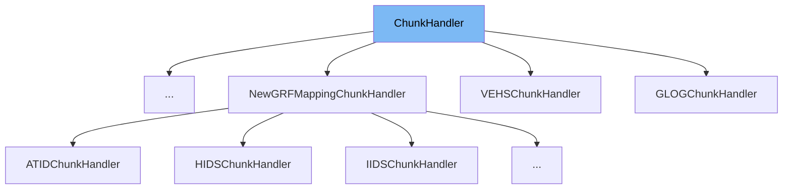

This document will cover the class <SwmToken path="src/saveload/saveload.h" pos="458:1:1" line-data="	ChunkHandler(uint32_t id, ChunkType type) : id(id), type(type) {}">`ChunkHandler`</SwmToken> in the <SwmToken path="src/saveload/saveload.h" pos="2:13:13" line-data=" * This file is part of OpenTTD.">`OpenTTD`</SwmToken> project. We will cover:

1. What is <SwmToken path="src/saveload/saveload.h" pos="458:1:1" line-data="	ChunkHandler(uint32_t id, ChunkType type) : id(id), type(type) {}">`ChunkHandler`</SwmToken>
2. Variables and functions
3. Usage example



# What is <SwmToken path="src/saveload/saveload.h" pos="458:1:1" line-data="	ChunkHandler(uint32_t id, ChunkType type) : id(id), type(type) {}">`ChunkHandler`</SwmToken>

The <SwmToken path="src/saveload/saveload.h" pos="458:1:1" line-data="	ChunkHandler(uint32_t id, ChunkType type) : id(id), type(type) {}">`ChunkHandler`</SwmToken> class in <SwmPath>[src/saveload/saveload.h](src/saveload/saveload.h)</SwmPath> is a structure used to handle chunks of data during the save and load operations in the <SwmToken path="src/saveload/saveload.h" pos="2:13:13" line-data=" * This file is part of OpenTTD.">`OpenTTD`</SwmToken> game. It provides a way to manage different types of chunks, ensuring that data is correctly saved and loaded, and that pointers are properly fixed after loading.

<SwmSnippet path="/src/saveload/saveload.h" line="455">

---

# Variables and functions

The variable <SwmToken path="src/saveload/saveload.h" pos="455:3:3" line-data="	uint32_t id;                          ///&lt; Unique ID (4 letters).">`id`</SwmToken> is a unique identifier for the chunk. It is a 4-letter code that uniquely identifies each chunk type.

```c
	uint32_t id;                          ///< Unique ID (4 letters).
```

---

</SwmSnippet>

<SwmSnippet path="/src/saveload/saveload.h" line="456">

---

The variable <SwmToken path="src/saveload/saveload.h" pos="456:3:3" line-data="	ChunkType type;                     ///&lt; Type of the chunk. @see ChunkType">`type`</SwmToken> specifies the type of the chunk. It uses the <SwmToken path="src/saveload/saveload.h" pos="456:1:1" line-data="	ChunkType type;                     ///&lt; Type of the chunk. @see ChunkType">`ChunkType`</SwmToken> enum to define the chunk type, such as <SwmToken path="src/saveload/saveload.h" pos="332:16:16" line-data="	SLV_RIFF_TO_ARRAY,                      ///&lt; 294  PR#9375 Changed many CH_RIFF chunks to CH_ARRAY chunks.">`CH_RIFF`</SwmToken>, <SwmToken path="src/saveload/saveload.h" pos="332:22:22" line-data="	SLV_RIFF_TO_ARRAY,                      ///&lt; 294  PR#9375 Changed many CH_RIFF chunks to CH_ARRAY chunks.">`CH_ARRAY`</SwmToken>, etc.

```c
	ChunkType type;                     ///< Type of the chunk. @see ChunkType
```

---

</SwmSnippet>

<SwmSnippet path="/src/saveload/saveload.h" line="458">

---

The constructor <SwmToken path="src/saveload/saveload.h" pos="458:1:11" line-data="	ChunkHandler(uint32_t id, ChunkType type) : id(id), type(type) {}">`ChunkHandler(uint32_t id, ChunkType type)`</SwmToken> initializes the <SwmToken path="src/saveload/saveload.h" pos="458:5:5" line-data="	ChunkHandler(uint32_t id, ChunkType type) : id(id), type(type) {}">`id`</SwmToken> and <SwmToken path="src/saveload/saveload.h" pos="458:10:10" line-data="	ChunkHandler(uint32_t id, ChunkType type) : id(id), type(type) {}">`type`</SwmToken> variables.

```c
	ChunkHandler(uint32_t id, ChunkType type) : id(id), type(type) {}
```

---

</SwmSnippet>

<SwmSnippet path="/src/saveload/saveload.h" line="460">

---

The destructor <SwmToken path="src/saveload/saveload.h" pos="460:1:10" line-data="	virtual ~ChunkHandler() = default;">`virtual ~ChunkHandler() = default`</SwmToken> is a virtual destructor, allowing derived classes to clean up resources properly.

```c
	virtual ~ChunkHandler() = default;
```

---

</SwmSnippet>

<SwmSnippet path="/src/saveload/saveload.h" line="466">

---

The function <SwmToken path="src/saveload/saveload.h" pos="466:1:9" line-data="	virtual void Save() const { NOT_REACHED(); }">`virtual void Save() const`</SwmToken> is a virtual function that must be overridden to save the chunk. If the chunk type is <SwmToken path="src/saveload/saveload.h" pos="450:1:1" line-data="	CH_READONLY, ///&lt; Chunk is never saved.">`CH_READONLY`</SwmToken>, this function should not be called.

```c
	virtual void Save() const { NOT_REACHED(); }
```

---

</SwmSnippet>

<SwmSnippet path="/src/saveload/saveload.h" line="472">

---

The function <SwmToken path="src/saveload/saveload.h" pos="472:1:13" line-data="	virtual void Load() const = 0;">`virtual void Load() const = 0`</SwmToken> is a pure virtual function that must be overridden to load the chunk.

```c
	virtual void Load() const = 0;
```

---

</SwmSnippet>

<SwmSnippet path="/src/saveload/saveload.h" line="480">

---

The function <SwmToken path="src/saveload/saveload.h" pos="480:1:9" line-data="	virtual void FixPointers() const {}">`virtual void FixPointers() const`</SwmToken> is a virtual function that can be overridden to fix pointers after loading. By default, it does nothing.

```c
	virtual void FixPointers() const {}
```

---

</SwmSnippet>

<SwmSnippet path="/src/saveload/saveload.h" line="487">

---

The function <SwmToken path="src/saveload/saveload.h" pos="487:1:16" line-data="	virtual void LoadCheck(size_t len = 0) const;">`virtual void LoadCheck(size_t len = 0) const`</SwmToken> is a virtual function that can be overridden to load the chunk for game preview. By default, it skips the data.

```c
	virtual void LoadCheck(size_t len = 0) const;
```

---

</SwmSnippet>

<SwmSnippet path="/src/saveload/saveload.h" line="489">

---

The function <SwmToken path="src/saveload/saveload.h" pos="489:1:9" line-data="	std::string GetName() const">`std::string GetName() const`</SwmToken> returns the name of the chunk as a string, constructed from the <SwmToken path="src/saveload/saveload.h" pos="492:10:10" line-data="			+ static_cast&lt;char&gt;(this-&gt;id &gt;&gt; 24)">`id`</SwmToken>.

```c
	std::string GetName() const
	{
		return std::string()
			+ static_cast<char>(this->id >> 24)
			+ static_cast<char>(this->id >> 16)
			+ static_cast<char>(this->id >> 8)
			+ static_cast<char>(this->id);
	}
```

---

</SwmSnippet>

<SwmSnippet path="/src/saveload/saveload.h" line="1271">

---

The function <SwmToken path="src/saveload/saveload.h" pos="1271:5:5" line-data="inline void *GetVariableAddress(const void *object, const SaveLoad &amp;sld)">`GetVariableAddress`</SwmToken> is used to get the address of a variable. It handles <SwmToken path="src/saveload/saveload.h" pos="1267:16:18" line-data=" * Get the address of the variable. Null-variables don&#39;t have an address,">`Null-variables`</SwmToken> and uses a callback function to return the address based on the <SwmToken path="src/saveload/saveload.h" pos="687:10:12" line-data="	SL_VAR         =  0, ///&lt; Save/load a variable.">`Save/load`</SwmToken> data and the current object.

```c
inline void *GetVariableAddress(const void *object, const SaveLoad &sld)
{
	/* Entry is a null-variable, mostly used to read old savegames etc. */
	if (GetVarMemType(sld.conv) == SLE_VAR_NULL) {
		assert(sld.address_proc == nullptr);
		return nullptr;
	}

	/* Everything else should be a non-null pointer. */
	assert(sld.address_proc != nullptr);
	return sld.address_proc(const_cast<void *>(object), sld.extra_data);
}
```

---

</SwmSnippet>

# Usage example

Here is an example of how to use <SwmToken path="src/saveload/saveload.h" pos="458:1:1" line-data="	ChunkHandler(uint32_t id, ChunkType type) : id(id), type(type) {}">`ChunkHandler`</SwmToken> in <SwmToken path="src/saveload/ai_sl.cpp" pos="75:2:2" line-data="struct AIPLChunkHandler : ChunkHandler {">`AIPLChunkHandler`</SwmToken>.

<SwmSnippet path="/src/saveload/ai_sl.cpp" line="511">

---

The <SwmToken path="src/saveload/ai_sl.cpp" pos="75:2:2" line-data="struct AIPLChunkHandler : ChunkHandler {">`AIPLChunkHandler`</SwmToken> class extends <SwmToken path="src/saveload/saveload.h" pos="458:1:1" line-data="	ChunkHandler(uint32_t id, ChunkType type) : id(id), type(type) {}">`ChunkHandler`</SwmToken> to handle AI player chunks. It overrides the necessary functions to save, load, and fix pointers for AI player data.

```c++

```

---

</SwmSnippet>

&nbsp;

*This is an auto-generated document by Swimm AI 🌊 and has not yet been verified by a human*

<SwmMeta version="3.0.0" repo-id="Z2l0aHViJTNBJTNBT3BlblRURC1jb3BpbG90LWRlbW8lM0ElM0Fzd2ltbWlv" repo-name="OpenTTD-copilot-demo"><sup>Powered by [Swimm](/)</sup></SwmMeta>
