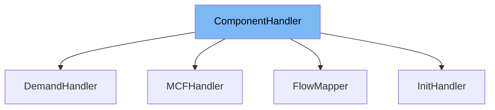

This document will cover the <SwmToken path="src/linkgraph/linkgraphschedule.h" pos="26:4:4" line-data="	virtual ~ComponentHandler() = default;">`ComponentHandler`</SwmToken> class. We will cover:

1. What <SwmToken path="src/linkgraph/linkgraphschedule.h" pos="26:4:4" line-data="	virtual ~ComponentHandler() = default;">`ComponentHandler`</SwmToken> is in the repo.
2. <SwmToken path="src/linkgraph/linkgraphschedule.h" pos="26:4:4" line-data="	virtual ~ComponentHandler() = default;">`ComponentHandler`</SwmToken>'s main variables and functions.
3. Example of how to use <SwmToken path="src/linkgraph/linkgraphschedule.h" pos="26:4:4" line-data="	virtual ~ComponentHandler() = default;">`ComponentHandler`</SwmToken> in <SwmToken path="src/linkgraph/flowmapper.h" pos="22:2:2" line-data="class FlowMapper : public ComponentHandler {">`FlowMapper`</SwmToken>.



# What is <SwmToken path="src/linkgraph/linkgraphschedule.h" pos="26:4:4" line-data="	virtual ~ComponentHandler() = default;">`ComponentHandler`</SwmToken>

The <SwmToken path="src/linkgraph/linkgraphschedule.h" pos="26:4:4" line-data="	virtual ~ComponentHandler() = default;">`ComponentHandler`</SwmToken> class in <SwmPath>[src/linkgraph/linkgraphschedule.h](src/linkgraph/linkgraphschedule.h)</SwmPath> is a handler that performs operations on a link graph component. It is designed to be stateless as it can be called concurrently from different threads. This ensures that it does not create potential desynchronization issues by reading or writing data outside the given component.

<SwmSnippet path="/src/linkgraph/linkgraphschedule.h" line="26">

---

# Variables and functions

The destructor <SwmToken path="src/linkgraph/linkgraphschedule.h" pos="26:3:4" line-data="	virtual ~ComponentHandler() = default;">`~ComponentHandler`</SwmToken> is defined as a virtual function to ensure that derived classes can clean up resources properly when an object is deleted.

```c
	virtual ~ComponentHandler() = default;
```

---

</SwmSnippet>

<SwmSnippet path="/src/linkgraph/linkgraphschedule.h" line="33">

---

The pure virtual function <SwmToken path="src/linkgraph/linkgraphschedule.h" pos="33:5:5" line-data="	virtual void Run(LinkGraphJob &amp;job) const = 0;">`Run`</SwmToken> is defined to be overridden by derived classes. It takes a <SwmToken path="src/linkgraph/linkgraphschedule.h" pos="33:7:7" line-data="	virtual void Run(LinkGraphJob &amp;job) const = 0;">`LinkGraphJob`</SwmToken> reference as a parameter and performs operations on it. This function must not read or write any data outside the given component to avoid potential desynchronization issues.

```c
	virtual void Run(LinkGraphJob &job) const = 0;
```

---

</SwmSnippet>

# Usage example

Here is an example of how to use <SwmToken path="src/linkgraph/linkgraphschedule.h" pos="26:4:4" line-data="	virtual ~ComponentHandler() = default;">`ComponentHandler`</SwmToken> in <SwmToken path="src/linkgraph/flowmapper.h" pos="22:2:2" line-data="class FlowMapper : public ComponentHandler {">`FlowMapper`</SwmToken>.

<SwmSnippet path="/src/linkgraph/flowmapper.h" line="22">

---

<SwmToken path="src/linkgraph/flowmapper.h" pos="22:2:2" line-data="class FlowMapper : public ComponentHandler {">`FlowMapper`</SwmToken> is a class that inherits from <SwmToken path="src/linkgraph/flowmapper.h" pos="22:8:8" line-data="class FlowMapper : public ComponentHandler {">`ComponentHandler`</SwmToken>. It overrides the <SwmToken path="src/linkgraph/linkgraphschedule.h" pos="33:5:5" line-data="	virtual void Run(LinkGraphJob &amp;job) const = 0;">`Run`</SwmToken> function to implement specific behavior for handling link graph components.

```c
class FlowMapper : public ComponentHandler {
```

---

</SwmSnippet>

&nbsp;

*This is an auto-generated document by Swimm AI 🌊 and has not yet been verified by a human*

<SwmMeta version="3.0.0" repo-id="Z2l0aHViJTNBJTNBT3BlblRURC1jb3BpbG90LWRlbW8lM0ElM0Fzd2ltbWlv" repo-name="OpenTTD-copilot-demo"><sup>Powered by [Swimm](/)</sup></SwmMeta>
