```mermaid
graph TD;
  ContentCallback:::currentBaseStyle
ContentCallback --> BaseNetworkContentDownloadStatusWindow
BaseNetworkContentDownloadStatusWindow --> BootstrapContentDownloadStatusWindow
BaseNetworkContentDownloadStatusWindow --> NetworkContentDownloadStatusWindow
ContentCallback --> ClientNetworkContentSocketHandler
ContentCallback --> NetworkContentListWindow
ContentCallback --> 1[...]

 classDef currentBaseStyle color:#000000,fill:#7CB9F4

%% Swimm:
%% graph TD;
%%   ContentCallback:::currentBaseStyle
%% <SwmToken path="src/network/network_content.h" pos="61:4:4" line-data="	virtual ~ContentCallback() = default;">`ContentCallback`</SwmToken> --> <SwmToken path="src/bootstrap_gui.cpp" pos="145:8:8" line-data="struct BootstrapContentDownloadStatusWindow : public BaseNetworkContentDownloadStatusWindow {">`BaseNetworkContentDownloadStatusWindow`</SwmToken>
%% <SwmToken path="src/bootstrap_gui.cpp" pos="145:8:8" line-data="struct BootstrapContentDownloadStatusWindow : public BaseNetworkContentDownloadStatusWindow {">`BaseNetworkContentDownloadStatusWindow`</SwmToken> --> <SwmToken path="src/bootstrap_gui.cpp" pos="145:2:2" line-data="struct BootstrapContentDownloadStatusWindow : public BaseNetworkContentDownloadStatusWindow {">`BootstrapContentDownloadStatusWindow`</SwmToken>
%% <SwmToken path="src/bootstrap_gui.cpp" pos="145:8:8" line-data="struct BootstrapContentDownloadStatusWindow : public BaseNetworkContentDownloadStatusWindow {">`BaseNetworkContentDownloadStatusWindow`</SwmToken> --> NetworkContentDownloadStatusWindow
%% <SwmToken path="src/network/network_content.h" pos="61:4:4" line-data="	virtual ~ContentCallback() = default;">`ContentCallback`</SwmToken> --> <SwmToken path="src/network/network_content.h" pos="67:2:2" line-data="class ClientNetworkContentSocketHandler : public NetworkContentSocketHandler, ContentCallback, HTTPCallback {">`ClientNetworkContentSocketHandler`</SwmToken>
%% <SwmToken path="src/network/network_content.h" pos="61:4:4" line-data="	virtual ~ContentCallback() = default;">`ContentCallback`</SwmToken> --> NetworkContentListWindow
%% <SwmToken path="src/network/network_content.h" pos="61:4:4" line-data="	virtual ~ContentCallback() = default;">`ContentCallback`</SwmToken> --> 1[...]
%% 
%%  classDef currentBaseStyle color:#000000,fill:#7CB9F4
```

This document will cover the <SwmToken path="src/network/network_content.h" pos="61:4:4" line-data="	virtual ~ContentCallback() = default;">`ContentCallback`</SwmToken> class in detail. We will cover:

1. What <SwmToken path="src/network/network_content.h" pos="61:4:4" line-data="	virtual ~ContentCallback() = default;">`ContentCallback`</SwmToken> is.
2. Variables and functions in <SwmToken path="src/network/network_content.h" pos="61:4:4" line-data="	virtual ~ContentCallback() = default;">`ContentCallback`</SwmToken>.
3. Usage example of <SwmToken path="src/network/network_content.h" pos="61:4:4" line-data="	virtual ~ContentCallback() = default;">`ContentCallback`</SwmToken> in <SwmToken path="src/bootstrap_gui.cpp" pos="293:2:2" line-data="class BootstrapEmscripten : public ContentCallback {">`BootstrapEmscripten`</SwmToken>.



# What is <SwmToken path="src/network/network_content.h" pos="61:4:4" line-data="	virtual ~ContentCallback() = default;">`ContentCallback`</SwmToken>

The <SwmToken path="src/network/network_content.h" pos="61:4:4" line-data="	virtual ~ContentCallback() = default;">`ContentCallback`</SwmToken> class in <SwmPath>[src/network/network_content.h](src/network/network_content.h)</SwmPath> is a structure designed to handle callbacks for notifying other parts of the system about incoming data related to content distribution. It is used within the network protocol handling content distribution in the <SwmToken path="src/network/network_content.h" pos="2:13:13" line-data=" * This file is part of OpenTTD.">`OpenTTD`</SwmToken> game.

<SwmSnippet path="/src/network/network_content.h" line="34">

---

# Variables and functions

The function <SwmToken path="src/network/network_content.h" pos="34:5:5" line-data="	virtual void OnConnect([[maybe_unused]] bool success) {}">`OnConnect`</SwmToken> is a virtual function that acts as a callback for when the connection has finished. It takes a boolean parameter <SwmToken path="src/network/network_content.h" pos="34:15:15" line-data="	virtual void OnConnect([[maybe_unused]] bool success) {}">`success`</SwmToken> to indicate whether the connection was successful or not.

```c
	virtual void OnConnect([[maybe_unused]] bool success) {}
```

---

</SwmSnippet>

<SwmSnippet path="/src/network/network_content.h" line="39">

---

The function <SwmToken path="src/network/network_content.h" pos="39:5:5" line-data="	virtual void OnDisconnect() {}">`OnDisconnect`</SwmToken> is a virtual function that acts as a callback for when the connection gets disconnected.

```c
	virtual void OnDisconnect() {}
```

---

</SwmSnippet>

<SwmSnippet path="/src/network/network_content.h" line="45">

---

The function <SwmToken path="src/network/network_content.h" pos="45:5:5" line-data="	virtual void OnReceiveContentInfo([[maybe_unused]] const ContentInfo *ci) {}">`OnReceiveContentInfo`</SwmToken> is a virtual function that acts as a callback for when content information is received. It takes a parameter <SwmToken path="src/network/network_content.h" pos="45:18:18" line-data="	virtual void OnReceiveContentInfo([[maybe_unused]] const ContentInfo *ci) {}">`ci`</SwmToken> which is a pointer to the received content information.

```c
	virtual void OnReceiveContentInfo([[maybe_unused]] const ContentInfo *ci) {}
```

---

</SwmSnippet>

<SwmSnippet path="/src/network/network_content.h" line="50">

---

The function <SwmToken path="src/network/network_content.h" pos="52:5:5" line-data="	virtual void OnDownloadProgress([[maybe_unused]] const ContentInfo *ci, [[maybe_unused]] int bytes) {}">`OnDownloadProgress`</SwmToken> is a virtual function that acts as a callback for reporting the progress of a file download. It takes two parameters: <SwmToken path="src/network/network_content.h" pos="45:18:18" line-data="	virtual void OnReceiveContentInfo([[maybe_unused]] const ContentInfo *ci) {}">`ci`</SwmToken> which is a pointer to the content information of the file, and <SwmToken path="src/network/network_content.h" pos="50:6:6" line-data="	 * @param bytes the number of bytes downloaded since the previous call">`bytes`</SwmToken> which indicates the number of bytes downloaded since the previous call.

```c
	 * @param bytes the number of bytes downloaded since the previous call
```

---

</SwmSnippet>

<SwmSnippet path="/src/network/network_content.h" line="55">

---

The function <SwmToken path="src/network/network_content.h" pos="58:5:5" line-data="	virtual void OnDownloadComplete([[maybe_unused]] ContentID cid) {}">`OnDownloadComplete`</SwmToken> is a virtual function that acts as a callback for when a file download is completed. It takes a parameter <SwmToken path="src/network/network_content.h" pos="56:6:6" line-data="	 * @param cid the ContentID of the downloaded file">`cid`</SwmToken> which is the <SwmToken path="src/network/network_content.h" pos="56:10:10" line-data="	 * @param cid the ContentID of the downloaded file">`ContentID`</SwmToken> of the downloaded file.

```c
	 * We have finished downloading a file
```

---

</SwmSnippet>

<SwmSnippet path="/src/network/network_content.h" line="61">

---

The destructor <SwmToken path="src/network/network_content.h" pos="61:3:4" line-data="	virtual ~ContentCallback() = default;">`~ContentCallback`</SwmToken> is a virtual function that ensures proper cleanup of resources when a <SwmToken path="src/network/network_content.h" pos="61:4:4" line-data="	virtual ~ContentCallback() = default;">`ContentCallback`</SwmToken> object is destroyed.

```c
	virtual ~ContentCallback() = default;
```

---

</SwmSnippet>

# Usage example

Here is an example of how to use <SwmToken path="src/network/network_content.h" pos="61:4:4" line-data="	virtual ~ContentCallback() = default;">`ContentCallback`</SwmToken> in <SwmToken path="src/bootstrap_gui.cpp" pos="293:2:2" line-data="class BootstrapEmscripten : public ContentCallback {">`BootstrapEmscripten`</SwmToken>.

<SwmSnippet path="/src/bootstrap_gui.cpp" line="301">

---

In <SwmToken path="src/bootstrap_gui.cpp" pos="293:2:2" line-data="class BootstrapEmscripten : public ContentCallback {">`BootstrapEmscripten`</SwmToken>, the <SwmToken path="src/network/network_content.h" pos="61:4:4" line-data="	virtual ~ContentCallback() = default;">`ContentCallback`</SwmToken> is used to add a callback and initiate a connection. The <SwmToken path="src/bootstrap_gui.cpp" pos="302:3:3" line-data="		_network_content_client.AddCallback(this);">`AddCallback`</SwmToken> function is called with <SwmToken path="src/bootstrap_gui.cpp" pos="302:5:5" line-data="		_network_content_client.AddCallback(this);">`this`</SwmToken> as the parameter, and then the <SwmToken path="src/bootstrap_gui.cpp" pos="303:3:3" line-data="		_network_content_client.Connect();">`Connect`</SwmToken> function is called to start the connection process.

```c++
	{
		_network_content_client.AddCallback(this);
		_network_content_client.Connect();
```

---

</SwmSnippet>

&nbsp;

*This is an auto-generated document by Swimm AI 🌊 and has not yet been verified by a human*

<SwmMeta version="3.0.0" repo-id="Z2l0aHViJTNBJTNBT3BlblRURC1jb3BpbG90LWRlbW8lM0ElM0Fzd2ltbWlv" repo-name="OpenTTD-copilot-demo"><sup>Powered by [Swimm](/)</sup></SwmMeta>
