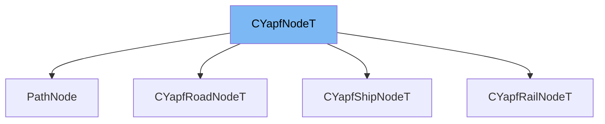

This document will cover the class <SwmToken path="src/pathfinder/yapf/yapf_node_rail.hpp" pos="120:3:3" line-data="	: CYapfNodeT&lt;Tkey_, CYapfRailNodeT&lt;Tkey_&gt; &gt;">`CYapfNodeT`</SwmToken> in detail. We will discuss:

1. What <SwmToken path="src/pathfinder/yapf/yapf_node_rail.hpp" pos="120:3:3" line-data="	: CYapfNodeT&lt;Tkey_, CYapfRailNodeT&lt;Tkey_&gt; &gt;">`CYapfNodeT`</SwmToken> is.
2. The variables and functions defined in <SwmToken path="src/pathfinder/yapf/yapf_node_rail.hpp" pos="120:3:3" line-data="	: CYapfNodeT&lt;Tkey_, CYapfRailNodeT&lt;Tkey_&gt; &gt;">`CYapfNodeT`</SwmToken>.
3. An example of how to use <SwmToken path="src/pathfinder/yapf/yapf_node_rail.hpp" pos="120:3:3" line-data="	: CYapfNodeT&lt;Tkey_, CYapfRailNodeT&lt;Tkey_&gt; &gt;">`CYapfNodeT`</SwmToken> in <SwmToken path="src/pathfinder/yapf/yapf_node_rail.hpp" pos="119:2:2" line-data="struct CYapfRailNodeT">`CYapfRailNodeT`</SwmToken>.



# What is <SwmToken path="src/pathfinder/yapf/yapf_node_rail.hpp" pos="120:3:3" line-data="	: CYapfNodeT&lt;Tkey_, CYapfRailNodeT&lt;Tkey_&gt; &gt;">`CYapfNodeT`</SwmToken>

<SwmToken path="src/pathfinder/yapf/yapf_node_rail.hpp" pos="120:3:3" line-data="	: CYapfNodeT&lt;Tkey_, CYapfRailNodeT&lt;Tkey_&gt; &gt;">`CYapfNodeT`</SwmToken> is a template structure defined in <SwmPath>[src/pathfinder/yapf/yapf_node.hpp](src/pathfinder/yapf/yapf_node.hpp)</SwmPath>. It represents a node in the pathfinder's graph and is used to store information about a specific node, including its key, parent, cost, and other attributes. This class is essential for pathfinding algorithms in the game, as it helps in evaluating and comparing different paths.

<SwmSnippet path="/src/pathfinder/yapf/yapf_node.hpp" line="63">

---

# Variables and functions

The variable <SwmToken path="src/pathfinder/yapf/yapf_node.hpp" pos="63:3:3" line-data="	Tkey_       m_key;">`m_key`</SwmToken> is used to store the key of the node, which includes information like the tile index and track direction.

```c++
	Tkey_       m_key;
```

---

</SwmSnippet>

<SwmSnippet path="/src/pathfinder/yapf/yapf_node.hpp" line="64">

---

The variable <SwmToken path="src/pathfinder/yapf/yapf_node.hpp" pos="64:4:4" line-data="	Node       *m_hash_next;">`m_hash_next`</SwmToken> is a pointer to the next node in the hash table, used for chaining in hash-based data structures.

```c++
	Node       *m_hash_next;
```

---

</SwmSnippet>

<SwmSnippet path="/src/pathfinder/yapf/yapf_node.hpp" line="65">

---

The variable <SwmToken path="src/pathfinder/yapf/yapf_node.hpp" pos="65:4:4" line-data="	Node       *m_parent;">`m_parent`</SwmToken> is a pointer to the parent node, which is used to trace the path back to the start node.

```c++
	Node       *m_parent;
```

---

</SwmSnippet>

<SwmSnippet path="/src/pathfinder/yapf/yapf_node.hpp" line="66">

---

The variable <SwmToken path="src/pathfinder/yapf/yapf_node.hpp" pos="66:3:3" line-data="	int         m_cost;">`m_cost`</SwmToken> stores the cost to reach this node from the start node.

```c++
	int         m_cost;
```

---

</SwmSnippet>

<SwmSnippet path="/src/pathfinder/yapf/yapf_node.hpp" line="67">

---

The variable <SwmToken path="src/pathfinder/yapf/yapf_node.hpp" pos="67:3:3" line-data="	int         m_estimate;">`m_estimate`</SwmToken> stores the estimated cost to reach the goal node from this node.

```c++
	int         m_estimate;
```

---

</SwmSnippet>

<SwmSnippet path="/src/pathfinder/yapf/yapf_node.hpp" line="68">

---

The variable <SwmToken path="src/pathfinder/yapf/yapf_node.hpp" pos="68:3:3" line-data="	bool        m_is_choice;">`m_is_choice`</SwmToken> is a boolean that indicates whether this node is a choice point in the pathfinding algorithm.

```c++
	bool        m_is_choice;
```

---

</SwmSnippet>

<SwmSnippet path="/src/pathfinder/yapf/yapf_node.hpp" line="70">

---

The function <SwmToken path="src/pathfinder/yapf/yapf_node.hpp" pos="70:5:5" line-data="	inline void Set(Node *parent, TileIndex tile, Trackdir td, bool is_choice)">`Set`</SwmToken> initializes the node with its parent, tile index, track direction, and whether it is a choice point.

```c++
	inline void Set(Node *parent, TileIndex tile, Trackdir td, bool is_choice)
	{
		m_key.Set(tile, td);
		m_hash_next = nullptr;
		m_parent = parent;
		m_cost = 0;
		m_estimate = 0;
		m_is_choice = is_choice;
	}
```

---

</SwmSnippet>

<SwmSnippet path="/src/pathfinder/yapf/yapf_node.hpp" line="80">

---

The function <SwmToken path="src/pathfinder/yapf/yapf_node.hpp" pos="80:6:6" line-data="	inline Node *GetHashNext()">`GetHashNext`</SwmToken> returns the next node in the hash table.

```c++
	inline Node *GetHashNext()
	{
		return m_hash_next;
	}
```

---

</SwmSnippet>

<SwmSnippet path="/src/pathfinder/yapf/yapf_node.hpp" line="85">

---

The function <SwmToken path="src/pathfinder/yapf/yapf_node.hpp" pos="85:5:5" line-data="	inline void SetHashNext(Node *pNext)">`SetHashNext`</SwmToken> sets the next node in the hash table.

```c++
	inline void SetHashNext(Node *pNext)
	{
		m_hash_next = pNext;
	}
```

---

</SwmSnippet>

<SwmSnippet path="/src/pathfinder/yapf/yapf_node.hpp" line="90">

---

The function <SwmToken path="src/pathfinder/yapf/yapf_node.hpp" pos="90:5:5" line-data="	inline TileIndex GetTile() const">`GetTile`</SwmToken> returns the tile index of the node.

```c++
	inline TileIndex GetTile() const
	{
		return m_key.m_tile;
	}
```

---

</SwmSnippet>

<SwmSnippet path="/src/pathfinder/yapf/yapf_node.hpp" line="95">

---

The function <SwmToken path="src/pathfinder/yapf/yapf_node.hpp" pos="95:5:5" line-data="	inline Trackdir GetTrackdir() const">`GetTrackdir`</SwmToken> returns the track direction of the node.

```c++
	inline Trackdir GetTrackdir() const
	{
		return m_key.m_td;
	}
```

---

</SwmSnippet>

<SwmSnippet path="/src/pathfinder/yapf/yapf_node.hpp" line="100">

---

The function <SwmToken path="src/pathfinder/yapf/yapf_node.hpp" pos="100:8:8" line-data="	inline const Tkey_ &amp;GetKey() const">`GetKey`</SwmToken> returns the key of the node.

```c++
	inline const Tkey_ &GetKey() const
	{
		return m_key;
	}
```

---

</SwmSnippet>

<SwmSnippet path="/src/pathfinder/yapf/yapf_node.hpp" line="105">

---

The function <SwmToken path="src/pathfinder/yapf/yapf_node.hpp" pos="105:5:5" line-data="	inline int GetCost() const">`GetCost`</SwmToken> returns the cost to reach this node from the start node.

```c++
	inline int GetCost() const
	{
		return m_cost;
	}
```

---

</SwmSnippet>

<SwmSnippet path="/src/pathfinder/yapf/yapf_node.hpp" line="110">

---

The function <SwmToken path="src/pathfinder/yapf/yapf_node.hpp" pos="110:5:5" line-data="	inline int GetCostEstimate() const">`GetCostEstimate`</SwmToken> returns the estimated cost to reach the goal node from this node.

```c++
	inline int GetCostEstimate() const
	{
		return m_estimate;
	}
```

---

</SwmSnippet>

<SwmSnippet path="/src/pathfinder/yapf/yapf_node.hpp" line="115">

---

The function <SwmToken path="src/pathfinder/yapf/yapf_node.hpp" pos="115:5:5" line-data="	inline bool GetIsChoice() const">`GetIsChoice`</SwmToken> returns whether this node is a choice point in the pathfinding algorithm.

```c++
	inline bool GetIsChoice() const
	{
		return m_is_choice;
	}
```

---

</SwmSnippet>

<SwmSnippet path="/src/pathfinder/yapf/yapf_node.hpp" line="120">

---

The operator `<` compares the estimated cost of this node with another node, used for priority queue operations.

```c++
	inline bool operator<(const Node &other) const
	{
		return m_estimate < other.m_estimate;
	}
```

---

</SwmSnippet>

<SwmSnippet path="/src/pathfinder/yapf/yapf_node.hpp" line="125">

---

The function <SwmToken path="src/pathfinder/yapf/yapf_node.hpp" pos="125:3:3" line-data="	void Dump(DumpTarget &amp;dmp) const">`Dump`</SwmToken> writes the node's data to a dump target, useful for debugging.

```c++
	void Dump(DumpTarget &dmp) const
	{
		dmp.WriteStructT("m_key", &m_key);
		dmp.WriteStructT("m_parent", m_parent);
		dmp.WriteValue("m_cost", m_cost);
		dmp.WriteValue("m_estimate", m_estimate);
	}
```

---

</SwmSnippet>

# Usage example

Here is an example of how to use <SwmToken path="src/pathfinder/yapf/yapf_node_rail.hpp" pos="120:3:3" line-data="	: CYapfNodeT&lt;Tkey_, CYapfRailNodeT&lt;Tkey_&gt; &gt;">`CYapfNodeT`</SwmToken> in <SwmToken path="src/pathfinder/yapf/yapf_node_rail.hpp" pos="119:2:2" line-data="struct CYapfRailNodeT">`CYapfRailNodeT`</SwmToken>.

<SwmSnippet path="/src/pathfinder/yapf/yapf_node_rail.hpp" line="119">

---

<SwmToken path="src/pathfinder/yapf/yapf_node_rail.hpp" pos="119:2:2" line-data="struct CYapfRailNodeT">`CYapfRailNodeT`</SwmToken> is a specialized version of <SwmToken path="src/pathfinder/yapf/yapf_node_rail.hpp" pos="120:3:3" line-data="	: CYapfNodeT&lt;Tkey_, CYapfRailNodeT&lt;Tkey_&gt; &gt;">`CYapfNodeT`</SwmToken> for rail nodes. It inherits from <SwmToken path="src/pathfinder/yapf/yapf_node_rail.hpp" pos="120:3:3" line-data="	: CYapfNodeT&lt;Tkey_, CYapfRailNodeT&lt;Tkey_&gt; &gt;">`CYapfNodeT`</SwmToken> and uses <SwmToken path="src/pathfinder/yapf/yapf_node.hpp" pos="44:2:2" line-data="struct CYapfNodeKeyTrackDir : public CYapfNodeKeyExitDir">`CYapfNodeKeyTrackDir`</SwmToken> as the key type.

```c++
struct CYapfRailNodeT
	: CYapfNodeT<Tkey_, CYapfRailNodeT<Tkey_> >
{
	typedef CYapfNodeT<Tkey_, CYapfRailNodeT<Tkey_> > base;
	typedef CYapfRailSegment CachedData;
```

---

</SwmSnippet>

&nbsp;

*This is an auto-generated document by Swimm AI 🌊 and has not yet been verified by a human*

<SwmMeta version="3.0.0" repo-id="Z2l0aHViJTNBJTNBT3BlblRURC1jb3BpbG90LWRlbW8lM0ElM0Fzd2ltbWlv" repo-name="OpenTTD-copilot-demo"><sup>Powered by [Swimm](/)</sup></SwmMeta>
