```mermaid
graph TD;
  CYapfT:::currentBaseStyle
CYapfT --> CYapfShip
CYapfT --> CYapfRail1
CYapfT --> CYapfRail2
CYapfT --> CYapfAnyDepotRail1
CYapfT --> CYapfAnyDepotRail2
CYapfT --> CYapfRoad2
CYapfT --> CYapfRegionWater
CYapfT --> 1[...]

 classDef currentBaseStyle color:#000000,fill:#7CB9F4

%% Swimm:
%% graph TD;
%%   CYapfT:::currentBaseStyle
%% <SwmToken path="src/pathfinder/yapf/yapf_common.hpp" pos="183:2:2" line-data="class CYapfT">`CYapfT`</SwmToken> --> CYapfShip
%% <SwmToken path="src/pathfinder/yapf/yapf_common.hpp" pos="183:2:2" line-data="class CYapfT">`CYapfT`</SwmToken> --> <SwmToken path="src/pathfinder/yapf/yapf_common.hpp" pos="180:3:3" line-data=" *  CYapfRail1, CYapfRail2, CYapfRail3, CYapfAnyDepotRail1, CYapfAnyDepotRail2, CYapfAnyDepotRail3">`CYapfRail1`</SwmToken>
%% <SwmToken path="src/pathfinder/yapf/yapf_common.hpp" pos="183:2:2" line-data="class CYapfT">`CYapfT`</SwmToken> --> <SwmToken path="src/pathfinder/yapf/yapf_common.hpp" pos="180:6:6" line-data=" *  CYapfRail1, CYapfRail2, CYapfRail3, CYapfAnyDepotRail1, CYapfAnyDepotRail2, CYapfAnyDepotRail3">`CYapfRail2`</SwmToken>
%% <SwmToken path="src/pathfinder/yapf/yapf_common.hpp" pos="183:2:2" line-data="class CYapfT">`CYapfT`</SwmToken> --> <SwmToken path="src/pathfinder/yapf/yapf_common.hpp" pos="180:12:12" line-data=" *  CYapfRail1, CYapfRail2, CYapfRail3, CYapfAnyDepotRail1, CYapfAnyDepotRail2, CYapfAnyDepotRail3">`CYapfAnyDepotRail1`</SwmToken>
%% <SwmToken path="src/pathfinder/yapf/yapf_common.hpp" pos="183:2:2" line-data="class CYapfT">`CYapfT`</SwmToken> --> <SwmToken path="src/pathfinder/yapf/yapf_common.hpp" pos="180:15:15" line-data=" *  CYapfRail1, CYapfRail2, CYapfRail3, CYapfAnyDepotRail1, CYapfAnyDepotRail2, CYapfAnyDepotRail3">`CYapfAnyDepotRail2`</SwmToken>
%% <SwmToken path="src/pathfinder/yapf/yapf_common.hpp" pos="183:2:2" line-data="class CYapfT">`CYapfT`</SwmToken> --> <SwmToken path="src/pathfinder/yapf/yapf_road.cpp" pos="528:2:2" line-data="struct CYapfRoad2         : CYapfT&lt;CYapfRoad_TypesT&lt;CYapfRoad2        , CRoadNodeListExitDir , CYapfDestinationTileRoadT    &gt; &gt; {};">`CYapfRoad2`</SwmToken>
%% <SwmToken path="src/pathfinder/yapf/yapf_common.hpp" pos="183:2:2" line-data="class CYapfT">`CYapfT`</SwmToken> --> CYapfRegionWater
%% <SwmToken path="src/pathfinder/yapf/yapf_common.hpp" pos="183:2:2" line-data="class CYapfT">`CYapfT`</SwmToken> --> 1[...]
%% 
%%  classDef currentBaseStyle color:#000000,fill:#7CB9F4
```

This document will cover the class <SwmToken path="src/pathfinder/yapf/yapf_common.hpp" pos="183:2:2" line-data="class CYapfT">`CYapfT`</SwmToken> in the <SwmToken path="src/pathfinder/yapf/yapf_common.hpp" pos="2:13:13" line-data=" * This file is part of OpenTTD.">`OpenTTD`</SwmToken> project. We will cover:

1. What <SwmToken path="src/pathfinder/yapf/yapf_common.hpp" pos="183:2:2" line-data="class CYapfT">`CYapfT`</SwmToken> is.
2. Variables and functions in <SwmToken path="src/pathfinder/yapf/yapf_common.hpp" pos="183:2:2" line-data="class CYapfT">`CYapfT`</SwmToken>.
3. Usage example of <SwmToken path="src/pathfinder/yapf/yapf_common.hpp" pos="183:2:2" line-data="class CYapfT">`CYapfT`</SwmToken> in <SwmToken path="src/pathfinder/yapf/yapf_road.cpp" pos="527:2:2" line-data="struct CYapfRoad1         : CYapfT&lt;CYapfRoad_TypesT&lt;CYapfRoad1        , CRoadNodeListTrackDir, CYapfDestinationTileRoadT    &gt; &gt; {};">`CYapfRoad1`</SwmToken>.



# What is <SwmToken path="src/pathfinder/yapf/yapf_common.hpp" pos="183:2:2" line-data="class CYapfT">`CYapfT`</SwmToken>

<SwmToken path="src/pathfinder/yapf/yapf_common.hpp" pos="183:2:2" line-data="class CYapfT">`CYapfT`</SwmToken> is a template class in the <SwmToken path="src/pathfinder/yapf/yapf_common.hpp" pos="2:13:13" line-data=" * This file is part of OpenTTD.">`OpenTTD`</SwmToken> project, specifically in the file <SwmPath>[src/pathfinder/yapf/yapf_common.hpp](src/pathfinder/yapf/yapf_common.hpp)</SwmPath>. It is used as a base class for various pathfinder implementations in the game. The class combines multiple functionalities such as cost calculation, segment cost caching, origin and destination handling, and node following.

<SwmSnippet path="/src/pathfinder/yapf/yapf_common.hpp" line="183">

---

# Variables and functions

<SwmToken path="src/pathfinder/yapf/yapf_common.hpp" pos="183:2:2" line-data="class CYapfT">`CYapfT`</SwmToken> is defined as a template class that inherits from several other classes specified by the <SwmToken path="src/pathfinder/yapf/yapf_common.hpp" pos="184:5:5" line-data="	: public Ttypes::PfBase         ///&lt; Instance of CYapfBaseT - main YAPF loop and support base class">`Ttypes`</SwmToken> template argument. These base classes provide the main YAPF loop, cost calculation, segment cost caching, origin handling, destination detection, and node following functionalities.

```c++
class CYapfT
	: public Ttypes::PfBase         ///< Instance of CYapfBaseT - main YAPF loop and support base class
	, public Ttypes::PfCost         ///< Cost calculation provider base class
	, public Ttypes::PfCache        ///< Segment cost cache provider
	, public Ttypes::PfOrigin       ///< Origin (tile or two-tile origin)
	, public Ttypes::PfDestination  ///< Destination detector and distance (estimate) calculation provider
	, public Ttypes::PfFollow       ///< Node follower (stepping provider)
{
};
```

---

</SwmSnippet>

# Usage example

Here is an example of how <SwmToken path="src/pathfinder/yapf/yapf_common.hpp" pos="183:2:2" line-data="class CYapfT">`CYapfT`</SwmToken> is used in the <SwmToken path="src/pathfinder/yapf/yapf_road.cpp" pos="527:2:2" line-data="struct CYapfRoad1         : CYapfT&lt;CYapfRoad_TypesT&lt;CYapfRoad1        , CRoadNodeListTrackDir, CYapfDestinationTileRoadT    &gt; &gt; {};">`CYapfRoad1`</SwmToken> class.

<SwmSnippet path="/src/pathfinder/yapf/yapf_road.cpp" line="527">

---

<SwmToken path="src/pathfinder/yapf/yapf_road.cpp" pos="527:2:2" line-data="struct CYapfRoad1         : CYapfT&lt;CYapfRoad_TypesT&lt;CYapfRoad1        , CRoadNodeListTrackDir, CYapfDestinationTileRoadT    &gt; &gt; {};">`CYapfRoad1`</SwmToken> is a struct that uses <SwmToken path="src/pathfinder/yapf/yapf_road.cpp" pos="527:6:6" line-data="struct CYapfRoad1         : CYapfT&lt;CYapfRoad_TypesT&lt;CYapfRoad1        , CRoadNodeListTrackDir, CYapfDestinationTileRoadT    &gt; &gt; {};">`CYapfT`</SwmToken> with specific template arguments to create a road pathfinder. It inherits from <SwmToken path="src/pathfinder/yapf/yapf_road.cpp" pos="527:6:6" line-data="struct CYapfRoad1         : CYapfT&lt;CYapfRoad_TypesT&lt;CYapfRoad1        , CRoadNodeListTrackDir, CYapfDestinationTileRoadT    &gt; &gt; {};">`CYapfT`</SwmToken> with the template argument <SwmToken path="src/pathfinder/yapf/yapf_road.cpp" pos="527:8:10" line-data="struct CYapfRoad1         : CYapfT&lt;CYapfRoad_TypesT&lt;CYapfRoad1        , CRoadNodeListTrackDir, CYapfDestinationTileRoadT    &gt; &gt; {};">`CYapfRoad_TypesT<CYapfRoad1`</SwmToken>`, `<SwmToken path="src/pathfinder/yapf/yapf_road.cpp" pos="527:14:14" line-data="struct CYapfRoad1         : CYapfT&lt;CYapfRoad_TypesT&lt;CYapfRoad1        , CRoadNodeListTrackDir, CYapfDestinationTileRoadT    &gt; &gt; {};">`CRoadNodeListTrackDir`</SwmToken>`, CYapfDestinationTileRoadT>`.

```c++
struct CYapfRoad1         : CYapfT<CYapfRoad_TypesT<CYapfRoad1        , CRoadNodeListTrackDir, CYapfDestinationTileRoadT    > > {};
```

---

</SwmSnippet>

&nbsp;

*This is an auto-generated document by Swimm AI 🌊 and has not yet been verified by a human*

<SwmMeta version="3.0.0" repo-id="Z2l0aHViJTNBJTNBT3BlblRURC1jb3BpbG90LWRlbW8lM0ElM0Fzd2ltbWlv" repo-name="OpenTTD-copilot-demo"><sup>Powered by [Swimm](/)</sup></SwmMeta>
