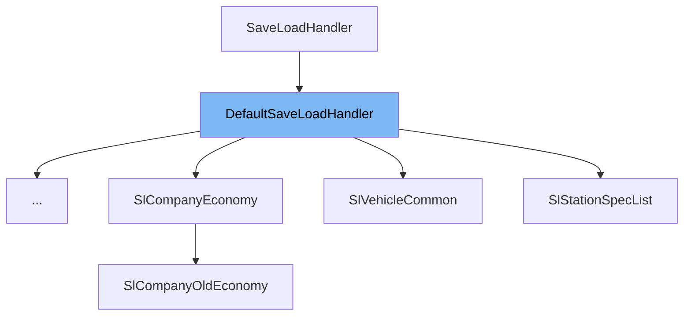

This document will cover the class <SwmToken path="src/saveload/linkgraph_sl.cpp" pos="31:8:8" line-data="class SlLinkgraphEdge : public DefaultSaveLoadHandler&lt;SlLinkgraphEdge, Node&gt; {">`DefaultSaveLoadHandler`</SwmToken> in detail. We will cover:

1. What is <SwmToken path="src/saveload/linkgraph_sl.cpp" pos="31:8:8" line-data="class SlLinkgraphEdge : public DefaultSaveLoadHandler&lt;SlLinkgraphEdge, Node&gt; {">`DefaultSaveLoadHandler`</SwmToken>
2. Variables and functions
3. Usage example



# What is <SwmToken path="src/saveload/linkgraph_sl.cpp" pos="31:8:8" line-data="class SlLinkgraphEdge : public DefaultSaveLoadHandler&lt;SlLinkgraphEdge, Node&gt; {">`DefaultSaveLoadHandler`</SwmToken>

The <SwmToken path="src/saveload/linkgraph_sl.cpp" pos="31:8:8" line-data="class SlLinkgraphEdge : public DefaultSaveLoadHandler&lt;SlLinkgraphEdge, Node&gt; {">`DefaultSaveLoadHandler`</SwmToken> class is a template class that extends the <SwmToken path="src/saveload/saveload.h" pos="512:2:2" line-data="class SaveLoadHandler {">`SaveLoadHandler`</SwmToken> class. It provides default implementations for saving and loading objects to and from disk. This class is used to handle common <SwmToken path="src/saveload/saveload.h" pos="687:10:12" line-data="	SL_VAR         =  0, ///&lt; Save/load a variable.">`Save/load`</SwmToken> operations, reducing the amount of code needed for specific handlers.

<SwmSnippet path="/src/saveload/saveload.h" line="574">

---

# Variables and functions

The function <SwmToken path="src/saveload/saveload.h" pos="574:3:3" line-data="	SaveLoadTable GetDescription() const override { return static_cast&lt;const TImpl *&gt;(this)-&gt;description; }">`GetDescription`</SwmToken> returns the description of the fields in the savegame. It overrides the pure virtual function from <SwmToken path="src/saveload/saveload.h" pos="512:2:2" line-data="class SaveLoadHandler {">`SaveLoadHandler`</SwmToken>.

```c
	SaveLoadTable GetDescription() const override { return static_cast<const TImpl *>(this)->description; }
```

---

</SwmSnippet>

<SwmSnippet path="/src/saveload/saveload.h" line="575">

---

The function <SwmToken path="src/saveload/saveload.h" pos="575:3:3" line-data="	SaveLoadCompatTable GetCompatDescription() const override { return static_cast&lt;const TImpl *&gt;(this)-&gt;compat_description; }">`GetCompatDescription`</SwmToken> returns the <SwmToken path="src/saveload/saveload.h" pos="548:7:9" line-data="	 * Get the pre-header description of the fields in the savegame.">`pre-header`</SwmToken> description of the fields in the savegame. It overrides the pure virtual function from <SwmToken path="src/saveload/saveload.h" pos="512:2:2" line-data="class SaveLoadHandler {">`SaveLoadHandler`</SwmToken>.

```c
	SaveLoadCompatTable GetCompatDescription() const override { return static_cast<const TImpl *>(this)->compat_description; }
```

---

</SwmSnippet>

<SwmSnippet path="/src/saveload/saveload.h" line="577">

---

The virtual function <SwmToken path="src/saveload/saveload.h" pos="577:5:5" line-data="	virtual void Save([[maybe_unused]] TObject *object) const {}">`Save`</SwmToken> is used to save the object to disk. It can be overridden by the derived class to provide specific save functionality.

```c
	virtual void Save([[maybe_unused]] TObject *object) const {}
```

---

</SwmSnippet>

<SwmSnippet path="/src/saveload/saveload.h" line="578">

---

The function <SwmToken path="src/saveload/saveload.h" pos="578:3:3" line-data="	void Save(void *object) const override { this-&gt;Save(static_cast&lt;TObject *&gt;(object)); }">`Save`</SwmToken> is an override that calls the virtual <SwmToken path="src/saveload/saveload.h" pos="578:3:3" line-data="	void Save(void *object) const override { this-&gt;Save(static_cast&lt;TObject *&gt;(object)); }">`Save`</SwmToken> function with the object cast to the specific type <SwmToken path="src/saveload/saveload.h" pos="578:23:23" line-data="	void Save(void *object) const override { this-&gt;Save(static_cast&lt;TObject *&gt;(object)); }">`TObject`</SwmToken>.

```c
	void Save(void *object) const override { this->Save(static_cast<TObject *>(object)); }
```

---

</SwmSnippet>

<SwmSnippet path="/src/saveload/saveload.h" line="580">

---

The virtual function <SwmToken path="src/saveload/saveload.h" pos="580:5:5" line-data="	virtual void Load([[maybe_unused]] TObject *object) const {}">`Load`</SwmToken> is used to load the object from disk. It can be overridden by the derived class to provide specific load functionality.

```c
	virtual void Load([[maybe_unused]] TObject *object) const {}
```

---

</SwmSnippet>

<SwmSnippet path="/src/saveload/saveload.h" line="581">

---

The function <SwmToken path="src/saveload/saveload.h" pos="581:3:3" line-data="	void Load(void *object) const override { this-&gt;Load(static_cast&lt;TObject *&gt;(object)); }">`Load`</SwmToken> is an override that calls the virtual <SwmToken path="src/saveload/saveload.h" pos="581:3:3" line-data="	void Load(void *object) const override { this-&gt;Load(static_cast&lt;TObject *&gt;(object)); }">`Load`</SwmToken> function with the object cast to the specific type <SwmToken path="src/saveload/saveload.h" pos="581:23:23" line-data="	void Load(void *object) const override { this-&gt;Load(static_cast&lt;TObject *&gt;(object)); }">`TObject`</SwmToken>.

```c
	void Load(void *object) const override { this->Load(static_cast<TObject *>(object)); }
```

---

</SwmSnippet>

<SwmSnippet path="/src/saveload/saveload.h" line="583">

---

The virtual function <SwmToken path="src/saveload/saveload.h" pos="583:5:5" line-data="	virtual void LoadCheck([[maybe_unused]] TObject *object) const {}">`LoadCheck`</SwmToken> is used to validate savegames. It can be overridden by the derived class to provide specific validation functionality.

```c
	virtual void LoadCheck([[maybe_unused]] TObject *object) const {}
```

---

</SwmSnippet>

<SwmSnippet path="/src/saveload/saveload.h" line="584">

---

The function <SwmToken path="src/saveload/saveload.h" pos="584:3:3" line-data="	void LoadCheck(void *object) const override { this-&gt;LoadCheck(static_cast&lt;TObject *&gt;(object)); }">`LoadCheck`</SwmToken> is an override that calls the virtual <SwmToken path="src/saveload/saveload.h" pos="584:3:3" line-data="	void LoadCheck(void *object) const override { this-&gt;LoadCheck(static_cast&lt;TObject *&gt;(object)); }">`LoadCheck`</SwmToken> function with the object cast to the specific type <SwmToken path="src/saveload/saveload.h" pos="584:23:23" line-data="	void LoadCheck(void *object) const override { this-&gt;LoadCheck(static_cast&lt;TObject *&gt;(object)); }">`TObject`</SwmToken>.

```c
	void LoadCheck(void *object) const override { this->LoadCheck(static_cast<TObject *>(object)); }
```

---

</SwmSnippet>

<SwmSnippet path="/src/saveload/saveload.h" line="586">

---

The virtual function <SwmToken path="src/saveload/saveload.h" pos="586:5:5" line-data="	virtual void FixPointers([[maybe_unused]] TObject *object) const {}">`FixPointers`</SwmToken> is used to fix pointers after loading. It can be overridden by the derived class to provide specific pointer fixing functionality.

```c
	virtual void FixPointers([[maybe_unused]] TObject *object) const {}
```

---

</SwmSnippet>

<SwmSnippet path="/src/saveload/saveload.h" line="587">

---

The function <SwmToken path="src/saveload/saveload.h" pos="587:3:3" line-data="	void FixPointers(void *object) const override { this-&gt;FixPointers(static_cast&lt;TObject *&gt;(object)); }">`FixPointers`</SwmToken> is an override that calls the virtual <SwmToken path="src/saveload/saveload.h" pos="587:3:3" line-data="	void FixPointers(void *object) const override { this-&gt;FixPointers(static_cast&lt;TObject *&gt;(object)); }">`FixPointers`</SwmToken> function with the object cast to the specific type <SwmToken path="src/saveload/saveload.h" pos="587:23:23" line-data="	void FixPointers(void *object) const override { this-&gt;FixPointers(static_cast&lt;TObject *&gt;(object)); }">`TObject`</SwmToken>.

```c
	void FixPointers(void *object) const override { this->FixPointers(static_cast<TObject *>(object)); }
```

---

</SwmSnippet>

# Usage example

The <SwmToken path="src/saveload/linkgraph_sl.cpp" pos="31:8:8" line-data="class SlLinkgraphEdge : public DefaultSaveLoadHandler&lt;SlLinkgraphEdge, Node&gt; {">`DefaultSaveLoadHandler`</SwmToken> class is used in various parts of the codebase. Here is an example of how it is used in the <SwmToken path="src/saveload/linkgraph_sl.cpp" pos="31:2:2" line-data="class SlLinkgraphEdge : public DefaultSaveLoadHandler&lt;SlLinkgraphEdge, Node&gt; {">`SlLinkgraphEdge`</SwmToken> class.

<SwmSnippet path="/src/saveload/linkgraph_sl.cpp" line="31">

---

The <SwmToken path="src/saveload/linkgraph_sl.cpp" pos="31:2:2" line-data="class SlLinkgraphEdge : public DefaultSaveLoadHandler&lt;SlLinkgraphEdge, Node&gt; {">`SlLinkgraphEdge`</SwmToken> class extends <SwmToken path="src/saveload/linkgraph_sl.cpp" pos="31:8:8" line-data="class SlLinkgraphEdge : public DefaultSaveLoadHandler&lt;SlLinkgraphEdge, Node&gt; {">`DefaultSaveLoadHandler`</SwmToken> with <SwmToken path="src/saveload/linkgraph_sl.cpp" pos="31:2:2" line-data="class SlLinkgraphEdge : public DefaultSaveLoadHandler&lt;SlLinkgraphEdge, Node&gt; {">`SlLinkgraphEdge`</SwmToken> as the implementation class and `Node` as the object type. It provides specific <SwmToken path="src/saveload/saveload.h" pos="687:10:12" line-data="	SL_VAR         =  0, ///&lt; Save/load a variable.">`Save/load`</SwmToken> functionality for link graph edges.

```c++
class SlLinkgraphEdge : public DefaultSaveLoadHandler<SlLinkgraphEdge, Node> {
public:
	inline static const SaveLoad description[] = {
		    SLE_VAR(Edge, capacity,                 SLE_UINT32),
		    SLE_VAR(Edge, usage,                    SLE_UINT32),
```

---

</SwmSnippet>

&nbsp;

*This is an auto-generated document by Swimm AI 🌊 and has not yet been verified by a human*

<SwmMeta version="3.0.0" repo-id="Z2l0aHViJTNBJTNBT3BlblRURC1jb3BpbG90LWRlbW8lM0ElM0Fzd2ltbWlv" repo-name="OpenTTD-copilot-demo"><sup>Powered by [Swimm](/)</sup></SwmMeta>
