```mermaid
graph TD;
  DriverFactoryBase:::currentBaseStyle
DriverFactoryBase --> FSoundDriver_SDL
DriverFactoryBase --> FMusicDriver_Allegro
DriverFactoryBase --> FMusicDriver_BeMidi
DriverFactoryBase --> FMusicDriver_Null
DriverFactoryBase --> FMusicDriver_Win32
DriverFactoryBase --> FMusicDriver_ExtMidi
DriverFactoryBase --> FMusicDriver_Cocoa
DriverFactoryBase --> FMusicDriver_FluidSynth
DriverFactoryBase --> FMusicDriver_DMusic
DriverFactoryBase --> FVideoDriver_SDL_OpenGL
DriverFactoryBase --> 1[...]

 classDef currentBaseStyle color:#000000,fill:#7CB9F4

%% Swimm:
%% graph TD;
%%   DriverFactoryBase:::currentBaseStyle
%% <SwmToken path="src/driver.h" pos="68:12:12" line-data="	typedef std::map&lt;std::string, DriverFactoryBase *&gt; Drivers; ///&lt; Type for a map of drivers.">`DriverFactoryBase`</SwmToken> --> FSoundDriver_SDL
%% <SwmToken path="src/driver.h" pos="68:12:12" line-data="	typedef std::map&lt;std::string, DriverFactoryBase *&gt; Drivers; ///&lt; Type for a map of drivers.">`DriverFactoryBase`</SwmToken> --> <SwmToken path="src/music/allegro_m.h" pos="33:2:2" line-data="class FMusicDriver_Allegro : public DriverFactoryBase {">`FMusicDriver_Allegro`</SwmToken>
%% <SwmToken path="src/driver.h" pos="68:12:12" line-data="	typedef std::map&lt;std::string, DriverFactoryBase *&gt; Drivers; ///&lt; Type for a map of drivers.">`DriverFactoryBase`</SwmToken> --> FMusicDriver_BeMidi
%% <SwmToken path="src/driver.h" pos="68:12:12" line-data="	typedef std::map&lt;std::string, DriverFactoryBase *&gt; Drivers; ///&lt; Type for a map of drivers.">`DriverFactoryBase`</SwmToken> --> FMusicDriver_Null
%% <SwmToken path="src/driver.h" pos="68:12:12" line-data="	typedef std::map&lt;std::string, DriverFactoryBase *&gt; Drivers; ///&lt; Type for a map of drivers.">`DriverFactoryBase`</SwmToken> --> FMusicDriver_Win32
%% <SwmToken path="src/driver.h" pos="68:12:12" line-data="	typedef std::map&lt;std::string, DriverFactoryBase *&gt; Drivers; ///&lt; Type for a map of drivers.">`DriverFactoryBase`</SwmToken> --> FMusicDriver_ExtMidi
%% <SwmToken path="src/driver.h" pos="68:12:12" line-data="	typedef std::map&lt;std::string, DriverFactoryBase *&gt; Drivers; ///&lt; Type for a map of drivers.">`DriverFactoryBase`</SwmToken> --> FMusicDriver_Cocoa
%% <SwmToken path="src/driver.h" pos="68:12:12" line-data="	typedef std::map&lt;std::string, DriverFactoryBase *&gt; Drivers; ///&lt; Type for a map of drivers.">`DriverFactoryBase`</SwmToken> --> FMusicDriver_FluidSynth
%% <SwmToken path="src/driver.h" pos="68:12:12" line-data="	typedef std::map&lt;std::string, DriverFactoryBase *&gt; Drivers; ///&lt; Type for a map of drivers.">`DriverFactoryBase`</SwmToken> --> FMusicDriver_DMusic
%% <SwmToken path="src/driver.h" pos="68:12:12" line-data="	typedef std::map&lt;std::string, DriverFactoryBase *&gt; Drivers; ///&lt; Type for a map of drivers.">`DriverFactoryBase`</SwmToken> --> FVideoDriver_SDL_OpenGL
%% <SwmToken path="src/driver.h" pos="68:12:12" line-data="	typedef std::map&lt;std::string, DriverFactoryBase *&gt; Drivers; ///&lt; Type for a map of drivers.">`DriverFactoryBase`</SwmToken> --> 1[...]
%% 
%%  classDef currentBaseStyle color:#000000,fill:#7CB9F4
```

This document will cover the class <SwmToken path="src/driver.h" pos="68:12:12" line-data="	typedef std::map&lt;std::string, DriverFactoryBase *&gt; Drivers; ///&lt; Type for a map of drivers.">`DriverFactoryBase`</SwmToken> in detail. We will cover:

1. What <SwmToken path="src/driver.h" pos="68:12:12" line-data="	typedef std::map&lt;std::string, DriverFactoryBase *&gt; Drivers; ///&lt; Type for a map of drivers.">`DriverFactoryBase`</SwmToken> is.
2. Variables and functions in <SwmToken path="src/driver.h" pos="68:12:12" line-data="	typedef std::map&lt;std::string, DriverFactoryBase *&gt; Drivers; ///&lt; Type for a map of drivers.">`DriverFactoryBase`</SwmToken>.
3. Usage example of <SwmToken path="src/driver.h" pos="68:12:12" line-data="	typedef std::map&lt;std::string, DriverFactoryBase *&gt; Drivers; ///&lt; Type for a map of drivers.">`DriverFactoryBase`</SwmToken> in <SwmToken path="src/music/allegro_m.h" pos="33:2:2" line-data="class FMusicDriver_Allegro : public DriverFactoryBase {">`FMusicDriver_Allegro`</SwmToken>.



# What is <SwmToken path="src/driver.h" pos="68:12:12" line-data="	typedef std::map&lt;std::string, DriverFactoryBase *&gt; Drivers; ///&lt; Type for a map of drivers.">`DriverFactoryBase`</SwmToken>

<SwmToken path="src/driver.h" pos="68:12:12" line-data="	typedef std::map&lt;std::string, DriverFactoryBase *&gt; Drivers; ///&lt; Type for a map of drivers.">`DriverFactoryBase`</SwmToken> is a base class for all driver factories in the <SwmToken path="src/driver.h" pos="2:13:13" line-data=" * This file is part of OpenTTD.">`OpenTTD`</SwmToken> project. It is used to manage different types of drivers such as video, sound, and music drivers. The class provides a common interface and shared functionality for creating and managing these drivers.

<SwmSnippet path="/src/driver.h" line="63">

---

# Variables and functions

The variable <SwmToken path="src/driver.h" pos="63:3:3" line-data="	Driver::Type type;       ///&lt; The type of driver.">`Type`</SwmToken> is used to store the type of the driver. It is of type <SwmToken path="src/driver.h" pos="63:1:3" line-data="	Driver::Type type;       ///&lt; The type of driver.">`Driver::Type`</SwmToken>.

```c
	Driver::Type type;       ///< The type of driver.
```

---

</SwmSnippet>

<SwmSnippet path="/src/driver.h" line="64">

---

The variable <SwmToken path="src/driver.h" pos="64:3:3" line-data="	int priority;            ///&lt; The priority of this factory.">`priority`</SwmToken> is used to store the priority of the factory. It is an integer value.

```c
	int priority;            ///< The priority of this factory.
```

---

</SwmSnippet>

<SwmSnippet path="/src/driver.h" line="65">

---

The variable <SwmToken path="src/driver.h" pos="65:5:5" line-data="	std::string_view name;        ///&lt; The name of the drivers of this factory.">`name`</SwmToken> is used to store the name of the drivers of this factory. It is a <SwmToken path="src/driver.h" pos="65:1:3" line-data="	std::string_view name;        ///&lt; The name of the drivers of this factory.">`std::string_view`</SwmToken>.

```c
	std::string_view name;        ///< The name of the drivers of this factory.
```

---

</SwmSnippet>

<SwmSnippet path="/src/driver.h" line="66">

---

The variable <SwmToken path="src/driver.h" pos="66:5:5" line-data="	std::string_view description; ///&lt; The description of this driver.">`description`</SwmToken> is used to store the description of the driver. It is a <SwmToken path="src/driver.h" pos="66:1:3" line-data="	std::string_view description; ///&lt; The description of this driver.">`std::string_view`</SwmToken>.

```c
	std::string_view description; ///< The description of this driver.
```

---

</SwmSnippet>

<SwmSnippet path="/src/driver.h" line="68">

---

The type <SwmToken path="src/driver.h" pos="68:16:16" line-data="	typedef std::map&lt;std::string, DriverFactoryBase *&gt; Drivers; ///&lt; Type for a map of drivers.">`Drivers`</SwmToken> is a map that associates driver names with their corresponding <SwmToken path="src/driver.h" pos="68:12:12" line-data="	typedef std::map&lt;std::string, DriverFactoryBase *&gt; Drivers; ///&lt; Type for a map of drivers.">`DriverFactoryBase`</SwmToken> instances.

```c
	typedef std::map<std::string, DriverFactoryBase *> Drivers; ///< Type for a map of drivers.
```

---

</SwmSnippet>

<SwmSnippet path="/src/driver.h" line="73">

---

The function <SwmToken path="src/driver.h" pos="73:6:6" line-data="	static Drivers &amp;GetDrivers()">`GetDrivers`</SwmToken> returns a reference to the map of drivers. It ensures that the map is initialized only once.

```c
	static Drivers &GetDrivers()
	{
		static Drivers &s_drivers = *new Drivers();
		return s_drivers;
	}
```

---

</SwmSnippet>

<SwmSnippet path="/src/driver.h" line="84">

---

The function <SwmToken path="src/driver.h" pos="84:6:6" line-data="	static Driver **GetActiveDriver(Driver::Type type)">`GetActiveDriver`</SwmToken> returns a pointer to the active driver for the given type. It uses a static array to store the active drivers.

```c
	static Driver **GetActiveDriver(Driver::Type type)
	{
		static Driver *s_driver[3] = { nullptr, nullptr, nullptr };
		return &s_driver[type];
	}
```

---

</SwmSnippet>

<SwmSnippet path="/src/driver.h" line="95">

---

The function <SwmToken path="src/driver.h" pos="95:7:7" line-data="	static std::string_view GetDriverTypeName(Driver::Type type)">`GetDriverTypeName`</SwmToken> returns the name of the driver type as a <SwmToken path="src/driver.h" pos="95:3:5" line-data="	static std::string_view GetDriverTypeName(Driver::Type type)">`std::string_view`</SwmToken>. It uses a static array to store the names of the driver types.

```c
	static std::string_view GetDriverTypeName(Driver::Type type)
	{
		static const std::string_view driver_type_name[] = { "music", "sound", "video" };
		return driver_type_name[type];
	}
```

---

</SwmSnippet>

<SwmSnippet path="/src/driver.h" line="106">

---

The constructor <SwmToken path="src/driver.h" pos="106:1:1" line-data="	DriverFactoryBase(Driver::Type type, int priority, const char *name, const char *description);">`DriverFactoryBase`</SwmToken> initializes the type, priority, name, and description of the driver factory.

```c
	DriverFactoryBase(Driver::Type type, int priority, const char *name, const char *description);

	virtual ~DriverFactoryBase();
```

---

</SwmSnippet>

<SwmSnippet path="/src/driver.h" line="110">

---

The destructor <SwmToken path="src/driver.h" pos="108:3:4" line-data="	virtual ~DriverFactoryBase();">`~DriverFactoryBase`</SwmToken> is a virtual destructor to ensure proper cleanup of derived classes.

```c
	/**
```

---

</SwmSnippet>

<SwmSnippet path="/src/driver.h" line="114">

---

The function <SwmToken path="src/driver.h" pos="114:5:5" line-data="	virtual bool UsesHardwareAcceleration() const">`UsesHardwareAcceleration`</SwmToken> returns whether the driver uses hardware acceleration. It is virtual and returns false by default.

```c
	virtual bool UsesHardwareAcceleration() const
	{
		return false;
	}
```

---

</SwmSnippet>

<SwmSnippet path="/src/driver.h" line="123">

---

The function <SwmToken path="src/driver.h" pos="123:5:5" line-data="	static void ShutdownDrivers()">`ShutdownDrivers`</SwmToken> shuts down all active drivers by calling their <SwmToken path="src/driver.h" pos="127:13:13" line-data="			if (driver != nullptr) driver-&gt;Stop();">`Stop`</SwmToken> method.

```c
	static void ShutdownDrivers()
	{
		for (Driver::Type dt = Driver::DT_BEGIN; dt < Driver::DT_END; dt++) {
			Driver *driver = *GetActiveDriver(dt);
			if (driver != nullptr) driver->Stop();
		}
	}
```

---

</SwmSnippet>

<SwmSnippet path="/src/driver.h" line="138">

---

The function <SwmToken path="src/driver.h" pos="138:5:5" line-data="	std::string_view GetDescription() const">`GetDescription`</SwmToken> returns the description of the driver as a <SwmToken path="src/driver.h" pos="138:1:3" line-data="	std::string_view GetDescription() const">`std::string_view`</SwmToken>.

```c
	std::string_view GetDescription() const
	{
		return this->description;
	}
```

---

</SwmSnippet>

<SwmSnippet path="/src/driver.h" line="147">

---

The function <SwmToken path="src/driver.h" pos="147:6:6" line-data="	virtual Driver *CreateInstance() const = 0;">`CreateInstance`</SwmToken> is a pure virtual function that creates an instance of the driver class. It must be implemented by derived classes.

```c
	virtual Driver *CreateInstance() const = 0;
```

---

</SwmSnippet>

# Usage example

Here is an example of how to use <SwmToken path="src/driver.h" pos="68:12:12" line-data="	typedef std::map&lt;std::string, DriverFactoryBase *&gt; Drivers; ///&lt; Type for a map of drivers.">`DriverFactoryBase`</SwmToken> in <SwmToken path="src/music/allegro_m.h" pos="33:2:2" line-data="class FMusicDriver_Allegro : public DriverFactoryBase {">`FMusicDriver_Allegro`</SwmToken>.

<SwmSnippet path="/src/music/allegro_m.h" line="33">

---

<SwmToken path="src/music/allegro_m.h" pos="33:2:2" line-data="class FMusicDriver_Allegro : public DriverFactoryBase {">`FMusicDriver_Allegro`</SwmToken> is a class that inherits from <SwmToken path="src/music/allegro_m.h" pos="33:8:8" line-data="class FMusicDriver_Allegro : public DriverFactoryBase {">`DriverFactoryBase`</SwmToken>. It initializes the base class with the type <SwmToken path="src/music/allegro_m.h" pos="43:9:11" line-data="	FMusicDriver_Allegro() : DriverFactoryBase(Driver::DT_MUSIC, PRIORITY, &quot;allegro&quot;, &quot;Allegro MIDI Driver&quot;) {}">`Driver::DT_MUSIC`</SwmToken>, a priority, and the name and description of the driver.

```c
class FMusicDriver_Allegro : public DriverFactoryBase {
public:
#if !defined(WITH_SDL) && defined(WITH_ALLEGRO)
	/* If SDL is not compiled in but Allegro is, chances are quite big
```

---

</SwmSnippet>

&nbsp;

*This is an auto-generated document by Swimm AI 🌊 and has not yet been verified by a human*

<SwmMeta version="3.0.0" repo-id="Z2l0aHViJTNBJTNBT3BlblRURC1jb3BpbG90LWRlbW8lM0ElM0Fzd2ltbWlv" repo-name="OpenTTD-copilot-demo"><sup>Powered by [Swimm](/)</sup></SwmMeta>
