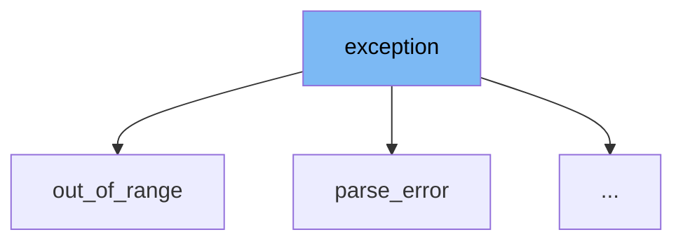

This document will cover the class <SwmToken path="src/3rdparty/nlohmann/json.hpp" pos="184:4:4" line-data="#include &lt;exception&gt; // exception">`exception`</SwmToken> in the file <SwmPath>[src/3rdparty/nlohmann/json.hpp](src/3rdparty/nlohmann/json.hpp)</SwmPath>. We will cover:

1. What is <SwmToken path="src/3rdparty/nlohmann/json.hpp" pos="184:4:4" line-data="#include &lt;exception&gt; // exception">`exception`</SwmToken>
2. Variables and functions
3. Usage example



# What is exception

The <SwmToken path="src/3rdparty/nlohmann/json.hpp" pos="184:4:4" line-data="#include &lt;exception&gt; // exception">`exception`</SwmToken> class in <SwmPath>[src/3rdparty/nlohmann/json.hpp](src/3rdparty/nlohmann/json.hpp)</SwmPath> is a custom exception class used within the nlohmann JSON library. It serves as the base class for all exceptions thrown by the library, providing a consistent interface for error handling.

<SwmSnippet path="/src/3rdparty/nlohmann/json.hpp" line="201">

---

# Variables and functions

The variable <SwmToken path="src/3rdparty/nlohmann/json.hpp" pos="2928:23:23" line-data="// (see GCC bug https://gcc.gnu.org/bugzilla/show_bug.cgi?id=105200)">`id`</SwmToken> is used to store the exception id. It is a protected member of the <SwmToken path="src/3rdparty/nlohmann/json.hpp" pos="184:4:4" line-data="#include &lt;exception&gt; // exception">`exception`</SwmToken> class.

```c++

```

---

</SwmSnippet>

<SwmSnippet path="/src/3rdparty/nlohmann/json.hpp" line="202">

---

The variable <SwmToken path="src/3rdparty/nlohmann/json.hpp" pos="4385:13:13" line-data="    exception(int id_, const char* what_arg) : id(id_), m(what_arg) {} // NOLINT(bugprone-throw-keyword-missing)">`what_arg`</SwmToken> is used to store the exception message. It is a protected member of the <SwmToken path="src/3rdparty/nlohmann/json.hpp" pos="184:4:4" line-data="#include &lt;exception&gt; // exception">`exception`</SwmToken> class.

```c++

```

---

</SwmSnippet>

<SwmSnippet path="/src/3rdparty/nlohmann/json.hpp" line="204">

---

The constructor <SwmToken path="src/3rdparty/nlohmann/json.hpp" pos="4385:1:3" line-data="    exception(int id_, const char* what_arg) : id(id_), m(what_arg) {} // NOLINT(bugprone-throw-keyword-missing)">`exception(int`</SwmToken>` `<SwmToken path="src/3rdparty/nlohmann/json.hpp" pos="4385:5:5" line-data="    exception(int id_, const char* what_arg) : id(id_), m(what_arg) {} // NOLINT(bugprone-throw-keyword-missing)">`id_`</SwmToken>`, const `<SwmToken path="src/3rdparty/nlohmann/json.hpp" pos="4240:10:11" line-data="inline std::size_t concat_length(const char* cstr, const Args&amp; ... rest);">`char*`</SwmToken>` what_arg_)` initializes the <SwmToken path="src/3rdparty/nlohmann/json.hpp" pos="2928:23:23" line-data="// (see GCC bug https://gcc.gnu.org/bugzilla/show_bug.cgi?id=105200)">`id`</SwmToken> and <SwmToken path="src/3rdparty/nlohmann/json.hpp" pos="4385:13:13" line-data="    exception(int id_, const char* what_arg) : id(id_), m(what_arg) {} // NOLINT(bugprone-throw-keyword-missing)">`what_arg`</SwmToken> variables with the provided values.

```c++
#include <cstddef> // size_t
#include <cstdint> // uint8_t
#include <string> // string
```

---

</SwmSnippet>

<SwmSnippet path="/src/3rdparty/nlohmann/json.hpp" line="208">

---

The function <SwmToken path="src/3rdparty/nlohmann/json.hpp" pos="2928:23:23" line-data="// (see GCC bug https://gcc.gnu.org/bugzilla/show_bug.cgi?id=105200)">`id`</SwmToken> returns the exception id. It is a public member function of the <SwmToken path="src/3rdparty/nlohmann/json.hpp" pos="184:4:4" line-data="#include &lt;exception&gt; // exception">`exception`</SwmToken> class.

```c++
// #include <nlohmann/detail/macro_scope.hpp>
//     __ _____ _____ _____
//  __|  |   __|     |   | |  JSON for Modern C++
```

---

</SwmSnippet>

<SwmSnippet path="/src/3rdparty/nlohmann/json.hpp" line="212">

---

The function <SwmToken path="src/3rdparty/nlohmann/json.hpp" pos="4375:6:6" line-data="    const char* what() const noexcept override">`what`</SwmToken> returns the exception message. It is a public member function of the <SwmToken path="src/3rdparty/nlohmann/json.hpp" pos="184:4:4" line-data="#include &lt;exception&gt; // exception">`exception`</SwmToken> class and overrides the <SwmToken path="src/3rdparty/nlohmann/json.hpp" pos="4375:6:6" line-data="    const char* what() const noexcept override">`what`</SwmToken> function from the standard <SwmToken path="src/3rdparty/nlohmann/json.hpp" pos="4371:8:10" line-data="class exception : public std::exception">`std::exception`</SwmToken> class.

```c++
// |_____|_____|_____|_|___|  https://github.com/nlohmann/json
//
// SPDX-FileCopyrightText: 2013-2023 Niels Lohmann <https://nlohmann.me>
```

---

</SwmSnippet>

# Usage example

Here is an example of how to use the <SwmToken path="src/3rdparty/nlohmann/json.hpp" pos="184:4:4" line-data="#include &lt;exception&gt; // exception">`exception`</SwmToken> class in a <SwmToken path="src/3rdparty/nlohmann/json.hpp" pos="4468:17:17" line-data="/// @sa https://json.nlohmann.me/api/basic_json/parse_error/">`parse_error`</SwmToken> scenario.

<SwmSnippet path="/src/3rdparty/nlohmann/json.hpp" line="220">

---

In this example, the <SwmToken path="src/3rdparty/nlohmann/json.hpp" pos="4468:17:17" line-data="/// @sa https://json.nlohmann.me/api/basic_json/parse_error/">`parse_error`</SwmToken> class inherits from the <SwmToken path="src/3rdparty/nlohmann/json.hpp" pos="184:4:4" line-data="#include &lt;exception&gt; // exception">`exception`</SwmToken> class. It initializes the base class with an id and a message, demonstrating how to use the <SwmToken path="src/3rdparty/nlohmann/json.hpp" pos="184:4:4" line-data="#include &lt;exception&gt; // exception">`exception`</SwmToken> class for specific error types.

```c++
// #include <nlohmann/detail/meta/detected.hpp>
//     __ _____ _____ _____
//  __|  |   __|     |   | |  JSON for Modern C++
// |  |  |__   |  |  | | | |  version 3.11.3
// |_____|_____|_____|_|___|  https://github.com/nlohmann/json
//
```

---

</SwmSnippet>

&nbsp;

*This is an auto-generated document by Swimm AI 🌊 and has not yet been verified by a human*

<SwmMeta version="3.0.0" repo-id="Z2l0aHViJTNBJTNBT3BlblRURC1jb3BpbG90LWRlbW8lM0ElM0Fzd2ltbWlv" repo-name="OpenTTD-copilot-demo"><sup>Powered by [Swimm](/)</sup></SwmMeta>
