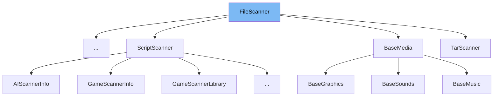

This document will cover the <SwmToken path="src/fios.cpp" pos="253:8:8" line-data="class FiosFileScanner : public FileScanner {">`FileScanner`</SwmToken> class. We will cover:

1. What <SwmToken path="src/fios.cpp" pos="253:8:8" line-data="class FiosFileScanner : public FileScanner {">`FileScanner`</SwmToken> is in the repo.
2. <SwmToken path="src/fios.cpp" pos="253:8:8" line-data="class FiosFileScanner : public FileScanner {">`FileScanner`</SwmToken> class main variables and functions.
3. Example of how to use the <SwmToken path="src/fios.cpp" pos="253:8:8" line-data="class FiosFileScanner : public FileScanner {">`FileScanner`</SwmToken> class.



# What is <SwmToken path="src/fios.cpp" pos="253:8:8" line-data="class FiosFileScanner : public FileScanner {">`FileScanner`</SwmToken>

<SwmToken path="src/fios.cpp" pos="253:8:8" line-data="class FiosFileScanner : public FileScanner {">`FileScanner`</SwmToken> is a helper class for scanning files with a given name. It is defined in <SwmPath>[src/fileio_func.h](src/fileio_func.h)</SwmPath> and is used to search through directories and subdirectories for files that match a specific extension. The class provides methods to scan directories and add files to a list.

<SwmSnippet path="/src/fileio_func.h" line="40">

---

# Variables and functions

The variable <SwmToken path="src/fileio_func.h" pos="40:3:3" line-data="	Subdirectory subdir; ///&lt; The current sub directory we are searching through">`subdir`</SwmToken> is used to store the current subdirectory being searched. It is a protected member of the <SwmToken path="src/fios.cpp" pos="253:8:8" line-data="class FiosFileScanner : public FileScanner {">`FileScanner`</SwmToken> class.

```c
	Subdirectory subdir; ///< The current sub directory we are searching through
```

---

</SwmSnippet>

<SwmSnippet path="/src/fileio_func.h" line="45">

---

The function <SwmToken path="src/fileio_func.h" pos="45:3:3" line-data="	uint Scan(std::string_view extension, Subdirectory sd, bool tars = true, bool recursive = true);">`Scan`</SwmToken> is used to scan a subdirectory for files with a given extension. It takes parameters for the file extension, subdirectory, and options for including tar files and recursive search.

```c
	uint Scan(std::string_view extension, Subdirectory sd, bool tars = true, bool recursive = true);
```

---

</SwmSnippet>

<SwmSnippet path="/src/fileio_func.h" line="46">

---

The function <SwmToken path="src/fileio_func.h" pos="46:3:3" line-data="	uint Scan(std::string_view extension, const std::string &amp;directory, bool recursive = true);">`Scan`</SwmToken> is overloaded to scan a specific directory for files with a given extension. It takes parameters for the file extension and directory, with an option for recursive search.

```c
	uint Scan(std::string_view extension, const std::string &directory, bool recursive = true);
```

---

</SwmSnippet>

<SwmSnippet path="/src/fileio_func.h" line="56">

---

The function <SwmToken path="src/fileio_func.h" pos="56:5:5" line-data="	virtual bool AddFile(const std::string &amp;filename, size_t basepath_length, const std::string &amp;tar_filename) = 0;">`AddFile`</SwmToken> is a pure virtual function that must be implemented by derived classes. It is used to add a file to the list of scanned files. It takes parameters for the filename, basepath length, and tar filename.

```c
	virtual bool AddFile(const std::string &filename, size_t basepath_length, const std::string &tar_filename) = 0;
```

---

</SwmSnippet>

# Usage example

Here is an example of how to use the <SwmToken path="src/fios.cpp" pos="253:8:8" line-data="class FiosFileScanner : public FileScanner {">`FileScanner`</SwmToken> class in <SwmToken path="src/fios.cpp" pos="253:2:2" line-data="class FiosFileScanner : public FileScanner {">`FiosFileScanner`</SwmToken>.

<SwmSnippet path="/src/fios.cpp" line="253">

---

<SwmToken path="src/fios.cpp" pos="253:2:2" line-data="class FiosFileScanner : public FileScanner {">`FiosFileScanner`</SwmToken> is a class that inherits from <SwmToken path="src/fios.cpp" pos="253:8:8" line-data="class FiosFileScanner : public FileScanner {">`FileScanner`</SwmToken>. It defines the type of file operation being performed.

```c++
class FiosFileScanner : public FileScanner {
```

---

</SwmSnippet>

<SwmSnippet path="/src/fios.cpp" line="604">

---

In this example, <SwmToken path="src/fios.cpp" pos="604:3:5" line-data="		this-&gt;FileScanner::Scan(&quot;.id&quot;, SCENARIO_DIR, true, true);">`FileScanner::Scan`</SwmToken> is called to scan the <SwmToken path="src/fios.cpp" pos="604:13:13" line-data="		this-&gt;FileScanner::Scan(&quot;.id&quot;, SCENARIO_DIR, true, true);">`SCENARIO_DIR`</SwmToken> directory for files with the <SwmToken path="src/fios.cpp" pos="604:8:9" line-data="		this-&gt;FileScanner::Scan(&quot;.id&quot;, SCENARIO_DIR, true, true);">`.id`</SwmToken> extension.

```c++
		this->FileScanner::Scan(".id", SCENARIO_DIR, true, true);
```

---

</SwmSnippet>

&nbsp;

*This is an auto-generated document by Swimm AI 🌊 and has not yet been verified by a human*

<SwmMeta version="3.0.0" repo-id="Z2l0aHViJTNBJTNBT3BlblRURC1jb3BpbG90LWRlbW8lM0ElM0Fzd2ltbWlv" repo-name="OpenTTD-copilot-demo"><sup>Powered by [Swimm](/)</sup></SwmMeta>
