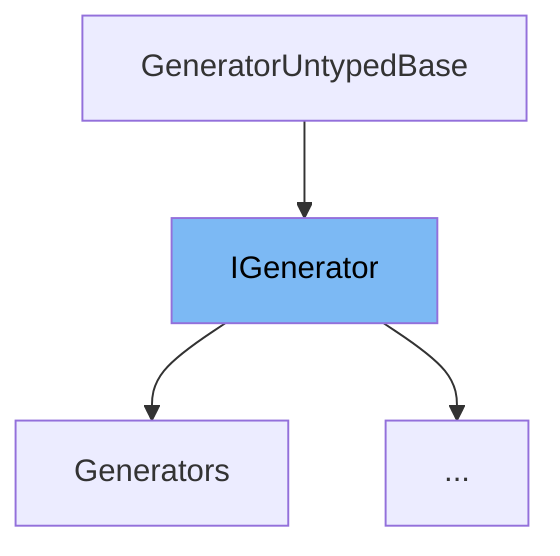

This document will cover the class <SwmToken path="src/3rdparty/catch2/catch.hpp" pos="3941:3:3" line-data="    struct IGenerator : GeneratorUntypedBase {">`IGenerator`</SwmToken> in the file <SwmPath>[src/3rdparty/catch2/catch.hpp](src/3rdparty/catch2/catch.hpp)</SwmPath>. We will cover:

1. What <SwmToken path="src/3rdparty/catch2/catch.hpp" pos="3941:3:3" line-data="    struct IGenerator : GeneratorUntypedBase {">`IGenerator`</SwmToken> is.
2. Variables and functions defined in <SwmToken path="src/3rdparty/catch2/catch.hpp" pos="3941:3:3" line-data="    struct IGenerator : GeneratorUntypedBase {">`IGenerator`</SwmToken>.
3. An example of how to use <SwmToken path="src/3rdparty/catch2/catch.hpp" pos="3941:3:3" line-data="    struct IGenerator : GeneratorUntypedBase {">`IGenerator`</SwmToken> in <SwmToken path="src/3rdparty/catch2/catch.hpp" pos="3953:3:3" line-data="    class SingleValueGenerator final : public IGenerator&lt;T&gt; {">`SingleValueGenerator`</SwmToken>.



# What is <SwmToken path="src/3rdparty/catch2/catch.hpp" pos="3941:3:3" line-data="    struct IGenerator : GeneratorUntypedBase {">`IGenerator`</SwmToken>

The <SwmToken path="src/3rdparty/catch2/catch.hpp" pos="3941:3:3" line-data="    struct IGenerator : GeneratorUntypedBase {">`IGenerator`</SwmToken> class in <SwmPath>[src/3rdparty/catch2/catch.hpp](src/3rdparty/catch2/catch.hpp)</SwmPath> is an interface used in the <SwmToken path="src/3rdparty/catch2/catch.hpp" pos="3898:17:17" line-data="    Catch::throw_logic_error(CATCH_MAKE_MSG( CATCH_INTERNAL_LINEINFO &lt;&lt; &quot;: Internal Catch2 error: &quot; &lt;&lt; __VA_ARGS__))">`Catch2`</SwmToken> testing framework. It defines the contract for generator classes, which are responsible for producing a sequence of values for testing purposes. Generators are used to create parameterized tests, where the same test case is executed with different inputs.

<SwmSnippet path="/src/3rdparty/catch2/catch.hpp" line="2280">

---

# Variables and functions

The function <SwmToken path="src/3rdparty/catch2/catch.hpp" pos="1454:3:3" line-data="        auto get() -&gt; std::ostream&amp; { return *m_oss; }">`get`</SwmToken> is a pure virtual function that returns a constant reference to the current value generated by the generator. This function must be implemented by any class that inherits from <SwmToken path="src/3rdparty/catch2/catch.hpp" pos="3941:3:3" line-data="    struct IGenerator : GeneratorUntypedBase {">`IGenerator`</SwmToken>.

```c++
            "chained comparisons are not supported inside assertions, "
```

---

</SwmSnippet>

<SwmSnippet path="/src/3rdparty/catch2/catch.hpp" line="2281">

---

The function <SwmToken path="src/3rdparty/catch2/catch.hpp" pos="718:8:8" line-data="#define CATCH_REC_NEXT0(test, next, ...) next CATCH_REC_OUT">`next`</SwmToken> is another pure virtual function that advances the generator to the next value. It returns a boolean indicating whether there are more values to generate. This function must also be implemented by any class that inherits from <SwmToken path="src/3rdparty/catch2/catch.hpp" pos="3941:3:3" line-data="    struct IGenerator : GeneratorUntypedBase {">`IGenerator`</SwmToken>.

```c++
            "wrap the expression inside parentheses, or decompose it");
```

---

</SwmSnippet>

# Usage example

Here is an example of how to use <SwmToken path="src/3rdparty/catch2/catch.hpp" pos="3941:3:3" line-data="    struct IGenerator : GeneratorUntypedBase {">`IGenerator`</SwmToken> in the <SwmToken path="src/3rdparty/catch2/catch.hpp" pos="3953:3:3" line-data="    class SingleValueGenerator final : public IGenerator&lt;T&gt; {">`SingleValueGenerator`</SwmToken> class.

<SwmSnippet path="/src/3rdparty/catch2/catch.hpp" line="2290">

---

The <SwmToken path="src/3rdparty/catch2/catch.hpp" pos="3953:3:3" line-data="    class SingleValueGenerator final : public IGenerator&lt;T&gt; {">`SingleValueGenerator`</SwmToken> class implements the <SwmToken path="src/3rdparty/catch2/catch.hpp" pos="3941:3:3" line-data="    struct IGenerator : GeneratorUntypedBase {">`IGenerator`</SwmToken> interface. It holds a single value and always returns that value when <SwmToken path="src/3rdparty/catch2/catch.hpp" pos="1454:3:3" line-data="        auto get() -&gt; std::ostream&amp; { return *m_oss; }">`get`</SwmToken> is called. The <SwmToken path="src/3rdparty/catch2/catch.hpp" pos="718:8:8" line-data="#define CATCH_REC_NEXT0(test, next, ...) next CATCH_REC_OUT">`next`</SwmToken> function always returns `false` because there are no more values to generate.

```c++

        template<typename T>
        auto operator <= ( T ) const -> BinaryExpr<LhsT, RhsT const&> const {
            static_assert(always_false<T>::value,
            "chained comparisons are not supported inside assertions, "
            "wrap the expression inside parentheses, or decompose it");
```

---

</SwmSnippet>

&nbsp;

*This is an auto-generated document by Swimm AI 🌊 and has not yet been verified by a human*

<SwmMeta version="3.0.0" repo-id="Z2l0aHViJTNBJTNBT3BlblRURC1jb3BpbG90LWRlbW8lM0ElM0Fzd2ltbWlv" repo-name="OpenTTD-copilot-demo"><sup>Powered by [Swimm](/)</sup></SwmMeta>
