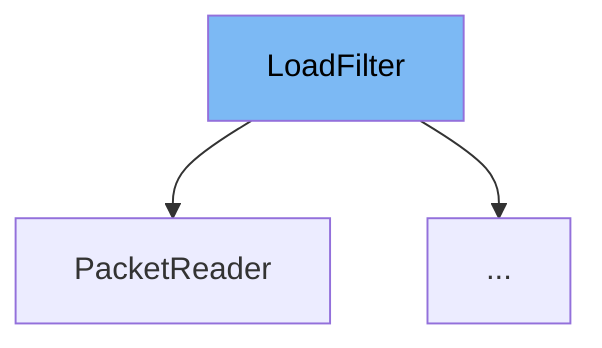

This document will cover the class <SwmToken path="src/saveload/saveload_filter.h" pos="16:5:5" line-data="	std::shared_ptr&lt;LoadFilter&gt; chain;">`LoadFilter`</SwmToken> in the <SwmToken path="src/saveload/saveload_filter.h" pos="2:13:13" line-data=" * This file is part of OpenTTD.">`OpenTTD`</SwmToken> project. We will discuss:

1. What <SwmToken path="src/saveload/saveload_filter.h" pos="16:5:5" line-data="	std::shared_ptr&lt;LoadFilter&gt; chain;">`LoadFilter`</SwmToken> is.
2. The variables and functions defined in <SwmToken path="src/saveload/saveload_filter.h" pos="16:5:5" line-data="	std::shared_ptr&lt;LoadFilter&gt; chain;">`LoadFilter`</SwmToken>.
3. An example of how to use <SwmToken path="src/saveload/saveload_filter.h" pos="16:5:5" line-data="	std::shared_ptr&lt;LoadFilter&gt; chain;">`LoadFilter`</SwmToken> in <SwmToken path="src/network/network_client.cpp" pos="43:2:2" line-data="struct PacketReader : LoadFilter {">`PacketReader`</SwmToken>.



# What is <SwmToken path="src/saveload/saveload_filter.h" pos="16:5:5" line-data="	std::shared_ptr&lt;LoadFilter&gt; chain;">`LoadFilter`</SwmToken>

<SwmToken path="src/saveload/saveload_filter.h" pos="16:5:5" line-data="	std::shared_ptr&lt;LoadFilter&gt; chain;">`LoadFilter`</SwmToken> is an interface for filtering a savegame until it is loaded. It is used to manage the reading process of savegame files, ensuring that the data is correctly processed and filtered through a chain of filters.

<SwmSnippet path="/src/saveload/saveload_filter.h" line="16">

---

# Variables and functions

The variable <SwmToken path="src/saveload/saveload_filter.h" pos="16:8:8" line-data="	std::shared_ptr&lt;LoadFilter&gt; chain;">`chain`</SwmToken> is a shared pointer to another <SwmToken path="src/saveload/saveload_filter.h" pos="16:5:5" line-data="	std::shared_ptr&lt;LoadFilter&gt; chain;">`LoadFilter`</SwmToken>. It represents the next filter in the chain of filters used to process the savegame data.

```c
	std::shared_ptr<LoadFilter> chain;
```

---

</SwmSnippet>

<SwmSnippet path="/src/saveload/saveload_filter.h" line="22">

---

The constructor <SwmToken path="src/saveload/saveload_filter.h" pos="22:1:1" line-data="	LoadFilter(std::shared_ptr&lt;LoadFilter&gt; chain) : chain(chain)">`LoadFilter`</SwmToken> initializes the filter and sets the next filter in the chain. It takes a shared pointer to another <SwmToken path="src/saveload/saveload_filter.h" pos="22:1:1" line-data="	LoadFilter(std::shared_ptr&lt;LoadFilter&gt; chain) : chain(chain)">`LoadFilter`</SwmToken> as a parameter.

```c
	LoadFilter(std::shared_ptr<LoadFilter> chain) : chain(chain)
	{
	}
```

---

</SwmSnippet>

<SwmSnippet path="/src/saveload/saveload_filter.h" line="27">

---

The destructor <SwmToken path="src/saveload/saveload_filter.h" pos="27:3:4" line-data="	virtual ~LoadFilter()">`~LoadFilter`</SwmToken> ensures that the writers are properly closed when the filter is destroyed.

```c
	virtual ~LoadFilter()
	{
	}
```

---

</SwmSnippet>

<SwmSnippet path="/src/saveload/saveload_filter.h" line="37">

---

The function <SwmToken path="src/saveload/saveload_filter.h" pos="37:5:5" line-data="	virtual size_t Read(uint8_t *buf, size_t len) = 0;">`Read`</SwmToken> is a pure virtual function that reads a given number of bytes from the savegame. It takes a buffer and the number of bytes to read as parameters and returns the number of bytes actually read.

```c
	virtual size_t Read(uint8_t *buf, size_t len) = 0;
```

---

</SwmSnippet>

<SwmSnippet path="/src/saveload/saveload_filter.h" line="42">

---

The function <SwmToken path="src/saveload/saveload_filter.h" pos="42:5:5" line-data="	virtual void Reset()">`Reset`</SwmToken> resets the filter to read from the beginning of the file. It calls the <SwmToken path="src/saveload/saveload_filter.h" pos="42:5:5" line-data="	virtual void Reset()">`Reset`</SwmToken> function of the next filter in the chain.

```c
	virtual void Reset()
	{
		this->chain->Reset();
	}
```

---

</SwmSnippet>

<SwmSnippet path="/src/saveload/saveload_filter.h" line="53">

---

The template function <SwmToken path="src/saveload/saveload_filter.h" pos="53:15:15" line-data="template &lt;typename T&gt; std::shared_ptr&lt;LoadFilter&gt; CreateLoadFilter(std::shared_ptr&lt;LoadFilter&gt; chain)">`CreateLoadFilter`</SwmToken> is an instantiator for a load filter. It takes a shared pointer to another <SwmToken path="src/saveload/saveload_filter.h" pos="53:12:12" line-data="template &lt;typename T&gt; std::shared_ptr&lt;LoadFilter&gt; CreateLoadFilter(std::shared_ptr&lt;LoadFilter&gt; chain)">`LoadFilter`</SwmToken> as a parameter and returns a shared pointer to a new <SwmToken path="src/saveload/saveload_filter.h" pos="53:12:12" line-data="template &lt;typename T&gt; std::shared_ptr&lt;LoadFilter&gt; CreateLoadFilter(std::shared_ptr&lt;LoadFilter&gt; chain)">`LoadFilter`</SwmToken> of type <SwmToken path="src/saveload/saveload_filter.h" pos="53:5:5" line-data="template &lt;typename T&gt; std::shared_ptr&lt;LoadFilter&gt; CreateLoadFilter(std::shared_ptr&lt;LoadFilter&gt; chain)">`T`</SwmToken>.

```c
template <typename T> std::shared_ptr<LoadFilter> CreateLoadFilter(std::shared_ptr<LoadFilter> chain)
{
	return std::make_shared<T>(chain);
}
```

---

</SwmSnippet>

# Usage example

Here is an example of how to use <SwmToken path="src/saveload/saveload_filter.h" pos="16:5:5" line-data="	std::shared_ptr&lt;LoadFilter&gt; chain;">`LoadFilter`</SwmToken> in the <SwmToken path="src/network/network_client.cpp" pos="43:2:2" line-data="struct PacketReader : LoadFilter {">`PacketReader`</SwmToken> class.

<SwmSnippet path="/src/network/network_client.cpp" line="42">

---

The <SwmToken path="src/network/network_client.cpp" pos="43:2:2" line-data="struct PacketReader : LoadFilter {">`PacketReader`</SwmToken> class extends <SwmToken path="src/network/network_client.cpp" pos="43:6:6" line-data="struct PacketReader : LoadFilter {">`LoadFilter`</SwmToken>. It initializes the filter with a null pointer and sets up various buffers and counters for reading packets.

```c++
/** Read some packets, and when do use that data as initial load filter. */
struct PacketReader : LoadFilter {
	static const size_t CHUNK = 32 * 1024;  ///< 32 KiB chunks of memory.

	std::vector<uint8_t *> blocks;             ///< Buffer with blocks of allocated memory.
	uint8_t *buf;                              ///< Buffer we're going to write to/read from.
	uint8_t *bufe;                             ///< End of the buffer we write to/read from.
	uint8_t **block;                           ///< The block we're reading from/writing to.
	size_t written_bytes;                   ///< The total number of bytes we've written.
	size_t read_bytes;                      ///< The total number of read bytes.

	/** Initialise everything. */
	PacketReader() : LoadFilter(nullptr), buf(nullptr), bufe(nullptr), block(nullptr), written_bytes(0), read_bytes(0)
	{
```

---

</SwmSnippet>

&nbsp;

*This is an auto-generated document by Swimm AI 🌊 and has not yet been verified by a human*

<SwmMeta version="3.0.0" repo-id="Z2l0aHViJTNBJTNBT3BlblRURC1jb3BpbG90LWRlbW8lM0ElM0Fzd2ltbWlv" repo-name="OpenTTD-copilot-demo"><sup>Powered by [Swimm](/)</sup></SwmMeta>
