```mermaid
graph TD;
  LoggedChange:::currentBaseStyle
LoggedChange --> LoggedChangeRevision
LoggedChange --> LoggedChangeMode
LoggedChange --> LoggedChangeOldVersion
LoggedChange --> LoggedChangeSettingChanged
LoggedChange --> LoggedChangeGRFAdd
LoggedChange --> 1[...]

 classDef currentBaseStyle color:#000000,fill:#7CB9F4

%% Swimm:
%% graph TD;
%%   LoggedChange:::currentBaseStyle
%% <SwmToken path="src/gamelog_internal.h" pos="32:1:1" line-data="	LoggedChange(GamelogChangeType type = GLCT_NONE) : ct(type) {}">`LoggedChange`</SwmToken> --> <SwmToken path="src/gamelog_internal.h" pos="49:2:2" line-data="struct LoggedChangeRevision : LoggedChange {">`LoggedChangeRevision`</SwmToken>
%% <SwmToken path="src/gamelog_internal.h" pos="32:1:1" line-data="	LoggedChange(GamelogChangeType type = GLCT_NONE) : ct(type) {}">`LoggedChange`</SwmToken> --> <SwmToken path="src/gamelog_internal.h" pos="39:2:2" line-data="struct LoggedChangeMode : LoggedChange {">`LoggedChangeMode`</SwmToken>
%% <SwmToken path="src/gamelog_internal.h" pos="32:1:1" line-data="	LoggedChange(GamelogChangeType type = GLCT_NONE) : ct(type) {}">`LoggedChange`</SwmToken> --> <SwmToken path="src/gamelog_internal.h" pos="61:2:2" line-data="struct LoggedChangeOldVersion : LoggedChange {">`LoggedChangeOldVersion`</SwmToken>
%% <SwmToken path="src/gamelog_internal.h" pos="32:1:1" line-data="	LoggedChange(GamelogChangeType type = GLCT_NONE) : ct(type) {}">`LoggedChange`</SwmToken> --> <SwmToken path="src/gamelog_internal.h" pos="113:2:2" line-data="struct LoggedChangeSettingChanged : LoggedChange {">`LoggedChangeSettingChanged`</SwmToken>
%% <SwmToken path="src/gamelog_internal.h" pos="32:1:1" line-data="	LoggedChange(GamelogChangeType type = GLCT_NONE) : ct(type) {}">`LoggedChange`</SwmToken> --> <SwmToken path="src/gamelog_internal.h" pos="71:2:2" line-data="struct LoggedChangeGRFAdd : LoggedChange, GRFIdentifier {">`LoggedChangeGRFAdd`</SwmToken>
%% <SwmToken path="src/gamelog_internal.h" pos="32:1:1" line-data="	LoggedChange(GamelogChangeType type = GLCT_NONE) : ct(type) {}">`LoggedChange`</SwmToken> --> 1[...]
%% 
%%  classDef currentBaseStyle color:#000000,fill:#7CB9F4
```

This document will cover the class <SwmToken path="src/gamelog_internal.h" pos="32:1:1" line-data="	LoggedChange(GamelogChangeType type = GLCT_NONE) : ct(type) {}">`LoggedChange`</SwmToken> in the <SwmPath>[src/gamelog_internal.h](src/gamelog_internal.h)</SwmPath> file. We will cover:

1. What <SwmToken path="src/gamelog_internal.h" pos="32:1:1" line-data="	LoggedChange(GamelogChangeType type = GLCT_NONE) : ct(type) {}">`LoggedChange`</SwmToken> is.
2. Variables and functions in <SwmToken path="src/gamelog_internal.h" pos="32:1:1" line-data="	LoggedChange(GamelogChangeType type = GLCT_NONE) : ct(type) {}">`LoggedChange`</SwmToken>.
3. Usage example of <SwmToken path="src/gamelog_internal.h" pos="32:1:1" line-data="	LoggedChange(GamelogChangeType type = GLCT_NONE) : ct(type) {}">`LoggedChange`</SwmToken> in <SwmToken path="src/gamelog_internal.h" pos="135:2:2" line-data="struct LoggedChangeEmergencySave : LoggedChange {">`LoggedChangeEmergencySave`</SwmToken>.



# What is <SwmToken path="src/gamelog_internal.h" pos="32:1:1" line-data="	LoggedChange(GamelogChangeType type = GLCT_NONE) : ct(type) {}">`LoggedChange`</SwmToken>

<SwmToken path="src/gamelog_internal.h" pos="32:1:1" line-data="	LoggedChange(GamelogChangeType type = GLCT_NONE) : ct(type) {}">`LoggedChange`</SwmToken> is a base class used to represent changes in the game log. It is an abstract class that provides a common interface for various types of changes that can occur in the game. Each specific type of change inherits from <SwmToken path="src/gamelog_internal.h" pos="32:1:1" line-data="	LoggedChange(GamelogChangeType type = GLCT_NONE) : ct(type) {}">`LoggedChange`</SwmToken> and implements the <SwmToken path="src/gamelog_internal.h" pos="34:5:5" line-data="	virtual void FormatTo(std::back_insert_iterator&lt;std::string&gt; &amp;output_iterator, GrfIDMapping &amp;grf_names, GamelogActionType action_type) = 0;">`FormatTo`</SwmToken> method to format the change details.

<SwmSnippet path="/src/gamelog_internal.h" line="36">

---

# Variables and functions

The variable <SwmToken path="src/gamelog_internal.h" pos="36:3:3" line-data="	GamelogChangeType ct;">`ct`</SwmToken> is of type <SwmToken path="src/gamelog_internal.h" pos="36:1:1" line-data="	GamelogChangeType ct;">`GamelogChangeType`</SwmToken> and is used to store the type of the change. It is initialized in the constructor.

```c
	GamelogChangeType ct;
```

---

</SwmSnippet>

<SwmSnippet path="/src/gamelog_internal.h" line="32">

---

The constructor <SwmToken path="src/gamelog_internal.h" pos="32:1:10" line-data="	LoggedChange(GamelogChangeType type = GLCT_NONE) : ct(type) {}">`LoggedChange(GamelogChangeType type = GLCT_NONE)`</SwmToken> initializes the <SwmToken path="src/gamelog_internal.h" pos="32:14:14" line-data="	LoggedChange(GamelogChangeType type = GLCT_NONE) : ct(type) {}">`ct`</SwmToken> variable with the provided type or defaults to <SwmToken path="src/gamelog_internal.h" pos="32:9:9" line-data="	LoggedChange(GamelogChangeType type = GLCT_NONE) : ct(type) {}">`GLCT_NONE`</SwmToken>.

```c
	LoggedChange(GamelogChangeType type = GLCT_NONE) : ct(type) {}
```

---

</SwmSnippet>

<SwmSnippet path="/src/gamelog_internal.h" line="33">

---

The destructor <SwmToken path="src/gamelog_internal.h" pos="33:1:6" line-data="	virtual ~LoggedChange() {}">`virtual ~LoggedChange()`</SwmToken> is a virtual destructor, ensuring that derived class destructors are called correctly.

```c
	virtual ~LoggedChange() {}
```

---

</SwmSnippet>

<SwmSnippet path="/src/gamelog_internal.h" line="34">

---

The pure virtual function <SwmToken path="src/gamelog_internal.h" pos="34:1:33" line-data="	virtual void FormatTo(std::back_insert_iterator&lt;std::string&gt; &amp;output_iterator, GrfIDMapping &amp;grf_names, GamelogActionType action_type) = 0;">`virtual void FormatTo(std::back_insert_iterator<std::string> &output_iterator, GrfIDMapping &grf_names, GamelogActionType action_type) = 0`</SwmToken> must be implemented by derived classes to format the change details.

```c
	virtual void FormatTo(std::back_insert_iterator<std::string> &output_iterator, GrfIDMapping &grf_names, GamelogActionType action_type) = 0;
```

---

</SwmSnippet>

# Usage example

Here is an example of how to use <SwmToken path="src/gamelog_internal.h" pos="32:1:1" line-data="	LoggedChange(GamelogChangeType type = GLCT_NONE) : ct(type) {}">`LoggedChange`</SwmToken> in <SwmToken path="src/gamelog_internal.h" pos="135:2:2" line-data="struct LoggedChangeEmergencySave : LoggedChange {">`LoggedChangeEmergencySave`</SwmToken>.

<SwmSnippet path="/src/gamelog_internal.h" line="135">

---

<SwmToken path="src/gamelog_internal.h" pos="135:2:2" line-data="struct LoggedChangeEmergencySave : LoggedChange {">`LoggedChangeEmergencySave`</SwmToken> is a derived class of <SwmToken path="src/gamelog_internal.h" pos="135:6:6" line-data="struct LoggedChangeEmergencySave : LoggedChange {">`LoggedChange`</SwmToken> that represents an emergency save change. It overrides the <SwmToken path="src/gamelog_internal.h" pos="137:3:3" line-data="	void FormatTo(std::back_insert_iterator&lt;std::string&gt; &amp;output_iterator, GrfIDMapping &amp;grf_names, GamelogActionType action_type) override;">`FormatTo`</SwmToken> method to provide specific formatting for emergency save changes.

```c
struct LoggedChangeEmergencySave : LoggedChange {
	LoggedChangeEmergencySave() : LoggedChange(GLCT_EMERGENCY) {}
	void FormatTo(std::back_insert_iterator<std::string> &output_iterator, GrfIDMapping &grf_names, GamelogActionType action_type) override;
};
```

---

</SwmSnippet>

&nbsp;

*This is an auto-generated document by Swimm AI 🌊 and has not yet been verified by a human*

<SwmMeta version="3.0.0" repo-id="Z2l0aHViJTNBJTNBT3BlblRURC1jb3BpbG90LWRlbW8lM0ElM0Fzd2ltbWlv" repo-name="OpenTTD-copilot-demo"><sup>Powered by [Swimm](/)</sup></SwmMeta>
