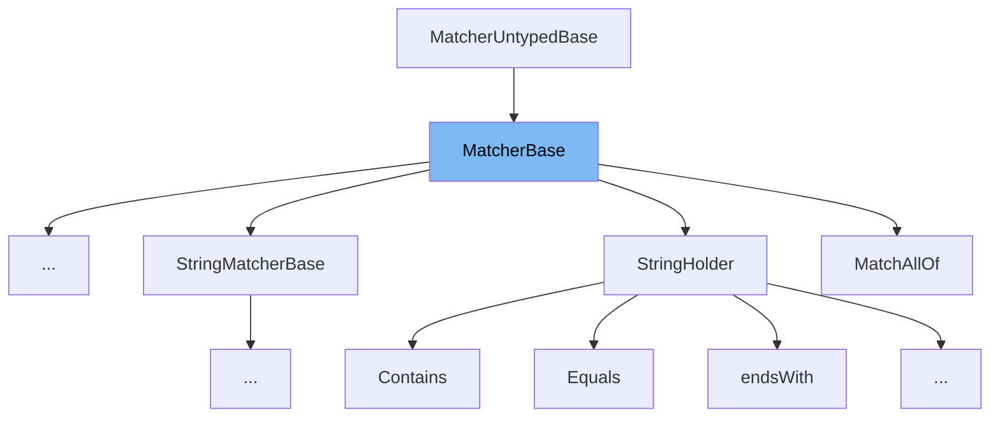

This document will cover the class <SwmToken path="src/3rdparty/catch2/catch.hpp" pos="3280:3:3" line-data="        struct MatcherBase : MatcherUntypedBase, MatcherMethod&lt;T&gt; {">`MatcherBase`</SwmToken> in the file <SwmPath>[src/3rdparty/catch2/catch.hpp](src/3rdparty/catch2/catch.hpp)</SwmPath>. We will cover:

1. What is <SwmToken path="src/3rdparty/catch2/catch.hpp" pos="3280:3:3" line-data="        struct MatcherBase : MatcherUntypedBase, MatcherMethod&lt;T&gt; {">`MatcherBase`</SwmToken>
2. Variables and functions
3. Usage example



# What is <SwmToken path="src/3rdparty/catch2/catch.hpp" pos="3280:3:3" line-data="        struct MatcherBase : MatcherUntypedBase, MatcherMethod&lt;T&gt; {">`MatcherBase`</SwmToken>

The <SwmToken path="src/3rdparty/catch2/catch.hpp" pos="3280:3:3" line-data="        struct MatcherBase : MatcherUntypedBase, MatcherMethod&lt;T&gt; {">`MatcherBase`</SwmToken> class in <SwmPath>[src/3rdparty/catch2/catch.hpp](src/3rdparty/catch2/catch.hpp)</SwmPath> is a base class for creating matchers in the <SwmToken path="src/3rdparty/catch2/catch.hpp" pos="3898:17:17" line-data="    Catch::throw_logic_error(CATCH_MAKE_MSG( CATCH_INTERNAL_LINEINFO &lt;&lt; &quot;: Internal Catch2 error: &quot; &lt;&lt; __VA_ARGS__))">`Catch2`</SwmToken> testing framework. Matchers are used to create custom assertions in tests, allowing for more expressive and readable test code. The <SwmToken path="src/3rdparty/catch2/catch.hpp" pos="3280:3:3" line-data="        struct MatcherBase : MatcherUntypedBase, MatcherMethod&lt;T&gt; {">`MatcherBase`</SwmToken> class provides a common interface and basic functionality that all matchers can inherit and extend.

<SwmSnippet path="/src/3rdparty/catch2/catch.hpp" line="2280">

---

# Variables and functions

The variable <SwmToken path="src/3rdparty/catch2/catch.hpp" pos="3552:3:3" line-data="            CasedString m_comparator;">`m_comparator`</SwmToken> is a function pointer used to store the comparison logic for the matcher.

```c++
            "chained comparisons are not supported inside assertions, "
```

---

</SwmSnippet>

<SwmSnippet path="/src/3rdparty/catch2/catch.hpp" line="2281">

---

The variable <SwmToken path="src/3rdparty/catch2/catch.hpp" pos="3497:5:5" line-data="    std::string m_description;">`m_description`</SwmToken> is a string that holds the description of the matcher, which is used in error messages when a test fails.

```c++
            "wrap the expression inside parentheses, or decompose it");
```

---

</SwmSnippet>

<SwmSnippet path="/src/3rdparty/catch2/catch.hpp" line="2283">

---

The constructor <SwmToken path="src/3rdparty/catch2/catch.hpp" pos="3280:3:3" line-data="        struct MatcherBase : MatcherUntypedBase, MatcherMethod&lt;T&gt; {">`MatcherBase`</SwmToken> initializes the matcher with a description and a comparator function.

```c++

        template<typename T>
        auto operator >= ( T ) const -> BinaryExpr<LhsT, RhsT const&> const {
```

---

</SwmSnippet>

<SwmSnippet path="/src/3rdparty/catch2/catch.hpp" line="2287">

---

The function <SwmToken path="src/3rdparty/catch2/catch.hpp" pos="3263:5:5" line-data="            virtual bool match( ObjectT const&amp; arg ) const = 0;">`match`</SwmToken> is a pure virtual function that must be implemented by derived classes. It takes a value and returns a boolean indicating whether the value matches the criteria defined by the matcher.

```c++
            "chained comparisons are not supported inside assertions, "
            "wrap the expression inside parentheses, or decompose it");
        }

```

---

</SwmSnippet>

<SwmSnippet path="/src/3rdparty/catch2/catch.hpp" line="2292">

---

The function <SwmToken path="src/3rdparty/catch2/catch.hpp" pos="3252:7:7" line-data="            virtual std::string describe() const = 0;">`describe`</SwmToken> returns the description of the matcher.

```c++
        auto operator <= ( T ) const -> BinaryExpr<LhsT, RhsT const&> const {
            static_assert(always_false<T>::value,
            "chained comparisons are not supported inside assertions, "
```

---

</SwmSnippet>

# Usage example

Here is an example of how to use <SwmToken path="src/3rdparty/catch2/catch.hpp" pos="3280:3:3" line-data="        struct MatcherBase : MatcherUntypedBase, MatcherMethod&lt;T&gt; {">`MatcherBase`</SwmToken> in <SwmToken path="src/3rdparty/catch2/catch.hpp" pos="3573:3:3" line-data="        struct RegexMatcher : MatcherBase&lt;std::string&gt; {">`RegexMatcher`</SwmToken>.

<SwmSnippet path="/src/3rdparty/catch2/catch.hpp" line="2300">

---

The <SwmToken path="src/3rdparty/catch2/catch.hpp" pos="3573:3:3" line-data="        struct RegexMatcher : MatcherBase&lt;std::string&gt; {">`RegexMatcher`</SwmToken> class inherits from <SwmToken path="src/3rdparty/catch2/catch.hpp" pos="3280:3:3" line-data="        struct MatcherBase : MatcherUntypedBase, MatcherMethod&lt;T&gt; {">`MatcherBase`</SwmToken> and implements the <SwmToken path="src/3rdparty/catch2/catch.hpp" pos="3263:5:5" line-data="            virtual bool match( ObjectT const&amp; arg ) const = 0;">`match`</SwmToken> function to check if a string matches a regular expression.

```c++
    class UnaryExpr : public ITransientExpression {
        LhsT m_lhs;

        void streamReconstructedExpression( std::ostream &os ) const override {
            os << Catch::Detail::stringify( m_lhs );
        }
```

---

</SwmSnippet>

&nbsp;

*This is an auto-generated document by Swimm AI 🌊 and has not yet been verified by a human*

<SwmMeta version="3.0.0" repo-id="Z2l0aHViJTNBJTNBT3BlblRURC1jb3BpbG90LWRlbW8lM0ElM0Fzd2ltbWlv" repo-name="OpenTTD-copilot-demo"><sup>Powered by [Swimm](/)</sup></SwmMeta>
