```mermaid
graph TD;
  MusicDriver:::currentBaseStyle
MusicDriver --> MusicDriver_DMusic
MusicDriver --> MusicDriver_Allegro
MusicDriver --> MusicDriver_ExtMidi
MusicDriver --> MusicDriver_Cocoa
MusicDriver --> MusicDriver_FluidSynth
MusicDriver --> MusicDriver_BeMidi
MusicDriver --> MusicDriver_Win32
MusicDriver --> MusicDriver_Null

 classDef currentBaseStyle color:#000000,fill:#7CB9F4

%% Swimm:
%% graph TD;
%%   MusicDriver:::currentBaseStyle
%% <SwmToken path="src/music/music_driver.hpp" pos="46:3:3" line-data="	static MusicDriver *GetInstance()">`MusicDriver`</SwmToken> --> MusicDriver_DMusic
%% <SwmToken path="src/music/music_driver.hpp" pos="46:3:3" line-data="	static MusicDriver *GetInstance()">`MusicDriver`</SwmToken> --> MusicDriver_Allegro
%% <SwmToken path="src/music/music_driver.hpp" pos="46:3:3" line-data="	static MusicDriver *GetInstance()">`MusicDriver`</SwmToken> --> <SwmToken path="src/music/extmidi.h" pos="15:2:2" line-data="class MusicDriver_ExtMidi : public MusicDriver {">`MusicDriver_ExtMidi`</SwmToken>
%% <SwmToken path="src/music/music_driver.hpp" pos="46:3:3" line-data="	static MusicDriver *GetInstance()">`MusicDriver`</SwmToken> --> MusicDriver_Cocoa
%% <SwmToken path="src/music/music_driver.hpp" pos="46:3:3" line-data="	static MusicDriver *GetInstance()">`MusicDriver`</SwmToken> --> MusicDriver_FluidSynth
%% <SwmToken path="src/music/music_driver.hpp" pos="46:3:3" line-data="	static MusicDriver *GetInstance()">`MusicDriver`</SwmToken> --> MusicDriver_BeMidi
%% <SwmToken path="src/music/music_driver.hpp" pos="46:3:3" line-data="	static MusicDriver *GetInstance()">`MusicDriver`</SwmToken> --> MusicDriver_Win32
%% <SwmToken path="src/music/music_driver.hpp" pos="46:3:3" line-data="	static MusicDriver *GetInstance()">`MusicDriver`</SwmToken> --> MusicDriver_Null
%% 
%%  classDef currentBaseStyle color:#000000,fill:#7CB9F4
```

This document will cover the <SwmToken path="src/music/music_driver.hpp" pos="46:3:3" line-data="	static MusicDriver *GetInstance()">`MusicDriver`</SwmToken> class. We will discuss:

1. What <SwmToken path="src/music/music_driver.hpp" pos="46:3:3" line-data="	static MusicDriver *GetInstance()">`MusicDriver`</SwmToken> is.
2. The variables and functions defined in <SwmToken path="src/music/music_driver.hpp" pos="46:3:3" line-data="	static MusicDriver *GetInstance()">`MusicDriver`</SwmToken>.
3. An example of how to use <SwmToken path="src/music/music_driver.hpp" pos="46:3:3" line-data="	static MusicDriver *GetInstance()">`MusicDriver`</SwmToken> in <SwmToken path="src/music/extmidi.h" pos="15:2:2" line-data="class MusicDriver_ExtMidi : public MusicDriver {">`MusicDriver_ExtMidi`</SwmToken>.



# What is <SwmToken path="src/music/music_driver.hpp" pos="46:3:3" line-data="	static MusicDriver *GetInstance()">`MusicDriver`</SwmToken>

The <SwmToken path="src/music/music_driver.hpp" pos="46:3:3" line-data="	static MusicDriver *GetInstance()">`MusicDriver`</SwmToken> class in <SwmPath>[src/music/music_driver.hpp](src/music/music_driver.hpp)</SwmPath> is a base class for all music playback functionalities in the <SwmToken path="src/music/music_driver.hpp" pos="2:13:13" line-data=" * This file is part of OpenTTD.">`OpenTTD`</SwmToken> game. It provides an interface for playing, stopping, and managing music playback, as well as setting the volume. This class is essential for integrating different music playback mechanisms into the game.

<SwmSnippet path="/src/music/music_driver.hpp" line="24">

---

# Variables and functions

The function <SwmToken path="src/music/music_driver.hpp" pos="24:5:5" line-data="	virtual void PlaySong(const MusicSongInfo &amp;song) = 0;">`PlaySong`</SwmToken> is a pure virtual function that takes a <SwmToken path="src/music/music_driver.hpp" pos="24:9:9" line-data="	virtual void PlaySong(const MusicSongInfo &amp;song) = 0;">`MusicSongInfo`</SwmToken> object as a parameter. It is used to play a particular song.

```c++
	virtual void PlaySong(const MusicSongInfo &song) = 0;
```

---

</SwmSnippet>

<SwmSnippet path="/src/music/music_driver.hpp" line="29">

---

The function <SwmToken path="src/music/music_driver.hpp" pos="29:5:5" line-data="	virtual void StopSong() = 0;">`StopSong`</SwmToken> is a pure virtual function that stops the currently playing song.

```c++
	virtual void StopSong() = 0;
```

---

</SwmSnippet>

<SwmSnippet path="/src/music/music_driver.hpp" line="35">

---

The function <SwmToken path="src/music/music_driver.hpp" pos="35:5:5" line-data="	virtual bool IsSongPlaying() = 0;">`IsSongPlaying`</SwmToken> is a pure virtual function that returns a boolean indicating whether a song is currently being played.

```c++
	virtual bool IsSongPlaying() = 0;
```

---

</SwmSnippet>

<SwmSnippet path="/src/music/music_driver.hpp" line="41">

---

The function <SwmToken path="src/music/music_driver.hpp" pos="41:5:5" line-data="	virtual void SetVolume(uint8_t vol) = 0;">`SetVolume`</SwmToken> is a pure virtual function that sets the volume for music playback. It takes a <SwmToken path="src/music/music_driver.hpp" pos="41:7:7" line-data="	virtual void SetVolume(uint8_t vol) = 0;">`uint8_t`</SwmToken> parameter representing the new volume.

```c++
	virtual void SetVolume(uint8_t vol) = 0;
```

---

</SwmSnippet>

<SwmSnippet path="/src/music/music_driver.hpp" line="46">

---

The function <SwmToken path="src/music/music_driver.hpp" pos="46:6:6" line-data="	static MusicDriver *GetInstance()">`GetInstance`</SwmToken> is a static function that returns the currently active instance of the <SwmToken path="src/music/music_driver.hpp" pos="46:3:3" line-data="	static MusicDriver *GetInstance()">`MusicDriver`</SwmToken>. It uses the <SwmToken path="src/music/music_driver.hpp" pos="48:9:9" line-data="		return static_cast&lt;MusicDriver*&gt;(*DriverFactoryBase::GetActiveDriver(Driver::DT_MUSIC));">`DriverFactoryBase`</SwmToken> to get the active driver of type <SwmToken path="src/music/music_driver.hpp" pos="48:15:15" line-data="		return static_cast&lt;MusicDriver*&gt;(*DriverFactoryBase::GetActiveDriver(Driver::DT_MUSIC));">`DT_MUSIC`</SwmToken>.

```c++
	static MusicDriver *GetInstance()
	{
		return static_cast<MusicDriver*>(*DriverFactoryBase::GetActiveDriver(Driver::DT_MUSIC));
	}
```

---

</SwmSnippet>

<SwmSnippet path="/src/music/music_driver.hpp" line="52">

---

The variable <SwmToken path="src/music/music_driver.hpp" pos="52:6:6" line-data="extern std::string _ini_musicdriver;">`_ini_musicdriver`</SwmToken> is an external string that likely holds the name or configuration of the music driver.

```c++
extern std::string _ini_musicdriver;
```

---

</SwmSnippet>

# Usage example

Here is an example of how to use the <SwmToken path="src/music/music_driver.hpp" pos="46:3:3" line-data="	static MusicDriver *GetInstance()">`MusicDriver`</SwmToken> class in <SwmToken path="src/music/extmidi.h" pos="15:2:2" line-data="class MusicDriver_ExtMidi : public MusicDriver {">`MusicDriver_ExtMidi`</SwmToken>.

<SwmSnippet path="/src/music/extmidi.h" line="15">

---

The <SwmToken path="src/music/extmidi.h" pos="15:2:2" line-data="class MusicDriver_ExtMidi : public MusicDriver {">`MusicDriver_ExtMidi`</SwmToken> class inherits from <SwmToken path="src/music/extmidi.h" pos="15:8:8" line-data="class MusicDriver_ExtMidi : public MusicDriver {">`MusicDriver`</SwmToken>. This class would implement the pure virtual functions defined in <SwmToken path="src/music/extmidi.h" pos="15:8:8" line-data="class MusicDriver_ExtMidi : public MusicDriver {">`MusicDriver`</SwmToken> to provide specific functionality for MIDI music playback.

```c
class MusicDriver_ExtMidi : public MusicDriver {
```

---

</SwmSnippet>

&nbsp;

*This is an auto-generated document by Swimm AI 🌊 and has not yet been verified by a human*

<SwmMeta version="3.0.0" repo-id="Z2l0aHViJTNBJTNBT3BlblRURC1jb3BpbG90LWRlbW8lM0ElM0Fzd2ltbWlv" repo-name="OpenTTD-copilot-demo"><sup>Powered by [Swimm](/)</sup></SwmMeta>
