This document will cover the class <SwmToken path="src/network/network_crypto.h" pos="252:7:7" line-data="	static std::unique_ptr&lt;NetworkAuthenticationClientHandler&gt; Create(std::shared_ptr&lt;NetworkAuthenticationPasswordRequestHandler&gt; password_handler, std::string &amp;secret_key, std::string &amp;public_key);">`NetworkAuthenticationClientHandler`</SwmToken> in detail. We will cover:

1. What is <SwmToken path="src/network/network_crypto.h" pos="252:7:7" line-data="	static std::unique_ptr&lt;NetworkAuthenticationClientHandler&gt; Create(std::shared_ptr&lt;NetworkAuthenticationPasswordRequestHandler&gt; password_handler, std::string &amp;secret_key, std::string &amp;public_key);">`NetworkAuthenticationClientHandler`</SwmToken>
2. Variables and functions
3. Usage example

```mermaid
graph TD;
 NetworkAuthenticationHandler --> NetworkAuthenticationClientHandler:::currentBaseStyle
NetworkAuthenticationClientHandler --> CombinedAuthenticationClientHandler
NetworkAuthenticationClientHandler --> X25519PAKEClientHandler
NetworkAuthenticationClientHandler --> X25519AuthorizedKeyClientHandler
NetworkAuthenticationClientHandler --> 1[...]

 classDef currentBaseStyle color:#000000,fill:#7CB9F4

%% Swimm:
%% graph TD;
%%  <SwmToken path="src/network/network_crypto.h" pos="190:2:2" line-data="class NetworkAuthenticationHandler {">`NetworkAuthenticationHandler`</SwmToken> --> NetworkAuthenticationClientHandler:::currentBaseStyle
%% <SwmToken path="src/network/network_crypto.h" pos="252:7:7" line-data="	static std::unique_ptr&lt;NetworkAuthenticationClientHandler&gt; Create(std::shared_ptr&lt;NetworkAuthenticationPasswordRequestHandler&gt; password_handler, std::string &amp;secret_key, std::string &amp;public_key);">`NetworkAuthenticationClientHandler`</SwmToken> --> <SwmToken path="src/network/network_crypto_internal.h" pos="300:2:2" line-data="class CombinedAuthenticationClientHandler : public NetworkAuthenticationClientHandler {">`CombinedAuthenticationClientHandler`</SwmToken>
%% <SwmToken path="src/network/network_crypto.h" pos="252:7:7" line-data="	static std::unique_ptr&lt;NetworkAuthenticationClientHandler&gt; Create(std::shared_ptr&lt;NetworkAuthenticationPasswordRequestHandler&gt; password_handler, std::string &amp;secret_key, std::string &amp;public_key);">`NetworkAuthenticationClientHandler`</SwmToken> --> <SwmToken path="src/network/network_crypto_internal.h" pos="195:1:1" line-data="	X25519PAKEClientHandler(const X25519SecretKey &amp;secret_key, std::shared_ptr&lt;NetworkAuthenticationPasswordRequestHandler&gt; handler) : X25519AuthenticationHandler(secret_key), handler(handler) {}">`X25519PAKEClientHandler`</SwmToken>
%% <SwmToken path="src/network/network_crypto.h" pos="252:7:7" line-data="	static std::unique_ptr&lt;NetworkAuthenticationClientHandler&gt; Create(std::shared_ptr&lt;NetworkAuthenticationPasswordRequestHandler&gt; password_handler, std::string &amp;secret_key, std::string &amp;public_key);">`NetworkAuthenticationClientHandler`</SwmToken> --> <SwmToken path="src/network/network_crypto_internal.h" pos="244:2:2" line-data="class X25519AuthorizedKeyClientHandler : protected X25519AuthenticationHandler, public NetworkAuthenticationClientHandler {">`X25519AuthorizedKeyClientHandler`</SwmToken>
%% <SwmToken path="src/network/network_crypto.h" pos="252:7:7" line-data="	static std::unique_ptr&lt;NetworkAuthenticationClientHandler&gt; Create(std::shared_ptr&lt;NetworkAuthenticationPasswordRequestHandler&gt; password_handler, std::string &amp;secret_key, std::string &amp;public_key);">`NetworkAuthenticationClientHandler`</SwmToken> --> 1[...]
%% 
%%  classDef currentBaseStyle color:#000000,fill:#7CB9F4
```



# What is <SwmToken path="src/network/network_crypto.h" pos="252:7:7" line-data="	static std::unique_ptr&lt;NetworkAuthenticationClientHandler&gt; Create(std::shared_ptr&lt;NetworkAuthenticationPasswordRequestHandler&gt; password_handler, std::string &amp;secret_key, std::string &amp;public_key);">`NetworkAuthenticationClientHandler`</SwmToken>

The <SwmToken path="src/network/network_crypto.h" pos="252:7:7" line-data="	static std::unique_ptr&lt;NetworkAuthenticationClientHandler&gt; Create(std::shared_ptr&lt;NetworkAuthenticationPasswordRequestHandler&gt; password_handler, std::string &amp;secret_key, std::string &amp;public_key);">`NetworkAuthenticationClientHandler`</SwmToken> is a base class for client-side cryptographic authentication handlers. It is used to handle requests from the server, create responses, and manage encryption requests. This class is part of the network handling system in <SwmToken path="src/network/network_crypto.h" pos="2:13:13" line-data=" * This file is part of OpenTTD.">`OpenTTD`</SwmToken>, specifically dealing with authentication and encryption.

<SwmSnippet path="/src/network/network_crypto.h" line="224">

---

# Variables and functions

The <SwmToken path="src/network/network_crypto.h" pos="225:3:3" line-data="	enum RequestResult {">`RequestResult`</SwmToken> enum defines the possible outcomes of processing a request from the server. It includes <SwmToken path="src/network/network_crypto.h" pos="226:1:1" line-data="		AWAIT_USER_INPUT, ///&lt; We have requested some user input, but must wait on that.">`AWAIT_USER_INPUT`</SwmToken>, <SwmToken path="src/network/network_crypto.h" pos="227:1:1" line-data="		READY_FOR_RESPONSE, ///&lt; We do not have to wait for user input, and can immediately respond to the server.">`READY_FOR_RESPONSE`</SwmToken>, and <SwmToken path="src/network/network_crypto.h" pos="228:1:1" line-data="		INVALID, ///&lt; We have received an invalid request.">`INVALID`</SwmToken>.

```c
	/** The processing result of receiving a request. */
	enum RequestResult {
		AWAIT_USER_INPUT, ///< We have requested some user input, but must wait on that.
		READY_FOR_RESPONSE, ///< We do not have to wait for user input, and can immediately respond to the server.
		INVALID, ///< We have received an invalid request.
	};
```

---

</SwmSnippet>

<SwmSnippet path="/src/network/network_crypto.h" line="232">

---

The <SwmToken path="src/network/network_crypto_internal.h" pos="197:5:5" line-data="	virtual RequestResult ReceiveRequest(struct Packet &amp;p) override;">`ReceiveRequest`</SwmToken> function reads a request from the server. It takes a <SwmToken path="src/network/network_crypto.h" pos="233:10:10" line-data="	 * @param p The packet to read the request from.">`packet`</SwmToken> as a parameter and returns a <SwmToken path="src/network/network_crypto.h" pos="225:3:3" line-data="	enum RequestResult {">`RequestResult`</SwmToken> indicating whether the request is valid.

```c
	 * Read a request from the server.
	 * @param p The packet to read the request from.
	 * @return True when valid, otherwise false.
	 */
```

---

</SwmSnippet>

<SwmSnippet path="/src/network/network_crypto.h" line="239">

---

The <SwmToken path="src/network/network_crypto_internal.h" pos="198:5:5" line-data="	virtual bool SendResponse(struct Packet &amp;p) override { return this-&gt;X25519AuthenticationHandler::SendResponse(p, this-&gt;handler-&gt;password); }">`SendResponse`</SwmToken> function creates a response to send to the server. It takes a <SwmToken path="src/network/network_crypto.h" pos="240:10:10" line-data="	 * @param p The packet to write the response from.">`packet`</SwmToken> as a parameter and returns a boolean indicating whether a valid packet was made.

```c
	 * Create the response to send to the server.
	 * @param p The packet to write the response from.
	 * @return True when a valid packet was made, otherwise false.
	 */
```

---

</SwmSnippet>

<SwmSnippet path="/src/network/network_crypto.h" line="246">

---

The <SwmToken path="src/network/network_crypto.h" pos="249:5:5" line-data="	virtual bool ReceiveEnableEncryption(struct Packet &amp;p) = 0;">`ReceiveEnableEncryption`</SwmToken> function reads the request to enable encryption from the server. It takes a <SwmToken path="src/network/network_crypto.h" pos="249:9:9" line-data="	virtual bool ReceiveEnableEncryption(struct Packet &amp;p) = 0;">`Packet`</SwmToken> as a parameter and returns a boolean indicating whether the request was valid.

```c
	 * Read the request to enable encryption from the server.
	 * @param p The request from the server.
	 */
	virtual bool ReceiveEnableEncryption(struct Packet &p) = 0;
```

---

</SwmSnippet>

<SwmSnippet path="/src/network/network_crypto.h" line="251">

---

The <SwmToken path="src/network/network_crypto.h" pos="251:5:5" line-data="	static void EnsureValidSecretKeyAndUpdatePublicKey(std::string &amp;secret_key, std::string &amp;public_key);">`EnsureValidSecretKeyAndUpdatePublicKey`</SwmToken> function ensures that the secret key is valid and updates the public key accordingly. It takes references to a secret key and a public key as parameters.

```c
	static void EnsureValidSecretKeyAndUpdatePublicKey(std::string &secret_key, std::string &public_key);
	static std::unique_ptr<NetworkAuthenticationClientHandler> Create(std::shared_ptr<NetworkAuthenticationPasswordRequestHandler> password_handler, std::string &secret_key, std::string &public_key);
```

---

</SwmSnippet>

<SwmSnippet path="/src/network/network_crypto.h" line="252">

---

The <SwmToken path="src/network/network_crypto.h" pos="252:10:10" line-data="	static std::unique_ptr&lt;NetworkAuthenticationClientHandler&gt; Create(std::shared_ptr&lt;NetworkAuthenticationPasswordRequestHandler&gt; password_handler, std::string &amp;secret_key, std::string &amp;public_key);">`Create`</SwmToken> function is a static function that creates an instance of <SwmToken path="src/network/network_crypto.h" pos="252:7:7" line-data="	static std::unique_ptr&lt;NetworkAuthenticationClientHandler&gt; Create(std::shared_ptr&lt;NetworkAuthenticationPasswordRequestHandler&gt; password_handler, std::string &amp;secret_key, std::string &amp;public_key);">`NetworkAuthenticationClientHandler`</SwmToken>. It takes a shared pointer to a <SwmToken path="src/network/network_crypto.h" pos="252:16:16" line-data="	static std::unique_ptr&lt;NetworkAuthenticationClientHandler&gt; Create(std::shared_ptr&lt;NetworkAuthenticationPasswordRequestHandler&gt; password_handler, std::string &amp;secret_key, std::string &amp;public_key);">`NetworkAuthenticationPasswordRequestHandler`</SwmToken>, a reference to a secret key, and a reference to a public key as parameters.

```c
	static std::unique_ptr<NetworkAuthenticationClientHandler> Create(std::shared_ptr<NetworkAuthenticationPasswordRequestHandler> password_handler, std::string &secret_key, std::string &public_key);
};
```

---

</SwmSnippet>

# Usage example

Here is an example of how to use <SwmToken path="src/network/network_crypto.h" pos="252:7:7" line-data="	static std::unique_ptr&lt;NetworkAuthenticationClientHandler&gt; Create(std::shared_ptr&lt;NetworkAuthenticationPasswordRequestHandler&gt; password_handler, std::string &amp;secret_key, std::string &amp;public_key);">`NetworkAuthenticationClientHandler`</SwmToken> in <SwmToken path="src/network/network_crypto_internal.h" pos="300:2:2" line-data="class CombinedAuthenticationClientHandler : public NetworkAuthenticationClientHandler {">`CombinedAuthenticationClientHandler`</SwmToken>.

<SwmSnippet path="/src/network/network_crypto_internal.h" line="187">

---

The <SwmToken path="src/network/network_crypto_internal.h" pos="300:2:2" line-data="class CombinedAuthenticationClientHandler : public NetworkAuthenticationClientHandler {">`CombinedAuthenticationClientHandler`</SwmToken> class extends <SwmToken path="src/network/network_crypto.h" pos="252:7:7" line-data="	static std::unique_ptr&lt;NetworkAuthenticationClientHandler&gt; Create(std::shared_ptr&lt;NetworkAuthenticationPasswordRequestHandler&gt; password_handler, std::string &amp;secret_key, std::string &amp;public_key);">`NetworkAuthenticationClientHandler`</SwmToken> and implements its functions. It demonstrates how to handle multiple authentication methods and manage encryption.

```c
	std::shared_ptr<NetworkAuthenticationPasswordRequestHandler> handler;

public:
	/**
	 * Create the handler with the given password handler.
	 * @param secret_key The secret key to initialize this handler with.
	 * @param handler The handler requesting the password from the user, if required.
	 */
	X25519PAKEClientHandler(const X25519SecretKey &secret_key, std::shared_ptr<NetworkAuthenticationPasswordRequestHandler> handler) : X25519AuthenticationHandler(secret_key), handler(handler) {}

	virtual RequestResult ReceiveRequest(struct Packet &p) override;
	virtual bool SendResponse(struct Packet &p) override { return this->X25519AuthenticationHandler::SendResponse(p, this->handler->password); }

	virtual std::string_view GetName() const override { return "X25519-PAKE-client"; }
	virtual NetworkAuthenticationMethod GetAuthenticationMethod() const override { return NETWORK_AUTH_METHOD_X25519_PAKE; }

	virtual bool ReceiveEnableEncryption(struct Packet &p) override { return this->X25519AuthenticationHandler::ReceiveEnableEncryption(p); }
	virtual std::unique_ptr<NetworkEncryptionHandler> CreateClientToServerEncryptionHandler() const override { return this->X25519AuthenticationHandler::CreateClientToServerEncryptionHandler(); }
	virtual std::unique_ptr<NetworkEncryptionHandler> CreateServerToClientEncryptionHandler() const override { return this->X25519AuthenticationHandler::CreateServerToClientEncryptionHandler(); }
};

```

---

</SwmSnippet>

&nbsp;

*This is an auto-generated document by Swimm AI 🌊 and has not yet been verified by a human*

<SwmMeta version="3.0.0" repo-id="Z2l0aHViJTNBJTNBT3BlblRURC1jb3BpbG90LWRlbW8lM0ElM0Fzd2ltbWlv" repo-name="OpenTTD-copilot-demo"><sup>Powered by [Swimm](/)</sup></SwmMeta>
