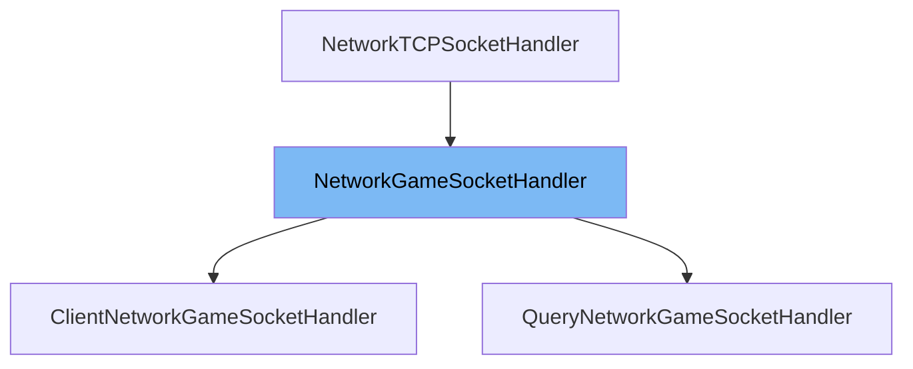

This document will cover the class <SwmToken path="src/network/core/tcp_game.h" pos="23:17:17" line-data=" * For the exact meaning, look at #NetworkGameSocketHandler.">`NetworkGameSocketHandler`</SwmToken> in detail. We will cover:

1. What is <SwmToken path="src/network/core/tcp_game.h" pos="23:17:17" line-data=" * For the exact meaning, look at #NetworkGameSocketHandler.">`NetworkGameSocketHandler`</SwmToken>
2. Variables and functions
3. Usage example



# What is <SwmToken path="src/network/core/tcp_game.h" pos="23:17:17" line-data=" * For the exact meaning, look at #NetworkGameSocketHandler.">`NetworkGameSocketHandler`</SwmToken>

The <SwmToken path="src/network/core/tcp_game.h" pos="23:17:17" line-data=" * For the exact meaning, look at #NetworkGameSocketHandler.">`NetworkGameSocketHandler`</SwmToken> class is a base socket handler for all TCP sockets in the <SwmToken path="src/network/core/tcp_game.h" pos="2:13:13" line-data=" * This file is part of OpenTTD.">`OpenTTD`</SwmToken> game. It is used to manage the communication between the game client and server by handling various TCP packets related to game actions, client-server interactions, and game state synchronization.

<SwmSnippet path="/src/network/core/tcp_game.h" line="144">

---

# Variables and functions

The variable <SwmToken path="src/network/core/tcp_game.h" pos="144:4:4" line-data="	NetworkClientInfo *info;          ///&lt; Client info related to this socket">`info`</SwmToken> is a pointer to <SwmToken path="src/network/core/tcp_game.h" pos="144:1:1" line-data="	NetworkClientInfo *info;          ///&lt; Client info related to this socket">`NetworkClientInfo`</SwmToken> which holds client-related information for this socket.

```c
	NetworkClientInfo *info;          ///< Client info related to this socket
```

---

</SwmSnippet>

<SwmSnippet path="/src/network/core/tcp_game.h" line="145">

---

The variable <SwmToken path="src/network/core/tcp_game.h" pos="145:3:3" line-data="	bool is_pending_deletion = false; ///&lt; Whether this socket is pending deletion">`is_pending_deletion`</SwmToken> is a boolean flag indicating whether this socket is pending deletion.

```c
	bool is_pending_deletion = false; ///< Whether this socket is pending deletion
```

---

</SwmSnippet>

<SwmSnippet path="/src/network/core/tcp_game.h" line="486">

---

The variable <SwmToken path="src/network/core/tcp_game.h" pos="486:3:3" line-data="	ClientID client_id;          ///&lt; Client identifier">`client_id`</SwmToken> is used to store the identifier of the client.

```c
	ClientID client_id;          ///< Client identifier
```

---

</SwmSnippet>

<SwmSnippet path="/src/network/core/tcp_game.h" line="487">

---

The variable <SwmToken path="src/network/core/tcp_game.h" pos="487:3:3" line-data="	uint32_t last_frame;           ///&lt; Last frame we have executed">`last_frame`</SwmToken> stores the last frame that has been executed.

```c
	uint32_t last_frame;           ///< Last frame we have executed
```

---

</SwmSnippet>

<SwmSnippet path="/src/network/core/tcp_game.h" line="488">

---

The variable <SwmToken path="src/network/core/tcp_game.h" pos="488:3:3" line-data="	uint32_t last_frame_server;    ///&lt; Last frame the server has executed">`last_frame_server`</SwmToken> stores the last frame that the server has executed.

```c
	uint32_t last_frame_server;    ///< Last frame the server has executed
```

---

</SwmSnippet>

<SwmSnippet path="/src/network/core/tcp_game.h" line="489">

---

The variable <SwmToken path="src/network/core/tcp_game.h" pos="489:3:3" line-data="	CommandQueue incoming_queue; ///&lt; The command-queue awaiting handling">`incoming_queue`</SwmToken> is a queue of <SwmToken path="src/network/core/tcp_game.h" pos="131:2:2" line-data="struct CommandPacket;">`CommandPacket`</SwmToken> objects awaiting handling.

```c
	CommandQueue incoming_queue; ///< The command-queue awaiting handling
```

---

</SwmSnippet>

<SwmSnippet path="/src/network/core/tcp_game.h" line="490">

---

The variable <SwmToken path="src/network/core/tcp_game.h" pos="490:9:9" line-data="	std::chrono::steady_clock::time_point last_packet; ///&lt; Time we received the last frame.">`last_packet`</SwmToken> is a timestamp indicating the time when the last frame was received.

```c
	std::chrono::steady_clock::time_point last_packet; ///< Time we received the last frame.
```

---

</SwmSnippet>

<SwmSnippet path="/src/network/core/tcp_game.h" line="148">

---

The function <SwmToken path="src/network/core/tcp_game.h" pos="148:3:3" line-data="	NetworkRecvStatus ReceiveInvalidPacket(PacketGameType type);">`ReceiveInvalidPacket`</SwmToken> handles the reception of invalid packets.

```c
	NetworkRecvStatus ReceiveInvalidPacket(PacketGameType type);
```

---

</SwmSnippet>

<SwmSnippet path="/src/network/core/tcp_game.h" line="154">

---

The function <SwmToken path="src/network/core/tcp_game.h" pos="154:5:5" line-data="	virtual NetworkRecvStatus Receive_SERVER_FULL(Packet &amp;p);">`Receive_SERVER_FULL`</SwmToken> handles the notification that the server is full.

```c
	virtual NetworkRecvStatus Receive_SERVER_FULL(Packet &p);
```

---

</SwmSnippet>

<SwmSnippet path="/src/network/core/tcp_game.h" line="160">

---

The function <SwmToken path="src/network/core/tcp_game.h" pos="160:5:5" line-data="	virtual NetworkRecvStatus Receive_SERVER_BANNED(Packet &amp;p);">`Receive_SERVER_BANNED`</SwmToken> handles the notification that the client trying to join is banned.

```c
	virtual NetworkRecvStatus Receive_SERVER_BANNED(Packet &p);
```

---

</SwmSnippet>

<SwmSnippet path="/src/network/core/tcp_game.h" line="173">

---

The function <SwmToken path="src/network/core/tcp_game.h" pos="173:5:5" line-data="	virtual NetworkRecvStatus Receive_CLIENT_JOIN(Packet &amp;p);">`Receive_CLIENT_JOIN`</SwmToken> handles the client's attempt to join the server.

```c
	virtual NetworkRecvStatus Receive_CLIENT_JOIN(Packet &p);
```

---

</SwmSnippet>

<SwmSnippet path="/src/network/core/tcp_game.h" line="180">

---

The function <SwmToken path="src/network/core/tcp_game.h" pos="180:5:5" line-data="	virtual NetworkRecvStatus Receive_SERVER_ERROR(Packet &amp;p);">`Receive_SERVER_ERROR`</SwmToken> handles errors reported by the server.

```c
	virtual NetworkRecvStatus Receive_SERVER_ERROR(Packet &p);
```

---

</SwmSnippet>

<SwmSnippet path="/src/network/core/tcp_game.h" line="186">

---

The function <SwmToken path="src/network/core/tcp_game.h" pos="186:5:5" line-data="	virtual NetworkRecvStatus Receive_CLIENT_GAME_INFO(Packet &amp;p);">`Receive_CLIENT_GAME_INFO`</SwmToken> handles requests for game information.

```c
	virtual NetworkRecvStatus Receive_CLIENT_GAME_INFO(Packet &p);
```

---

</SwmSnippet>

<SwmSnippet path="/src/network/core/tcp_game.h" line="193">

---

The function <SwmToken path="src/network/core/tcp_game.h" pos="193:5:5" line-data="	virtual NetworkRecvStatus Receive_SERVER_GAME_INFO(Packet &amp;p);">`Receive_SERVER_GAME_INFO`</SwmToken> sends information about the game.

```c
	virtual NetworkRecvStatus Receive_SERVER_GAME_INFO(Packet &p);
```

---

</SwmSnippet>

<SwmSnippet path="/src/network/core/tcp_game.h" line="203">

---

The function <SwmToken path="src/network/core/tcp_game.h" pos="203:5:5" line-data="	virtual NetworkRecvStatus Receive_SERVER_CLIENT_INFO(Packet &amp;p);">`Receive_SERVER_CLIENT_INFO`</SwmToken> sends information about a client.

```c
	virtual NetworkRecvStatus Receive_SERVER_CLIENT_INFO(Packet &p);
```

---

</SwmSnippet>

<SwmSnippet path="/src/network/core/tcp_game.h" line="211">

---

The function <SwmToken path="src/network/core/tcp_game.h" pos="211:5:5" line-data="	virtual NetworkRecvStatus Receive_CLIENT_IDENTIFY(Packet &amp;p);">`Receive_CLIENT_IDENTIFY`</SwmToken> handles the client's identity information.

```c
	virtual NetworkRecvStatus Receive_CLIENT_IDENTIFY(Packet &p);
```

---

</SwmSnippet>

<SwmSnippet path="/src/network/core/tcp_game.h" line="220">

---

The function <SwmToken path="src/network/core/tcp_game.h" pos="220:5:5" line-data="	virtual NetworkRecvStatus Receive_SERVER_AUTH_REQUEST(Packet &amp;p);">`Receive_SERVER_AUTH_REQUEST`</SwmToken> handles the server's authentication request.

```c
	virtual NetworkRecvStatus Receive_SERVER_AUTH_REQUEST(Packet &p);
```

---

</SwmSnippet>

<SwmSnippet path="/src/network/core/tcp_game.h" line="229">

---

The function <SwmToken path="src/network/core/tcp_game.h" pos="229:5:5" line-data="	virtual NetworkRecvStatus Receive_CLIENT_AUTH_RESPONSE(Packet &amp;p);">`Receive_CLIENT_AUTH_RESPONSE`</SwmToken> handles the client's response to the authentication request.

```c
	virtual NetworkRecvStatus Receive_CLIENT_AUTH_RESPONSE(Packet &p);
```

---

</SwmSnippet>

<SwmSnippet path="/src/network/core/tcp_game.h" line="237">

---

The function <SwmToken path="src/network/core/tcp_game.h" pos="237:5:5" line-data="	virtual NetworkRecvStatus Receive_SERVER_ENABLE_ENCRYPTION(Packet &amp;p);">`Receive_SERVER_ENABLE_ENCRYPTION`</SwmToken> indicates that authentication is complete and encryption should be enabled.

```c
	virtual NetworkRecvStatus Receive_SERVER_ENABLE_ENCRYPTION(Packet &p);
```

---

</SwmSnippet>

<SwmSnippet path="/src/network/core/tcp_game.h" line="244">

---

The function <SwmToken path="src/network/core/tcp_game.h" pos="244:5:5" line-data="	virtual NetworkRecvStatus Receive_SERVER_WELCOME(Packet &amp;p);">`Receive_SERVER_WELCOME`</SwmToken> handles the server's welcome message to the client.

```c
	virtual NetworkRecvStatus Receive_SERVER_WELCOME(Packet &p);
```

---

</SwmSnippet>

<SwmSnippet path="/src/network/core/tcp_game.h" line="250">

---

The function <SwmToken path="src/network/core/tcp_game.h" pos="250:5:5" line-data="	virtual NetworkRecvStatus Receive_CLIENT_GETMAP(Packet &amp;p);">`Receive_CLIENT_GETMAP`</SwmToken> handles the client's request for the game map.

```c
	virtual NetworkRecvStatus Receive_CLIENT_GETMAP(Packet &p);
```

---

</SwmSnippet>

<SwmSnippet path="/src/network/core/tcp_game.h" line="257">

---

The function <SwmToken path="src/network/core/tcp_game.h" pos="257:5:5" line-data="	virtual NetworkRecvStatus Receive_SERVER_WAIT(Packet &amp;p);">`Receive_SERVER_WAIT`</SwmToken> notifies the client that another client is currently receiving the map.

```c
	virtual NetworkRecvStatus Receive_SERVER_WAIT(Packet &p);
```

---

</SwmSnippet>

<SwmSnippet path="/src/network/core/tcp_game.h" line="264">

---

The function <SwmToken path="src/network/core/tcp_game.h" pos="264:5:5" line-data="	virtual NetworkRecvStatus Receive_SERVER_MAP_BEGIN(Packet &amp;p);">`Receive_SERVER_MAP_BEGIN`</SwmToken> indicates that the server will begin sending the map to the client.

```c
	virtual NetworkRecvStatus Receive_SERVER_MAP_BEGIN(Packet &p);
```

---

</SwmSnippet>

<SwmSnippet path="/src/network/core/tcp_game.h" line="271">

---

The function <SwmToken path="src/network/core/tcp_game.h" pos="271:5:5" line-data="	virtual NetworkRecvStatus Receive_SERVER_MAP_SIZE(Packet &amp;p);">`Receive_SERVER_MAP_SIZE`</SwmToken> sends the size of the map to the client.

```c
	virtual NetworkRecvStatus Receive_SERVER_MAP_SIZE(Packet &p);
```

---

</SwmSnippet>

<SwmSnippet path="/src/network/core/tcp_game.h" line="278">

---

The function <SwmToken path="src/network/core/tcp_game.h" pos="278:5:5" line-data="	virtual NetworkRecvStatus Receive_SERVER_MAP_DATA(Packet &amp;p);">`Receive_SERVER_MAP_DATA`</SwmToken> sends the map data to the client.

```c
	virtual NetworkRecvStatus Receive_SERVER_MAP_DATA(Packet &p);
```

---

</SwmSnippet>

<SwmSnippet path="/src/network/core/tcp_game.h" line="284">

---

The function <SwmToken path="src/network/core/tcp_game.h" pos="284:5:5" line-data="	virtual NetworkRecvStatus Receive_SERVER_MAP_DONE(Packet &amp;p);">`Receive_SERVER_MAP_DONE`</SwmToken> indicates that all map data has been sent to the client.

```c
	virtual NetworkRecvStatus Receive_SERVER_MAP_DONE(Packet &p);
```

---

</SwmSnippet>

<SwmSnippet path="/src/network/core/tcp_game.h" line="290">

---

The function <SwmToken path="src/network/core/tcp_game.h" pos="290:5:5" line-data="	virtual NetworkRecvStatus Receive_CLIENT_MAP_OK(Packet &amp;p);">`Receive_CLIENT_MAP_OK`</SwmToken> tells the server that the client has received the entire map.

```c
	virtual NetworkRecvStatus Receive_CLIENT_MAP_OK(Packet &p);
```

---

</SwmSnippet>

<SwmSnippet path="/src/network/core/tcp_game.h" line="297">

---

The function <SwmToken path="src/network/core/tcp_game.h" pos="297:5:5" line-data="	virtual NetworkRecvStatus Receive_SERVER_JOIN(Packet &amp;p);">`Receive_SERVER_JOIN`</SwmToken> handles the notification that a new client has joined the game.

```c
	virtual NetworkRecvStatus Receive_SERVER_JOIN(Packet &p);
```

---

</SwmSnippet>

<SwmSnippet path="/src/network/core/tcp_game.h" line="308">

---

The function <SwmToken path="src/network/core/tcp_game.h" pos="308:5:5" line-data="	virtual NetworkRecvStatus Receive_SERVER_FRAME(Packet &amp;p);">`Receive_SERVER_FRAME`</SwmToken> sends the current frame counter to the client.

```c
	virtual NetworkRecvStatus Receive_SERVER_FRAME(Packet &p);
```

---

</SwmSnippet>

<SwmSnippet path="/src/network/core/tcp_game.h" line="317">

---

The function <SwmToken path="src/network/core/tcp_game.h" pos="317:5:5" line-data="	virtual NetworkRecvStatus Receive_SERVER_SYNC(Packet &amp;p);">`Receive_SERVER_SYNC`</SwmToken> sends a <SwmToken path="src/network/core/tcp_game.h" pos="311:7:9" line-data="	 * Sends a sync-check to the client:">`sync-check`</SwmToken> to the client.

```c
	virtual NetworkRecvStatus Receive_SERVER_SYNC(Packet &p);
```

---

</SwmSnippet>

<SwmSnippet path="/src/network/core/tcp_game.h" line="325">

---

The function <SwmToken path="src/network/core/tcp_game.h" pos="325:5:5" line-data="	virtual NetworkRecvStatus Receive_CLIENT_ACK(Packet &amp;p);">`Receive_CLIENT_ACK`</SwmToken> tells the server that the client is done with the current frame.

```c
	virtual NetworkRecvStatus Receive_CLIENT_ACK(Packet &p);
```

---

</SwmSnippet>

<SwmSnippet path="/src/network/core/tcp_game.h" line="336">

---

The function <SwmToken path="src/network/core/tcp_game.h" pos="336:5:5" line-data="	virtual NetworkRecvStatus Receive_CLIENT_COMMAND(Packet &amp;p);">`Receive_CLIENT_COMMAND`</SwmToken> handles the client's command execution.

```c
	virtual NetworkRecvStatus Receive_CLIENT_COMMAND(Packet &p);
```

---

</SwmSnippet>

<SwmSnippet path="/src/network/core/tcp_game.h" line="348">

---

The function <SwmToken path="src/network/core/tcp_game.h" pos="348:5:5" line-data="	virtual NetworkRecvStatus Receive_SERVER_COMMAND(Packet &amp;p);">`Receive_SERVER_COMMAND`</SwmToken> sends a command to the client.

```c
	virtual NetworkRecvStatus Receive_SERVER_COMMAND(Packet &p);
```

---

</SwmSnippet>

&nbsp;

*This is an auto-generated document by Swimm AI 🌊 and has not yet been verified by a human*

<SwmMeta version="3.0.0" repo-id="Z2l0aHViJTNBJTNBT3BlblRURC1jb3BpbG90LWRlbW8lM0ElM0Fzd2ltbWlv" repo-name="OpenTTD-copilot-demo"><sup>Powered by [Swimm](/)</sup></SwmMeta>
