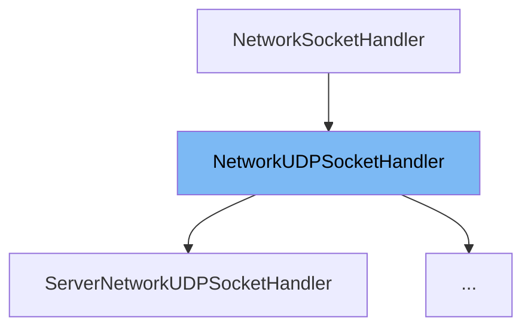

This document will cover the class <SwmToken path="src/network/core/udp.h" pos="51:1:1" line-data="	NetworkUDPSocketHandler(NetworkAddressList *bind = nullptr);">`NetworkUDPSocketHandler`</SwmToken> in detail. We will cover:

1. What <SwmToken path="src/network/core/udp.h" pos="51:1:1" line-data="	NetworkUDPSocketHandler(NetworkAddressList *bind = nullptr);">`NetworkUDPSocketHandler`</SwmToken> is.
2. Main variables and functions in <SwmToken path="src/network/core/udp.h" pos="51:1:1" line-data="	NetworkUDPSocketHandler(NetworkAddressList *bind = nullptr);">`NetworkUDPSocketHandler`</SwmToken>.
3. Example of how to use <SwmToken path="src/network/core/udp.h" pos="51:1:1" line-data="	NetworkUDPSocketHandler(NetworkAddressList *bind = nullptr);">`NetworkUDPSocketHandler`</SwmToken> in <SwmToken path="src/network/network_udp.cpp" pos="72:1:1" line-data="	ServerNetworkUDPSocketHandler(NetworkAddressList *addresses) : NetworkUDPSocketHandler(addresses) {}">`ServerNetworkUDPSocketHandler`</SwmToken>.



# What is <SwmToken path="src/network/core/udp.h" pos="51:1:1" line-data="	NetworkUDPSocketHandler(NetworkAddressList *bind = nullptr);">`NetworkUDPSocketHandler`</SwmToken>

<SwmToken path="src/network/core/udp.h" pos="51:1:1" line-data="	NetworkUDPSocketHandler(NetworkAddressList *bind = nullptr);">`NetworkUDPSocketHandler`</SwmToken> is a base class for handling UDP sockets in the <SwmToken path="src/network/core/udp.h" pos="2:13:13" line-data=" * This file is part of OpenTTD.">`OpenTTD`</SwmToken> game. It provides the fundamental functionalities required to receive and send UDP packets. This class is essential for network communication within the game, allowing different components to interact over the network using UDP protocol.

<SwmSnippet path="/src/network/core/udp.h" line="29">

---

# Variables and functions

The variable <SwmToken path="src/network/core/udp.h" pos="29:3:3" line-data="	NetworkAddressList bind;">`bind`</SwmToken> is used to store the address to which the socket should bind. It is of type <SwmToken path="src/network/core/udp.h" pos="29:1:1" line-data="	NetworkAddressList bind;">`NetworkAddressList`</SwmToken>.

```c
	NetworkAddressList bind;
```

---

</SwmSnippet>

<SwmSnippet path="/src/network/core/udp.h" line="31">

---

The variable <SwmToken path="src/network/core/udp.h" pos="31:3:3" line-data="	SocketList sockets;">`sockets`</SwmToken> is used to store the list of opened sockets. It is of type <SwmToken path="src/network/core/udp.h" pos="31:1:1" line-data="	SocketList sockets;">`SocketList`</SwmToken>.

```c
	SocketList sockets;
```

---

</SwmSnippet>

<SwmSnippet path="/src/network/core/udp.h" line="33">

---

The function <SwmToken path="src/network/core/udp.h" pos="33:3:3" line-data="	void ReceiveInvalidPacket(PacketUDPType, NetworkAddress &amp;client_addr);">`ReceiveInvalidPacket`</SwmToken> handles invalid packets received by the socket. It takes a <SwmToken path="src/network/core/udp.h" pos="33:5:5" line-data="	void ReceiveInvalidPacket(PacketUDPType, NetworkAddress &amp;client_addr);">`PacketUDPType`</SwmToken> and a <SwmToken path="src/network/core/udp.h" pos="33:8:8" line-data="	void ReceiveInvalidPacket(PacketUDPType, NetworkAddress &amp;client_addr);">`NetworkAddress`</SwmToken> reference as parameters.

```c
	void ReceiveInvalidPacket(PacketUDPType, NetworkAddress &client_addr);
```

---

</SwmSnippet>

<SwmSnippet path="/src/network/core/udp.h" line="40">

---

The function <SwmToken path="src/network/core/udp.h" pos="40:5:5" line-data="	virtual void Receive_CLIENT_FIND_SERVER(Packet &amp;p, NetworkAddress &amp;client_addr);">`Receive_CLIENT_FIND_SERVER`</SwmToken> is a virtual function that processes packets querying the server for game information. It takes a <SwmToken path="src/network/core/udp.h" pos="40:7:7" line-data="	virtual void Receive_CLIENT_FIND_SERVER(Packet &amp;p, NetworkAddress &amp;client_addr);">`Packet`</SwmToken> reference and a <SwmToken path="src/network/core/udp.h" pos="40:13:13" line-data="	virtual void Receive_CLIENT_FIND_SERVER(Packet &amp;p, NetworkAddress &amp;client_addr);">`NetworkAddress`</SwmToken> reference as parameters.

```c
	virtual void Receive_CLIENT_FIND_SERVER(Packet &p, NetworkAddress &client_addr);
```

---

</SwmSnippet>

<SwmSnippet path="/src/network/core/udp.h" line="47">

---

The function <SwmToken path="src/network/core/udp.h" pos="47:5:5" line-data="	virtual void Receive_SERVER_RESPONSE(Packet &amp;p, NetworkAddress &amp;client_addr);">`Receive_SERVER_RESPONSE`</SwmToken> is a virtual function that processes packets responding to client queries. It takes a <SwmToken path="src/network/core/udp.h" pos="47:7:7" line-data="	virtual void Receive_SERVER_RESPONSE(Packet &amp;p, NetworkAddress &amp;client_addr);">`Packet`</SwmToken> reference and a <SwmToken path="src/network/core/udp.h" pos="47:13:13" line-data="	virtual void Receive_SERVER_RESPONSE(Packet &amp;p, NetworkAddress &amp;client_addr);">`NetworkAddress`</SwmToken> reference as parameters.

```c
	virtual void Receive_SERVER_RESPONSE(Packet &p, NetworkAddress &client_addr);
```

---

</SwmSnippet>

<SwmSnippet path="/src/network/core/udp.h" line="49">

---

The function <SwmToken path="src/network/core/udp.h" pos="49:3:3" line-data="	void HandleUDPPacket(Packet &amp;p, NetworkAddress &amp;client_addr);">`HandleUDPPacket`</SwmToken> processes incoming UDP packets. It takes a <SwmToken path="src/network/core/udp.h" pos="49:5:5" line-data="	void HandleUDPPacket(Packet &amp;p, NetworkAddress &amp;client_addr);">`Packet`</SwmToken> reference and a <SwmToken path="src/network/core/udp.h" pos="49:11:11" line-data="	void HandleUDPPacket(Packet &amp;p, NetworkAddress &amp;client_addr);">`NetworkAddress`</SwmToken> reference as parameters.

```c
	void HandleUDPPacket(Packet &p, NetworkAddress &client_addr);
```

---

</SwmSnippet>

<SwmSnippet path="/src/network/core/udp.h" line="51">

---

The constructor <SwmToken path="src/network/core/udp.h" pos="51:1:1" line-data="	NetworkUDPSocketHandler(NetworkAddressList *bind = nullptr);">`NetworkUDPSocketHandler`</SwmToken> initializes the socket handler. It takes an optional <SwmToken path="src/network/core/udp.h" pos="51:3:3" line-data="	NetworkUDPSocketHandler(NetworkAddressList *bind = nullptr);">`NetworkAddressList`</SwmToken> pointer as a parameter.

```c
	NetworkUDPSocketHandler(NetworkAddressList *bind = nullptr);
```

---

</SwmSnippet>

<SwmSnippet path="/src/network/core/udp.h" line="54">

---

The destructor <SwmToken path="src/network/core/udp.h" pos="54:3:4" line-data="	virtual ~NetworkUDPSocketHandler() { this-&gt;CloseSocket(); }">`~NetworkUDPSocketHandler`</SwmToken> ensures that the socket is closed when the object is destroyed.

```c
	virtual ~NetworkUDPSocketHandler() { this->CloseSocket(); }
```

---

</SwmSnippet>

<SwmSnippet path="/src/network/core/udp.h" line="56">

---

The function <SwmToken path="src/network/core/udp.h" pos="56:3:3" line-data="	bool Listen();">`Listen`</SwmToken> starts listening for incoming UDP packets.

```c
	bool Listen();
```

---

</SwmSnippet>

<SwmSnippet path="/src/network/core/udp.h" line="57">

---

The function <SwmToken path="src/network/core/udp.h" pos="57:3:3" line-data="	void CloseSocket();">`CloseSocket`</SwmToken> closes the opened socket.

```c
	void CloseSocket();
```

---

</SwmSnippet>

<SwmSnippet path="/src/network/core/udp.h" line="59">

---

The function <SwmToken path="src/network/core/udp.h" pos="59:3:3" line-data="	void SendPacket(Packet &amp;p, NetworkAddress &amp;recv, bool all = false, bool broadcast = false);">`SendPacket`</SwmToken> sends a UDP packet to a specified address. It takes a <SwmToken path="src/network/core/udp.h" pos="59:5:5" line-data="	void SendPacket(Packet &amp;p, NetworkAddress &amp;recv, bool all = false, bool broadcast = false);">`Packet`</SwmToken> reference, a <SwmToken path="src/network/core/udp.h" pos="59:11:11" line-data="	void SendPacket(Packet &amp;p, NetworkAddress &amp;recv, bool all = false, bool broadcast = false);">`NetworkAddress`</SwmToken> reference, and optional boolean parameters for sending to all addresses or broadcasting.

```c
	void SendPacket(Packet &p, NetworkAddress &recv, bool all = false, bool broadcast = false);
```

---

</SwmSnippet>

<SwmSnippet path="/src/network/core/udp.h" line="60">

---

The function <SwmToken path="src/network/core/udp.h" pos="60:3:3" line-data="	void ReceivePackets();">`ReceivePackets`</SwmToken> processes all incoming UDP packets.

```c
	void ReceivePackets();
```

---

</SwmSnippet>

# Usage example

Here is an example of how to use <SwmToken path="src/network/core/udp.h" pos="51:1:1" line-data="	NetworkUDPSocketHandler(NetworkAddressList *bind = nullptr);">`NetworkUDPSocketHandler`</SwmToken> in the <SwmToken path="src/network/network_udp.cpp" pos="72:1:1" line-data="	ServerNetworkUDPSocketHandler(NetworkAddressList *addresses) : NetworkUDPSocketHandler(addresses) {}">`ServerNetworkUDPSocketHandler`</SwmToken> class.

<SwmSnippet path="/src/network/network_udp.cpp" line="72">

---

The <SwmToken path="src/network/network_udp.cpp" pos="72:1:1" line-data="	ServerNetworkUDPSocketHandler(NetworkAddressList *addresses) : NetworkUDPSocketHandler(addresses) {}">`ServerNetworkUDPSocketHandler`</SwmToken> class extends <SwmToken path="src/network/network_udp.cpp" pos="72:11:11" line-data="	ServerNetworkUDPSocketHandler(NetworkAddressList *addresses) : NetworkUDPSocketHandler(addresses) {}">`NetworkUDPSocketHandler`</SwmToken> and initializes it with a list of network addresses.

```c++
	ServerNetworkUDPSocketHandler(NetworkAddressList *addresses) : NetworkUDPSocketHandler(addresses) {}
```

---

</SwmSnippet>

&nbsp;

*This is an auto-generated document by Swimm AI 🌊 and has not yet been verified by a human*

<SwmMeta version="3.0.0" repo-id="Z2l0aHViJTNBJTNBT3BlblRURC1jb3BpbG90LWRlbW8lM0ElM0Fzd2ltbWlv" repo-name="OpenTTD-copilot-demo"><sup>Powered by [Swimm](/)</sup></SwmMeta>
