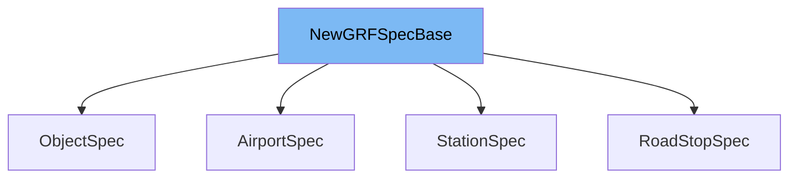

This document will cover the class <SwmToken path="src/newgrf_station.h" pos="115:6:6" line-data="struct StationSpec : NewGRFSpecBase&lt;StationClassID&gt; {">`NewGRFSpecBase`</SwmToken> in the <SwmToken path="src/newgrf_class.h" pos="2:13:13" line-data=" * This file is part of OpenTTD.">`OpenTTD`</SwmToken> project. We will cover:

1. What <SwmToken path="src/newgrf_station.h" pos="115:6:6" line-data="struct StationSpec : NewGRFSpecBase&lt;StationClassID&gt; {">`NewGRFSpecBase`</SwmToken> is.
2. Variables and functions defined in <SwmToken path="src/newgrf_station.h" pos="115:6:6" line-data="struct StationSpec : NewGRFSpecBase&lt;StationClassID&gt; {">`NewGRFSpecBase`</SwmToken>.
3. Usage example of <SwmToken path="src/newgrf_station.h" pos="115:6:6" line-data="struct StationSpec : NewGRFSpecBase&lt;StationClassID&gt; {">`NewGRFSpecBase`</SwmToken> in <SwmToken path="src/newgrf_station.h" pos="115:2:2" line-data="struct StationSpec : NewGRFSpecBase&lt;StationClassID&gt; {">`StationSpec`</SwmToken>.



# What is <SwmToken path="src/newgrf_station.h" pos="115:6:6" line-data="struct StationSpec : NewGRFSpecBase&lt;StationClassID&gt; {">`NewGRFSpecBase`</SwmToken>

<SwmToken path="src/newgrf_station.h" pos="115:6:6" line-data="struct StationSpec : NewGRFSpecBase&lt;StationClassID&gt; {">`NewGRFSpecBase`</SwmToken> is a template struct defined in <SwmPath>[src/newgrf_class.h](src/newgrf_class.h)</SwmPath>. It serves as a base for each type of <SwmToken path="src/newgrf_class.h" pos="8:30:30" line-data="/** @file newgrf_class.h Header file for classes to be used by e.g. NewGRF stations and airports */">`NewGRF`</SwmToken> specification to be used with the <SwmToken path="src/newgrf_class.h" pos="15:24:24" line-data="/* Base for each type of NewGRF spec to be used with NewGRFClass. */">`NewGRFClass`</SwmToken> template. This struct is used to manage the class index and the index within the class for various <SwmToken path="src/newgrf_class.h" pos="8:30:30" line-data="/** @file newgrf_class.h Header file for classes to be used by e.g. NewGRF stations and airports */">`NewGRF`</SwmToken> specifications, such as stations, airports, road stops, and objects.

<SwmSnippet path="/src/newgrf_class.h" line="18">

---

# Variables and functions

The variable <SwmToken path="src/newgrf_class.h" pos="18:3:3" line-data="	Tindex class_index; ///&lt; Class index of this spec, invalid until class is allocated.">`class_index`</SwmToken> is used to store the class index of the specification. It is invalid until the class is allocated.

```c
	Tindex class_index; ///< Class index of this spec, invalid until class is allocated.
```

---

</SwmSnippet>

<SwmSnippet path="/src/newgrf_class.h" line="19">

---

The variable <SwmToken path="src/newgrf_class.h" pos="19:3:3" line-data="	uint16_t index; ///&lt; Index within class of this spec, invalid until inserted into class.">`index`</SwmToken> is used to store the index within the class of the specification. It is invalid until the specification is inserted into the class.

```c
	uint16_t index; ///< Index within class of this spec, invalid until inserted into class.
```

---

</SwmSnippet>

# Usage example

Here is an example of how to use <SwmToken path="src/newgrf_station.h" pos="115:6:6" line-data="struct StationSpec : NewGRFSpecBase&lt;StationClassID&gt; {">`NewGRFSpecBase`</SwmToken> in <SwmToken path="src/newgrf_station.h" pos="115:2:2" line-data="struct StationSpec : NewGRFSpecBase&lt;StationClassID&gt; {">`StationSpec`</SwmToken>.

<SwmSnippet path="/src/newgrf_station.h" line="115">

---

<SwmToken path="src/newgrf_station.h" pos="115:2:2" line-data="struct StationSpec : NewGRFSpecBase&lt;StationClassID&gt; {">`StationSpec`</SwmToken> is a struct that inherits from <SwmToken path="src/newgrf_station.h" pos="115:6:6" line-data="struct StationSpec : NewGRFSpecBase&lt;StationClassID&gt; {">`NewGRFSpecBase`</SwmToken> with <SwmToken path="src/newgrf_station.h" pos="115:8:8" line-data="struct StationSpec : NewGRFSpecBase&lt;StationClassID&gt; {">`StationClassID`</SwmToken> as the template parameter. This demonstrates how <SwmToken path="src/newgrf_station.h" pos="115:6:6" line-data="struct StationSpec : NewGRFSpecBase&lt;StationClassID&gt; {">`NewGRFSpecBase`</SwmToken> is used as a base for station specifications.

```c
struct StationSpec : NewGRFSpecBase<StationClassID> {
	StationSpec() : name(0),
```

---

</SwmSnippet>

&nbsp;

*This is an auto-generated document by Swimm AI 🌊 and has not yet been verified by a human*

<SwmMeta version="3.0.0" repo-id="Z2l0aHViJTNBJTNBT3BlblRURC1jb3BpbG90LWRlbW8lM0ElM0Fzd2ltbWlv" repo-name="OpenTTD-copilot-demo"><sup>Powered by [Swimm](/)</sup></SwmMeta>
