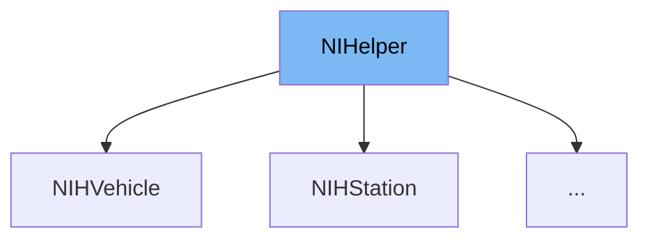

This document will cover the class <SwmToken path="src/newgrf_debug_gui.cpp" pos="118:2:2" line-data="class NIHelper {">`NIHelper`</SwmToken> in <SwmPath>[src/newgrf_debug_gui.cpp](src/newgrf_debug_gui.cpp)</SwmPath>. We will cover:

1. What <SwmToken path="src/newgrf_debug_gui.cpp" pos="118:2:2" line-data="class NIHelper {">`NIHelper`</SwmToken> is and what it is used for.
2. The variables and functions defined in <SwmToken path="src/newgrf_debug_gui.cpp" pos="118:2:2" line-data="class NIHelper {">`NIHelper`</SwmToken>.
3. An example of how to use <SwmToken path="src/newgrf_debug_gui.cpp" pos="118:2:2" line-data="class NIHelper {">`NIHelper`</SwmToken> in <SwmToken path="src/table/newgrf_debug_data.h" pos="138:2:2" line-data="class NIHStation : public NIHelper {">`NIHStation`</SwmToken>.



# What is <SwmToken path="src/newgrf_debug_gui.cpp" pos="118:2:2" line-data="class NIHelper {">`NIHelper`</SwmToken>

<SwmToken path="src/newgrf_debug_gui.cpp" pos="118:2:2" line-data="class NIHelper {">`NIHelper`</SwmToken> is a helper class defined in <SwmPath>[src/newgrf_debug_gui.cpp](src/newgrf_debug_gui.cpp)</SwmPath>. It is used to wrap some functionality and queries related to <SwmToken path="src/newgrf_debug_gui.cpp" pos="87:14:14" line-data="/** Representation of the data from a NewGRF property. */">`NewGRF`</SwmToken> properties, callbacks, and variables. The class provides a set of virtual functions that can be overridden to inspect and manipulate <SwmToken path="src/newgrf_debug_gui.cpp" pos="87:14:14" line-data="/** Representation of the data from a NewGRF property. */">`NewGRF`</SwmToken> data.

<SwmSnippet path="/src/newgrf_debug_gui.cpp" line="117">

---

# Variables and functions

The class <SwmToken path="src/newgrf_debug_gui.cpp" pos="118:2:2" line-data="class NIHelper {">`NIHelper`</SwmToken> is defined with several virtual functions that need to be overridden by derived classes. These functions include <SwmToken path="src/newgrf_debug_gui.cpp" pos="128:5:5" line-data="	virtual bool IsInspectable(uint index) const = 0;">`IsInspectable`</SwmToken>, <SwmToken path="src/newgrf_debug_gui.cpp" pos="135:5:5" line-data="	virtual uint GetParent(uint index) const = 0;">`GetParent`</SwmToken>, <SwmToken path="src/newgrf_debug_gui.cpp" pos="142:8:8" line-data="	virtual const void *GetInstance(uint index) const = 0;">`GetInstance`</SwmToken>, <SwmToken path="src/newgrf_debug_gui.cpp" pos="149:8:8" line-data="	virtual const void *GetSpec(uint index) const = 0;">`GetSpec`</SwmToken>, <SwmToken path="src/newgrf_debug_gui.cpp" pos="155:5:5" line-data="	virtual void SetStringParameters(uint index) const = 0;">`SetStringParameters`</SwmToken>, <SwmToken path="src/newgrf_debug_gui.cpp" pos="162:5:5" line-data="	virtual uint32_t GetGRFID(uint index) const = 0;">`GetGRFID`</SwmToken>, <SwmToken path="src/newgrf_debug_gui.cpp" pos="165:3:3" line-data="	 * Resolve (action2) variable for a given index.">`Resolve`</SwmToken>, <SwmToken path="src/newgrf_debug_gui.cpp" pos="178:5:5" line-data="	virtual bool PSAWithParameter() const">`PSAWithParameter`</SwmToken>, and <SwmToken path="src/newgrf_debug_gui.cpp" pos="189:12:12" line-data="	virtual const std::span&lt;int32_t&gt; GetPSA([[maybe_unused]] uint index, [[maybe_unused]] uint32_t grfid) const">`GetPSA`</SwmToken>. Additionally, there are protected helper functions <SwmToken path="src/newgrf_debug_gui.cpp" pos="200:3:3" line-data="	void SetSimpleStringParameters(StringID string, uint32_t index) const">`SetSimpleStringParameters`</SwmToken> and <SwmToken path="src/newgrf_debug_gui.cpp" pos="213:3:3" line-data="	void SetObjectAtStringParameters(StringID string, uint32_t index, TileIndex tile) const">`SetObjectAtStringParameters`</SwmToken>.

```c++
/** Helper class to wrap some functionality/queries in. */
class NIHelper {
public:
	/** Silence a warning. */
	virtual ~NIHelper() = default;

	/**
	 * Is the item with the given index inspectable?
	 * @param index the index to check.
	 * @return true iff the index is inspectable.
	 */
	virtual bool IsInspectable(uint index) const = 0;

	/**
	 * Get the parent "window_number" of a given instance.
	 * @param index the instance to get the parent for.
	 * @return the parent's window_number or UINT32_MAX if there is none.
	 */
	virtual uint GetParent(uint index) const = 0;

	/**
```

---

</SwmSnippet>

<SwmSnippet path="/src/newgrf_debug_gui.cpp" line="239">

---

The function <SwmToken path="src/newgrf_debug_gui.cpp" pos="249:9:9" line-data="static inline const NIFeature *GetFeature(uint window_number)">`GetFeature`</SwmToken> retrieves the <SwmToken path="src/newgrf_debug_gui.cpp" pos="245:7:7" line-data=" * Get the NIFeature related to the window number.">`NIFeature`</SwmToken> related to the window number. It is used to get the feature associated with a specific window.

```c++
static inline GrfSpecFeature GetFeatureNum(uint window_number)
{
	return (GrfSpecFeature)GB(window_number, 24, 8);
}

/**
 * Get the NIFeature related to the window number.
 * @param window_number The window to get the NIFeature for.
 * @return the NIFeature, or nullptr is there isn't one.
 */
static inline const NIFeature *GetFeature(uint window_number)
{
	GrfSpecFeature idx = GetFeatureNum(window_number);
	return idx < GSF_FAKE_END ? _nifeatures[idx] : nullptr;
}
```

---

</SwmSnippet>

<SwmSnippet path="/src/newgrf_debug_gui.cpp" line="255">

---

The function <SwmToken path="src/newgrf_debug_gui.cpp" pos="261:9:9" line-data="static inline const NIHelper *GetFeatureHelper(uint window_number)">`GetFeatureHelper`</SwmToken> retrieves the <SwmToken path="src/newgrf_debug_gui.cpp" pos="256:7:7" line-data=" * Get the NIHelper related to the window number.">`NIHelper`</SwmToken> related to the window number. It is used to get the helper functions associated with a specific window.

```c++
/**
 * Get the NIHelper related to the window number.
 * @param window_number The window to get the NIHelper for.
 * @pre GetFeature(window_number) != nullptr
 * @return the NIHelper
 */
static inline const NIHelper *GetFeatureHelper(uint window_number)
{
	return GetFeature(window_number)->helper;
}
```

---

</SwmSnippet>

# Usage example

Here is an example of how to use <SwmToken path="src/newgrf_debug_gui.cpp" pos="118:2:2" line-data="class NIHelper {">`NIHelper`</SwmToken> in <SwmToken path="src/table/newgrf_debug_data.h" pos="138:2:2" line-data="class NIHStation : public NIHelper {">`NIHStation`</SwmToken>.

<SwmSnippet path="/src/table/newgrf_debug_data.h" line="138">

---

<SwmToken path="src/table/newgrf_debug_data.h" pos="138:2:2" line-data="class NIHStation : public NIHelper {">`NIHStation`</SwmToken> is a class that inherits from <SwmToken path="src/table/newgrf_debug_data.h" pos="138:8:8" line-data="class NIHStation : public NIHelper {">`NIHelper`</SwmToken>. It overrides the <SwmToken path="src/table/newgrf_debug_data.h" pos="139:3:3" line-data="	bool IsInspectable(uint index) const override        { return GetStationSpec(index) != nullptr; }">`IsInspectable`</SwmToken> function to check if a station is inspectable by verifying if the station specification is not null.

```c
class NIHStation : public NIHelper {
	bool IsInspectable(uint index) const override        { return GetStationSpec(index) != nullptr; }
```

---

</SwmSnippet>

&nbsp;

*This is an auto-generated document by Swimm AI 🌊 and has not yet been verified by a human*

<SwmMeta version="3.0.0" repo-id="Z2l0aHViJTNBJTNBT3BlblRURC1jb3BpbG90LWRlbW8lM0ElM0Fzd2ltbWlv" repo-name="OpenTTD-copilot-demo"><sup>Powered by [Swimm](/)</sup></SwmMeta>
