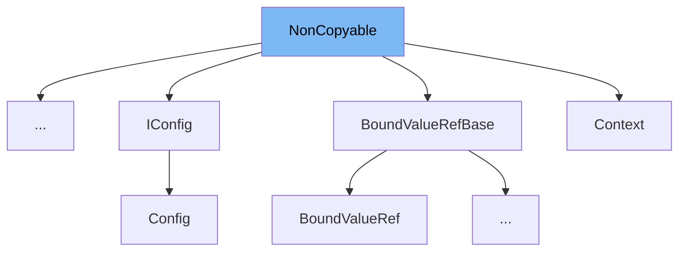

This document will cover the class <SwmToken path="src/3rdparty/catch2/catch.hpp" pos="491:3:3" line-data="    class NonCopyable {">`NonCopyable`</SwmToken> in the file <SwmPath>[src/3rdparty/catch2/catch.hpp](src/3rdparty/catch2/catch.hpp)</SwmPath>. We will cover:

1. What <SwmToken path="src/3rdparty/catch2/catch.hpp" pos="491:3:3" line-data="    class NonCopyable {">`NonCopyable`</SwmToken> is.
2. Variables and functions defined in <SwmToken path="src/3rdparty/catch2/catch.hpp" pos="491:3:3" line-data="    class NonCopyable {">`NonCopyable`</SwmToken>.
3. Usage example of <SwmToken path="src/3rdparty/catch2/catch.hpp" pos="491:3:3" line-data="    class NonCopyable {">`NonCopyable`</SwmToken> in <SwmToken path="src/3rdparty/catch2/catch.hpp" pos="986:2:2" line-data="struct AutoReg : NonCopyable {">`AutoReg`</SwmToken>.



# What is <SwmToken path="src/3rdparty/catch2/catch.hpp" pos="491:3:3" line-data="    class NonCopyable {">`NonCopyable`</SwmToken>

The <SwmToken path="src/3rdparty/catch2/catch.hpp" pos="491:3:3" line-data="    class NonCopyable {">`NonCopyable`</SwmToken> class is a utility class designed to prevent copying and moving of derived classes. It achieves this by deleting the copy constructor, move constructor, copy assignment operator, and move assignment operator. This is useful in scenarios where you want to ensure that instances of a class cannot be copied or moved, thereby maintaining unique instances.

<SwmSnippet path="/src/3rdparty/catch2/catch.hpp" line="491">

---

# Variables and functions

The <SwmToken path="src/3rdparty/catch2/catch.hpp" pos="491:3:3" line-data="    class NonCopyable {">`NonCopyable`</SwmToken> class deletes the copy constructor, move constructor, copy assignment operator, and move assignment operator to prevent copying and moving of instances.

```c++
    class NonCopyable {
        NonCopyable( NonCopyable const& )              = delete;
        NonCopyable( NonCopyable && )                  = delete;
        NonCopyable& operator = ( NonCopyable const& ) = delete;
        NonCopyable& operator = ( NonCopyable && )     = delete;
```

---

</SwmSnippet>

<SwmSnippet path="/src/3rdparty/catch2/catch.hpp" line="498">

---

The <SwmToken path="src/3rdparty/catch2/catch.hpp" pos="498:1:1" line-data="        NonCopyable();">`NonCopyable`</SwmToken> class has a protected default constructor to allow derived classes to be instantiated.

```c++
        NonCopyable();
        virtual ~NonCopyable();
```

---

</SwmSnippet>

<SwmSnippet path="/src/3rdparty/catch2/catch.hpp" line="499">

---

The <SwmToken path="src/3rdparty/catch2/catch.hpp" pos="499:4:4" line-data="        virtual ~NonCopyable();">`NonCopyable`</SwmToken> class has a virtual destructor to ensure proper cleanup of derived classes.

```c++
        virtual ~NonCopyable();
    };
```

---

</SwmSnippet>

# Usage example

Here is an example of how to use <SwmToken path="src/3rdparty/catch2/catch.hpp" pos="491:3:3" line-data="    class NonCopyable {">`NonCopyable`</SwmToken> in the <SwmToken path="src/3rdparty/catch2/catch.hpp" pos="986:2:2" line-data="struct AutoReg : NonCopyable {">`AutoReg`</SwmToken> class.

<SwmSnippet path="/src/3rdparty/catch2/catch.hpp" line="986">

---

The <SwmToken path="src/3rdparty/catch2/catch.hpp" pos="986:2:2" line-data="struct AutoReg : NonCopyable {">`AutoReg`</SwmToken> class inherits from <SwmToken path="src/3rdparty/catch2/catch.hpp" pos="986:6:6" line-data="struct AutoReg : NonCopyable {">`NonCopyable`</SwmToken>, ensuring that instances of <SwmToken path="src/3rdparty/catch2/catch.hpp" pos="986:2:2" line-data="struct AutoReg : NonCopyable {">`AutoReg`</SwmToken> cannot be copied or moved.

```c++
struct AutoReg : NonCopyable {
    AutoReg( ITestInvoker* invoker, SourceLineInfo const& lineInfo, StringRef const& classOrMethod, NameAndTags const& nameAndTags ) noexcept;
    ~AutoReg();
};
```

---

</SwmSnippet>

&nbsp;

*This is an auto-generated document by Swimm AI 🌊 and has not yet been verified by a human*

<SwmMeta version="3.0.0" repo-id="Z2l0aHViJTNBJTNBT3BlblRURC1jb3BpbG90LWRlbW8lM0ElM0Fzd2ltbWlv" repo-name="OpenTTD-copilot-demo"><sup>Powered by [Swimm](/)</sup></SwmMeta>
