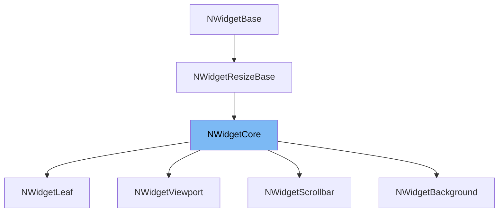

This document will cover the class <SwmToken path="src/widget_type.h" pos="374:1:1" line-data="	NWidgetCore(WidgetType tp, Colours colour, WidgetID index, uint fill_x, uint fill_y, uint32_t widget_data, StringID tool_tip);">`NWidgetCore`</SwmToken> in detail. We will cover:

1. What <SwmToken path="src/widget_type.h" pos="374:1:1" line-data="	NWidgetCore(WidgetType tp, Colours colour, WidgetID index, uint fill_x, uint fill_y, uint32_t widget_data, StringID tool_tip);">`NWidgetCore`</SwmToken> is in <SwmPath>[src/widget_type.h](src/widget_type.h)</SwmPath> and what it is used for.
2. The variables and functions defined in <SwmToken path="src/widget_type.h" pos="374:1:1" line-data="	NWidgetCore(WidgetType tp, Colours colour, WidgetID index, uint fill_x, uint fill_y, uint32_t widget_data, StringID tool_tip);">`NWidgetCore`</SwmToken>.
3. An example of how to use <SwmToken path="src/widget_type.h" pos="374:1:1" line-data="	NWidgetCore(WidgetType tp, Colours colour, WidgetID index, uint fill_x, uint fill_y, uint32_t widget_data, StringID tool_tip);">`NWidgetCore`</SwmToken> in <SwmToken path="src/widget_type.h" pos="682:2:2" line-data="class NWidgetViewport : public NWidgetCore {">`NWidgetViewport`</SwmToken>.



# What is <SwmToken path="src/widget_type.h" pos="374:1:1" line-data="	NWidgetCore(WidgetType tp, Colours colour, WidgetID index, uint fill_x, uint fill_y, uint32_t widget_data, StringID tool_tip);">`NWidgetCore`</SwmToken>

The <SwmToken path="src/widget_type.h" pos="374:1:1" line-data="	NWidgetCore(WidgetType tp, Colours colour, WidgetID index, uint fill_x, uint fill_y, uint32_t widget_data, StringID tool_tip);">`NWidgetCore`</SwmToken> class is a base class for 'real' widgets in the <SwmToken path="src/widget_type.h" pos="2:13:13" line-data=" * This file is part of OpenTTD.">`OpenTTD`</SwmToken> project. It is used to define the core properties and behaviors of widgets that can be nested within other widgets. This class provides functionalities such as setting and getting widget states (e.g., highlighted, lowered, disabled), managing widget data and tooltips, and handling widget display flags.

<SwmSnippet path="/src/widget_type.h" line="374">

---

# Variables and functions

The constructor <SwmToken path="src/widget_type.h" pos="374:1:36" line-data="	NWidgetCore(WidgetType tp, Colours colour, WidgetID index, uint fill_x, uint fill_y, uint32_t widget_data, StringID tool_tip);">`NWidgetCore(WidgetType tp, Colours colour, WidgetID index, uint fill_x, uint fill_y, uint32_t widget_data, StringID tool_tip)`</SwmToken> initializes the widget with the specified type, color, index, fill sizes, widget data, and tooltip.

```c
	NWidgetCore(WidgetType tp, Colours colour, WidgetID index, uint fill_x, uint fill_y, uint32_t widget_data, StringID tool_tip);
```

---

</SwmSnippet>

<SwmSnippet path="/src/widget_type.h" line="376">

---

The function <SwmToken path="src/widget_type.h" pos="376:3:13" line-data="	void SetDataTip(uint32_t widget_data, StringID tool_tip);">`SetDataTip(uint32_t widget_data, StringID tool_tip)`</SwmToken> sets the widget's data and tooltip.

```c
	void SetDataTip(uint32_t widget_data, StringID tool_tip);
```

---

</SwmSnippet>

<SwmSnippet path="/src/widget_type.h" line="377">

---

The function <SwmToken path="src/widget_type.h" pos="377:3:8" line-data="	void SetToolTip(StringID tool_tip);">`SetToolTip(StringID tool_tip)`</SwmToken> sets the widget's tooltip.

```c
	void SetToolTip(StringID tool_tip);
```

---

</SwmSnippet>

<SwmSnippet path="/src/widget_type.h" line="378">

---

The function <SwmToken path="src/widget_type.h" pos="378:3:13" line-data="	void SetTextStyle(TextColour colour, FontSize size);">`SetTextStyle(TextColour colour, FontSize size)`</SwmToken> sets the text style of the widget, including the text color and font size.

```c
	void SetTextStyle(TextColour colour, FontSize size);
```

---

</SwmSnippet>

<SwmSnippet path="/src/widget_type.h" line="379">

---

The function <SwmToken path="src/widget_type.h" pos="379:3:8" line-data="	void SetAlignment(StringAlignment align);">`SetAlignment(StringAlignment align)`</SwmToken> sets the alignment of the text or image within the widget.

```c
	void SetAlignment(StringAlignment align);
```

---

</SwmSnippet>

<SwmSnippet path="/src/widget_type.h" line="381">

---

The function <SwmToken path="src/widget_type.h" pos="381:5:10" line-data="	inline void SetLowered(bool lowered);">`SetLowered(bool lowered)`</SwmToken> sets the widget's state to lowered (pressed down) or not.

```c
	inline void SetLowered(bool lowered);
```

---

</SwmSnippet>

<SwmSnippet path="/src/widget_type.h" line="382">

---

The function <SwmToken path="src/widget_type.h" pos="382:5:9" line-data="	inline bool IsLowered() const;">`IsLowered() const`</SwmToken> returns whether the widget is in the lowered state.

```c
	inline bool IsLowered() const;
```

---

</SwmSnippet>

<SwmSnippet path="/src/widget_type.h" line="383">

---

The function <SwmToken path="src/widget_type.h" pos="383:5:10" line-data="	inline void SetDisabled(bool disabled);">`SetDisabled(bool disabled)`</SwmToken> sets the widget's state to disabled (greyed out) or not.

```c
	inline void SetDisabled(bool disabled);
```

---

</SwmSnippet>

<SwmSnippet path="/src/widget_type.h" line="384">

---

The function <SwmToken path="src/widget_type.h" pos="384:5:9" line-data="	inline bool IsDisabled() const;">`IsDisabled() const`</SwmToken> returns whether the widget is in the disabled state.

```c
	inline bool IsDisabled() const;
```

---

</SwmSnippet>

<SwmSnippet path="/src/widget_type.h" line="386">

---

The function <SwmToken path="src/widget_type.h" pos="386:3:9" line-data="	void FillWidgetLookup(WidgetLookup &amp;widget_lookup) override;">`FillWidgetLookup(WidgetLookup &widget_lookup)`</SwmToken> fills the widget lookup map with the widget's ID and pointer.

```c
	void FillWidgetLookup(WidgetLookup &widget_lookup) override;
```

---

</SwmSnippet>

<SwmSnippet path="/src/widget_type.h" line="387">

---

The function <SwmToken path="src/widget_type.h" pos="387:4:14" line-data="	NWidgetCore *GetWidgetFromPos(int x, int y) override;">`GetWidgetFromPos(int x, int y)`</SwmToken> returns the widget at the specified position.

```c
	NWidgetCore *GetWidgetFromPos(int x, int y) override;
```

---

</SwmSnippet>

<SwmSnippet path="/src/widget_type.h" line="388">

---

The function <SwmToken path="src/widget_type.h" pos="388:3:7" line-data="	bool IsHighlighted() const override;">`IsHighlighted() const`</SwmToken> returns whether the widget is highlighted.

```c
	bool IsHighlighted() const override;
```

---

</SwmSnippet>

<SwmSnippet path="/src/widget_type.h" line="389">

---

The function <SwmToken path="src/widget_type.h" pos="389:3:7" line-data="	TextColour GetHighlightColour() const override;">`GetHighlightColour() const`</SwmToken> returns the color of the widget's highlight.

```c
	TextColour GetHighlightColour() const override;
```

---

</SwmSnippet>

<SwmSnippet path="/src/widget_type.h" line="390">

---

The function <SwmToken path="src/widget_type.h" pos="390:3:8" line-data="	void SetHighlighted(TextColour highlight_colour) override;">`SetHighlighted(TextColour highlight_colour)`</SwmToken> sets the widget's highlight color.

```c
	void SetHighlighted(TextColour highlight_colour) override;
```

---

</SwmSnippet>

# Usage example

The <SwmToken path="src/widget_type.h" pos="682:2:2" line-data="class NWidgetViewport : public NWidgetCore {">`NWidgetViewport`</SwmToken> class is an example of how <SwmToken path="src/widget_type.h" pos="374:1:1" line-data="	NWidgetCore(WidgetType tp, Colours colour, WidgetID index, uint fill_x, uint fill_y, uint32_t widget_data, StringID tool_tip);">`NWidgetCore`</SwmToken> is used. <SwmToken path="src/widget_type.h" pos="682:2:2" line-data="class NWidgetViewport : public NWidgetCore {">`NWidgetViewport`</SwmToken> inherits from <SwmToken path="src/widget_type.h" pos="374:1:1" line-data="	NWidgetCore(WidgetType tp, Colours colour, WidgetID index, uint fill_x, uint fill_y, uint32_t widget_data, StringID tool_tip);">`NWidgetCore`</SwmToken> and utilizes its functionalities to manage a viewport widget.

<SwmSnippet path="/src/widget_type.h" line="682">

---

The <SwmToken path="src/widget_type.h" pos="682:2:2" line-data="class NWidgetViewport : public NWidgetCore {">`NWidgetViewport`</SwmToken> class inherits from <SwmToken path="src/widget_type.h" pos="682:8:8" line-data="class NWidgetViewport : public NWidgetCore {">`NWidgetCore`</SwmToken> and provides additional functionalities specific to viewport widgets, such as initializing and updating viewport coordinates.

```c
class NWidgetViewport : public NWidgetCore {
public:
	NWidgetViewport(WidgetID index);

	void SetupSmallestSize(Window *w) override;
	void Draw(const Window *w) override;

	void InitializeViewport(Window *w, std::variant<TileIndex, VehicleID> focus, ZoomLevel zoom);
	void UpdateViewportCoordinates(Window *w);
};
```

---

</SwmSnippet>

&nbsp;

*This is an auto-generated document by Swimm AI 🌊 and has not yet been verified by a human*

<SwmMeta version="3.0.0" repo-id="Z2l0aHViJTNBJTNBT3BlblRURC1jb3BpbG90LWRlbW8lM0ElM0Fzd2ltbWlv" repo-name="OpenTTD-copilot-demo"><sup>Powered by [Swimm](/)</sup></SwmMeta>
