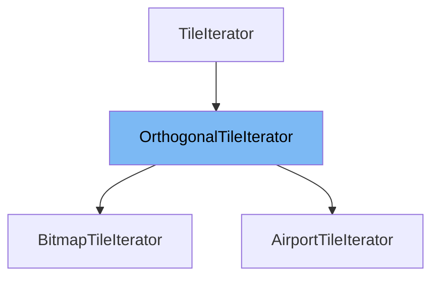

This document will cover the class <SwmToken path="src/tilearea_type.h" pos="196:1:1" line-data="	OrthogonalTileIterator(const OrthogonalTileArea &amp;ta) : TileIterator(ta.w == 0 || ta.h == 0 ? INVALID_TILE : ta.tile), w(ta.w), x(ta.w), y(ta.h)">`OrthogonalTileIterator`</SwmToken> in the file <SwmPath>[src/tilearea_type.h](src/tilearea_type.h)</SwmPath>. We will cover:

1. What is <SwmToken path="src/tilearea_type.h" pos="196:1:1" line-data="	OrthogonalTileIterator(const OrthogonalTileArea &amp;ta) : TileIterator(ta.w == 0 || ta.h == 0 ? INVALID_TILE : ta.tile), w(ta.w), x(ta.w), y(ta.h)">`OrthogonalTileIterator`</SwmToken>
2. Variables and functions
3. Usage example



# What is <SwmToken path="src/tilearea_type.h" pos="196:1:1" line-data="	OrthogonalTileIterator(const OrthogonalTileArea &amp;ta) : TileIterator(ta.w == 0 || ta.h == 0 ? INVALID_TILE : ta.tile), w(ta.w), x(ta.w), y(ta.h)">`OrthogonalTileIterator`</SwmToken>

The <SwmToken path="src/tilearea_type.h" pos="196:1:1" line-data="	OrthogonalTileIterator(const OrthogonalTileArea &amp;ta) : TileIterator(ta.w == 0 || ta.h == 0 ? INVALID_TILE : ta.tile), w(ta.w), x(ta.w), y(ta.h)">`OrthogonalTileIterator`</SwmToken> is a class defined in <SwmPath>[src/tilearea_type.h](src/tilearea_type.h)</SwmPath>. It is used to iterate over a rectangular area of tiles on the map. This iterator allows for traversing tiles in a specified rectangular region, making it useful for operations that need to process or analyze a specific area on the map.

<SwmSnippet path="/src/tilearea_type.h" line="187">

---

# Variables and functions

The variable <SwmToken path="src/tilearea_type.h" pos="187:3:3" line-data="	int w;          ///&lt; The width of the iterated area.">`w`</SwmToken> is used to store the width of the iterated area.

```c
	int w;          ///< The width of the iterated area.
```

---

</SwmSnippet>

<SwmSnippet path="/src/tilearea_type.h" line="188">

---

The variable <SwmToken path="src/tilearea_type.h" pos="188:3:3" line-data="	int x;          ///&lt; The current &#39;x&#39; position in the rectangle.">`x`</SwmToken> is used to store the current 'x' position in the rectangle.

```c
	int x;          ///< The current 'x' position in the rectangle.
```

---

</SwmSnippet>

<SwmSnippet path="/src/tilearea_type.h" line="189">

---

The variable <SwmToken path="src/tilearea_type.h" pos="189:3:3" line-data="	int y;          ///&lt; The current &#39;y&#39; position in the rectangle.">`y`</SwmToken> is used to store the current 'y' position in the rectangle.

```c
	int y;          ///< The current 'y' position in the rectangle.
```

---

</SwmSnippet>

<SwmSnippet path="/src/tilearea_type.h" line="192">

---

The constructor <SwmToken path="src/tilearea_type.h" pos="196:1:9" line-data="	OrthogonalTileIterator(const OrthogonalTileArea &amp;ta) : TileIterator(ta.w == 0 || ta.h == 0 ? INVALID_TILE : ta.tile), w(ta.w), x(ta.w), y(ta.h)">`OrthogonalTileIterator(const OrthogonalTileArea &ta)`</SwmToken> initializes the iterator with the given tile area. If the width or height of the area is zero, the iterator is set to an invalid state.

```c
	/**
	 * Construct the iterator.
	 * @param ta Area, i.e. begin point and width/height of to-be-iterated area.
	 */
	OrthogonalTileIterator(const OrthogonalTileArea &ta) : TileIterator(ta.w == 0 || ta.h == 0 ? INVALID_TILE : ta.tile), w(ta.w), x(ta.w), y(ta.h)
	{
	}
```

---

</SwmSnippet>

<SwmSnippet path="/src/tilearea_type.h" line="200">

---

The constructor <SwmToken path="src/tilearea_type.h" pos="205:1:11" line-data="	OrthogonalTileIterator(TileIndex corner1, TileIndex corner2)">`OrthogonalTileIterator(TileIndex corner1, TileIndex corner2)`</SwmToken> initializes the iterator with two corner tiles, defining the rectangular area to iterate over.

```c
	/**
	 * Construct the iterator.
	 * @param corner1 Tile from where to begin iterating.
	 * @param corner2 Tile where to end the iterating.
	 */
	OrthogonalTileIterator(TileIndex corner1, TileIndex corner2)
	{
		*this = OrthogonalTileIterator(OrthogonalTileArea(corner1, corner2));
	}
```

---

</SwmSnippet>

<SwmSnippet path="/src/tilearea_type.h" line="213">

---

The function <SwmToken path="src/tilearea_type.h" pos="213:3:10" line-data="	inline TileIterator&amp; operator ++() override">`TileIterator& operator ++()`</SwmToken> moves the iterator to the next tile in the rectangle. If the end of a row is reached, it moves to the next row. If the end of the rectangle is reached, it sets the iterator to an invalid state.

```c
	inline TileIterator& operator ++() override
	{
		assert(this->tile != INVALID_TILE);

		if (--this->x > 0) {
			this->tile++;
		} else if (--this->y > 0) {
			this->x = this->w;
			this->tile += TileDiffXY(1, 1) - this->w;
		} else {
			this->tile = INVALID_TILE;
		}
		return *this;
	}
```

---

</SwmSnippet>

<SwmSnippet path="/src/tilearea_type.h" line="228">

---

The function <SwmToken path="src/tilearea_type.h" pos="228:1:12" line-data="	std::unique_ptr&lt;TileIterator&gt; Clone() const override">`std::unique_ptr<TileIterator> Clone() const`</SwmToken> creates a copy of the current iterator and returns it as a unique pointer.

```c
	std::unique_ptr<TileIterator> Clone() const override
	{
		return std::make_unique<OrthogonalTileIterator>(*this);
	}
```

---

</SwmSnippet>

# Usage example

The <SwmToken path="src/bitmap_type.h" pos="114:1:1" line-data="	BitmapTileIterator(const BitmapTileArea &amp;bitmap) : OrthogonalTileIterator(bitmap), bitmap(&amp;bitmap)">`BitmapTileIterator`</SwmToken> class in <SwmPath>[src/bitmap_type.h](src/bitmap_type.h)</SwmPath> is an example of how to use <SwmToken path="src/tilearea_type.h" pos="196:1:1" line-data="	OrthogonalTileIterator(const OrthogonalTileArea &amp;ta) : TileIterator(ta.w == 0 || ta.h == 0 ? INVALID_TILE : ta.tile), w(ta.w), x(ta.w), y(ta.h)">`OrthogonalTileIterator`</SwmToken>. It extends <SwmToken path="src/tilearea_type.h" pos="196:1:1" line-data="	OrthogonalTileIterator(const OrthogonalTileArea &amp;ta) : TileIterator(ta.w == 0 || ta.h == 0 ? INVALID_TILE : ta.tile), w(ta.w), x(ta.w), y(ta.h)">`OrthogonalTileIterator`</SwmToken> to iterate over all tiles belonging to a bitmap tile area.

<SwmSnippet path="/src/bitmap_type.h" line="114">

---

The <SwmToken path="src/bitmap_type.h" pos="114:1:1" line-data="	BitmapTileIterator(const BitmapTileArea &amp;bitmap) : OrthogonalTileIterator(bitmap), bitmap(&amp;bitmap)">`BitmapTileIterator`</SwmToken> constructor initializes the iterator with a <SwmToken path="src/bitmap_type.h" pos="114:5:5" line-data="	BitmapTileIterator(const BitmapTileArea &amp;bitmap) : OrthogonalTileIterator(bitmap), bitmap(&amp;bitmap)">`BitmapTileArea`</SwmToken>. It uses the <SwmToken path="src/bitmap_type.h" pos="114:13:13" line-data="	BitmapTileIterator(const BitmapTileArea &amp;bitmap) : OrthogonalTileIterator(bitmap), bitmap(&amp;bitmap)">`OrthogonalTileIterator`</SwmToken> constructor to set up the iteration. The <SwmToken path="src/bitmap_type.h" pos="121:8:9" line-data="		(*this).OrthogonalTileIterator::operator++();">`operator++`</SwmToken> function is overridden to skip tiles that do not belong to the bitmap.

```c
	BitmapTileIterator(const BitmapTileArea &bitmap) : OrthogonalTileIterator(bitmap), bitmap(&bitmap)
	{
		if (!this->bitmap->HasTile(TileIndex(this->tile))) ++(*this);
	}

	inline TileIterator& operator ++() override
	{
		(*this).OrthogonalTileIterator::operator++();
		while (this->tile != INVALID_TILE && !this->bitmap->HasTile(TileIndex(this->tile))) {
			(*this).OrthogonalTileIterator::operator++();
		}
```

---

</SwmSnippet>

&nbsp;

*This is an auto-generated document by Swimm AI 🌊 and has not yet been verified by a human*

<SwmMeta version="3.0.0" repo-id="Z2l0aHViJTNBJTNBT3BlblRURC1jb3BpbG90LWRlbW8lM0ElM0Fzd2ltbWlv" repo-name="OpenTTD-copilot-demo"><sup>Powered by [Swimm](/)</sup></SwmMeta>
