```mermaid
graph TD;
  OverrideManagerBase:::currentBaseStyle
OverrideManagerBase --> IndustryOverrideManager
OverrideManagerBase --> AirportTileOverrideManager
OverrideManagerBase --> HouseOverrideManager
OverrideManagerBase --> IndustryTileOverrideManager
OverrideManagerBase --> AirportOverrideManager
OverrideManagerBase --> ObjectOverrideManager

 classDef currentBaseStyle color:#000000,fill:#7CB9F4

%% Swimm:
%% graph TD;
%%   OverrideManagerBase:::currentBaseStyle
%% <SwmToken path="src/newgrf_commons.h" pos="205:1:1" line-data="	OverrideManagerBase(uint16_t offset, uint16_t maximum, uint16_t invalid);">`OverrideManagerBase`</SwmToken> --> <SwmToken path="src/newgrf_commons.h" pos="234:2:2" line-data="class IndustryOverrideManager : public OverrideManagerBase {">`IndustryOverrideManager`</SwmToken>
%% <SwmToken path="src/newgrf_commons.h" pos="205:1:1" line-data="	OverrideManagerBase(uint16_t offset, uint16_t maximum, uint16_t invalid);">`OverrideManagerBase`</SwmToken> --> <SwmToken path="src/newgrf_commons.h" pos="267:2:2" line-data="class AirportTileOverrideManager : public OverrideManagerBase {">`AirportTileOverrideManager`</SwmToken>
%% <SwmToken path="src/newgrf_commons.h" pos="205:1:1" line-data="	OverrideManagerBase(uint16_t offset, uint16_t maximum, uint16_t invalid);">`OverrideManagerBase`</SwmToken> --> <SwmToken path="src/newgrf_commons.h" pos="224:2:2" line-data="class HouseOverrideManager : public OverrideManagerBase {">`HouseOverrideManager`</SwmToken>
%% <SwmToken path="src/newgrf_commons.h" pos="205:1:1" line-data="	OverrideManagerBase(uint16_t offset, uint16_t maximum, uint16_t invalid);">`OverrideManagerBase`</SwmToken> --> <SwmToken path="src/newgrf_commons.h" pos="247:2:2" line-data="class IndustryTileOverrideManager : public OverrideManagerBase {">`IndustryTileOverrideManager`</SwmToken>
%% <SwmToken path="src/newgrf_commons.h" pos="205:1:1" line-data="	OverrideManagerBase(uint16_t offset, uint16_t maximum, uint16_t invalid);">`OverrideManagerBase`</SwmToken> --> <SwmToken path="src/newgrf_commons.h" pos="258:2:2" line-data="class AirportOverrideManager : public OverrideManagerBase {">`AirportOverrideManager`</SwmToken>
%% <SwmToken path="src/newgrf_commons.h" pos="205:1:1" line-data="	OverrideManagerBase(uint16_t offset, uint16_t maximum, uint16_t invalid);">`OverrideManagerBase`</SwmToken> --> <SwmToken path="src/newgrf_commons.h" pos="278:2:2" line-data="class ObjectOverrideManager : public OverrideManagerBase {">`ObjectOverrideManager`</SwmToken>
%% 
%%  classDef currentBaseStyle color:#000000,fill:#7CB9F4
```

This document will cover the class <SwmToken path="src/newgrf_commons.h" pos="205:1:1" line-data="	OverrideManagerBase(uint16_t offset, uint16_t maximum, uint16_t invalid);">`OverrideManagerBase`</SwmToken> in the codebase. We will cover:

1. What <SwmToken path="src/newgrf_commons.h" pos="205:1:1" line-data="	OverrideManagerBase(uint16_t offset, uint16_t maximum, uint16_t invalid);">`OverrideManagerBase`</SwmToken> is.
2. Variables and functions in <SwmToken path="src/newgrf_commons.h" pos="205:1:1" line-data="	OverrideManagerBase(uint16_t offset, uint16_t maximum, uint16_t invalid);">`OverrideManagerBase`</SwmToken>.
3. Usage example of <SwmToken path="src/newgrf_commons.h" pos="205:1:1" line-data="	OverrideManagerBase(uint16_t offset, uint16_t maximum, uint16_t invalid);">`OverrideManagerBase`</SwmToken> in <SwmToken path="src/newgrf_commons.h" pos="258:2:2" line-data="class AirportOverrideManager : public OverrideManagerBase {">`AirportOverrideManager`</SwmToken>.



# What is <SwmToken path="src/newgrf_commons.h" pos="205:1:1" line-data="	OverrideManagerBase(uint16_t offset, uint16_t maximum, uint16_t invalid);">`OverrideManagerBase`</SwmToken>

The <SwmToken path="src/newgrf_commons.h" pos="205:1:1" line-data="	OverrideManagerBase(uint16_t offset, uint16_t maximum, uint16_t invalid);">`OverrideManagerBase`</SwmToken> class is a base class used to manage overrides for various entities in the game. It provides a mechanism to map entity <SwmToken path="src/newgrf_commons.h" pos="176:15:15" line-data=" * which we need to correlate the ids from the grf files with the ones in the">`ids`</SwmToken> from GRF files to the game's internal <SwmToken path="src/newgrf_commons.h" pos="176:15:15" line-data=" * which we need to correlate the ids from the grf files with the ones in the">`ids`</SwmToken>, allowing for the dynamic loading and substitution of entities. This class is essential for handling custom entities defined by GRF files, ensuring that they can be correctly referenced and used within the game.

<SwmSnippet path="/src/newgrf_commons.h" line="193">

---

# Variables and functions

The variable <SwmToken path="src/newgrf_commons.h" pos="193:8:8" line-data="	std::vector&lt;uint16_t&gt; entity_overrides;">`entity_overrides`</SwmToken> is a vector that stores the overrides for entity <SwmToken path="src/newgrf_commons.h" pos="176:15:15" line-data=" * which we need to correlate the ids from the grf files with the ones in the">`ids`</SwmToken>. It is used to keep track of the new <SwmToken path="src/newgrf_commons.h" pos="176:15:15" line-data=" * which we need to correlate the ids from the grf files with the ones in the">`ids`</SwmToken> assigned to entities.

```c
	std::vector<uint16_t> entity_overrides;
```

---

</SwmSnippet>

<SwmSnippet path="/src/newgrf_commons.h" line="194">

---

The variable <SwmToken path="src/newgrf_commons.h" pos="194:8:8" line-data="	std::vector&lt;uint32_t&gt; grfid_overrides;">`grfid_overrides`</SwmToken> is a vector that stores the overrides for GRF <SwmToken path="src/newgrf_commons.h" pos="176:15:15" line-data=" * which we need to correlate the ids from the grf files with the ones in the">`ids`</SwmToken>. It is used to map the GRF <SwmToken path="src/newgrf_commons.h" pos="176:15:15" line-data=" * which we need to correlate the ids from the grf files with the ones in the">`ids`</SwmToken> to the corresponding entities.

```c
	std::vector<uint32_t> grfid_overrides;
```

---

</SwmSnippet>

<SwmSnippet path="/src/newgrf_commons.h" line="196">

---

The variable <SwmToken path="src/newgrf_commons.h" pos="196:3:3" line-data="	uint16_t max_offset;   ///&lt; what is the length of the original entity&#39;s array of specs">`max_offset`</SwmToken> indicates the length of the original entity's array of specifications. It helps in determining the range of valid entity <SwmToken path="src/newgrf_commons.h" pos="176:15:15" line-data=" * which we need to correlate the ids from the grf files with the ones in the">`ids`</SwmToken>.

```c
	uint16_t max_offset;   ///< what is the length of the original entity's array of specs
```

---

</SwmSnippet>

<SwmSnippet path="/src/newgrf_commons.h" line="197">

---

The variable <SwmToken path="src/newgrf_commons.h" pos="197:3:3" line-data="	uint16_t max_entities; ///&lt; what is the amount of entities, old and new summed">`max_entities`</SwmToken> represents the total number of entities, including both old and new ones. It is used to manage the overall count of entities.

```c
	uint16_t max_entities; ///< what is the amount of entities, old and new summed
```

---

</SwmSnippet>

<SwmSnippet path="/src/newgrf_commons.h" line="199">

---

The variable <SwmToken path="src/newgrf_commons.h" pos="199:3:3" line-data="	uint16_t invalid_id;   ///&lt; ID used to detected invalid entities">`invalid_id`</SwmToken> is used to detect invalid entities. It serves as a marker for entities that are not valid.

```c
	uint16_t invalid_id;   ///< ID used to detected invalid entities
```

---

</SwmSnippet>

<SwmSnippet path="/src/newgrf_commons.h" line="205">

---

The constructor <SwmToken path="src/newgrf_commons.h" pos="205:1:1" line-data="	OverrideManagerBase(uint16_t offset, uint16_t maximum, uint16_t invalid);">`OverrideManagerBase`</SwmToken> initializes the base class with the given offset, maximum number of entities, and invalid ID. It sets up the initial state for managing overrides.

```c
	OverrideManagerBase(uint16_t offset, uint16_t maximum, uint16_t invalid);
```

---

</SwmSnippet>

<SwmSnippet path="/src/newgrf_commons.h" line="208">

---

The function <SwmToken path="src/newgrf_commons.h" pos="208:3:3" line-data="	void ResetOverride();">`ResetOverride`</SwmToken> resets the override mappings, clearing any previously set overrides.

```c
	void ResetOverride();
```

---

</SwmSnippet>

<SwmSnippet path="/src/newgrf_commons.h" line="209">

---

The function <SwmToken path="src/newgrf_commons.h" pos="209:3:3" line-data="	void ResetMapping();">`ResetMapping`</SwmToken> resets the entity ID mappings, clearing any previously set mappings.

```c
	void ResetMapping();
```

---

</SwmSnippet>

<SwmSnippet path="/src/newgrf_commons.h" line="211">

---

The function <SwmToken path="src/newgrf_commons.h" pos="211:3:3" line-data="	void Add(uint16_t local_id, uint32_t grfid, uint entity_type);">`Add`</SwmToken> adds a new entity override with the given local ID, GRF ID, and entity type. It updates the override mappings accordingly.

```c
	void Add(uint16_t local_id, uint32_t grfid, uint entity_type);
```

---

</SwmSnippet>

<SwmSnippet path="/src/newgrf_commons.h" line="212">

---

The function <SwmToken path="src/newgrf_commons.h" pos="212:5:5" line-data="	virtual uint16_t AddEntityID(uint16_t grf_local_id, uint32_t grfid, uint16_t substitute_id);">`AddEntityID`</SwmToken> adds a new entity ID mapping with the given GRF local ID, GRF ID, and substitute ID. It returns the new entity ID.

```c
	virtual uint16_t AddEntityID(uint16_t grf_local_id, uint32_t grfid, uint16_t substitute_id);
```

---

</SwmSnippet>

<SwmSnippet path="/src/newgrf_commons.h" line="214">

---

The function <SwmToken path="src/newgrf_commons.h" pos="214:3:3" line-data="	uint32_t GetGRFID(uint16_t entity_id) const;">`GetGRFID`</SwmToken> retrieves the GRF ID for the given entity ID. It looks up the GRF ID in the override mappings.

```c
	uint32_t GetGRFID(uint16_t entity_id) const;
```

---

</SwmSnippet>

<SwmSnippet path="/src/newgrf_commons.h" line="215">

---

The function <SwmToken path="src/newgrf_commons.h" pos="215:3:3" line-data="	uint16_t GetSubstituteID(uint16_t entity_id) const;">`GetSubstituteID`</SwmToken> retrieves the substitute ID for the given entity ID. It looks up the substitute ID in the entity mappings.

```c
	uint16_t GetSubstituteID(uint16_t entity_id) const;
```

---

</SwmSnippet>

<SwmSnippet path="/src/newgrf_commons.h" line="216">

---

The function <SwmToken path="src/newgrf_commons.h" pos="216:5:5" line-data="	virtual uint16_t GetID(uint16_t grf_local_id, uint32_t grfid) const;">`GetID`</SwmToken> retrieves the entity ID for the given GRF local ID and GRF ID. It looks up the entity ID in the override mappings.

```c
	virtual uint16_t GetID(uint16_t grf_local_id, uint32_t grfid) const;
```

---

</SwmSnippet>

# Usage example

The <SwmToken path="src/newgrf_commons.h" pos="258:2:2" line-data="class AirportOverrideManager : public OverrideManagerBase {">`AirportOverrideManager`</SwmToken> class is an example of how <SwmToken path="src/newgrf_commons.h" pos="205:1:1" line-data="	OverrideManagerBase(uint16_t offset, uint16_t maximum, uint16_t invalid);">`OverrideManagerBase`</SwmToken> is used. It extends <SwmToken path="src/newgrf_commons.h" pos="205:1:1" line-data="	OverrideManagerBase(uint16_t offset, uint16_t maximum, uint16_t invalid);">`OverrideManagerBase`</SwmToken> to manage overrides for airport entities.

<SwmSnippet path="/src/newgrf_commons.h" line="258">

---

The <SwmToken path="src/newgrf_commons.h" pos="258:2:2" line-data="class AirportOverrideManager : public OverrideManagerBase {">`AirportOverrideManager`</SwmToken> class extends <SwmToken path="src/newgrf_commons.h" pos="258:8:8" line-data="class AirportOverrideManager : public OverrideManagerBase {">`OverrideManagerBase`</SwmToken> and provides additional functionality specific to airport entities. It includes a method <SwmToken path="src/newgrf_commons.h" pos="263:3:3" line-data="	void SetEntitySpec(AirportSpec *inds);">`SetEntitySpec`</SwmToken> to set the specifications for airport entities.

```c
class AirportOverrideManager : public OverrideManagerBase {
public:
	AirportOverrideManager(uint16_t offset, uint16_t maximum, uint16_t invalid) :
			OverrideManagerBase(offset, maximum, invalid) {}

	void SetEntitySpec(AirportSpec *inds);
};
```

---

</SwmSnippet>

&nbsp;

*This is an auto-generated document by Swimm AI 🌊 and has not yet been verified by a human*

<SwmMeta version="3.0.0" repo-id="Z2l0aHViJTNBJTNBT3BlblRURC1jb3BpbG90LWRlbW8lM0ElM0Fzd2ltbWlv" repo-name="OpenTTD-copilot-demo"><sup>Powered by [Swimm](/)</sup></SwmMeta>
