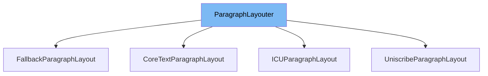

This document will cover the class <SwmToken path="src/gfx_layout_fallback.cpp" pos="38:8:8" line-data="class FallbackParagraphLayout : public ParagraphLayouter {">`ParagraphLayouter`</SwmToken> in <SwmPath>[src/gfx_layout.h](src/gfx_layout.h)</SwmPath>. We will cover:

1. What <SwmToken path="src/gfx_layout_fallback.cpp" pos="38:8:8" line-data="class FallbackParagraphLayout : public ParagraphLayouter {">`ParagraphLayouter`</SwmToken> is.
2. Variables and functions in <SwmToken path="src/gfx_layout_fallback.cpp" pos="38:8:8" line-data="class FallbackParagraphLayout : public ParagraphLayouter {">`ParagraphLayouter`</SwmToken>.
3. Usage example of <SwmToken path="src/gfx_layout_fallback.cpp" pos="38:8:8" line-data="class FallbackParagraphLayout : public ParagraphLayouter {">`ParagraphLayouter`</SwmToken> in <SwmToken path="src/gfx_layout_fallback.cpp" pos="38:2:2" line-data="class FallbackParagraphLayout : public ParagraphLayouter {">`FallbackParagraphLayout`</SwmToken>.



# What is <SwmToken path="src/gfx_layout_fallback.cpp" pos="38:8:8" line-data="class FallbackParagraphLayout : public ParagraphLayouter {">`ParagraphLayouter`</SwmToken>

<SwmToken path="src/gfx_layout_fallback.cpp" pos="38:8:8" line-data="class FallbackParagraphLayout : public ParagraphLayouter {">`ParagraphLayouter`</SwmToken> is an interface in <SwmPath>[src/gfx_layout.h](src/gfx_layout.h)</SwmPath> that serves as a glue between fallback and normal layouters. It is used for laying out paragraphs of text, handling the positioning of glyphs, and managing visual runs and lines of text.

<SwmSnippet path="/src/gfx_layout.h" line="93">

---

# Variables and functions

The <SwmToken path="src/gfx_layout.h" pos="93:3:3" line-data="	/** Position of a glyph within a VisualRun. */">`Position`</SwmToken> class within <SwmToken path="src/gfx_layout_fallback.cpp" pos="38:8:8" line-data="class FallbackParagraphLayout : public ParagraphLayouter {">`ParagraphLayouter`</SwmToken> represents the position of a glyph within a <SwmToken path="src/gfx_layout.h" pos="93:15:15" line-data="	/** Position of a glyph within a VisualRun. */">`VisualRun`</SwmToken>. It includes the left, right, and top positions of the glyph.

```c
	/** Position of a glyph within a VisualRun. */
	class Position {
	public:
		int16_t left; ///< Left-most position of glyph.
		int16_t right; ///< Right-most position of glyph.
		int16_t top; ///< Top-most position of glyph.

		constexpr inline Position(int16_t left, int16_t right, int16_t top) : left(left), right(right), top(top) { }

		/** Conversion from a single point to a Position. */
		constexpr inline Position(const Point &pt) : left(pt.x), right(pt.x), top(pt.y) { }
	};
```

---

</SwmSnippet>

<SwmSnippet path="/src/gfx_layout.h" line="106">

---

The <SwmToken path="src/gfx_layout.h" pos="107:3:3" line-data="	class VisualRun {">`VisualRun`</SwmToken> class within <SwmToken path="src/gfx_layout_fallback.cpp" pos="38:8:8" line-data="class FallbackParagraphLayout : public ParagraphLayouter {">`ParagraphLayouter`</SwmToken> contains data about a segment of text that uses the same font. It includes methods to get the font, glyph count, glyphs, positions, leading, and glyph-to-character map.

```c
	/** Visual run contains data about the bit of text with the same font. */
	class VisualRun {
	public:
		virtual ~VisualRun() = default;
		virtual const Font *GetFont() const = 0;
		virtual int GetGlyphCount() const = 0;
		virtual std::span<const GlyphID> GetGlyphs() const = 0;
		virtual std::span<const Position> GetPositions() const = 0;
		virtual int GetLeading() const = 0;
		virtual std::span<const int> GetGlyphToCharMap() const = 0;
	};
```

---

</SwmSnippet>

<SwmSnippet path="/src/gfx_layout.h" line="118">

---

The <SwmToken path="src/gfx_layout.h" pos="118:7:7" line-data="	/** A single line worth of VisualRuns. */">`line`</SwmToken> class within <SwmToken path="src/gfx_layout_fallback.cpp" pos="38:8:8" line-data="class FallbackParagraphLayout : public ParagraphLayouter {">`ParagraphLayouter`</SwmToken> represents a single line of text composed of multiple <SwmToken path="src/gfx_layout.h" pos="125:5:5" line-data="		virtual const VisualRun &amp;GetVisualRun(int run) const = 0;">`VisualRun`</SwmToken> objects. It includes methods to get the leading, width, run count, visual run, and internal character length.

```c
	/** A single line worth of VisualRuns. */
	class Line {
	public:
		virtual ~Line() = default;
		virtual int GetLeading() const = 0;
		virtual int GetWidth() const = 0;
		virtual int CountRuns() const = 0;
		virtual const VisualRun &GetVisualRun(int run) const = 0;
		virtual int GetInternalCharLength(char32_t c) const = 0;
	};
```

---

</SwmSnippet>

<SwmSnippet path="/src/gfx_layout.h" line="129">

---

The <SwmToken path="src/gfx_layout.h" pos="129:5:5" line-data="	virtual void Reflow() = 0;">`Reflow`</SwmToken> function is a pure virtual function that must be implemented by derived classes. It is used to reflow the text layout.

```c
	virtual void Reflow() = 0;
	virtual std::unique_ptr<const Line> NextLine(int max_width) = 0;
```

---

</SwmSnippet>

<SwmSnippet path="/src/gfx_layout.h" line="131">

---

The <SwmToken path="src/gfx_layout.h" pos="130:12:12" line-data="	virtual std::unique_ptr&lt;const Line&gt; NextLine(int max_width) = 0;">`NextLine`</SwmToken> function is a pure virtual function that must be implemented by derived classes. It returns a unique pointer to the next line of text, given a maximum width.

```c
};
```

---

</SwmSnippet>

# Usage example

Here is an example of how to use <SwmToken path="src/gfx_layout_fallback.cpp" pos="38:8:8" line-data="class FallbackParagraphLayout : public ParagraphLayouter {">`ParagraphLayouter`</SwmToken> in <SwmToken path="src/gfx_layout_fallback.cpp" pos="38:2:2" line-data="class FallbackParagraphLayout : public ParagraphLayouter {">`FallbackParagraphLayout`</SwmToken>.

<SwmSnippet path="/src/gfx_layout_fallback.cpp" line="38">

---

<SwmToken path="src/gfx_layout_fallback.cpp" pos="38:2:2" line-data="class FallbackParagraphLayout : public ParagraphLayouter {">`FallbackParagraphLayout`</SwmToken> is a class that implements <SwmToken path="src/gfx_layout_fallback.cpp" pos="38:8:8" line-data="class FallbackParagraphLayout : public ParagraphLayouter {">`ParagraphLayouter`</SwmToken>. It includes nested classes <SwmToken path="src/gfx_layout_fallback.cpp" pos="41:3:3" line-data="	class FallbackVisualRun : public ParagraphLayouter::VisualRun {">`FallbackVisualRun`</SwmToken> and <SwmToken path="src/gfx_layout_fallback.cpp" pos="59:3:3" line-data="	class FallbackLine : public std::vector&lt;FallbackVisualRun&gt;, public ParagraphLayouter::Line {">`FallbackLine`</SwmToken> that extend <SwmToken path="src/gfx_layout_fallback.cpp" pos="41:9:11" line-data="	class FallbackVisualRun : public ParagraphLayouter::VisualRun {">`ParagraphLayouter::VisualRun`</SwmToken> and <SwmToken path="src/gfx_layout.h" pos="138:18:20" line-data="class Layouter : public std::vector&lt;std::unique_ptr&lt;const ParagraphLayouter::Line&gt;&gt; {">`ParagraphLayouter::Line`</SwmToken>, respectively. The <SwmToken path="src/gfx_layout_fallback.cpp" pos="85:11:11" line-data="/* static */ ParagraphLayouter *FallbackParagraphLayoutFactory::GetParagraphLayout(char32_t *buff, char32_t *buff_end, FontMap &amp;fontMapping)">`GetParagraphLayout`</SwmToken> function demonstrates how to create a <SwmToken path="src/gfx_layout_fallback.cpp" pos="38:2:2" line-data="class FallbackParagraphLayout : public ParagraphLayouter {">`FallbackParagraphLayout`</SwmToken> instance.

```c++
class FallbackParagraphLayout : public ParagraphLayouter {
public:
	/** Visual run contains data about the bit of text with the same font. */
	class FallbackVisualRun : public ParagraphLayouter::VisualRun {
		std::vector<GlyphID> glyphs; ///< The glyphs we're drawing.
		std::vector<Position> positions; ///< The positions of the glyphs.
		std::vector<int> glyph_to_char; ///< The char index of the glyphs.

		Font *font;       ///< The font used to layout these.

	public:
		FallbackVisualRun(Font *font, const char32_t *chars, int glyph_count, int char_offset, int x);
		const Font *GetFont() const override { return this->font; }
		int GetGlyphCount() const override { return static_cast<int>(this->glyphs.size()); }
		std::span<const GlyphID> GetGlyphs() const override { return this->glyphs; }
		std::span<const Position> GetPositions() const override { return this->positions; }
		int GetLeading() const override { return this->GetFont()->fc->GetHeight(); }
		std::span<const int> GetGlyphToCharMap() const override { return this->glyph_to_char; }
	};

	/** A single line worth of VisualRuns. */
```

---

</SwmSnippet>

&nbsp;

*This is an auto-generated document by Swimm AI 🌊 and has not yet been verified by a human*

<SwmMeta version="3.0.0" repo-id="Z2l0aHViJTNBJTNBT3BlblRURC1jb3BpbG90LWRlbW8lM0ElM0Fzd2ltbWlv" repo-name="OpenTTD-copilot-demo"><sup>Powered by [Swimm](/)</sup></SwmMeta>
