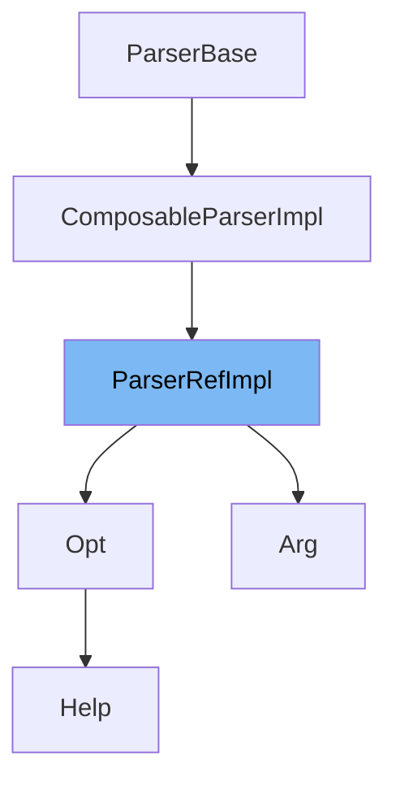

This document will cover the class <SwmToken path="src/3rdparty/catch2/catch.hpp" pos="9247:3:3" line-data="    class ParserRefImpl : public ComposableParserImpl&lt;DerivedT&gt; {">`ParserRefImpl`</SwmToken> in the file <SwmPath>[src/3rdparty/catch2/catch.hpp](src/3rdparty/catch2/catch.hpp)</SwmPath>. We will cover:

1. What <SwmToken path="src/3rdparty/catch2/catch.hpp" pos="9247:3:3" line-data="    class ParserRefImpl : public ComposableParserImpl&lt;DerivedT&gt; {">`ParserRefImpl`</SwmToken> is.
2. Variables and functions defined in <SwmToken path="src/3rdparty/catch2/catch.hpp" pos="9247:3:3" line-data="    class ParserRefImpl : public ComposableParserImpl&lt;DerivedT&gt; {">`ParserRefImpl`</SwmToken>.
3. Example of how to use <SwmToken path="src/3rdparty/catch2/catch.hpp" pos="9247:3:3" line-data="    class ParserRefImpl : public ComposableParserImpl&lt;DerivedT&gt; {">`ParserRefImpl`</SwmToken> in <SwmToken path="src/3rdparty/catch2/catch.hpp" pos="3263:13:13" line-data="            virtual bool match( ObjectT const&amp; arg ) const = 0;">`arg`</SwmToken>.



# What is <SwmToken path="src/3rdparty/catch2/catch.hpp" pos="9247:3:3" line-data="    class ParserRefImpl : public ComposableParserImpl&lt;DerivedT&gt; {">`ParserRefImpl`</SwmToken>

<SwmToken path="src/3rdparty/catch2/catch.hpp" pos="9247:3:3" line-data="    class ParserRefImpl : public ComposableParserImpl&lt;DerivedT&gt; {">`ParserRefImpl`</SwmToken> is a class defined in the file <SwmPath>[src/3rdparty/catch2/catch.hpp](src/3rdparty/catch2/catch.hpp)</SwmPath>. It is used within the <SwmToken path="src/3rdparty/catch2/catch.hpp" pos="3898:17:17" line-data="    Catch::throw_logic_error(CATCH_MAKE_MSG( CATCH_INTERNAL_LINEINFO &lt;&lt; &quot;: Internal Catch2 error: &quot; &lt;&lt; __VA_ARGS__))">`Catch2`</SwmToken> testing framework, which is a multi-paradigm test framework for C++. The <SwmToken path="src/3rdparty/catch2/catch.hpp" pos="9247:3:3" line-data="    class ParserRefImpl : public ComposableParserImpl&lt;DerivedT&gt; {">`ParserRefImpl`</SwmToken> class is part of the internal implementation of the argument parser in <SwmToken path="src/3rdparty/catch2/catch.hpp" pos="3898:17:17" line-data="    Catch::throw_logic_error(CATCH_MAKE_MSG( CATCH_INTERNAL_LINEINFO &lt;&lt; &quot;: Internal Catch2 error: &quot; &lt;&lt; __VA_ARGS__))">`Catch2`</SwmToken>, which helps in parsing command-line arguments.

<SwmSnippet path="/src/3rdparty/catch2/catch.hpp" line="2279">

---

# Variables and functions

The variable <SwmToken path="src/3rdparty/catch2/catch.hpp" pos="9128:4:4" line-data="        T &amp;m_ref;">`m_ref`</SwmToken> is a reference to a <SwmToken path="src/3rdparty/catch2/catch.hpp" pos="9223:3:3" line-data="    class ParserBase {">`ParserBase`</SwmToken> object. It is used to store a reference to the parser that <SwmToken path="src/3rdparty/catch2/catch.hpp" pos="9247:3:3" line-data="    class ParserRefImpl : public ComposableParserImpl&lt;DerivedT&gt; {">`ParserRefImpl`</SwmToken> is wrapping.

```c++
            static_assert(always_false<T>::value,
            "chained comparisons are not supported inside assertions, "
```

---

</SwmSnippet>

<SwmSnippet path="/src/3rdparty/catch2/catch.hpp" line="2281">

---

The constructor `ParserRefImpl(ParserBase& `<SwmToken path="src/3rdparty/catch2/catch.hpp" pos="9221:3:3" line-data="    struct Parser;">`Parser`</SwmToken>`)` initializes the <SwmToken path="src/3rdparty/catch2/catch.hpp" pos="9128:4:4" line-data="        T &amp;m_ref;">`m_ref`</SwmToken> variable with the provided <SwmToken path="src/3rdparty/catch2/catch.hpp" pos="9223:3:3" line-data="    class ParserBase {">`ParserBase`</SwmToken> reference.

```c++
            "wrap the expression inside parentheses, or decompose it");
        }
```

---

</SwmSnippet>

<SwmSnippet path="/src/3rdparty/catch2/catch.hpp" line="2283">

---

The function <SwmToken path="src/3rdparty/catch2/catch.hpp" pos="4082:25:25" line-data="    // Note: The type after -&gt; is weird, because VS2015 cannot parse">`parse`</SwmToken> takes a <SwmToken path="src/3rdparty/catch2/catch.hpp" pos="156:5:7" line-data="// like `std::string::~string` being called on an uninitialized value.">`std::string`</SwmToken> argument and calls the <SwmToken path="src/3rdparty/catch2/catch.hpp" pos="4082:25:25" line-data="    // Note: The type after -&gt; is weird, because VS2015 cannot parse">`parse`</SwmToken> method on the <SwmToken path="src/3rdparty/catch2/catch.hpp" pos="9128:4:4" line-data="        T &amp;m_ref;">`m_ref`</SwmToken> object. This function is used to parse the provided string using the referenced parser.

```c++

        template<typename T>
```

---

</SwmSnippet>

# Usage example

Here is an example of how to use <SwmToken path="src/3rdparty/catch2/catch.hpp" pos="9247:3:3" line-data="    class ParserRefImpl : public ComposableParserImpl&lt;DerivedT&gt; {">`ParserRefImpl`</SwmToken> in <SwmToken path="src/3rdparty/catch2/catch.hpp" pos="3263:13:13" line-data="            virtual bool match( ObjectT const&amp; arg ) const = 0;">`arg`</SwmToken>.

<SwmSnippet path="/src/3rdparty/catch2/catch.hpp" line="2290">

---

In this example, <SwmToken path="src/3rdparty/catch2/catch.hpp" pos="9247:3:3" line-data="    class ParserRefImpl : public ComposableParserImpl&lt;DerivedT&gt; {">`ParserRefImpl`</SwmToken> is used to wrap a <SwmToken path="src/3rdparty/catch2/catch.hpp" pos="9223:3:3" line-data="    class ParserBase {">`ParserBase`</SwmToken> object and call its <SwmToken path="src/3rdparty/catch2/catch.hpp" pos="4082:25:25" line-data="    // Note: The type after -&gt; is weird, because VS2015 cannot parse">`parse`</SwmToken> method with a given string argument.

```c++

        template<typename T>
        auto operator <= ( T ) const -> BinaryExpr<LhsT, RhsT const&> const {
            static_assert(always_false<T>::value,
            "chained comparisons are not supported inside assertions, "
            "wrap the expression inside parentheses, or decompose it");
```

---

</SwmSnippet>

&nbsp;

*This is an auto-generated document by Swimm AI 🌊 and has not yet been verified by a human*

<SwmMeta version="3.0.0" repo-id="Z2l0aHViJTNBJTNBT3BlblRURC1jb3BpbG90LWRlbW8lM0ElM0Fzd2ltbWlv" repo-name="OpenTTD-copilot-demo"><sup>Powered by [Swimm](/)</sup></SwmMeta>
