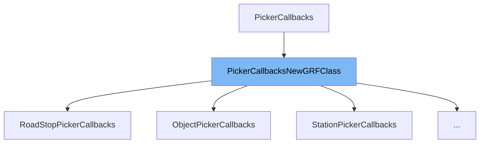

This document will cover the class <SwmToken path="src/picker_gui.h" pos="102:3:3" line-data="	explicit PickerCallbacksNewGRFClass(const std::string &amp;ini_group) : PickerCallbacks(ini_group) {}">`PickerCallbacksNewGRFClass`</SwmToken>. We will cover:

1. What <SwmToken path="src/picker_gui.h" pos="102:3:3" line-data="	explicit PickerCallbacksNewGRFClass(const std::string &amp;ini_group) : PickerCallbacks(ini_group) {}">`PickerCallbacksNewGRFClass`</SwmToken> is.
2. Variables and functions in <SwmToken path="src/picker_gui.h" pos="102:3:3" line-data="	explicit PickerCallbacksNewGRFClass(const std::string &amp;ini_group) : PickerCallbacks(ini_group) {}">`PickerCallbacksNewGRFClass`</SwmToken>.
3. Usage example of <SwmToken path="src/picker_gui.h" pos="102:3:3" line-data="	explicit PickerCallbacksNewGRFClass(const std::string &amp;ini_group) : PickerCallbacks(ini_group) {}">`PickerCallbacksNewGRFClass`</SwmToken> in <SwmToken path="src/rail_gui.cpp" pos="1779:2:2" line-data="class WaypointPickerCallbacks : public PickerCallbacksNewGRFClass&lt;StationClass&gt; {">`WaypointPickerCallbacks`</SwmToken>.



# What is <SwmToken path="src/picker_gui.h" pos="102:3:3" line-data="	explicit PickerCallbacksNewGRFClass(const std::string &amp;ini_group) : PickerCallbacks(ini_group) {}">`PickerCallbacksNewGRFClass`</SwmToken>

<SwmToken path="src/picker_gui.h" pos="102:3:3" line-data="	explicit PickerCallbacksNewGRFClass(const std::string &amp;ini_group) : PickerCallbacks(ini_group) {}">`PickerCallbacksNewGRFClass`</SwmToken> is a template class in <SwmPath>[src/picker_gui.h](src/picker_gui.h)</SwmPath> that extends the <SwmToken path="src/picker_gui.h" pos="102:17:17" line-data="	explicit PickerCallbacksNewGRFClass(const std::string &amp;ini_group) : PickerCallbacks(ini_group) {}">`PickerCallbacks`</SwmToken> class. It is used to provide callback functions for picker windows when the class system is based on <SwmToken path="src/picker_gui.h" pos="98:22:22" line-data="/** Helper for PickerCallbacks when the class system is based on NewGRFClass. */">`NewGRFClass`</SwmToken>. This class helps in managing and retrieving information about different classes and types within the picker GUI.

<SwmSnippet path="/src/picker_gui.h" line="102">

---

# Variables and functions

The constructor <SwmToken path="src/picker_gui.h" pos="102:3:3" line-data="	explicit PickerCallbacksNewGRFClass(const std::string &amp;ini_group) : PickerCallbacks(ini_group) {}">`PickerCallbacksNewGRFClass`</SwmToken> initializes the class with a given <SwmToken path="src/picker_gui.h" pos="102:12:12" line-data="	explicit PickerCallbacksNewGRFClass(const std::string &amp;ini_group) : PickerCallbacks(ini_group) {}">`ini_group`</SwmToken> string.

```c
	explicit PickerCallbacksNewGRFClass(const std::string &ini_group) : PickerCallbacks(ini_group) {}
```

---

</SwmSnippet>

<SwmSnippet path="/src/picker_gui.h" line="104">

---

The function <SwmToken path="src/picker_gui.h" pos="104:9:9" line-data="	inline typename T::index_type GetClassIndex(int cls_id) const { return static_cast&lt;typename T::index_type&gt;(cls_id); }">`GetClassIndex`</SwmToken> converts a class ID to the corresponding index type of the template parameter T.

```c
	inline typename T::index_type GetClassIndex(int cls_id) const { return static_cast<typename T::index_type>(cls_id); }
```

---

</SwmSnippet>

<SwmSnippet path="/src/picker_gui.h" line="105">

---

The function <SwmToken path="src/picker_gui.h" pos="105:8:8" line-data="	inline const T *GetClass(int cls_id) const { return T::Get(this-&gt;GetClassIndex(cls_id)); }">`GetClass`</SwmToken> retrieves the class object corresponding to a given class ID.

```c
	inline const T *GetClass(int cls_id) const { return T::Get(this->GetClassIndex(cls_id)); }
```

---

</SwmSnippet>

<SwmSnippet path="/src/picker_gui.h" line="106">

---

The function <SwmToken path="src/picker_gui.h" pos="106:12:12" line-data="	inline const typename T::spec_type *GetSpec(int cls_id, int id) const { return this-&gt;GetClass(cls_id)-&gt;GetSpec(id); }">`GetSpec`</SwmToken> retrieves the specification object for a given class ID and type ID.

```c
	inline const typename T::spec_type *GetSpec(int cls_id, int id) const { return this->GetClass(cls_id)->GetSpec(id); }
```

---

</SwmSnippet>

<SwmSnippet path="/src/picker_gui.h" line="108">

---

The function <SwmToken path="src/picker_gui.h" pos="108:3:3" line-data="	bool HasClassChoice() const override { return T::GetUIClassCount() &gt; 1; }">`HasClassChoice`</SwmToken> checks if there are multiple classes to choose from.

```c
	bool HasClassChoice() const override { return T::GetUIClassCount() > 1; }
```

---

</SwmSnippet>

<SwmSnippet path="/src/picker_gui.h" line="110">

---

The function <SwmToken path="src/picker_gui.h" pos="110:3:3" line-data="	int GetClassCount() const override { return T::GetClassCount(); }">`GetClassCount`</SwmToken> returns the total number of classes.

```c
	int GetClassCount() const override { return T::GetClassCount(); }
```

---

</SwmSnippet>

<SwmSnippet path="/src/picker_gui.h" line="111">

---

The function <SwmToken path="src/picker_gui.h" pos="111:3:3" line-data="	int GetTypeCount(int cls_id) const override { return this-&gt;GetClass(cls_id)-&gt;GetSpecCount(); }">`GetTypeCount`</SwmToken> returns the number of types in a given class.

```c
	int GetTypeCount(int cls_id) const override { return this->GetClass(cls_id)->GetSpecCount(); }
```

---

</SwmSnippet>

<SwmSnippet path="/src/picker_gui.h" line="113">

---

The function <SwmToken path="src/picker_gui.h" pos="113:3:3" line-data="	PickerItem GetPickerItem(const typename T::spec_type *spec, int cls_id = -1, int id = -1) const">`GetPickerItem`</SwmToken> retrieves a <SwmToken path="src/picker_gui.h" pos="113:1:1" line-data="	PickerItem GetPickerItem(const typename T::spec_type *spec, int cls_id = -1, int id = -1) const">`PickerItem`</SwmToken> object for a given specification object, class ID, and type ID.

```c
	PickerItem GetPickerItem(const typename T::spec_type *spec, int cls_id = -1, int id = -1) const
	{
		if (spec == nullptr) return {0, 0, cls_id, id};
		return {spec->grf_prop.grffile == nullptr ? 0 : spec->grf_prop.grffile->grfid, spec->grf_prop.local_id, spec->class_index, spec->index};
	}
```

---

</SwmSnippet>

<SwmSnippet path="/src/picker_gui.h" line="119">

---

The function <SwmToken path="src/picker_gui.h" pos="119:3:3" line-data="	PickerItem GetPickerItem(int cls_id, int id) const override">`GetPickerItem`</SwmToken> retrieves a <SwmToken path="src/picker_gui.h" pos="119:1:1" line-data="	PickerItem GetPickerItem(int cls_id, int id) const override">`PickerItem`</SwmToken> object for a given class ID and type ID.

```c
	PickerItem GetPickerItem(int cls_id, int id) const override
	{
		return GetPickerItem(GetClass(cls_id)->GetSpec(id), cls_id, id);
	}
```

---

</SwmSnippet>

<SwmSnippet path="/src/picker_gui.h" line="124">

---

The function <SwmToken path="src/picker_gui.h" pos="124:8:8" line-data="	std::set&lt;PickerItem&gt; UpdateSavedItems(const std::set&lt;PickerItem&gt; &amp;src) override">`UpdateSavedItems`</SwmToken> updates the saved items set with new <SwmToken path="src/picker_gui.h" pos="124:5:5" line-data="	std::set&lt;PickerItem&gt; UpdateSavedItems(const std::set&lt;PickerItem&gt; &amp;src) override">`PickerItem`</SwmToken> objects based on the given source set.

```c
	std::set<PickerItem> UpdateSavedItems(const std::set<PickerItem> &src) override
	{
		if (src.empty()) return {};

		std::set<PickerItem> dst;
		for (const auto &item : src) {
			const auto *spec = T::GetByGrf(item.grfid, item.local_id);
			if (spec == nullptr) {
				dst.insert({item.grfid, item.local_id, -1, -1});
			} else {
				dst.insert(GetPickerItem(spec));
			}
		}
		return dst;
```

---

</SwmSnippet>

# Usage example

Here is an example of how to use <SwmToken path="src/picker_gui.h" pos="102:3:3" line-data="	explicit PickerCallbacksNewGRFClass(const std::string &amp;ini_group) : PickerCallbacks(ini_group) {}">`PickerCallbacksNewGRFClass`</SwmToken> in <SwmToken path="src/rail_gui.cpp" pos="1779:2:2" line-data="class WaypointPickerCallbacks : public PickerCallbacksNewGRFClass&lt;StationClass&gt; {">`WaypointPickerCallbacks`</SwmToken>.

<SwmSnippet path="/src/rail_gui.cpp" line="1779">

---

The <SwmToken path="src/rail_gui.cpp" pos="1779:2:2" line-data="class WaypointPickerCallbacks : public PickerCallbacksNewGRFClass&lt;StationClass&gt; {">`WaypointPickerCallbacks`</SwmToken> class extends <SwmToken path="src/rail_gui.cpp" pos="1779:8:8" line-data="class WaypointPickerCallbacks : public PickerCallbacksNewGRFClass&lt;StationClass&gt; {">`PickerCallbacksNewGRFClass`</SwmToken> with <SwmToken path="src/rail_gui.cpp" pos="1779:10:10" line-data="class WaypointPickerCallbacks : public PickerCallbacksNewGRFClass&lt;StationClass&gt; {">`StationClass`</SwmToken> as the template parameter. It initializes the base class with the <SwmToken path="src/picker_gui.h" pos="102:12:12" line-data="	explicit PickerCallbacksNewGRFClass(const std::string &amp;ini_group) : PickerCallbacks(ini_group) {}">`ini_group`</SwmToken> <SwmToken path="src/rail_gui.cpp" pos="1781:13:13" line-data="	WaypointPickerCallbacks() : PickerCallbacksNewGRFClass&lt;StationClass&gt;(&quot;fav_waypoints&quot;) {}">`fav_waypoints`</SwmToken>.

```c++
class WaypointPickerCallbacks : public PickerCallbacksNewGRFClass<StationClass> {
public:
	WaypointPickerCallbacks() : PickerCallbacksNewGRFClass<StationClass>("fav_waypoints") {}
```

---

</SwmSnippet>

&nbsp;

*This is an auto-generated document by Swimm AI 🌊 and has not yet been verified by a human*

<SwmMeta version="3.0.0" repo-id="Z2l0aHViJTNBJTNBT3BlblRURC1jb3BpbG90LWRlbW8lM0ElM0Fzd2ltbWlv" repo-name="OpenTTD-copilot-demo"><sup>Powered by [Swimm](/)</sup></SwmMeta>
