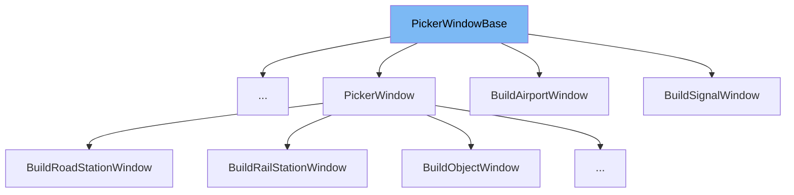

This document will cover the class <SwmToken path="src/window_gui.h" pos="992:1:1" line-data="	PickerWindowBase(WindowDesc &amp;desc, Window *parent) : Window(desc)">`PickerWindowBase`</SwmToken> in the codebase. We will cover:

1. What is <SwmToken path="src/window_gui.h" pos="992:1:1" line-data="	PickerWindowBase(WindowDesc &amp;desc, Window *parent) : Window(desc)">`PickerWindowBase`</SwmToken>
2. Variables and functions
3. Usage example



# What is <SwmToken path="src/window_gui.h" pos="992:1:1" line-data="	PickerWindowBase(WindowDesc &amp;desc, Window *parent) : Window(desc)">`PickerWindowBase`</SwmToken>

<SwmToken path="src/window_gui.h" pos="992:1:1" line-data="	PickerWindowBase(WindowDesc &amp;desc, Window *parent) : Window(desc)">`PickerWindowBase`</SwmToken> is a base class for windows that are opened from a toolbar. It inherits from the <SwmToken path="src/window_gui.h" pos="992:9:9" line-data="	PickerWindowBase(WindowDesc &amp;desc, Window *parent) : Window(desc)">`Window`</SwmToken> class and provides additional functionality specific to picker windows. This class is used as a foundation for creating various picker windows in the game, such as those for building depots, stations, and other structures.

<SwmSnippet path="/src/window_gui.h" line="992">

---

# Variables and functions

The constructor <SwmToken path="src/window_gui.h" pos="992:1:1" line-data="	PickerWindowBase(WindowDesc &amp;desc, Window *parent) : Window(desc)">`PickerWindowBase`</SwmToken> initializes the picker window with a given <SwmToken path="src/window_gui.h" pos="992:3:3" line-data="	PickerWindowBase(WindowDesc &amp;desc, Window *parent) : Window(desc)">`WindowDesc`</SwmToken> and a parent window. It sets the parent window for the picker window.

```c
	PickerWindowBase(WindowDesc &desc, Window *parent) : Window(desc)
	{
		this->parent = parent;
	}
```

---

</SwmSnippet>

<SwmSnippet path="/src/window_gui.h" line="997">

---

The function <SwmToken path="src/window_gui.h" pos="997:3:3" line-data="	void Close([[maybe_unused]] int data = 0) override;">`Close`</SwmToken> is an override of the <SwmToken path="src/window_gui.h" pos="997:3:3" line-data="	void Close([[maybe_unused]] int data = 0) override;">`Close`</SwmToken> function in the <SwmToken path="src/window_gui.h" pos="992:9:9" line-data="	PickerWindowBase(WindowDesc &amp;desc, Window *parent) : Window(desc)">`Window`</SwmToken> class. It provides specific behavior for closing picker windows.

```c
	void Close([[maybe_unused]] int data = 0) override;
};
```

---

</SwmSnippet>

<SwmSnippet path="/src/window_gui.h" line="992">

---

The constructor <SwmToken path="src/window_gui.h" pos="992:1:13" line-data="	PickerWindowBase(WindowDesc &amp;desc, Window *parent) : Window(desc)">`PickerWindowBase(WindowDesc &desc, Window *parent)`</SwmToken> initializes the picker window with a given <SwmToken path="src/window_gui.h" pos="992:3:3" line-data="	PickerWindowBase(WindowDesc &amp;desc, Window *parent) : Window(desc)">`WindowDesc`</SwmToken> and a parent window. It sets the parent window for the picker window.

```c
	PickerWindowBase(WindowDesc &desc, Window *parent) : Window(desc)
	{
		this->parent = parent;
	}
```

---

</SwmSnippet>

<SwmSnippet path="/src/window_gui.h" line="997">

---

The function <SwmToken path="src/window_gui.h" pos="997:3:3" line-data="	void Close([[maybe_unused]] int data = 0) override;">`Close`</SwmToken> is an override of the <SwmToken path="src/window_gui.h" pos="997:3:3" line-data="	void Close([[maybe_unused]] int data = 0) override;">`Close`</SwmToken> function in the <SwmToken path="src/window_gui.h" pos="992:9:9" line-data="	PickerWindowBase(WindowDesc &amp;desc, Window *parent) : Window(desc)">`Window`</SwmToken> class. It provides specific behavior for closing picker windows.

```c
	void Close([[maybe_unused]] int data = 0) override;
};
```

---

</SwmSnippet>

<SwmSnippet path="/src/window_gui.h" line="992">

---

The constructor <SwmToken path="src/window_gui.h" pos="992:1:13" line-data="	PickerWindowBase(WindowDesc &amp;desc, Window *parent) : Window(desc)">`PickerWindowBase(WindowDesc &desc, Window *parent)`</SwmToken> initializes the picker window with a given <SwmToken path="src/window_gui.h" pos="992:3:3" line-data="	PickerWindowBase(WindowDesc &amp;desc, Window *parent) : Window(desc)">`WindowDesc`</SwmToken> and a parent window. It sets the parent window for the picker window.

```c
	PickerWindowBase(WindowDesc &desc, Window *parent) : Window(desc)
	{
		this->parent = parent;
	}
```

---

</SwmSnippet>

<SwmSnippet path="/src/window_gui.h" line="997">

---

The function <SwmToken path="src/window_gui.h" pos="997:3:3" line-data="	void Close([[maybe_unused]] int data = 0) override;">`Close`</SwmToken> is an override of the <SwmToken path="src/window_gui.h" pos="997:3:3" line-data="	void Close([[maybe_unused]] int data = 0) override;">`Close`</SwmToken> function in the <SwmToken path="src/window_gui.h" pos="992:9:9" line-data="	PickerWindowBase(WindowDesc &amp;desc, Window *parent) : Window(desc)">`Window`</SwmToken> class. It provides specific behavior for closing picker windows.

```c
	void Close([[maybe_unused]] int data = 0) override;
};
```

---

</SwmSnippet>

# Usage example

Here is an example of how to use <SwmToken path="src/window_gui.h" pos="992:1:1" line-data="	PickerWindowBase(WindowDesc &amp;desc, Window *parent) : Window(desc)">`PickerWindowBase`</SwmToken> in <SwmToken path="src/rail_gui.cpp" pos="1701:2:2" line-data="struct BuildRailDepotWindow : public PickerWindowBase {">`BuildRailDepotWindow`</SwmToken>.

<SwmSnippet path="/src/rail_gui.cpp" line="1701">

---

<SwmToken path="src/rail_gui.cpp" pos="1701:2:2" line-data="struct BuildRailDepotWindow : public PickerWindowBase {">`BuildRailDepotWindow`</SwmToken> is a class that inherits from <SwmToken path="src/rail_gui.cpp" pos="1701:8:8" line-data="struct BuildRailDepotWindow : public PickerWindowBase {">`PickerWindowBase`</SwmToken>. It initializes the picker window with a given <SwmToken path="src/rail_gui.cpp" pos="1702:3:3" line-data="	BuildRailDepotWindow(WindowDesc &amp;desc, Window *parent) : PickerWindowBase(desc, parent)">`WindowDesc`</SwmToken> and a parent window.

```c++
struct BuildRailDepotWindow : public PickerWindowBase {
	BuildRailDepotWindow(WindowDesc &desc, Window *parent) : PickerWindowBase(desc, parent)
	{
```

---

</SwmSnippet>

&nbsp;

*This is an auto-generated document by Swimm AI 🌊 and has not yet been verified by a human*

<SwmMeta version="3.0.0" repo-id="Z2l0aHViJTNBJTNBT3BlblRURC1jb3BpbG90LWRlbW8lM0ElM0Fzd2ltbWlv" repo-name="OpenTTD-copilot-demo"><sup>Powered by [Swimm](/)</sup></SwmMeta>
