```mermaid
graph TD;
  ResolverObject:::currentBaseStyle
ResolverObject --> VehicleResolverObject
ResolverObject --> HouseResolverObject
ResolverObject --> IndustryTileResolverObject
ResolverObject --> RoadStopResolverObject
ResolverObject --> StationResolverObject
ResolverObject --> IndustriesResolverObject
ResolverObject --> AirportResolverObject
ResolverObject --> AirportTileResolverObject
ResolverObject --> RailTypeResolverObject
ResolverObject --> ObjectResolverObject
ResolverObject --> 1[...]

 classDef currentBaseStyle color:#000000,fill:#7CB9F4

%% Swimm:
%% graph TD;
%%   ResolverObject:::currentBaseStyle
%% <SwmToken path="src/newgrf_roadtype.h" pos="30:3:3" line-data="	RoadTypeScopeResolver(ResolverObject &amp;ro, const RoadTypeInfo *rti, TileIndex tile, TileContext context)">`ResolverObject`</SwmToken> --> VehicleResolverObject
%% <SwmToken path="src/newgrf_roadtype.h" pos="30:3:3" line-data="	RoadTypeScopeResolver(ResolverObject &amp;ro, const RoadTypeInfo *rti, TileIndex tile, TileContext context)">`ResolverObject`</SwmToken> --> HouseResolverObject
%% <SwmToken path="src/newgrf_roadtype.h" pos="30:3:3" line-data="	RoadTypeScopeResolver(ResolverObject &amp;ro, const RoadTypeInfo *rti, TileIndex tile, TileContext context)">`ResolverObject`</SwmToken> --> IndustryTileResolverObject
%% <SwmToken path="src/newgrf_roadtype.h" pos="30:3:3" line-data="	RoadTypeScopeResolver(ResolverObject &amp;ro, const RoadTypeInfo *rti, TileIndex tile, TileContext context)">`ResolverObject`</SwmToken> --> RoadStopResolverObject
%% <SwmToken path="src/newgrf_roadtype.h" pos="30:3:3" line-data="	RoadTypeScopeResolver(ResolverObject &amp;ro, const RoadTypeInfo *rti, TileIndex tile, TileContext context)">`ResolverObject`</SwmToken> --> StationResolverObject
%% <SwmToken path="src/newgrf_roadtype.h" pos="30:3:3" line-data="	RoadTypeScopeResolver(ResolverObject &amp;ro, const RoadTypeInfo *rti, TileIndex tile, TileContext context)">`ResolverObject`</SwmToken> --> IndustriesResolverObject
%% <SwmToken path="src/newgrf_roadtype.h" pos="30:3:3" line-data="	RoadTypeScopeResolver(ResolverObject &amp;ro, const RoadTypeInfo *rti, TileIndex tile, TileContext context)">`ResolverObject`</SwmToken> --> AirportResolverObject
%% <SwmToken path="src/newgrf_roadtype.h" pos="30:3:3" line-data="	RoadTypeScopeResolver(ResolverObject &amp;ro, const RoadTypeInfo *rti, TileIndex tile, TileContext context)">`ResolverObject`</SwmToken> --> AirportTileResolverObject
%% <SwmToken path="src/newgrf_roadtype.h" pos="30:3:3" line-data="	RoadTypeScopeResolver(ResolverObject &amp;ro, const RoadTypeInfo *rti, TileIndex tile, TileContext context)">`ResolverObject`</SwmToken> --> RailTypeResolverObject
%% <SwmToken path="src/newgrf_roadtype.h" pos="30:3:3" line-data="	RoadTypeScopeResolver(ResolverObject &amp;ro, const RoadTypeInfo *rti, TileIndex tile, TileContext context)">`ResolverObject`</SwmToken> --> ObjectResolverObject
%% <SwmToken path="src/newgrf_roadtype.h" pos="30:3:3" line-data="	RoadTypeScopeResolver(ResolverObject &amp;ro, const RoadTypeInfo *rti, TileIndex tile, TileContext context)">`ResolverObject`</SwmToken> --> 1[...]
%% 
%%  classDef currentBaseStyle color:#000000,fill:#7CB9F4
```

This document will cover the class <SwmToken path="src/newgrf_roadtype.h" pos="30:3:3" line-data="	RoadTypeScopeResolver(ResolverObject &amp;ro, const RoadTypeInfo *rti, TileIndex tile, TileContext context)">`ResolverObject`</SwmToken> in the file <SwmPath>[src/newgrf_spritegroup.h](src/newgrf_spritegroup.h)</SwmPath>. We will cover:

1. What <SwmToken path="src/newgrf_roadtype.h" pos="30:3:3" line-data="	RoadTypeScopeResolver(ResolverObject &amp;ro, const RoadTypeInfo *rti, TileIndex tile, TileContext context)">`ResolverObject`</SwmToken> is.
2. Variables and functions defined in <SwmToken path="src/newgrf_roadtype.h" pos="30:3:3" line-data="	RoadTypeScopeResolver(ResolverObject &amp;ro, const RoadTypeInfo *rti, TileIndex tile, TileContext context)">`ResolverObject`</SwmToken>.
3. Example of how to use <SwmToken path="src/newgrf_roadtype.h" pos="30:3:3" line-data="	RoadTypeScopeResolver(ResolverObject &amp;ro, const RoadTypeInfo *rti, TileIndex tile, TileContext context)">`ResolverObject`</SwmToken> in <SwmToken path="src/newgrf_roadtype.h" pos="40:2:2" line-data="struct RoadTypeResolverObject : public ResolverObject {">`RoadTypeResolverObject`</SwmToken>.



# What is <SwmToken path="src/newgrf_roadtype.h" pos="30:3:3" line-data="	RoadTypeScopeResolver(ResolverObject &amp;ro, const RoadTypeInfo *rti, TileIndex tile, TileContext context)">`ResolverObject`</SwmToken>

The <SwmToken path="src/newgrf_roadtype.h" pos="30:3:3" line-data="	RoadTypeScopeResolver(ResolverObject &amp;ro, const RoadTypeInfo *rti, TileIndex tile, TileContext context)">`ResolverObject`</SwmToken> class in <SwmPath>[src/newgrf_spritegroup.h](src/newgrf_spritegroup.h)</SwmPath> is an interface for <SwmToken path="src/newgrf_spritegroup.h" pos="336:17:17" line-data="	const GRFFile *grffile;     ///&lt; GRFFile the resolved SpriteGroup belongs to">`SpriteGroup`</SwmToken> objects to access the game state. It allows <SwmToken path="src/newgrf_spritegroup.h" pos="336:17:17" line-data="	const GRFFile *grffile;     ///&lt; GRFFile the resolved SpriteGroup belongs to">`SpriteGroup`</SwmToken> chains (action <SwmToken path="src/newgrf_spritegroup.h" pos="287:23:27" line-data=" * to different game entities from a #SpriteGroup-chain (action 1-2-3 chain).">`1-2-3`</SwmToken> chains) to be resolved to get the results of callbacks, rerandomizations, or normal sprite lookups.

<SwmSnippet path="/src/newgrf_spritegroup.h" line="324">

---

# Variables and functions

The variable <SwmToken path="src/newgrf_spritegroup.h" pos="324:3:3" line-data="	ScopeResolver default_scope; ///&lt; Default implementation of the grf scope.">`default_scope`</SwmToken> is an instance of <SwmToken path="src/newgrf_spritegroup.h" pos="324:1:1" line-data="	ScopeResolver default_scope; ///&lt; Default implementation of the grf scope.">`ScopeResolver`</SwmToken> and provides the default implementation of the GRF scope.

```c
	ScopeResolver default_scope; ///< Default implementation of the grf scope.
```

---

</SwmSnippet>

<SwmSnippet path="/src/newgrf_spritegroup.h" line="326">

---

The variable <SwmToken path="src/newgrf_spritegroup.h" pos="326:3:3" line-data="	CallbackID callback;        ///&lt; Callback being resolved.">`callback`</SwmToken> stores the callback being resolved.

```c
	CallbackID callback;        ///< Callback being resolved.
```

---

</SwmSnippet>

<SwmSnippet path="/src/newgrf_spritegroup.h" line="327">

---

The variables <SwmToken path="src/newgrf_spritegroup.h" pos="327:3:3" line-data="	uint32_t callback_param1;     ///&lt; First parameter (var 10) of the callback.">`callback_param1`</SwmToken> and <SwmToken path="src/newgrf_spritegroup.h" pos="328:3:3" line-data="	uint32_t callback_param2;     ///&lt; Second parameter (var 18) of the callback.">`callback_param2`</SwmToken> store the first and second parameters of the callback, respectively.

```c
	uint32_t callback_param1;     ///< First parameter (var 10) of the callback.
	uint32_t callback_param2;     ///< Second parameter (var 18) of the callback.
```

---

</SwmSnippet>

<SwmSnippet path="/src/newgrf_spritegroup.h" line="330">

---

The variable <SwmToken path="src/newgrf_spritegroup.h" pos="330:3:3" line-data="	uint32_t last_value;          ///&lt; Result of most recent DeterministicSpriteGroup (including procedure calls)">`last_value`</SwmToken> stores the result of the most recent <SwmToken path="src/newgrf_spritegroup.h" pos="330:16:16" line-data="	uint32_t last_value;          ///&lt; Result of most recent DeterministicSpriteGroup (including procedure calls)">`DeterministicSpriteGroup`</SwmToken>, including procedure calls.

```c
	uint32_t last_value;          ///< Result of most recent DeterministicSpriteGroup (including procedure calls)
```

---

</SwmSnippet>

<SwmSnippet path="/src/newgrf_spritegroup.h" line="332">

---

The variables <SwmToken path="src/newgrf_spritegroup.h" pos="332:3:3" line-data="	uint32_t waiting_triggers;    ///&lt; Waiting triggers to be used by any rerandomisation. (scope independent)">`waiting_triggers`</SwmToken> and <SwmToken path="src/newgrf_spritegroup.h" pos="333:3:3" line-data="	uint32_t used_triggers;       ///&lt; Subset of cur_triggers, which actually triggered some rerandomisation. (scope independent)">`used_triggers`</SwmToken> store the waiting triggers to be used by any rerandomization and the subset of current triggers that actually triggered some rerandomization, respectively.

```c
	uint32_t waiting_triggers;    ///< Waiting triggers to be used by any rerandomisation. (scope independent)
	uint32_t used_triggers;       ///< Subset of cur_triggers, which actually triggered some rerandomisation. (scope independent)
```

---

</SwmSnippet>

<SwmSnippet path="/src/newgrf_spritegroup.h" line="334">

---

The variable <SwmToken path="src/newgrf_spritegroup.h" pos="334:3:3" line-data="	uint32_t reseed[VSG_END];     ///&lt; Collects bits to rerandomise while triggering triggers.">`reseed`</SwmToken> collects bits to rerandomize while triggering triggers.

```c
	uint32_t reseed[VSG_END];     ///< Collects bits to rerandomise while triggering triggers.
```

---

</SwmSnippet>

<SwmSnippet path="/src/newgrf_spritegroup.h" line="336">

---

The variable <SwmToken path="src/newgrf_spritegroup.h" pos="336:3:3" line-data="	const GRFFile *grffile;     ///&lt; GRFFile the resolved SpriteGroup belongs to">`GRFFile`</SwmToken> stores the GRF file the resolved <SwmToken path="src/newgrf_spritegroup.h" pos="336:17:17" line-data="	const GRFFile *grffile;     ///&lt; GRFFile the resolved SpriteGroup belongs to">`SpriteGroup`</SwmToken> belongs to.

```c
	const GRFFile *grffile;     ///< GRFFile the resolved SpriteGroup belongs to
```

---

</SwmSnippet>

<SwmSnippet path="/src/newgrf_spritegroup.h" line="337">

---

The variable <SwmToken path="src/newgrf_spritegroup.h" pos="337:6:6" line-data="	const SpriteGroup *root_spritegroup; ///&lt; Root SpriteGroup to use for resolving">`root_spritegroup`</SwmToken> stores the root <SwmToken path="src/newgrf_spritegroup.h" pos="337:3:3" line-data="	const SpriteGroup *root_spritegroup; ///&lt; Root SpriteGroup to use for resolving">`SpriteGroup`</SwmToken> to use for resolving.

```c
	const SpriteGroup *root_spritegroup; ///< Root SpriteGroup to use for resolving
```

---

</SwmSnippet>

<SwmSnippet path="/src/newgrf_spritegroup.h" line="343">

---

The function <SwmToken path="src/newgrf_spritegroup.h" pos="343:6:6" line-data="	const SpriteGroup *Resolve()">`Resolve`</SwmToken> resolves the <SwmToken path="src/newgrf_spritegroup.h" pos="343:3:3" line-data="	const SpriteGroup *Resolve()">`SpriteGroup`</SwmToken> and returns the result <SwmToken path="src/newgrf_spritegroup.h" pos="343:3:3" line-data="	const SpriteGroup *Resolve()">`SpriteGroup`</SwmToken>.

```c
	const SpriteGroup *Resolve()
	{
		return SpriteGroup::Resolve(this->root_spritegroup, *this);
	}
```

---

</SwmSnippet>

<SwmSnippet path="/src/newgrf_spritegroup.h" line="352">

---

The function <SwmToken path="src/newgrf_spritegroup.h" pos="352:3:3" line-data="	uint16_t ResolveCallback()">`ResolveCallback`</SwmToken> resolves the callback and returns the callback result.

```c
	uint16_t ResolveCallback()
	{
		const SpriteGroup *result = Resolve();
		return result != nullptr ? result->GetCallbackResult() : CALLBACK_FAILED;
	}
```

---

</SwmSnippet>

<SwmSnippet path="/src/newgrf_spritegroup.h" line="358">

---

The function <SwmToken path="src/newgrf_spritegroup.h" pos="358:8:8" line-data="	virtual const SpriteGroup *ResolveReal(const RealSpriteGroup *group) const;">`ResolveReal`</SwmToken> is a virtual function that resolves a <SwmToken path="src/newgrf_spritegroup.h" pos="358:12:12" line-data="	virtual const SpriteGroup *ResolveReal(const RealSpriteGroup *group) const;">`RealSpriteGroup`</SwmToken>.

```c
	virtual const SpriteGroup *ResolveReal(const RealSpriteGroup *group) const;
```

---

</SwmSnippet>

<SwmSnippet path="/src/newgrf_spritegroup.h" line="360">

---

The function <SwmToken path="src/newgrf_spritegroup.h" pos="360:6:6" line-data="	virtual ScopeResolver *GetScope(VarSpriteGroupScope scope = VSG_SCOPE_SELF, uint8_t relative = 0);">`GetScope`</SwmToken> is a virtual function that returns a <SwmToken path="src/newgrf_spritegroup.h" pos="360:3:3" line-data="	virtual ScopeResolver *GetScope(VarSpriteGroupScope scope = VSG_SCOPE_SELF, uint8_t relative = 0);">`ScopeResolver`</SwmToken> for a given <SwmToken path="src/newgrf_spritegroup.h" pos="360:8:8" line-data="	virtual ScopeResolver *GetScope(VarSpriteGroupScope scope = VSG_SCOPE_SELF, uint8_t relative = 0);">`VarSpriteGroupScope`</SwmToken>.

```c
	virtual ScopeResolver *GetScope(VarSpriteGroupScope scope = VSG_SCOPE_SELF, uint8_t relative = 0);
```

---

</SwmSnippet>

<SwmSnippet path="/src/newgrf_spritegroup.h" line="365">

---

The function <SwmToken path="src/newgrf_spritegroup.h" pos="365:3:3" line-data="	uint32_t GetRemainingTriggers() const">`GetRemainingTriggers`</SwmToken> returns the waiting triggers that did not trigger any rerandomization.

```c
	uint32_t GetRemainingTriggers() const
	{
		return this->waiting_triggers & ~this->used_triggers;
	}
```

---

</SwmSnippet>

<SwmSnippet path="/src/newgrf_spritegroup.h" line="375">

---

The function <SwmToken path="src/newgrf_spritegroup.h" pos="375:3:3" line-data="	uint32_t GetReseedSum() const">`GetReseedSum`</SwmToken> returns the <SwmToken path="src/newgrf_spritegroup.h" pos="371:7:9" line-data="	 * Returns the OR-sum of all bits that need reseeding">`OR-sum`</SwmToken> of all bits that need reseeding, independent of the scope they were accessed with.

```c
	uint32_t GetReseedSum() const
	{
		uint32_t sum = 0;
		for (VarSpriteGroupScope vsg = VSG_BEGIN; vsg < VSG_END; vsg++) {
			sum |= this->reseed[vsg];
		}
		return sum;
	}
```

---

</SwmSnippet>

<SwmSnippet path="/src/newgrf_spritegroup.h" line="388">

---

The function <SwmToken path="src/newgrf_spritegroup.h" pos="388:3:3" line-data="	void ResetState()">`ResetState`</SwmToken> resets the dynamic state of the resolver object. It is called before resolving an <SwmToken path="src/newgrf_spritegroup.h" pos="386:15:21" line-data="	 * To be called before resolving an Action-1-2-3 chain.">`Action-1-2-3`</SwmToken> chain.

```c
	void ResetState()
	{
		this->last_value = 0;
		this->waiting_triggers = 0;
		this->used_triggers = 0;
		memset(this->reseed, 0, sizeof(this->reseed));
	}
```

---

</SwmSnippet>

<SwmSnippet path="/src/newgrf_spritegroup.h" line="400">

---

The function <SwmToken path="src/newgrf_spritegroup.h" pos="400:5:5" line-data="	virtual GrfSpecFeature GetFeature() const { return GSF_INVALID; }">`GetFeature`</SwmToken> is a virtual function that returns the feature number being resolved for. It is mainly intended for the callback profiling feature.

```c
	virtual GrfSpecFeature GetFeature() const { return GSF_INVALID; }
```

---

</SwmSnippet>

<SwmSnippet path="/src/newgrf_spritegroup.h" line="406">

---

The function <SwmToken path="src/newgrf_spritegroup.h" pos="406:5:5" line-data="	virtual uint32_t GetDebugID() const { return 0; }">`GetDebugID`</SwmToken> is a virtual function that returns an identifier for the item being resolved. It is mainly intended for the callback profiling feature and should return an identifier recognizable by the <SwmToken path="src/newgrf_spritegroup.h" pos="24:17:17" line-data=" * Gets the value of a so-called newgrf &quot;register&quot;.">`newgrf`</SwmToken> developer.

```c
	virtual uint32_t GetDebugID() const { return 0; }
```

---

</SwmSnippet>

# Usage example

Here is an example of how to use <SwmToken path="src/newgrf_roadtype.h" pos="30:3:3" line-data="	RoadTypeScopeResolver(ResolverObject &amp;ro, const RoadTypeInfo *rti, TileIndex tile, TileContext context)">`ResolverObject`</SwmToken> in <SwmToken path="src/newgrf_roadtype.h" pos="40:2:2" line-data="struct RoadTypeResolverObject : public ResolverObject {">`RoadTypeResolverObject`</SwmToken>.

<SwmSnippet path="/src/newgrf_roadtype.h" line="30">

---

The <SwmToken path="src/newgrf_roadtype.h" pos="30:1:1" line-data="	RoadTypeScopeResolver(ResolverObject &amp;ro, const RoadTypeInfo *rti, TileIndex tile, TileContext context)">`RoadTypeScopeResolver`</SwmToken> constructor takes a <SwmToken path="src/newgrf_roadtype.h" pos="30:3:3" line-data="	RoadTypeScopeResolver(ResolverObject &amp;ro, const RoadTypeInfo *rti, TileIndex tile, TileContext context)">`ResolverObject`</SwmToken> reference, a <SwmToken path="src/newgrf_roadtype.h" pos="30:11:11" line-data="	RoadTypeScopeResolver(ResolverObject &amp;ro, const RoadTypeInfo *rti, TileIndex tile, TileContext context)">`RoadTypeInfo`</SwmToken> pointer, a <SwmToken path="src/newgrf_roadtype.h" pos="30:17:17" line-data="	RoadTypeScopeResolver(ResolverObject &amp;ro, const RoadTypeInfo *rti, TileIndex tile, TileContext context)">`TileIndex`</SwmToken>, and a <SwmToken path="src/newgrf_roadtype.h" pos="30:22:22" line-data="	RoadTypeScopeResolver(ResolverObject &amp;ro, const RoadTypeInfo *rti, TileIndex tile, TileContext context)">`TileContext`</SwmToken> as parameters.

```c
	RoadTypeScopeResolver(ResolverObject &ro, const RoadTypeInfo *rti, TileIndex tile, TileContext context)
		: ScopeResolver(ro), tile(tile), context(context), rti(rti)
	{
```

---

</SwmSnippet>

<SwmSnippet path="/src/newgrf_roadtype.h" line="40">

---

The <SwmToken path="src/newgrf_roadtype.h" pos="40:2:2" line-data="struct RoadTypeResolverObject : public ResolverObject {">`RoadTypeResolverObject`</SwmToken> struct extends <SwmToken path="src/newgrf_roadtype.h" pos="40:8:8" line-data="struct RoadTypeResolverObject : public ResolverObject {">`ResolverObject`</SwmToken> and contains a <SwmToken path="src/newgrf_roadtype.h" pos="41:1:1" line-data="	RoadTypeScopeResolver roadtype_scope; ///&lt; Resolver for the roadtype scope.">`RoadTypeScopeResolver`</SwmToken> instance named <SwmToken path="src/newgrf_roadtype.h" pos="41:3:3" line-data="	RoadTypeScopeResolver roadtype_scope; ///&lt; Resolver for the roadtype scope.">`roadtype_scope`</SwmToken>.

```c
struct RoadTypeResolverObject : public ResolverObject {
	RoadTypeScopeResolver roadtype_scope; ///< Resolver for the roadtype scope.
```

---

</SwmSnippet>

<SwmSnippet path="/src/newgrf_roadtype.h" line="48">

---

The <SwmToken path="src/newgrf_roadtype.h" pos="49:8:8" line-data="			default:             return ResolverObject::GetScope(scope, relative);">`GetScope`</SwmToken> function in <SwmToken path="src/newgrf_roadtype.h" pos="40:2:2" line-data="struct RoadTypeResolverObject : public ResolverObject {">`RoadTypeResolverObject`</SwmToken> returns the <SwmToken path="src/newgrf_roadtype.h" pos="48:11:11" line-data="			case VSG_SCOPE_SELF: return &amp;this-&gt;roadtype_scope;">`roadtype_scope`</SwmToken> for the <SwmToken path="src/newgrf_roadtype.h" pos="48:3:3" line-data="			case VSG_SCOPE_SELF: return &amp;this-&gt;roadtype_scope;">`VSG_SCOPE_SELF`</SwmToken> scope or calls the base class <SwmToken path="src/newgrf_roadtype.h" pos="49:8:8" line-data="			default:             return ResolverObject::GetScope(scope, relative);">`GetScope`</SwmToken> function for other scopes.

```c
			case VSG_SCOPE_SELF: return &this->roadtype_scope;
			default:             return ResolverObject::GetScope(scope, relative);
		}
```

---

</SwmSnippet>

&nbsp;

*This is an auto-generated document by Swimm AI 🌊 and has not yet been verified by a human*

<SwmMeta version="3.0.0" repo-id="Z2l0aHViJTNBJTNBT3BlblRURC1jb3BpbG90LWRlbW8lM0ElM0Fzd2ltbWlv" repo-name="OpenTTD-copilot-demo"><sup>Powered by [Swimm](/)</sup></SwmMeta>
