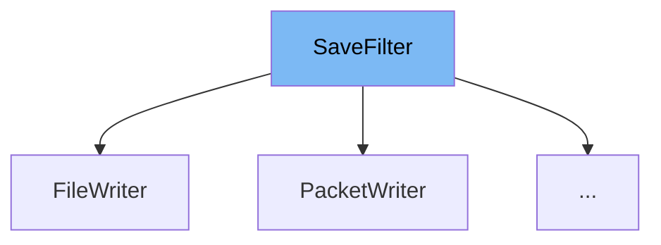

This document will cover the <SwmToken path="src/saveload/saveload_filter.h" pos="61:5:5" line-data="	std::shared_ptr&lt;SaveFilter&gt; chain;">`SaveFilter`</SwmToken> class. We will discuss:

1. What <SwmToken path="src/saveload/saveload_filter.h" pos="61:5:5" line-data="	std::shared_ptr&lt;SaveFilter&gt; chain;">`SaveFilter`</SwmToken> is.
2. The variables and functions defined in <SwmToken path="src/saveload/saveload_filter.h" pos="61:5:5" line-data="	std::shared_ptr&lt;SaveFilter&gt; chain;">`SaveFilter`</SwmToken>.
3. An example of how to use <SwmToken path="src/saveload/saveload_filter.h" pos="61:5:5" line-data="	std::shared_ptr&lt;SaveFilter&gt; chain;">`SaveFilter`</SwmToken> in <SwmToken path="src/saveload/saveload.cpp" pos="2371:2:2" line-data="struct NoCompSaveFilter : SaveFilter {">`NoCompSaveFilter`</SwmToken>.



# What is <SwmToken path="src/saveload/saveload_filter.h" pos="61:5:5" line-data="	std::shared_ptr&lt;SaveFilter&gt; chain;">`SaveFilter`</SwmToken>

<SwmToken path="src/saveload/saveload_filter.h" pos="61:5:5" line-data="	std::shared_ptr&lt;SaveFilter&gt; chain;">`SaveFilter`</SwmToken> is an interface for filtering a savegame until it is written. It is used to manage the process of writing data to a savegame, ensuring that the data is properly handled and any necessary transformations or compressions are applied.

<SwmSnippet path="/src/saveload/saveload_filter.h" line="61">

---

# Variables and functions

The variable <SwmToken path="src/saveload/saveload_filter.h" pos="61:8:8" line-data="	std::shared_ptr&lt;SaveFilter&gt; chain;">`chain`</SwmToken> is a shared pointer to another <SwmToken path="src/saveload/saveload_filter.h" pos="61:5:5" line-data="	std::shared_ptr&lt;SaveFilter&gt; chain;">`SaveFilter`</SwmToken>. It allows chaining multiple filters together, where each filter can process the data before passing it to the next filter in the chain.

```c
	std::shared_ptr<SaveFilter> chain;
```

---

</SwmSnippet>

<SwmSnippet path="/src/saveload/saveload_filter.h" line="67">

---

The constructor <SwmToken path="src/saveload/saveload_filter.h" pos="67:1:1" line-data="	SaveFilter(std::shared_ptr&lt;SaveFilter&gt; chain) : chain(chain)">`SaveFilter`</SwmToken> initializes the filter with the next filter in the chain. It takes a shared pointer to another <SwmToken path="src/saveload/saveload_filter.h" pos="67:1:1" line-data="	SaveFilter(std::shared_ptr&lt;SaveFilter&gt; chain) : chain(chain)">`SaveFilter`</SwmToken> as a parameter.

```c
	SaveFilter(std::shared_ptr<SaveFilter> chain) : chain(chain)
	{
	}
```

---

</SwmSnippet>

<SwmSnippet path="/src/saveload/saveload_filter.h" line="72">

---

The destructor <SwmToken path="src/saveload/saveload_filter.h" pos="72:3:4" line-data="	virtual ~SaveFilter()">`~SaveFilter`</SwmToken> ensures that the writers are properly closed when the filter is destroyed.

```c
	virtual ~SaveFilter()
	{
	}
```

---

</SwmSnippet>

<SwmSnippet path="/src/saveload/saveload_filter.h" line="78">

---

The function <SwmToken path="src/saveload/saveload_filter.h" pos="78:14:14" line-data="	 * @param buf The bytes to write.">`write`</SwmToken> is a pure virtual function that writes a given number of bytes into the savegame. It takes a buffer and the number of bytes to write as parameters.

```c
	 * @param buf The bytes to write.
	 * @param len The number of bytes to write.
	 */
```

---

</SwmSnippet>

<SwmSnippet path="/src/saveload/saveload_filter.h" line="86">

---

The function <SwmToken path="src/saveload/saveload_filter.h" pos="86:5:5" line-data="	virtual void Finish()">`Finish`</SwmToken> prepares everything to finish writing the savegame. It calls the <SwmToken path="src/saveload/saveload_filter.h" pos="86:5:5" line-data="	virtual void Finish()">`Finish`</SwmToken> function of the next filter in the chain if it exists.

```c
	virtual void Finish()
	{
		if (this->chain != nullptr) this->chain->Finish();
	}
```

---

</SwmSnippet>

# Usage example

Here is an example of how to use <SwmToken path="src/saveload/saveload_filter.h" pos="61:5:5" line-data="	std::shared_ptr&lt;SaveFilter&gt; chain;">`SaveFilter`</SwmToken> in <SwmToken path="src/saveload/saveload.cpp" pos="2371:2:2" line-data="struct NoCompSaveFilter : SaveFilter {">`NoCompSaveFilter`</SwmToken>.

<SwmSnippet path="/src/saveload/saveload.cpp" line="2222">

---

<SwmToken path="src/saveload/saveload.cpp" pos="2371:2:2" line-data="struct NoCompSaveFilter : SaveFilter {">`NoCompSaveFilter`</SwmToken> is a struct that extends <SwmToken path="src/saveload/saveload.cpp" pos="2222:6:6" line-data="struct FileWriter : SaveFilter {">`SaveFilter`</SwmToken>. It represents a filter that writes data directly to a file without any compression. The constructor initializes the <SwmToken path="src/saveload/saveload.cpp" pos="2222:6:6" line-data="struct FileWriter : SaveFilter {">`SaveFilter`</SwmToken> with a <SwmToken path="src/saveload/saveload.cpp" pos="2229:13:13" line-data="	FileWriter(FILE *file) : SaveFilter(nullptr), file(file)">`nullptr`</SwmToken> chain and sets the file to write to.

```c++
struct FileWriter : SaveFilter {
	FILE *file; ///< The file to write to.

	/**
	 * Create the file writer, so it writes to a specific file.
	 * @param file The file to write to.
	 */
	FileWriter(FILE *file) : SaveFilter(nullptr), file(file)
	{
```

---

</SwmSnippet>

&nbsp;

*This is an auto-generated document by Swimm AI 🌊 and has not yet been verified by a human*

<SwmMeta version="3.0.0" repo-id="Z2l0aHViJTNBJTNBT3BlblRURC1jb3BpbG90LWRlbW8lM0ElM0Fzd2ltbWlv" repo-name="OpenTTD-copilot-demo"><sup>Powered by [Swimm](/)</sup></SwmMeta>
