```mermaid
graph TD;
  ScopeResolver:::currentBaseStyle
ScopeResolver --> TownScopeResolver
ScopeResolver --> VehicleScopeResolver
ScopeResolver --> IndustriesScopeResolver
ScopeResolver --> AirportScopeResolver
ScopeResolver --> IndustryTileScopeResolver
ScopeResolver --> RoadStopScopeResolver
ScopeResolver --> StationScopeResolver
ScopeResolver --> HouseScopeResolver
ScopeResolver --> CanalScopeResolver
ScopeResolver --> RoadTypeScopeResolver
ScopeResolver --> 1[...]

 classDef currentBaseStyle color:#000000,fill:#7CB9F4

%% Swimm:
%% graph TD;
%%   ScopeResolver:::currentBaseStyle
%% <SwmToken path="src/newgrf_spritegroup.h" pos="292:1:1" line-data="	ScopeResolver(ResolverObject &amp;ro) : ro(ro) {}">`ScopeResolver`</SwmToken> --> TownScopeResolver
%% <SwmToken path="src/newgrf_spritegroup.h" pos="292:1:1" line-data="	ScopeResolver(ResolverObject &amp;ro) : ro(ro) {}">`ScopeResolver`</SwmToken> --> VehicleScopeResolver
%% <SwmToken path="src/newgrf_spritegroup.h" pos="292:1:1" line-data="	ScopeResolver(ResolverObject &amp;ro) : ro(ro) {}">`ScopeResolver`</SwmToken> --> IndustriesScopeResolver
%% <SwmToken path="src/newgrf_spritegroup.h" pos="292:1:1" line-data="	ScopeResolver(ResolverObject &amp;ro) : ro(ro) {}">`ScopeResolver`</SwmToken> --> AirportScopeResolver
%% <SwmToken path="src/newgrf_spritegroup.h" pos="292:1:1" line-data="	ScopeResolver(ResolverObject &amp;ro) : ro(ro) {}">`ScopeResolver`</SwmToken> --> IndustryTileScopeResolver
%% <SwmToken path="src/newgrf_spritegroup.h" pos="292:1:1" line-data="	ScopeResolver(ResolverObject &amp;ro) : ro(ro) {}">`ScopeResolver`</SwmToken> --> RoadStopScopeResolver
%% <SwmToken path="src/newgrf_spritegroup.h" pos="292:1:1" line-data="	ScopeResolver(ResolverObject &amp;ro) : ro(ro) {}">`ScopeResolver`</SwmToken> --> StationScopeResolver
%% <SwmToken path="src/newgrf_spritegroup.h" pos="292:1:1" line-data="	ScopeResolver(ResolverObject &amp;ro) : ro(ro) {}">`ScopeResolver`</SwmToken> --> HouseScopeResolver
%% <SwmToken path="src/newgrf_spritegroup.h" pos="292:1:1" line-data="	ScopeResolver(ResolverObject &amp;ro) : ro(ro) {}">`ScopeResolver`</SwmToken> --> <SwmToken path="src/newgrf_canal.cpp" pos="27:1:1" line-data="	CanalScopeResolver(ResolverObject &amp;ro, TileIndex tile)">`CanalScopeResolver`</SwmToken>
%% <SwmToken path="src/newgrf_spritegroup.h" pos="292:1:1" line-data="	ScopeResolver(ResolverObject &amp;ro) : ro(ro) {}">`ScopeResolver`</SwmToken> --> RoadTypeScopeResolver
%% <SwmToken path="src/newgrf_spritegroup.h" pos="292:1:1" line-data="	ScopeResolver(ResolverObject &amp;ro) : ro(ro) {}">`ScopeResolver`</SwmToken> --> 1[...]
%% 
%%  classDef currentBaseStyle color:#000000,fill:#7CB9F4
```

This document will cover the <SwmToken path="src/newgrf_spritegroup.h" pos="292:1:1" line-data="	ScopeResolver(ResolverObject &amp;ro) : ro(ro) {}">`ScopeResolver`</SwmToken> class in detail. We will cover:

1. What <SwmToken path="src/newgrf_spritegroup.h" pos="292:1:1" line-data="	ScopeResolver(ResolverObject &amp;ro) : ro(ro) {}">`ScopeResolver`</SwmToken> is.
2. Variables and functions in <SwmToken path="src/newgrf_spritegroup.h" pos="292:1:1" line-data="	ScopeResolver(ResolverObject &amp;ro) : ro(ro) {}">`ScopeResolver`</SwmToken>.
3. Usage example of <SwmToken path="src/newgrf_spritegroup.h" pos="292:1:1" line-data="	ScopeResolver(ResolverObject &amp;ro) : ro(ro) {}">`ScopeResolver`</SwmToken> in <SwmToken path="src/newgrf_canal.cpp" pos="27:1:1" line-data="	CanalScopeResolver(ResolverObject &amp;ro, TileIndex tile)">`CanalScopeResolver`</SwmToken>.



# What is <SwmToken path="src/newgrf_spritegroup.h" pos="292:1:1" line-data="	ScopeResolver(ResolverObject &amp;ro) : ro(ro) {}">`ScopeResolver`</SwmToken>

The <SwmToken path="src/newgrf_spritegroup.h" pos="292:1:1" line-data="	ScopeResolver(ResolverObject &amp;ro) : ro(ro) {}">`ScopeResolver`</SwmToken> class in <SwmPath>[src/newgrf_spritegroup.h](src/newgrf_spritegroup.h)</SwmPath> is an interface designed to query and set values specific to a single <SwmToken path="src/newgrf_canal.cpp" pos="44:6:6" line-data="	ScopeResolver *GetScope(VarSpriteGroupScope scope = VSG_SCOPE_SELF, uint8_t relative = 0) override">`VarSpriteGroupScope`</SwmToken> (action 2 scope). It is used within a <SwmToken path="src/newgrf_spritegroup.h" pos="290:1:1" line-data="	ResolverObject &amp;ro; ///&lt; Surrounding resolver object.">`ResolverObject`</SwmToken> to access different game entities from a <SwmToken path="src/newgrf_spritegroup.h" pos="46:2:2" line-data="struct SpriteGroup;">`SpriteGroup`</SwmToken>-chain (action <SwmToken path="src/newgrf_spritegroup.h" pos="287:23:27" line-data=" * to different game entities from a #SpriteGroup-chain (action 1-2-3 chain).">`1-2-3`</SwmToken> chain).

<SwmSnippet path="/src/newgrf_spritegroup.h" line="290">

---

# Variables and functions

The variable <SwmToken path="src/newgrf_spritegroup.h" pos="290:4:4" line-data="	ResolverObject &amp;ro; ///&lt; Surrounding resolver object.">`ro`</SwmToken> is a reference to the surrounding <SwmToken path="src/newgrf_spritegroup.h" pos="290:1:1" line-data="	ResolverObject &amp;ro; ///&lt; Surrounding resolver object.">`ResolverObject`</SwmToken>. It is used to access the context in which the <SwmToken path="src/newgrf_spritegroup.h" pos="292:1:1" line-data="	ScopeResolver(ResolverObject &amp;ro) : ro(ro) {}">`ScopeResolver`</SwmToken> operates.

```c
	ResolverObject &ro; ///< Surrounding resolver object.
```

---

</SwmSnippet>

<SwmSnippet path="/src/newgrf_spritegroup.h" line="292">

---

The constructor <SwmToken path="src/newgrf_spritegroup.h" pos="292:1:7" line-data="	ScopeResolver(ResolverObject &amp;ro) : ro(ro) {}">`ScopeResolver(ResolverObject &ro)`</SwmToken> initializes the <SwmToken path="src/newgrf_spritegroup.h" pos="292:1:1" line-data="	ScopeResolver(ResolverObject &amp;ro) : ro(ro) {}">`ScopeResolver`</SwmToken> with a reference to a <SwmToken path="src/newgrf_spritegroup.h" pos="292:3:3" line-data="	ScopeResolver(ResolverObject &amp;ro) : ro(ro) {}">`ResolverObject`</SwmToken>.

```c
	ScopeResolver(ResolverObject &ro) : ro(ro) {}
```

---

</SwmSnippet>

<SwmSnippet path="/src/newgrf_spritegroup.h" line="293">

---

The destructor <SwmToken path="src/newgrf_spritegroup.h" pos="293:3:6" line-data="	virtual ~ScopeResolver() = default;">`~ScopeResolver()`</SwmToken> is a virtual destructor, allowing derived classes to clean up resources properly.

```c
	virtual ~ScopeResolver() = default;
```

---

</SwmSnippet>

<SwmSnippet path="/src/newgrf_spritegroup.h" line="295">

---

The function <SwmToken path="src/newgrf_spritegroup.h" pos="295:5:7" line-data="	virtual uint32_t GetRandomBits() const;">`GetRandomBits()`</SwmToken> is a virtual function that returns random bits specific to the scope.

```c
	virtual uint32_t GetRandomBits() const;
```

---

</SwmSnippet>

<SwmSnippet path="/src/newgrf_spritegroup.h" line="296">

---

The function <SwmToken path="src/newgrf_spritegroup.h" pos="296:5:7" line-data="	virtual uint32_t GetTriggers() const;">`GetTriggers()`</SwmToken> is a virtual function that returns the triggers specific to the scope.

```c
	virtual uint32_t GetTriggers() const;
```

---

</SwmSnippet>

<SwmSnippet path="/src/newgrf_spritegroup.h" line="298">

---

The function <SwmToken path="src/newgrf_spritegroup.h" pos="298:5:7" line-data="	virtual uint32_t GetVariable(uint8_t variable, [[maybe_unused]] uint32_t parameter, bool &amp;available) const;">`GetVariable(uint8_t`</SwmToken>` `<SwmToken path="src/newgrf_spritegroup.h" pos="298:9:9" line-data="	virtual uint32_t GetVariable(uint8_t variable, [[maybe_unused]] uint32_t parameter, bool &amp;available) const;">`variable`</SwmToken>`, `<SwmToken path="src/newgrf_spritegroup.h" pos="298:3:3" line-data="	virtual uint32_t GetVariable(uint8_t variable, [[maybe_unused]] uint32_t parameter, bool &amp;available) const;">`uint32_t`</SwmToken>` `<SwmToken path="src/newgrf_spritegroup.h" pos="298:20:20" line-data="	virtual uint32_t GetVariable(uint8_t variable, [[maybe_unused]] uint32_t parameter, bool &amp;available) const;">`parameter`</SwmToken>`, `<SwmToken path="src/newgrf_spritegroup.h" pos="298:23:23" line-data="	virtual uint32_t GetVariable(uint8_t variable, [[maybe_unused]] uint32_t parameter, bool &amp;available) const;">`bool`</SwmToken>` `<SwmToken path="src/newgrf_spritegroup.h" pos="298:25:26" line-data="	virtual uint32_t GetVariable(uint8_t variable, [[maybe_unused]] uint32_t parameter, bool &amp;available) const;">`&available`</SwmToken>`)` is a virtual function that retrieves the value of a variable within the scope.

```c
	virtual uint32_t GetVariable(uint8_t variable, [[maybe_unused]] uint32_t parameter, bool &available) const;
```

---

</SwmSnippet>

<SwmSnippet path="/src/newgrf_spritegroup.h" line="299">

---

The function <SwmToken path="src/newgrf_spritegroup.h" pos="299:5:15" line-data="	virtual void StorePSA(uint reg, int32_t value);">`StorePSA(uint reg, int32_t value)`</SwmToken> is a virtual function that stores a value in the persistent storage array (PSA).

```c
	virtual void StorePSA(uint reg, int32_t value);
```

---

</SwmSnippet>

# Usage example

The <SwmToken path="src/newgrf_canal.cpp" pos="27:1:1" line-data="	CanalScopeResolver(ResolverObject &amp;ro, TileIndex tile)">`CanalScopeResolver`</SwmToken> class in <SwmPath>[src/newgrf_canal.cpp](src/newgrf_canal.cpp)</SwmPath> is an example of how to use the <SwmToken path="src/newgrf_spritegroup.h" pos="292:1:1" line-data="	ScopeResolver(ResolverObject &amp;ro) : ro(ro) {}">`ScopeResolver`</SwmToken> class. It extends <SwmToken path="src/newgrf_spritegroup.h" pos="292:1:1" line-data="	ScopeResolver(ResolverObject &amp;ro) : ro(ro) {}">`ScopeResolver`</SwmToken> to provide specific functionality for canal tiles.

<SwmSnippet path="/src/newgrf_canal.cpp" line="27">

---

The <SwmToken path="src/newgrf_canal.cpp" pos="27:1:1" line-data="	CanalScopeResolver(ResolverObject &amp;ro, TileIndex tile)">`CanalScopeResolver`</SwmToken> constructor initializes the <SwmToken path="src/newgrf_canal.cpp" pos="28:3:3" line-data="		: ScopeResolver(ro), tile(tile)">`ScopeResolver`</SwmToken> with a reference to a <SwmToken path="src/newgrf_canal.cpp" pos="27:3:3" line-data="	CanalScopeResolver(ResolverObject &amp;ro, TileIndex tile)">`ResolverObject`</SwmToken> and a tile index.

```c++
	CanalScopeResolver(ResolverObject &ro, TileIndex tile)
		: ScopeResolver(ro), tile(tile)
	{
```

---

</SwmSnippet>

<SwmSnippet path="/src/newgrf_canal.cpp" line="44">

---

The <SwmToken path="src/newgrf_canal.cpp" pos="44:4:4" line-data="	ScopeResolver *GetScope(VarSpriteGroupScope scope = VSG_SCOPE_SELF, uint8_t relative = 0) override">`GetScope`</SwmToken> function in <SwmToken path="src/newgrf_canal.cpp" pos="27:1:1" line-data="	CanalScopeResolver(ResolverObject &amp;ro, TileIndex tile)">`CanalScopeResolver`</SwmToken> overrides the base class function to provide scope-specific behavior.

```c++
	ScopeResolver *GetScope(VarSpriteGroupScope scope = VSG_SCOPE_SELF, uint8_t relative = 0) override
	{
```

---

</SwmSnippet>

&nbsp;

*This is an auto-generated document by Swimm AI 🌊 and has not yet been verified by a human*

<SwmMeta version="3.0.0" repo-id="Z2l0aHViJTNBJTNBT3BlblRURC1jb3BpbG90LWRlbW8lM0ElM0Fzd2ltbWlv" repo-name="OpenTTD-copilot-demo"><sup>Powered by [Swimm](/)</sup></SwmMeta>
