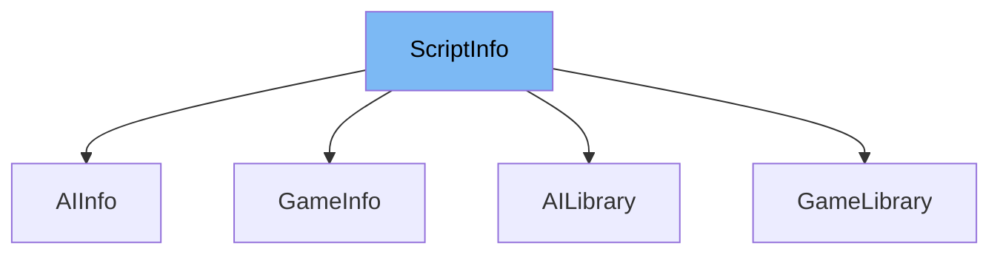

This document will cover the class <SwmToken path="src/script/script_info.hpp" pos="32:1:1" line-data="	ScriptInfo() :">`ScriptInfo`</SwmToken> in detail. We will discuss:

1. What <SwmToken path="src/script/script_info.hpp" pos="32:1:1" line-data="	ScriptInfo() :">`ScriptInfo`</SwmToken> is.
2. The variables and functions defined in <SwmToken path="src/script/script_info.hpp" pos="32:1:1" line-data="	ScriptInfo() :">`ScriptInfo`</SwmToken>.
3. An example of how to use <SwmToken path="src/script/script_info.hpp" pos="32:1:1" line-data="	ScriptInfo() :">`ScriptInfo`</SwmToken> in <SwmToken path="src/ai/ai_info.hpp" pos="8:9:9" line-data="/** @file ai_info.hpp AIInfo keeps track of all information of an AI, like Author, Description, ... */">`AIInfo`</SwmToken>.



# What is <SwmToken path="src/script/script_info.hpp" pos="32:1:1" line-data="	ScriptInfo() :">`ScriptInfo`</SwmToken>

The <SwmToken path="src/script/script_info.hpp" pos="32:1:1" line-data="	ScriptInfo() :">`ScriptInfo`</SwmToken> class in <SwmPath>[src/script/script_info.hpp](src/script/script_info.hpp)</SwmPath> is used to keep track of all static information related to a script, such as its name, version, author, description, and other metadata. It provides various methods to retrieve this information and manage script settings.

<SwmSnippet path="/src/script/script_info.hpp" line="32">

---

# Variables and functions

The constructor <SwmToken path="src/script/script_info.hpp" pos="32:1:3" line-data="	ScriptInfo() :">`ScriptInfo()`</SwmToken> initializes the <SwmToken path="src/script/script_info.hpp" pos="33:1:1" line-data="		engine(nullptr),">`engine`</SwmToken>, <SwmToken path="src/script/script_info.hpp" pos="34:1:1" line-data="		version(0),">`version`</SwmToken>, and <SwmToken path="src/script/script_info.hpp" pos="35:1:1" line-data="		scanner(nullptr)">`scanner`</SwmToken> members to <SwmToken path="src/script/script_info.hpp" pos="33:3:3" line-data="		engine(nullptr),">`nullptr`</SwmToken> and <SwmToken path="src/script/script_info.hpp" pos="34:3:3" line-data="		version(0),">`0`</SwmToken> respectively.

```c++
	ScriptInfo() :
		engine(nullptr),
		version(0),
		scanner(nullptr)
	{}
```

---

</SwmSnippet>

<SwmSnippet path="/src/script/script_info.hpp" line="41">

---

The function <SwmToken path="src/script/script_info.hpp" pos="41:8:8" line-data="	const std::string &amp;GetAuthor() const { return this-&gt;author; }">`GetAuthor`</SwmToken> returns the author of the script.

```c++
	const std::string &GetAuthor() const { return this->author; }
```

---

</SwmSnippet>

<SwmSnippet path="/src/script/script_info.hpp" line="46">

---

The function <SwmToken path="src/script/script_info.hpp" pos="46:8:8" line-data="	const std::string &amp;GetName() const { return this-&gt;name; }">`GetName`</SwmToken> returns the name of the script.

```c++
	const std::string &GetName() const { return this->name; }
```

---

</SwmSnippet>

<SwmSnippet path="/src/script/script_info.hpp" line="51">

---

The function <SwmToken path="src/script/script_info.hpp" pos="51:8:8" line-data="	const std::string &amp;GetShortName() const { return this-&gt;short_name; }">`GetShortName`</SwmToken> returns the 4-character long short name of the script.

```c++
	const std::string &GetShortName() const { return this->short_name; }
```

---

</SwmSnippet>

<SwmSnippet path="/src/script/script_info.hpp" line="56">

---

The function <SwmToken path="src/script/script_info.hpp" pos="56:8:8" line-data="	const std::string &amp;GetDescription() const { return this-&gt;description; }">`GetDescription`</SwmToken> returns the description of the script.

```c++
	const std::string &GetDescription() const { return this->description; }
```

---

</SwmSnippet>

<SwmSnippet path="/src/script/script_info.hpp" line="61">

---

The function <SwmToken path="src/script/script_info.hpp" pos="61:3:3" line-data="	int GetVersion() const { return this-&gt;version; }">`GetVersion`</SwmToken> returns the version of the script.

```c++
	int GetVersion() const { return this->version; }
```

---

</SwmSnippet>

<SwmSnippet path="/src/script/script_info.hpp" line="66">

---

The function <SwmToken path="src/script/script_info.hpp" pos="66:8:8" line-data="	const std::string &amp;GetDate() const { return this-&gt;date; }">`GetDate`</SwmToken> returns the <SwmToken path="src/script/script_info.hpp" pos="64:7:9" line-data="	 * Get the last-modified date of the script.">`last-modified`</SwmToken> date of the script.

```c++
	const std::string &GetDate() const { return this->date; }
```

---

</SwmSnippet>

<SwmSnippet path="/src/script/script_info.hpp" line="71">

---

The function <SwmToken path="src/script/script_info.hpp" pos="71:8:8" line-data="	const std::string &amp;GetInstanceName() const { return this-&gt;instance_name; }">`GetInstanceName`</SwmToken> returns the name of the instance of the script to create.

```c++
	const std::string &GetInstanceName() const { return this->instance_name; }
```

---

</SwmSnippet>

<SwmSnippet path="/src/script/script_info.hpp" line="76">

---

The function <SwmToken path="src/script/script_info.hpp" pos="76:8:8" line-data="	const std::string &amp;GetURL() const { return this-&gt;url; }">`GetURL`</SwmToken> returns the website URL for the script.

```c++
	const std::string &GetURL() const { return this->url; }
```

---

</SwmSnippet>

<SwmSnippet path="/src/script/script_info.hpp" line="81">

---

The function <SwmToken path="src/script/script_info.hpp" pos="81:8:8" line-data="	const std::string &amp;GetMainScript() const { return this-&gt;main_script; }">`GetMainScript`</SwmToken> returns the filename of the main script (<SwmPath>[regression/regression/main.nut](regression/regression/main.nut)</SwmPath>).

```c++
	const std::string &GetMainScript() const { return this->main_script; }
```

---

</SwmSnippet>

<SwmSnippet path="/src/script/script_info.hpp" line="86">

---

The function <SwmToken path="src/script/script_info.hpp" pos="86:8:8" line-data="	const std::string &amp;GetTarFile() const { return this-&gt;tar_file; }">`GetTarFile`</SwmToken> returns the filename of the tar file the script is in.

```c++
	const std::string &GetTarFile() const { return this->tar_file; }
```

---

</SwmSnippet>

<SwmSnippet path="/src/script/script_info.hpp" line="91">

---

The function <SwmToken path="src/script/script_info.hpp" pos="91:3:3" line-data="	bool CheckMethod(const char *name) const;">`CheckMethod`</SwmToken> checks if a given method exists in the script.

```c++
	bool CheckMethod(const char *name) const;
```

---

</SwmSnippet>

<SwmSnippet path="/src/script/script_info.hpp" line="96">

---

The static function <SwmToken path="src/script/script_info.hpp" pos="96:5:5" line-data="	static SQInteger Constructor(HSQUIRRELVM vm, ScriptInfo *info);">`Constructor`</SwmToken> processes the creation of a <SwmToken path="src/script/script_info.hpp" pos="94:13:13" line-data="	 * Process the creation of a FileInfo object.">`FileInfo`</SwmToken> object.

```c++
	static SQInteger Constructor(HSQUIRRELVM vm, ScriptInfo *info);
```

---

</SwmSnippet>

<SwmSnippet path="/src/script/script_info.hpp" line="101">

---

The function <SwmToken path="src/script/script_info.hpp" pos="101:8:8" line-data="	virtual class ScriptScanner *GetScanner() { return this-&gt;scanner; }">`GetScanner`</SwmToken> returns the <SwmToken path="src/script/script_info.hpp" pos="101:5:5" line-data="	virtual class ScriptScanner *GetScanner() { return this-&gt;scanner; }">`ScriptScanner`</SwmToken> which found this <SwmToken path="src/script/script_info.hpp" pos="32:1:1" line-data="	ScriptInfo() :">`ScriptInfo`</SwmToken>.

```c++
	virtual class ScriptScanner *GetScanner() { return this->scanner; }
```

---

</SwmSnippet>

<SwmSnippet path="/src/script/script_info.hpp" line="106">

---

The function <SwmToken path="src/script/script_info.hpp" pos="106:3:3" line-data="	bool GetSettings();">`GetSettings`</SwmToken> retrieves the settings of the script.

```c++
	bool GetSettings();
```

---

</SwmSnippet>

<SwmSnippet path="/src/script/script_info.hpp" line="111">

---

The function <SwmToken path="src/script/script_info.hpp" pos="111:6:6" line-data="	const ScriptConfigItemList *GetConfigList() const;">`GetConfigList`</SwmToken> returns the configuration list for the script.

```c++
	const ScriptConfigItemList *GetConfigList() const;
```

---

</SwmSnippet>

<SwmSnippet path="/src/script/script_info.hpp" line="116">

---

The function <SwmToken path="src/script/script_info.hpp" pos="116:6:6" line-data="	const ScriptConfigItem *GetConfigItem(const std::string_view name) const;">`GetConfigItem`</SwmToken> returns the description of a specific script configuration option.

```c++
	const ScriptConfigItem *GetConfigItem(const std::string_view name) const;
```

---

</SwmSnippet>

<SwmSnippet path="/src/script/script_info.hpp" line="121">

---

The function <SwmToken path="src/script/script_info.hpp" pos="121:3:3" line-data="	SQInteger AddSetting(HSQUIRRELVM vm);">`AddSetting`</SwmToken> sets a setting for the script.

```c++
	SQInteger AddSetting(HSQUIRRELVM vm);
```

---

</SwmSnippet>

<SwmSnippet path="/src/script/script_info.hpp" line="126">

---

The function <SwmToken path="src/script/script_info.hpp" pos="126:3:3" line-data="	SQInteger AddLabels(HSQUIRRELVM vm);">`AddLabels`</SwmToken> adds labels for a setting.

```c++
	SQInteger AddLabels(HSQUIRRELVM vm);
```

---

</SwmSnippet>

<SwmSnippet path="/src/script/script_info.hpp" line="131">

---

The function <SwmToken path="src/script/script_info.hpp" pos="131:3:3" line-data="	int GetSettingDefaultValue(const std::string &amp;name) const;">`GetSettingDefaultValue`</SwmToken> returns the default value for a setting.

```c++
	int GetSettingDefaultValue(const std::string &name) const;
```

---

</SwmSnippet>

<SwmSnippet path="/src/script/script_info.hpp" line="136">

---

The function <SwmToken path="src/script/script_info.hpp" pos="136:5:5" line-data="	virtual bool IsDeveloperOnly() const { return false; }">`IsDeveloperOnly`</SwmToken> checks if the script can be selected by developers only.

```c++
	virtual bool IsDeveloperOnly() const { return false; }
```

---

</SwmSnippet>

# Usage example

Here is an example of how to use <SwmToken path="src/script/script_info.hpp" pos="32:1:1" line-data="	ScriptInfo() :">`ScriptInfo`</SwmToken> in <SwmToken path="src/ai/ai_info.hpp" pos="8:9:9" line-data="/** @file ai_info.hpp AIInfo keeps track of all information of an AI, like Author, Description, ... */">`AIInfo`</SwmToken>.

<SwmSnippet path="/src/ai/ai_info.hpp" line="30">

---

The <SwmToken path="src/ai/ai_info.hpp" pos="8:9:9" line-data="/** @file ai_info.hpp AIInfo keeps track of all information of an AI, like Author, Description, ... */">`AIInfo`</SwmToken> class extends <SwmToken path="src/script/script_info.hpp" pos="32:1:1" line-data="	ScriptInfo() :">`ScriptInfo`</SwmToken> and sets various properties such as the name and version of the AI script. It also provides additional methods specific to AI scripts.

```c++
	/**
	 * Create a dummy-AI.
	 */
	static SQInteger DummyConstructor(HSQUIRRELVM vm);

	/**
```

---

</SwmSnippet>

&nbsp;

*This is an auto-generated document by Swimm AI 🌊 and has not yet been verified by a human*

<SwmMeta version="3.0.0" repo-id="Z2l0aHViJTNBJTNBT3BlblRURC1jb3BpbG90LWRlbW8lM0ElM0Fzd2ltbWlv" repo-name="OpenTTD-copilot-demo"><sup>Powered by [Swimm](/)</sup></SwmMeta>
