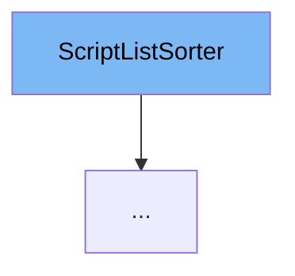

This document will cover the class <SwmToken path="src/script/api/script_list.cpp" pos="30:4:4" line-data="	virtual ~ScriptListSorter() = default;">`ScriptListSorter`</SwmToken> in the file <SwmPath>[src/script/api/script_list.cpp](src/script/api/script_list.cpp)</SwmPath>. We will cover:

1. What <SwmToken path="src/script/api/script_list.cpp" pos="30:4:4" line-data="	virtual ~ScriptListSorter() = default;">`ScriptListSorter`</SwmToken> is and what it is used for.
2. The variables and functions defined in <SwmToken path="src/script/api/script_list.cpp" pos="30:4:4" line-data="	virtual ~ScriptListSorter() = default;">`ScriptListSorter`</SwmToken>.
3. An example of how to use <SwmToken path="src/script/api/script_list.cpp" pos="30:4:4" line-data="	virtual ~ScriptListSorter() = default;">`ScriptListSorter`</SwmToken> in <SwmToken path="src/script/api/script_list.cpp" pos="175:1:1" line-data="	ScriptListSorterValueDescending(ScriptList *list)">`ScriptListSorterValueDescending`</SwmToken>.



# What is <SwmToken path="src/script/api/script_list.cpp" pos="30:4:4" line-data="	virtual ~ScriptListSorter() = default;">`ScriptListSorter`</SwmToken>

<SwmToken path="src/script/api/script_list.cpp" pos="30:4:4" line-data="	virtual ~ScriptListSorter() = default;">`ScriptListSorter`</SwmToken> is a base class for any sorter used in the <SwmToken path="src/script/api/script_list.cpp" pos="22:1:1" line-data="	ScriptList *list;       ///&lt; The list that&#39;s being sorted.">`ScriptList`</SwmToken> class. It provides a common interface and shared functionality for sorting items in a <SwmToken path="src/script/api/script_list.cpp" pos="22:1:1" line-data="	ScriptList *list;       ///&lt; The list that&#39;s being sorted.">`ScriptList`</SwmToken>. The class is designed to be extended by specific sorting implementations, such as sorting by value or item, in ascending or descending order.

<SwmSnippet path="/src/script/api/script_list.cpp" line="22">

---

# Variables and functions

The variable `list` is a pointer to the <SwmToken path="src/script/api/script_list.cpp" pos="22:1:1" line-data="	ScriptList *list;       ///&lt; The list that&#39;s being sorted.">`ScriptList`</SwmToken> that is being sorted.

```c++
	ScriptList *list;       ///< The list that's being sorted.
```

---

</SwmSnippet>

<SwmSnippet path="/src/script/api/script_list.cpp" line="23">

---

The variable <SwmToken path="src/script/api/script_list.cpp" pos="23:3:3" line-data="	bool has_no_more_items; ///&lt; Whether we have more items to iterate over.">`has_no_more_items`</SwmToken> is a boolean that indicates whether there are more items to iterate over.

```c++
	bool has_no_more_items; ///< Whether we have more items to iterate over.
```

---

</SwmSnippet>

<SwmSnippet path="/src/script/api/script_list.cpp" line="24">

---

The variable <SwmToken path="src/script/api/script_list.cpp" pos="24:3:3" line-data="	SQInteger item_next;    ///&lt; The next item we will show.">`item_next`</SwmToken> is an integer that represents the next item to be shown.

```c++
	SQInteger item_next;    ///< The next item we will show.
```

---

</SwmSnippet>

<SwmSnippet path="/src/script/api/script_list.cpp" line="30">

---

The destructor <SwmToken path="src/script/api/script_list.cpp" pos="30:3:4" line-data="	virtual ~ScriptListSorter() = default;">`~ScriptListSorter`</SwmToken> is virtual and defined as default to mute warnings.

```c++
	virtual ~ScriptListSorter() = default;
```

---

</SwmSnippet>

<SwmSnippet path="/src/script/api/script_list.cpp" line="35">

---

The function <SwmToken path="src/script/api/script_list.cpp" pos="35:5:5" line-data="	virtual SQInteger Begin() = 0;">`Begin`</SwmToken> is a pure virtual function that gets the first item of the sorter.

```c++
	virtual SQInteger Begin() = 0;
```

---

</SwmSnippet>

<SwmSnippet path="/src/script/api/script_list.cpp" line="40">

---

The function <SwmToken path="src/script/api/script_list.cpp" pos="40:5:5" line-data="	virtual void End() = 0;">`End`</SwmToken> is a pure virtual function that stops iterating a sorter.

```c++
	virtual void End() = 0;
```

---

</SwmSnippet>

<SwmSnippet path="/src/script/api/script_list.cpp" line="45">

---

The function <SwmToken path="src/script/api/script_list.cpp" pos="45:5:5" line-data="	virtual SQInteger Next() = 0;">`Next`</SwmToken> is a pure virtual function that gets the next item of the sorter.

```c++
	virtual SQInteger Next() = 0;
```

---

</SwmSnippet>

<SwmSnippet path="/src/script/api/script_list.cpp" line="50">

---

The function <SwmToken path="src/script/api/script_list.cpp" pos="50:3:3" line-data="	bool IsEnd()">`IsEnd`</SwmToken> checks if the sorter has reached the end by verifying if the list's buckets are empty or if there are no more items.

```c++
	bool IsEnd()
	{
		return this->list->buckets.empty() || this->has_no_more_items;
	}
```

---

</SwmSnippet>

<SwmSnippet path="/src/script/api/script_list.cpp" line="58">

---

The function <SwmToken path="src/script/api/script_list.cpp" pos="58:5:5" line-data="	virtual void Remove(SQInteger item) = 0;">`Remove`</SwmToken> is a pure virtual function that acts as a callback when an item gets removed from the list.

```c++
	virtual void Remove(SQInteger item) = 0;
```

---

</SwmSnippet>

<SwmSnippet path="/src/script/api/script_list.cpp" line="66">

---

The function <SwmToken path="src/script/api/script_list.cpp" pos="66:5:5" line-data="	virtual void Retarget(ScriptList *new_list)">`Retarget`</SwmToken> attaches the sorter to a new list, assuming the content of the old list has been moved to the new list.

```c++
	virtual void Retarget(ScriptList *new_list)
	{
		this->list = new_list;
	}
```

---

</SwmSnippet>

# Usage example

Here is an example of how to use <SwmToken path="src/script/api/script_list.cpp" pos="30:4:4" line-data="	virtual ~ScriptListSorter() = default;">`ScriptListSorter`</SwmToken> in <SwmToken path="src/script/api/script_list.cpp" pos="175:1:1" line-data="	ScriptListSorterValueDescending(ScriptList *list)">`ScriptListSorterValueDescending`</SwmToken>.

<SwmSnippet path="/src/script/api/script_list.cpp" line="171">

---

The constructor <SwmToken path="src/script/api/script_list.cpp" pos="175:1:1" line-data="	ScriptListSorterValueDescending(ScriptList *list)">`ScriptListSorterValueDescending`</SwmToken> initializes the sorter with the given list and calls the <SwmToken path="src/script/api/script_list.cpp" pos="178:3:3" line-data="		this-&gt;End();">`End`</SwmToken> function to set initial values.

```c++
	/**
	 * Create a new sorter.
	 * @param list The list to sort.
	 */
	ScriptListSorterValueDescending(ScriptList *list)
	{
		this->list = list;
		this->End();
	}
```

---

</SwmSnippet>

<SwmSnippet path="/src/script/api/script_list.cpp" line="181">

---

The function <SwmToken path="src/script/api/script_list.cpp" pos="181:3:3" line-data="	SQInteger Begin() override">`Begin`</SwmToken> in <SwmToken path="src/script/api/script_list.cpp" pos="175:1:1" line-data="	ScriptListSorterValueDescending(ScriptList *list)">`ScriptListSorterValueDescending`</SwmToken> sets up the iterators to start from the end of the list and finds the first item to be shown.

```c++
	SQInteger Begin() override
	{
		if (this->list->buckets.empty()) return 0;
		this->has_no_more_items = false;

		/* Go to the end of the bucket-list */
		this->bucket_iter = this->list->buckets.end();
		--this->bucket_iter;
		this->bucket_list = &(*this->bucket_iter).second;

		/* Go to the end of the items in the bucket */
		this->bucket_list_iter = this->bucket_list->end();
		--this->bucket_list_iter;
		this->item_next = *this->bucket_list_iter;

		SQInteger item_current = this->item_next;
		FindNext();
		return item_current;
	}
```

---

</SwmSnippet>

<SwmSnippet path="/src/script/api/script_list.cpp" line="201">

---

The function <SwmToken path="src/script/api/script_list.cpp" pos="201:3:3" line-data="	void End() override">`End`</SwmToken> in <SwmToken path="src/script/api/script_list.cpp" pos="175:1:1" line-data="	ScriptListSorterValueDescending(ScriptList *list)">`ScriptListSorterValueDescending`</SwmToken> sets the bucket list to <SwmToken path="src/script/api/script_list.cpp" pos="203:7:7" line-data="		this-&gt;bucket_list = nullptr;">`nullptr`</SwmToken>, marks that there are no more items, and resets the next item to 0.

```c++
	void End() override
	{
		this->bucket_list = nullptr;
		this->has_no_more_items = true;
		this->item_next = 0;
	}
```

---

</SwmSnippet>

<SwmSnippet path="/src/script/api/script_list.cpp" line="208">

---

The function <SwmToken path="src/script/api/script_list.cpp" pos="211:3:3" line-data="	void FindNext()">`FindNext`</SwmToken> in <SwmToken path="src/script/api/script_list.cpp" pos="175:1:1" line-data="	ScriptListSorterValueDescending(ScriptList *list)">`ScriptListSorterValueDescending`</SwmToken> finds the next item in the list and updates the iterators accordingly.

```c++
	/**
	 * Find the next item, and store that information.
	 */
	void FindNext()
	{
		if (this->bucket_list == nullptr) {
			this->has_no_more_items = true;
			return;
		}

		if (this->bucket_list_iter == this->bucket_list->begin()) {
			if (this->bucket_iter == this->list->buckets.begin()) {
				this->bucket_list = nullptr;
				return;
			}
			this->bucket_iter--;
			this->bucket_list = &(*this->bucket_iter).second;
			/* Go to the end of the items in the bucket */
			this->bucket_list_iter = this->bucket_list->end();
			--this->bucket_list_iter;
		} else {
```

---

</SwmSnippet>

<SwmSnippet path="/src/script/api/script_list.cpp" line="234">

---

The function <SwmToken path="src/script/api/script_list.cpp" pos="234:3:3" line-data="	SQInteger Next() override">`Next`</SwmToken> in <SwmToken path="src/script/api/script_list.cpp" pos="175:1:1" line-data="	ScriptListSorterValueDescending(ScriptList *list)">`ScriptListSorterValueDescending`</SwmToken> returns the current item and finds the next item to be shown.

```c++
	SQInteger Next() override
	{
		if (this->IsEnd()) return 0;

		SQInteger item_current = this->item_next;
		FindNext();
		return item_current;
	}
```

---

</SwmSnippet>

<SwmSnippet path="/src/script/api/script_list.cpp" line="243">

---

The function <SwmToken path="src/script/api/script_list.cpp" pos="243:3:3" line-data="	void Remove(SQInteger item) override">`Remove`</SwmToken> in <SwmToken path="src/script/api/script_list.cpp" pos="175:1:1" line-data="	ScriptListSorterValueDescending(ScriptList *list)">`ScriptListSorterValueDescending`</SwmToken> skips to the next item if the item to be removed is the next item to be shown.

```c++
	void Remove(SQInteger item) override
	{
		if (this->IsEnd()) return;

		/* If we remove the 'next' item, skip to the next */
		if (item == this->item_next) {
			FindNext();
			return;
		}
	}
```

---

</SwmSnippet>

&nbsp;

*This is an auto-generated document by Swimm AI 🌊 and has not yet been verified by a human*

<SwmMeta version="3.0.0" repo-id="Z2l0aHViJTNBJTNBT3BlblRURC1jb3BpbG90LWRlbW8lM0ElM0Fzd2ltbWlv" repo-name="OpenTTD-copilot-demo"><sup>Powered by [Swimm](/)</sup></SwmMeta>
