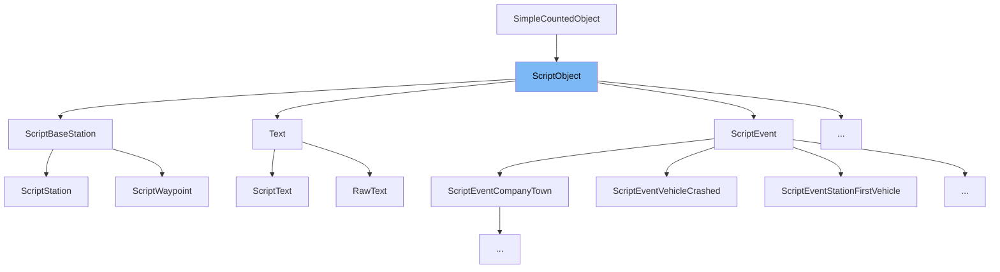

This document will cover the class <SwmToken path="src/script/api/script_object.hpp" pos="88:31:31" line-data="	 * @param owner The owner/script to get the randomizer for. This defaults to ScriptObject::GetRootCompany()">`ScriptObject`</SwmToken> in detail. We will cover:

1. What <SwmToken path="src/script/api/script_object.hpp" pos="88:31:31" line-data="	 * @param owner The owner/script to get the randomizer for. This defaults to ScriptObject::GetRootCompany()">`ScriptObject`</SwmToken> is.
2. Variables and functions in <SwmToken path="src/script/api/script_object.hpp" pos="88:31:31" line-data="	 * @param owner The owner/script to get the randomizer for. This defaults to ScriptObject::GetRootCompany()">`ScriptObject`</SwmToken>.
3. Usage example of <SwmToken path="src/script/api/script_object.hpp" pos="88:31:31" line-data="	 * @param owner The owner/script to get the randomizer for. This defaults to ScriptObject::GetRootCompany()">`ScriptObject`</SwmToken> in `ScriptAccounting`.



# What is <SwmToken path="src/script/api/script_object.hpp" pos="88:31:31" line-data="	 * @param owner The owner/script to get the randomizer for. This defaults to ScriptObject::GetRootCompany()">`ScriptObject`</SwmToken>

<SwmToken path="src/script/api/script_object.hpp" pos="88:31:31" line-data="	 * @param owner The owner/script to get the randomizer for. This defaults to ScriptObject::GetRootCompany()">`ScriptObject`</SwmToken> is the upper-parent object of all API classes in the <SwmToken path="src/script/api/script_object.hpp" pos="2:13:13" line-data=" * This file is part of OpenTTD.">`OpenTTD`</SwmToken> project. It is not intended to be used directly in scripts as it does not publish any public functions. Instead, it serves as a common base for handling internal command processing and <SwmToken path="src/script/api/script_object.hpp" pos="41:10:12" line-data=" *   command processing, and command-validation checks.">`command-validation`</SwmToken> checks.

<SwmSnippet path="/src/script/api/script_object.hpp" line="68">

---

# Variables and functions

The function <SwmToken path="src/script/api/script_object.hpp" pos="72:5:5" line-data="	static void SetLastCommandRes(bool res);">`SetLastCommandRes`</SwmToken> stores the latest result of a <SwmToken path="src/script/api/script_object.hpp" pos="69:15:15" line-data="	 * Store the latest result of a DoCommand per company.">`DoCommand`</SwmToken> per company.

```c++
	/**
	 * Store the latest result of a DoCommand per company.
	 * @param res The result of the last command.
	 */
	static void SetLastCommandRes(bool res);
```

---

</SwmSnippet>

<SwmSnippet path="/src/script/api/script_object.hpp" line="74">

---

The function <SwmToken path="src/script/api/script_object.hpp" pos="78:5:5" line-data="	static void SetLastCommandResData(CommandDataBuffer data);">`SetLastCommandResData`</SwmToken> stores the extra data returned by the last <SwmToken path="src/script/api/script_object.hpp" pos="75:19:19" line-data="	 * Store the extra data return by the last DoCommand.">`DoCommand`</SwmToken>.

```c++
	/**
	 * Store the extra data return by the last DoCommand.
	 * @param data Extra data return by the command.
	 */
	static void SetLastCommandResData(CommandDataBuffer data);
```

---

</SwmSnippet>

<SwmSnippet path="/src/script/api/script_object.hpp" line="80">

---

The function <SwmToken path="src/script/api/script_object.hpp" pos="84:8:8" line-data="	static class ScriptInstance *GetActiveInstance();">`GetActiveInstance`</SwmToken> returns the currently active instance of <SwmToken path="src/script/api/script_object.hpp" pos="88:31:31" line-data="	 * @param owner The owner/script to get the randomizer for. This defaults to ScriptObject::GetRootCompany()">`ScriptObject`</SwmToken>.

```c++
	/**
	 * Get the currently active instance.
	 * @return The instance.
	 */
	static class ScriptInstance *GetActiveInstance();
```

---

</SwmSnippet>

<SwmSnippet path="/src/script/api/script_object.hpp" line="86">

---

The function <SwmToken path="src/script/api/script_object.hpp" pos="90:6:6" line-data="	static Randomizer &amp;GetRandomizer(Owner owner = ScriptObject::GetRootCompany());">`GetRandomizer`</SwmToken> returns a reference to the randomizer that provides random values for the script.

```c++
	/**
	 * Get a reference of the randomizer that brings this script random values.
	 * @param owner The owner/script to get the randomizer for. This defaults to ScriptObject::GetRootCompany()
	 */
	static Randomizer &GetRandomizer(Owner owner = ScriptObject::GetRootCompany());
```

---

</SwmSnippet>

<SwmSnippet path="/src/script/api/script_object.hpp" line="92">

---

The function <SwmToken path="src/script/api/script_object.hpp" pos="96:5:5" line-data="	static void InitializeRandomizers();">`InitializeRandomizers`</SwmToken> initializes or resets the script random states based on the current random seed.

```c++
	/**
	 * Initialize/reset the script random states. The state of the scripts are
	 * based on the current _random seed, but _random does not get changed.
	 */
	static void InitializeRandomizers();
```

---

</SwmSnippet>

<SwmSnippet path="/src/script/api/script_object.hpp" line="127">

---

The function <SwmToken path="src/script/api/script_object.hpp" pos="130:5:5" line-data="	static void SetLastCommand(const CommandDataBuffer &amp;data, Commands cmd);">`SetLastCommand`</SwmToken> stores the latest command executed by the script.

```c++
	/**
	 * Store the latest command executed by the script.
	 */
	static void SetLastCommand(const CommandDataBuffer &data, Commands cmd);
```

---

</SwmSnippet>

<SwmSnippet path="/src/script/api/script_object.hpp" line="132">

---

The function <SwmToken path="src/script/api/script_object.hpp" pos="135:5:5" line-data="	static bool CheckLastCommand(const CommandDataBuffer &amp;data, Commands cmd);">`CheckLastCommand`</SwmToken> checks if the given command data matches the latest command executed by the script.

```c++
	/**
	 * Check if it's the latest command executed by the script.
	 */
	static bool CheckLastCommand(const CommandDataBuffer &data, Commands cmd);
```

---

</SwmSnippet>

<SwmSnippet path="/src/script/api/script_object.hpp" line="137">

---

The function <SwmToken path="src/script/api/script_object.hpp" pos="140:5:5" line-data="	static void SetDoCommandCosts(Money value);">`SetDoCommandCosts`</SwmToken> sets the <SwmToken path="src/script/api/script_object.hpp" pos="138:7:7" line-data="	 * Sets the DoCommand costs counter to a value.">`DoCommand`</SwmToken> costs counter to a specified value.

```c++
	/**
	 * Sets the DoCommand costs counter to a value.
	 */
	static void SetDoCommandCosts(Money value);
```

---

</SwmSnippet>

<SwmSnippet path="/src/script/api/script_object.hpp" line="142">

---

The function <SwmToken path="src/script/api/script_object.hpp" pos="145:5:5" line-data="	static void IncreaseDoCommandCosts(Money value);">`IncreaseDoCommandCosts`</SwmToken> increases the current value of the <SwmToken path="src/script/api/script_object.hpp" pos="143:15:15" line-data="	 * Increase the current value of the DoCommand costs counter.">`DoCommand`</SwmToken> costs counter.

```c++
	/**
	 * Increase the current value of the DoCommand costs counter.
	 */
	static void IncreaseDoCommandCosts(Money value);
```

---

</SwmSnippet>

<SwmSnippet path="/src/script/api/script_object.hpp" line="147">

---

The function <SwmToken path="src/script/api/script_object.hpp" pos="150:5:5" line-data="	static Money GetDoCommandCosts();">`GetDoCommandCosts`</SwmToken> returns the current value of the <SwmToken path="src/script/api/script_object.hpp" pos="148:9:9" line-data="	 * Get the current DoCommand costs counter.">`DoCommand`</SwmToken> costs counter.

```c++
	/**
	 * Get the current DoCommand costs counter.
	 */
	static Money GetDoCommandCosts();
```

---

</SwmSnippet>

<SwmSnippet path="/src/script/api/script_object.hpp" line="152">

---

The function <SwmToken path="src/script/api/script_object.hpp" pos="155:5:5" line-data="	static void SetLastError(ScriptErrorType last_error);">`SetLastError`</SwmToken> sets the last error encountered during a <SwmToken path="src/script/api/script_object.hpp" pos="153:7:7" line-data="	 * Set the DoCommand last error.">`DoCommand`</SwmToken>.

```c++
	/**
	 * Set the DoCommand last error.
	 */
	static void SetLastError(ScriptErrorType last_error);
```

---

</SwmSnippet>

<SwmSnippet path="/src/script/api/script_object.hpp" line="157">

---

The function <SwmToken path="src/script/api/script_object.hpp" pos="160:5:5" line-data="	static ScriptErrorType GetLastError();">`GetLastError`</SwmToken> returns the last error encountered during a <SwmToken path="src/script/api/script_object.hpp" pos="158:7:7" line-data="	 * Get the DoCommand last error.">`DoCommand`</SwmToken>.

```c++
	/**
	 * Get the DoCommand last error.
	 */
	static ScriptErrorType GetLastError();
```

---

</SwmSnippet>

<SwmSnippet path="/src/script/api/script_object.hpp" line="162">

---

The function <SwmToken path="src/script/api/script_object.hpp" pos="165:5:5" line-data="	static void SetRoadType(RoadType road_type);">`SetRoadType`</SwmToken> sets the road type for the script.

```c++
	/**
	 * Set the road type.
	 */
	static void SetRoadType(RoadType road_type);
```

---

</SwmSnippet>

<SwmSnippet path="/src/script/api/script_object.hpp" line="167">

---

The function <SwmToken path="src/script/api/script_object.hpp" pos="170:5:5" line-data="	static RoadType GetRoadType();">`GetRoadType`</SwmToken> returns the current road type set for the script.

```c++
	/**
	 * Get the road type.
	 */
	static RoadType GetRoadType();
```

---

</SwmSnippet>

<SwmSnippet path="/src/script/api/script_object.hpp" line="172">

---

The function <SwmToken path="src/script/api/script_object.hpp" pos="175:5:5" line-data="	static void SetRailType(RailType rail_type);">`SetRailType`</SwmToken> sets the rail type for the script.

```c++
	/**
	 * Set the rail type.
	 */
	static void SetRailType(RailType rail_type);
```

---

</SwmSnippet>

<SwmSnippet path="/src/script/api/script_object.hpp" line="177">

---

The function <SwmToken path="src/script/api/script_object.hpp" pos="180:5:5" line-data="	static RailType GetRailType();">`GetRailType`</SwmToken> returns the current rail type set for the script.

```c++
	/**
	 * Get the rail type.
	 */
	static RailType GetRailType();
```

---

</SwmSnippet>

<SwmSnippet path="/src/script/api/script_object.hpp" line="182">

---

The function <SwmToken path="src/script/api/script_object.hpp" pos="185:5:5" line-data="	static void SetDoCommandMode(ScriptModeProc *proc, ScriptObject *instance);">`SetDoCommandMode`</SwmToken> sets the current mode of the script to the specified procedure.

```c++
	/**
	 * Set the current mode of your script to this proc.
	 */
	static void SetDoCommandMode(ScriptModeProc *proc, ScriptObject *instance);
```

---

</SwmSnippet>

<SwmSnippet path="/src/script/api/script_object.hpp" line="187">

---

The function <SwmToken path="src/script/api/script_object.hpp" pos="190:6:6" line-data="	static ScriptModeProc *GetDoCommandMode();">`GetDoCommandMode`</SwmToken> returns the current mode the script is under.

```c++
	/**
	 * Get the current mode your script is currently under.
	 */
	static ScriptModeProc *GetDoCommandMode();
```

---

</SwmSnippet>

<SwmSnippet path="/src/script/api/script_object.hpp" line="192">

---

The function <SwmToken path="src/script/api/script_object.hpp" pos="195:6:6" line-data="	static ScriptObject *GetDoCommandModeInstance();">`GetDoCommandModeInstance`</SwmToken> returns the instance of the current mode the script is under.

```c++
	/**
	 * Get the instance of the current mode your script is currently under.
	 */
	static ScriptObject *GetDoCommandModeInstance();
```

---

</SwmSnippet>

<SwmSnippet path="/src/script/api/script_object.hpp" line="197">

---

The function <SwmToken path="src/script/api/script_object.hpp" pos="200:5:5" line-data="	static void SetDoCommandAsyncMode(ScriptAsyncModeProc *proc, ScriptObject *instance);">`SetDoCommandAsyncMode`</SwmToken> sets the current asynchronous mode of the script to the specified procedure.

```c++
	/**
	 * Set the current async mode of your script to this proc.
	 */
	static void SetDoCommandAsyncMode(ScriptAsyncModeProc *proc, ScriptObject *instance);
```

---

</SwmSnippet>

<SwmSnippet path="/src/script/api/script_object.hpp" line="202">

---

The function <SwmToken path="src/script/api/script_object.hpp" pos="205:6:6" line-data="	static ScriptModeProc *GetDoCommandAsyncMode();">`GetDoCommandAsyncMode`</SwmToken> returns the current asynchronous mode the script is under.

```c++
	/**
	 * Get the current async mode your script is currently under.
	 */
	static ScriptModeProc *GetDoCommandAsyncMode();
```

---

</SwmSnippet>

<SwmSnippet path="/src/script/api/script_object.hpp" line="207">

---

The function <SwmToken path="src/script/api/script_object.hpp" pos="210:6:6" line-data="	static ScriptObject *GetDoCommandAsyncModeInstance();">`GetDoCommandAsyncModeInstance`</SwmToken> returns the instance of the current asynchronous mode the script is under.

```c++
	/**
	 * Get the instance of the current async mode your script is currently under.
	 */
	static ScriptObject *GetDoCommandAsyncModeInstance();
```

---

</SwmSnippet>

<SwmSnippet path="/src/script/api/script_object.hpp" line="212">

---

The function <SwmToken path="src/script/api/script_object.hpp" pos="215:5:5" line-data="	static void SetDoCommandDelay(uint ticks);">`SetDoCommandDelay`</SwmToken> sets the delay for the <SwmToken path="src/script/api/script_object.hpp" pos="213:13:13" line-data="	 * Set the delay of the DoCommand.">`DoCommand`</SwmToken>.

```c++
	/**
	 * Set the delay of the DoCommand.
	 */
	static void SetDoCommandDelay(uint ticks);
```

---

</SwmSnippet>

<SwmSnippet path="/src/script/api/script_object.hpp" line="217">

---

The function <SwmToken path="src/script/api/script_object.hpp" pos="220:5:5" line-data="	static uint GetDoCommandDelay();">`GetDoCommandDelay`</SwmToken> returns the delay set for the <SwmToken path="src/script/api/script_object.hpp" pos="218:13:13" line-data="	 * Get the delay of the DoCommand.">`DoCommand`</SwmToken>.

```c++
	/**
	 * Get the delay of the DoCommand.
	 */
	static uint GetDoCommandDelay();
```

---

</SwmSnippet>

<SwmSnippet path="/src/script/api/script_object.hpp" line="222">

---

The function <SwmToken path="src/script/api/script_object.hpp" pos="225:5:5" line-data="	static bool GetLastCommandRes();">`GetLastCommandRes`</SwmToken> returns the latest result of a <SwmToken path="src/script/api/script_object.hpp" pos="223:15:15" line-data="	 * Get the latest result of a DoCommand.">`DoCommand`</SwmToken>.

```c++
	/**
	 * Get the latest result of a DoCommand.
	 */
	static bool GetLastCommandRes();
```

---

</SwmSnippet>

<SwmSnippet path="/src/script/api/script_object.hpp" line="227">

---

The function <SwmToken path="src/script/api/script_object.hpp" pos="230:8:8" line-data="	static const CommandDataBuffer &amp;GetLastCommandResData();">`GetLastCommandResData`</SwmToken> returns the extra data from the last <SwmToken path="src/script/api/script_object.hpp" pos="228:19:19" line-data="	 * Get the extra return data from the last DoCommand.">`DoCommand`</SwmToken>.

```c++
	/**
	 * Get the extra return data from the last DoCommand.
	 */
	static const CommandDataBuffer &GetLastCommandResData();
```

---

</SwmSnippet>

<SwmSnippet path="/src/script/api/script_object.hpp" line="232">

---

The function <SwmToken path="src/script/api/script_object.hpp" pos="236:5:5" line-data="	static void SetAllowDoCommand(bool allow);">`SetAllowDoCommand`</SwmToken> stores an allow-do-command flag per company.

```c++
	/**
	 * Store a allow_do_command per company.
	 * @param allow The new allow.
	 */
	static void SetAllowDoCommand(bool allow);
```

---

</SwmSnippet>

<SwmSnippet path="/src/script/api/script_object.hpp" line="238">

---

The function <SwmToken path="src/script/api/script_object.hpp" pos="245:5:5" line-data="	static bool GetAllowDoCommand();">`GetAllowDoCommand`</SwmToken> returns the internal value of the allow-do-command flag.

```c++
	/**
	 * Get the internal value of allow_do_command. This can differ
	 * from CanSuspend() if the reason we are not allowed
	 * to execute a DoCommand is in squirrel and not the API.
	 * In that case use this function to restore the previous value.
	 * @return True iff DoCommands are allowed in the current scope.
	 */
	static bool GetAllowDoCommand();
```

---

</SwmSnippet>

<SwmSnippet path="/src/script/api/script_object.hpp" line="247">

---

The function <SwmToken path="src/script/api/script_object.hpp" pos="252:5:5" line-data="	static void SetCompany(CompanyID company);">`SetCompany`</SwmToken> sets the current company for executing commands or requesting information.

```c++
	/**
	 * Set the current company to execute commands for or request
	 *  information about.
	 * @param company The new company.
	 */
	static void SetCompany(CompanyID company);
```

---

</SwmSnippet>

<SwmSnippet path="/src/script/api/script_object.hpp" line="254">

---

The function <SwmToken path="src/script/api/script_object.hpp" pos="259:5:5" line-data="	static CompanyID GetCompany();">`GetCompany`</SwmToken> returns the current company for executing commands or requesting information.

```c++
	/**
	 * Get the current company we are executing commands for or
	 *  requesting information about.
	 * @return The current company.
	 */
	static CompanyID GetCompany();
```

---

</SwmSnippet>

<SwmSnippet path="/src/script/api/script_object.hpp" line="261">

---

The function <SwmToken path="src/script/api/script_object.hpp" pos="266:5:5" line-data="	static CompanyID GetRootCompany();">`GetRootCompany`</SwmToken> returns the root company that the script runs under or for.

```c++
	/**
	 * Get the root company, the company that the script really
	 *  runs under / for.
	 * @return The root company.
	 */
	static CompanyID GetRootCompany();
```

---

</SwmSnippet>

<SwmSnippet path="/src/script/api/script_object.hpp" line="268">

---

The function <SwmToken path="src/script/api/script_object.hpp" pos="271:5:5" line-data="	static void SetLastCost(Money last_cost);">`SetLastCost`</SwmToken> sets the cost of the last command.

```c++
	/**
	 * Set the cost of the last command.
	 */
	static void SetLastCost(Money last_cost);
```

---

</SwmSnippet>

<SwmSnippet path="/src/script/api/script_object.hpp" line="273">

---

The function <SwmToken path="src/script/api/script_object.hpp" pos="276:5:5" line-data="	static Money GetLastCost();">`GetLastCost`</SwmToken> returns the cost of the last command.

```c++
	/**
	 * Get the cost of the last command.
	 */
	static Money GetLastCost();
```

---

</SwmSnippet>

&nbsp;

*This is an auto-generated document by Swimm AI 🌊 and has not yet been verified by a human*

<SwmMeta version="3.0.0" repo-id="Z2l0aHViJTNBJTNBT3BlblRURC1jb3BpbG90LWRlbW8lM0ElM0Fzd2ltbWlv" repo-name="OpenTTD-copilot-demo"><sup>Powered by [Swimm](/)</sup></SwmMeta>
