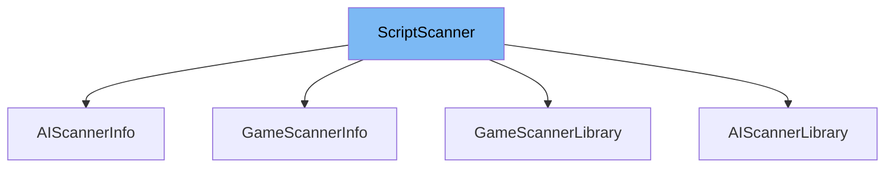

This document will cover the class <SwmToken path="src/script/script_scanner.hpp" pos="21:1:1" line-data="	ScriptScanner();">`ScriptScanner`</SwmToken> in detail. We will discuss:

1. What <SwmToken path="src/script/script_scanner.hpp" pos="21:1:1" line-data="	ScriptScanner();">`ScriptScanner`</SwmToken> is.
2. The variables and functions defined in <SwmToken path="src/script/script_scanner.hpp" pos="21:1:1" line-data="	ScriptScanner();">`ScriptScanner`</SwmToken>.
3. An example of how to use <SwmToken path="src/script/script_scanner.hpp" pos="21:1:1" line-data="	ScriptScanner();">`ScriptScanner`</SwmToken> in <SwmToken path="src/ai/ai_scanner.hpp" pos="15:2:2" line-data="class AIScannerInfo : public ScriptScanner {">`AIScannerInfo`</SwmToken>.



# What is <SwmToken path="src/script/script_scanner.hpp" pos="21:1:1" line-data="	ScriptScanner();">`ScriptScanner`</SwmToken>

The <SwmToken path="src/script/script_scanner.hpp" pos="21:1:1" line-data="	ScriptScanner();">`ScriptScanner`</SwmToken> class is a part of the <SwmToken path="src/script/script_scanner.hpp" pos="2:13:13" line-data=" * This file is part of OpenTTD.">`OpenTTD`</SwmToken> project, specifically located in <SwmPath>[src/script/script_scanner.hpp](src/script/script_scanner.hpp)</SwmPath>. It is used to help find and manage scripts within the game. The class provides functionalities to initialize the scanner, register scripts, and retrieve various script-related information.

<SwmSnippet path="/src/script/script_scanner.hpp" line="21">

---

# Variables and functions

The constructor <SwmToken path="src/script/script_scanner.hpp" pos="21:1:3" line-data="	ScriptScanner();">`ScriptScanner()`</SwmToken> is used to initialize an instance of the <SwmToken path="src/script/script_scanner.hpp" pos="21:1:1" line-data="	ScriptScanner();">`ScriptScanner`</SwmToken> class.

```c++
	ScriptScanner();
```

---

</SwmSnippet>

<SwmSnippet path="/src/script/script_scanner.hpp" line="22">

---

The destructor <SwmToken path="src/script/script_scanner.hpp" pos="22:3:6" line-data="	virtual ~ScriptScanner();">`~ScriptScanner()`</SwmToken> is used to clean up resources when an instance of the <SwmToken path="src/script/script_scanner.hpp" pos="22:4:4" line-data="	virtual ~ScriptScanner();">`ScriptScanner`</SwmToken> class is destroyed.

```c++
	virtual ~ScriptScanner();
```

---

</SwmSnippet>

<SwmSnippet path="/src/script/script_scanner.hpp" line="24">

---

The pure virtual function <SwmToken path="src/script/script_scanner.hpp" pos="24:5:7" line-data="	virtual void Initialize() = 0;">`Initialize()`</SwmToken> is intended to initialize the scanner. It must be implemented by any derived class.

```c++
	virtual void Initialize() = 0;
```

---

</SwmSnippet>

<SwmSnippet path="/src/script/script_scanner.hpp" line="29">

---

The function <SwmToken path="src/script/script_scanner.hpp" pos="29:6:8" line-data="	class Squirrel *GetEngine() { return this-&gt;engine; }">`GetEngine()`</SwmToken> returns the engine of the main squirrel handler, which indexes all available scripts.

```c++
	class Squirrel *GetEngine() { return this->engine; }
```

---

</SwmSnippet>

<SwmSnippet path="/src/script/script_scanner.hpp" line="34">

---

The function <SwmToken path="src/script/script_scanner.hpp" pos="34:5:7" line-data="	std::string GetMainScript() { return this-&gt;main_script; }">`GetMainScript()`</SwmToken> returns the current main script that the <SwmToken path="src/script/script_scanner.hpp" pos="32:15:15" line-data="	 * Get the current main script the ScanDir is currently tracking.">`ScanDir`</SwmToken> is currently tracking.

```c++
	std::string GetMainScript() { return this->main_script; }
```

---

</SwmSnippet>

<SwmSnippet path="/src/script/script_scanner.hpp" line="39">

---

The function <SwmToken path="src/script/script_scanner.hpp" pos="39:5:7" line-data="	std::string GetTarFile() { return this-&gt;tar_file; }">`GetTarFile()`</SwmToken> returns the current tar file that the <SwmToken path="src/script/script_scanner.hpp" pos="32:15:15" line-data="	 * Get the current main script the ScanDir is currently tracking.">`ScanDir`</SwmToken> is currently tracking.

```c++
	std::string GetTarFile() { return this->tar_file; }
```

---

</SwmSnippet>

<SwmSnippet path="/src/script/script_scanner.hpp" line="44">

---

The function <SwmToken path="src/script/script_scanner.hpp" pos="44:6:8" line-data="	const ScriptInfoList *GetInfoList() { return &amp;this-&gt;info_list; }">`GetInfoList()`</SwmToken> returns the list of all registered scripts.

```c++
	const ScriptInfoList *GetInfoList() { return &this->info_list; }
```

---

</SwmSnippet>

<SwmSnippet path="/src/script/script_scanner.hpp" line="49">

---

The function <SwmToken path="src/script/script_scanner.hpp" pos="49:6:8" line-data="	const ScriptInfoList *GetUniqueInfoList() { return &amp;this-&gt;info_single_list; }">`GetUniqueInfoList()`</SwmToken> returns the list of the latest version of all registered scripts.

```c++
	const ScriptInfoList *GetUniqueInfoList() { return &this->info_single_list; }
```

---

</SwmSnippet>

<SwmSnippet path="/src/script/script_scanner.hpp" line="54">

---

The function `RegisterScript()` registers a <SwmToken path="src/script/script_scanner.hpp" pos="54:7:7" line-data="	void RegisterScript(class ScriptInfo *info);">`ScriptInfo`</SwmToken> to the scanner.

```c++
	void RegisterScript(class ScriptInfo *info);
```

---

</SwmSnippet>

<SwmSnippet path="/src/script/script_scanner.hpp" line="61">

---

The function `GetConsoleList()` gets the list of registered scripts to print on the console. It takes an output iterator and a boolean indicating whether to show only the newest scripts.

```c++
	void GetConsoleList(std::back_insert_iterator<std::string> &output_iterator, bool newest_only) const;
```

---

</SwmSnippet>

<SwmSnippet path="/src/script/script_scanner.hpp" line="69">

---

The function `HasScript()` checks whether there is a script with the exact characteristics as provided in the <SwmToken path="src/script/script_scanner.hpp" pos="69:9:9" line-data="	bool HasScript(const struct ContentInfo *ci, bool md5sum);">`ContentInfo`</SwmToken> parameter. It also takes a boolean to check the <SwmToken path="src/script/script_scanner.hpp" pos="66:16:16" line-data="	 * @param md5sum Whether to check the MD5 checksum.">`MD5`</SwmToken> checksum.

```c++
	bool HasScript(const struct ContentInfo *ci, bool md5sum);
```

---

</SwmSnippet>

<SwmSnippet path="/src/script/script_scanner.hpp" line="77">

---

The function `FindMainScript()` finds a script based on the provided <SwmToken path="src/script/script_scanner.hpp" pos="77:10:10" line-data="	const char *FindMainScript(const ContentInfo *ci, bool md5sum);">`ContentInfo`</SwmToken>. It also takes a boolean to check the <SwmToken path="src/script/script_scanner.hpp" pos="66:16:16" line-data="	 * @param md5sum Whether to check the MD5 checksum.">`MD5`</SwmToken> checksum and returns a filename or <SwmToken path="src/script/script_scanner.hpp" pos="75:28:28" line-data="	 * @return A filename of a file of the content, else \c nullptr.">`nullptr`</SwmToken>.

```c++
	const char *FindMainScript(const ContentInfo *ci, bool md5sum);
```

---

</SwmSnippet>

<SwmSnippet path="/src/script/script_scanner.hpp" line="79">

---

The function `AddFile()` adds a file to the scanner. It takes the filename, basepath length, and tar filename as parameters.

```c++
	bool AddFile(const std::string &filename, size_t basepath_length, const std::string &tar_filename) override;
```

---

</SwmSnippet>

<SwmSnippet path="/src/script/script_scanner.hpp" line="84">

---

The function <SwmToken path="src/script/script_scanner.hpp" pos="84:3:5" line-data="	void RescanDir();">`RescanDir()`</SwmToken> rescans the script directory.

```c++
	void RescanDir();
```

---

</SwmSnippet>

<SwmSnippet path="/src/script/script_scanner.hpp" line="87">

---

The variable <SwmToken path="src/script/script_scanner.hpp" pos="87:6:6" line-data="	class Squirrel *engine;  ///&lt; The engine we&#39;re scanning with.">`engine`</SwmToken> is a pointer to the <SwmToken path="src/script/script_scanner.hpp" pos="87:3:3" line-data="	class Squirrel *engine;  ///&lt; The engine we&#39;re scanning with.">`Squirrel`</SwmToken> engine used for scanning.

```c++
	class Squirrel *engine;  ///< The engine we're scanning with.
```

---

</SwmSnippet>

<SwmSnippet path="/src/script/script_scanner.hpp" line="88">

---

The variable <SwmToken path="src/script/script_scanner.hpp" pos="88:5:5" line-data="	std::string main_script; ///&lt; The full path of the script.">`main_script`</SwmToken> stores the full path of the main script.

```c++
	std::string main_script; ///< The full path of the script.
```

---

</SwmSnippet>

<SwmSnippet path="/src/script/script_scanner.hpp" line="89">

---

The variable <SwmToken path="src/script/script_scanner.hpp" pos="89:5:5" line-data="	std::string tar_file;    ///&lt; If, which tar file the script was in.">`tar_file`</SwmToken> stores the name of the tar file the script was in, if any.

```c++
	std::string tar_file;    ///< If, which tar file the script was in.
```

---

</SwmSnippet>

<SwmSnippet path="/src/script/script_scanner.hpp" line="91">

---

The variable <SwmToken path="src/script/script_scanner.hpp" pos="91:3:3" line-data="	ScriptInfoList info_list;        ///&lt; The list of all script.">`info_list`</SwmToken> is a list of all registered scripts.

```c++
	ScriptInfoList info_list;        ///< The list of all script.
```

---

</SwmSnippet>

<SwmSnippet path="/src/script/script_scanner.hpp" line="92">

---

The variable <SwmToken path="src/script/script_scanner.hpp" pos="92:3:3" line-data="	ScriptInfoList info_single_list; ///&lt; The list of all unique script. The best script (highest version) is shown.">`info_single_list`</SwmToken> is a list of all unique scripts, showing the best script (highest version).

```c++
	ScriptInfoList info_single_list; ///< The list of all unique script. The best script (highest version) is shown.
```

---

</SwmSnippet>

<SwmSnippet path="/src/script/script_scanner.hpp" line="98">

---

The function <SwmToken path="src/script/script_scanner.hpp" pos="98:3:11" line-data="	void Initialize(const char *name);">`Initialize(const char *name)`</SwmToken> initializes the scanner with the provided name.

```c++
	void Initialize(const char *name);
```

---

</SwmSnippet>

<SwmSnippet path="/src/script/script_scanner.hpp" line="103">

---

The pure virtual function <SwmToken path="src/script/script_scanner.hpp" pos="103:7:13" line-data="	virtual std::string GetScriptName(ScriptInfo *info) = 0;">`GetScriptName(ScriptInfo *info)`</SwmToken> gets the script name for storing the script in memory. It must be implemented by any derived class.

```c++
	virtual std::string GetScriptName(ScriptInfo *info) = 0;
```

---

</SwmSnippet>

<SwmSnippet path="/src/script/script_scanner.hpp" line="108">

---

The pure virtual function <SwmToken path="src/script/script_scanner.hpp" pos="108:8:10" line-data="	virtual const char *GetFileName() const = 0;">`GetFileName()`</SwmToken> gets the filename to scan for this type of script. It must be implemented by any derived class.

```c++
	virtual const char *GetFileName() const = 0;
```

---

</SwmSnippet>

<SwmSnippet path="/src/script/script_scanner.hpp" line="113">

---

The pure virtual function <SwmToken path="src/script/script_scanner.hpp" pos="113:5:7" line-data="	virtual Subdirectory GetDirectory() const = 0;">`GetDirectory()`</SwmToken> gets the directory to scan in. It must be implemented by any derived class.

```c++
	virtual Subdirectory GetDirectory() const = 0;
```

---

</SwmSnippet>

<SwmSnippet path="/src/script/script_scanner.hpp" line="118">

---

The pure virtual function <SwmToken path="src/script/script_scanner.hpp" pos="118:5:13" line-data="	virtual void RegisterAPI(class Squirrel *engine) = 0;">`RegisterAPI(class Squirrel *engine)`</SwmToken> registers the API for the <SwmToken path="src/script/script_scanner.hpp" pos="54:7:7" line-data="	void RegisterScript(class ScriptInfo *info);">`ScriptInfo`</SwmToken>. It must be implemented by any derived class.

```c++
	virtual void RegisterAPI(class Squirrel *engine) = 0;
```

---

</SwmSnippet>

<SwmSnippet path="/src/script/script_scanner.hpp" line="123">

---

The pure virtual function <SwmToken path="src/script/script_scanner.hpp" pos="123:8:10" line-data="	virtual const char *GetScannerName() const = 0;">`GetScannerName()`</SwmToken> gets the type of the script in plural form. It must be implemented by any derived class.

```c++
	virtual const char *GetScannerName() const = 0;
```

---

</SwmSnippet>

<SwmSnippet path="/src/script/script_scanner.hpp" line="128">

---

The function <SwmToken path="src/script/script_scanner.hpp" pos="128:3:5" line-data="	void Reset();">`Reset()`</SwmToken> resets all allocated lists.

```c++
	void Reset();
```

---

</SwmSnippet>

<SwmSnippet path="/src/script/script_scanner.hpp" line="133">

---

The function <SwmToken path="src/script/script_scanner.hpp" pos="133:3:5" line-data="	void ResetEngine();">`ResetEngine()`</SwmToken> resets the engine to ensure a clean environment for further steps.

```c++
	void ResetEngine();
```

---

</SwmSnippet>

# Usage example

The <SwmToken path="src/ai/ai_scanner.hpp" pos="15:2:2" line-data="class AIScannerInfo : public ScriptScanner {">`AIScannerInfo`</SwmToken> class in <SwmPath>[src/ai/ai_scanner.hpp](src/ai/ai_scanner.hpp)</SwmPath> is an example of how to use the <SwmToken path="src/script/script_scanner.hpp" pos="21:1:1" line-data="	ScriptScanner();">`ScriptScanner`</SwmToken> class. It extends <SwmToken path="src/script/script_scanner.hpp" pos="21:1:1" line-data="	ScriptScanner();">`ScriptScanner`</SwmToken> and implements its pure virtual functions to provide specific functionalities for AI scripts.

<SwmSnippet path="/src/ai/ai_scanner.hpp" line="19">

---

The <SwmToken path="src/ai/ai_scanner.hpp" pos="15:2:2" line-data="class AIScannerInfo : public ScriptScanner {">`AIScannerInfo`</SwmToken> class extends <SwmToken path="src/script/script_scanner.hpp" pos="21:1:1" line-data="	ScriptScanner();">`ScriptScanner`</SwmToken> to provide specific functionalities for AI scripts.

```c++

```

---

</SwmSnippet>

&nbsp;

*This is an auto-generated document by Swimm AI 🌊 and has not yet been verified by a human*

<SwmMeta version="3.0.0" repo-id="Z2l0aHViJTNBJTNBT3BlblRURC1jb3BpbG90LWRlbW8lM0ElM0Fzd2ltbWlv" repo-name="OpenTTD-copilot-demo"><sup>Powered by [Swimm](/)</sup></SwmMeta>
