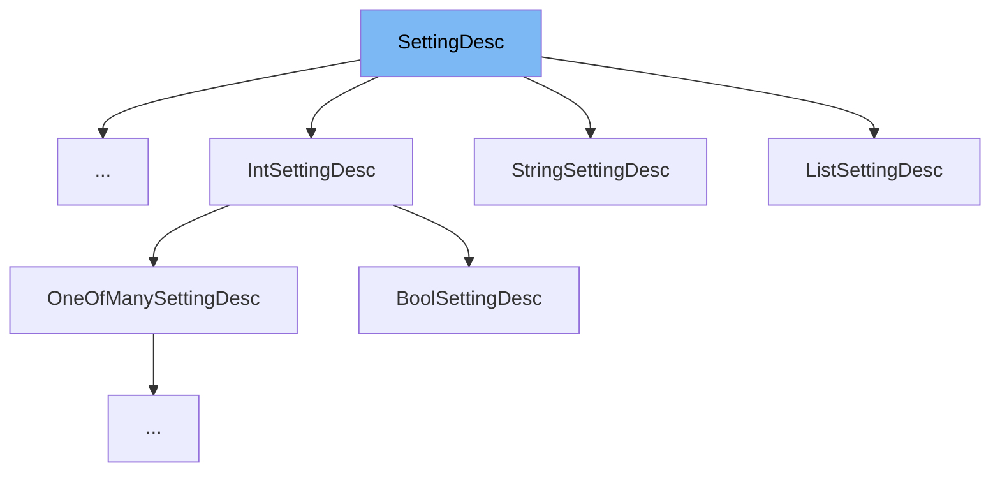

This document will cover the class <SwmToken path="src/settings_internal.h" pos="336:1:1" line-data="		SettingDesc(save, flags, startup), def(def == nullptr ? &quot;&quot; : def), max_length(max_length),">`SettingDesc`</SwmToken> in the file <SwmPath>[src/settings_internal.h](src/settings_internal.h)</SwmPath>. We will cover:

1. What <SwmToken path="src/settings_internal.h" pos="336:1:1" line-data="		SettingDesc(save, flags, startup), def(def == nullptr ? &quot;&quot; : def), max_length(max_length),">`SettingDesc`</SwmToken> is.
2. Variables and functions defined in <SwmToken path="src/settings_internal.h" pos="336:1:1" line-data="		SettingDesc(save, flags, startup), def(def == nullptr ? &quot;&quot; : def), max_length(max_length),">`SettingDesc`</SwmToken>.
3. Usage example of <SwmToken path="src/settings_internal.h" pos="336:1:1" line-data="		SettingDesc(save, flags, startup), def(def == nullptr ? &quot;&quot; : def), max_length(max_length),">`SettingDesc`</SwmToken> in <SwmToken path="src/settings_internal.h" pos="105:5:5" line-data="	const struct StringSettingDesc *AsStringSetting() const;">`StringSettingDesc`</SwmToken>.



# What is <SwmToken path="src/settings_internal.h" pos="336:1:1" line-data="		SettingDesc(save, flags, startup), def(def == nullptr ? &quot;&quot; : def), max_length(max_length),">`SettingDesc`</SwmToken>

<SwmToken path="src/settings_internal.h" pos="336:1:1" line-data="		SettingDesc(save, flags, startup), def(def == nullptr ? &quot;&quot; : def), max_length(max_length),">`SettingDesc`</SwmToken> is a structure defined in <SwmPath>[src/settings_internal.h](src/settings_internal.h)</SwmPath> that represents the properties of configuration file settings. It is used to handle various settings within the game, including how they are saved, loaded, and displayed in the GUI. The class provides a base for different types of settings, such as integer, boolean, and string settings.

<SwmSnippet path="/src/settings_internal.h" line="76">

---

# Variables and functions

The variable <SwmToken path="src/settings_internal.h" pos="76:3:3" line-data="	SettingFlag flags;  ///&lt; Handles how a setting would show up in the GUI (text/currency, etc.).">`flags`</SwmToken> is used to handle how a setting would show up in the GUI, such as text or currency.

```c
	SettingFlag flags;  ///< Handles how a setting would show up in the GUI (text/currency, etc.).
```

---

</SwmSnippet>

<SwmSnippet path="/src/settings_internal.h" line="77">

---

The variable <SwmToken path="src/settings_internal.h" pos="77:3:3" line-data="	bool startup;       ///&lt; Setting has to be loaded directly at startup?.">`startup`</SwmToken> indicates whether the setting has to be loaded directly at startup.

```c
	bool startup;       ///< Setting has to be loaded directly at startup?.
```

---

</SwmSnippet>

<SwmSnippet path="/src/settings_internal.h" line="78">

---

The variable <SwmToken path="src/settings_internal.h" pos="78:3:3" line-data="	SaveLoad save;      ///&lt; Internal structure (going to savegame, parts to config).">`save`</SwmToken> is an internal structure that handles saving to the savegame and parts to the config.

```c
	SaveLoad save;      ///< Internal structure (going to savegame, parts to config).
```

---

</SwmSnippet>

<SwmSnippet path="/src/settings_internal.h" line="80">

---

The function <SwmToken path="src/settings_internal.h" pos="80:3:3" line-data="	bool IsEditable(bool do_command = false) const;">`IsEditable`</SwmToken> checks if the setting is editable, optionally considering command execution.

```c
	bool IsEditable(bool do_command = false) const;
```

---

</SwmSnippet>

<SwmSnippet path="/src/settings_internal.h" line="81">

---

The function <SwmToken path="src/settings_internal.h" pos="81:3:3" line-data="	SettingType GetType() const;">`GetType`</SwmToken> returns the type of the setting.

```c
	SettingType GetType() const;
```

---

</SwmSnippet>

<SwmSnippet path="/src/settings_internal.h" line="87">

---

The function <SwmToken path="src/settings_internal.h" pos="87:10:10" line-data="	constexpr const std::string &amp;GetName() const">`GetName`</SwmToken> returns the name of the setting.

```c
	constexpr const std::string &GetName() const
	{
		return this->save.name;
	}
```

---

</SwmSnippet>

<SwmSnippet path="/src/settings_internal.h" line="96">

---

The function <SwmToken path="src/settings_internal.h" pos="96:5:5" line-data="	virtual bool IsIntSetting() const { return false; }">`IsIntSetting`</SwmToken> checks if the setting is of integer type.

```c
	virtual bool IsIntSetting() const { return false; }
```

---

</SwmSnippet>

<SwmSnippet path="/src/settings_internal.h" line="102">

---

The function <SwmToken path="src/settings_internal.h" pos="102:5:5" line-data="	virtual bool IsStringSetting() const { return false; }">`IsStringSetting`</SwmToken> checks if the setting is of string type.

```c
	virtual bool IsStringSetting() const { return false; }
```

---

</SwmSnippet>

<SwmSnippet path="/src/settings_internal.h" line="104">

---

The function <SwmToken path="src/settings_internal.h" pos="104:8:8" line-data="	const struct IntSettingDesc *AsIntSetting() const;">`AsIntSetting`</SwmToken> returns the setting as an <SwmToken path="src/settings_internal.h" pos="104:5:5" line-data="	const struct IntSettingDesc *AsIntSetting() const;">`IntSettingDesc`</SwmToken> if it is of integer type.

```c
	const struct IntSettingDesc *AsIntSetting() const;
	const struct StringSettingDesc *AsStringSetting() const;
```

---

</SwmSnippet>

<SwmSnippet path="/src/settings_internal.h" line="105">

---

The function <SwmToken path="src/settings_internal.h" pos="105:8:8" line-data="	const struct StringSettingDesc *AsStringSetting() const;">`AsStringSetting`</SwmToken> returns the setting as a <SwmToken path="src/settings_internal.h" pos="105:5:5" line-data="	const struct StringSettingDesc *AsStringSetting() const;">`StringSettingDesc`</SwmToken> if it is of string type.

```c
	const struct StringSettingDesc *AsStringSetting() const;

```

---

</SwmSnippet>

<SwmSnippet path="/src/settings_internal.h" line="113">

---

The function <SwmToken path="src/settings_internal.h" pos="113:7:7" line-data="	virtual std::string FormatValue(const void *object) const = 0;">`FormatValue`</SwmToken> formats the value of the setting associated with this object.

```c
	virtual std::string FormatValue(const void *object) const = 0;

```

---

</SwmSnippet>

<SwmSnippet path="/src/settings_internal.h" line="120">

---

The function <SwmToken path="src/settings_internal.h" pos="120:5:5" line-data="	virtual void ParseValue(const IniItem *item, void *object) const = 0;">`ParseValue`</SwmToken> reads the value from the Ini item into the setting associated with this object.

```c
	virtual void ParseValue(const IniItem *item, void *object) const = 0;

```

---

</SwmSnippet>

<SwmSnippet path="/src/settings_internal.h" line="131">

---

The function <SwmToken path="src/settings_internal.h" pos="131:5:5" line-data="	virtual bool IsSameValue(const IniItem *item, void *object) const = 0;">`IsSameValue`</SwmToken> checks whether the value in the Ini item is the same as is saved in this setting in the object.

```c
	virtual bool IsSameValue(const IniItem *item, void *object) const = 0;

```

---

</SwmSnippet>

<SwmSnippet path="/src/settings_internal.h" line="139">

---

The function <SwmToken path="src/settings_internal.h" pos="139:5:5" line-data="	virtual bool IsDefaultValue(void *object) const = 0;">`IsDefaultValue`</SwmToken> checks whether the value is the same as the default value.

```c
	virtual bool IsDefaultValue(void *object) const = 0;

```

---

</SwmSnippet>

<SwmSnippet path="/src/settings_internal.h" line="144">

---

The function <SwmToken path="src/settings_internal.h" pos="144:5:5" line-data="	virtual void ResetToDefault(void *object) const = 0;">`ResetToDefault`</SwmToken> resets the setting to its default value.

```c
	virtual void ResetToDefault(void *object) const = 0;
};
```

---

</SwmSnippet>

<SwmSnippet path="/src/settings_internal.h" line="392">

---

The function <SwmToken path="src/settings_internal.h" pos="392:9:9" line-data="static constexpr const SettingDesc *GetSettingDesc(const SettingVariant &amp;desc)">`GetSettingDesc`</SwmToken> is a helper to convert the type of the iterated settings description to a pointer to it.

```c
static constexpr const SettingDesc *GetSettingDesc(const SettingVariant &desc)
{
	return std::visit([](auto&& arg) -> const SettingDesc * { return &arg; }, desc);
}
```

---

</SwmSnippet>

# Usage example

Here is an example of how to use <SwmToken path="src/settings_internal.h" pos="336:1:1" line-data="		SettingDesc(save, flags, startup), def(def == nullptr ? &quot;&quot; : def), max_length(max_length),">`SettingDesc`</SwmToken> in <SwmToken path="src/settings_internal.h" pos="105:5:5" line-data="	const struct StringSettingDesc *AsStringSetting() const;">`StringSettingDesc`</SwmToken>.

<SwmSnippet path="/src/settings_internal.h" line="334">

---

<SwmToken path="src/settings_internal.h" pos="334:1:1" line-data="	StringSettingDesc(const SaveLoad &amp;save, SettingFlag flags, bool startup, const char *def,">`StringSettingDesc`</SwmToken> is a derived class from <SwmToken path="src/settings_internal.h" pos="336:1:1" line-data="		SettingDesc(save, flags, startup), def(def == nullptr ? &quot;&quot; : def), max_length(max_length),">`SettingDesc`</SwmToken> that handles string settings. It initializes the base class <SwmToken path="src/settings_internal.h" pos="336:1:1" line-data="		SettingDesc(save, flags, startup), def(def == nullptr ? &quot;&quot; : def), max_length(max_length),">`SettingDesc`</SwmToken> with the save, flags, and startup parameters.

```c
	StringSettingDesc(const SaveLoad &save, SettingFlag flags, bool startup, const char *def,
			uint32_t max_length, PreChangeCheck pre_check, PostChangeCallback post_callback) :
		SettingDesc(save, flags, startup), def(def == nullptr ? "" : def), max_length(max_length),
			pre_check(pre_check), post_callback(post_callback) {}
```

---

</SwmSnippet>

&nbsp;

*This is an auto-generated document by Swimm AI 🌊 and has not yet been verified by a human*

<SwmMeta version="3.0.0" repo-id="Z2l0aHViJTNBJTNBT3BlblRURC1jb3BpbG90LWRlbW8lM0ElM0Fzd2ltbWlv" repo-name="OpenTTD-copilot-demo"><sup>Powered by [Swimm](/)</sup></SwmMeta>
