```mermaid
graph TD;
  SoundDriver:::currentBaseStyle
SoundDriver --> SoundDriver_SDL
SoundDriver --> SoundDriver_Allegro
SoundDriver --> SoundDriver_XAudio2
SoundDriver --> SoundDriver_Cocoa
SoundDriver --> SoundDriver_Win32
SoundDriver --> SoundDriver_Null

 classDef currentBaseStyle color:#000000,fill:#7CB9F4

%% Swimm:
%% graph TD;
%%   SoundDriver:::currentBaseStyle
%% <SwmToken path="src/sound/sound_driver.hpp" pos="35:3:3" line-data="	static SoundDriver *GetInstance()">`SoundDriver`</SwmToken> --> SoundDriver_SDL
%% <SwmToken path="src/sound/sound_driver.hpp" pos="35:3:3" line-data="	static SoundDriver *GetInstance()">`SoundDriver`</SwmToken> --> <SwmToken path="src/sound/allegro_s.h" pos="16:2:2" line-data="class SoundDriver_Allegro : public SoundDriver {">`SoundDriver_Allegro`</SwmToken>
%% <SwmToken path="src/sound/sound_driver.hpp" pos="35:3:3" line-data="	static SoundDriver *GetInstance()">`SoundDriver`</SwmToken> --> SoundDriver_XAudio2
%% <SwmToken path="src/sound/sound_driver.hpp" pos="35:3:3" line-data="	static SoundDriver *GetInstance()">`SoundDriver`</SwmToken> --> SoundDriver_Cocoa
%% <SwmToken path="src/sound/sound_driver.hpp" pos="35:3:3" line-data="	static SoundDriver *GetInstance()">`SoundDriver`</SwmToken> --> SoundDriver_Win32
%% <SwmToken path="src/sound/sound_driver.hpp" pos="35:3:3" line-data="	static SoundDriver *GetInstance()">`SoundDriver`</SwmToken> --> SoundDriver_Null
%% 
%%  classDef currentBaseStyle color:#000000,fill:#7CB9F4
```

This document will cover the class <SwmToken path="src/sound/sound_driver.hpp" pos="35:3:3" line-data="	static SoundDriver *GetInstance()">`SoundDriver`</SwmToken> in detail. We will discuss:

1. What <SwmToken path="src/sound/sound_driver.hpp" pos="35:3:3" line-data="	static SoundDriver *GetInstance()">`SoundDriver`</SwmToken> is.
2. The variables and functions defined in <SwmToken path="src/sound/sound_driver.hpp" pos="35:3:3" line-data="	static SoundDriver *GetInstance()">`SoundDriver`</SwmToken>.
3. An example of how to use <SwmToken path="src/sound/sound_driver.hpp" pos="35:3:3" line-data="	static SoundDriver *GetInstance()">`SoundDriver`</SwmToken> in <SwmToken path="src/sound/allegro_s.h" pos="16:2:2" line-data="class SoundDriver_Allegro : public SoundDriver {">`SoundDriver_Allegro`</SwmToken>.



# What is <SwmToken path="src/sound/sound_driver.hpp" pos="35:3:3" line-data="	static SoundDriver *GetInstance()">`SoundDriver`</SwmToken>

The <SwmToken path="src/sound/sound_driver.hpp" pos="35:3:3" line-data="	static SoundDriver *GetInstance()">`SoundDriver`</SwmToken> class, defined in <SwmPath>[src/sound/sound_driver.hpp](src/sound/sound_driver.hpp)</SwmPath>, serves as the base class for all sound drivers in the <SwmToken path="src/sound/sound_driver.hpp" pos="2:13:13" line-data=" * This file is part of OpenTTD.">`OpenTTD`</SwmToken> game. It provides the fundamental interface and functionalities that all specific sound driver implementations must adhere to. This class is crucial for managing sound output in the game, ensuring that sound drivers can be easily swapped or modified without affecting the overall sound management system.

<SwmSnippet path="/src/sound/sound_driver.hpp" line="17">

---

# Variables and functions

The function <SwmToken path="src/sound/sound_driver.hpp" pos="19:5:5" line-data="	virtual void MainLoop() {}">`MainLoop`</SwmToken> is called once every tick. It is a virtual function that can be overridden by derived classes to implement specific behavior that needs to be executed regularly.

```c++
public:
	/** Called once every tick */
	virtual void MainLoop() {}
```

---

</SwmSnippet>

<SwmSnippet path="/src/sound/sound_driver.hpp" line="21">

---

The function <SwmToken path="src/sound/sound_driver.hpp" pos="27:5:5" line-data="	virtual bool HasOutput() const">`HasOutput`</SwmToken> checks whether the driver has an output from which the user can hear sound. It returns `true` for all drivers except the null driver. This function helps determine if a warning should be issued to the user about sound issues.

```c++
	/**
	 * Whether the driver has an output from which the user can hear sound.
	 * Or in other words, whether we should warn the user if no soundset is
	 * loaded and that loading one would fix the sound problems.
	 * @return True for all drivers except null.
	 */
	virtual bool HasOutput() const
	{
		return true;
	}
```

---

</SwmSnippet>

<SwmSnippet path="/src/sound/sound_driver.hpp" line="32">

---

The static function <SwmToken path="src/sound/sound_driver.hpp" pos="35:6:6" line-data="	static SoundDriver *GetInstance()">`GetInstance`</SwmToken> returns the currently active instance of the sound driver. It uses the <SwmToken path="src/sound/sound_driver.hpp" pos="37:9:11" line-data="		return static_cast&lt;SoundDriver*&gt;(*DriverFactoryBase::GetActiveDriver(Driver::DT_SOUND));">`DriverFactoryBase::GetActiveDriver`</SwmToken> method to fetch the active driver of type <SwmToken path="src/sound/sound_driver.hpp" pos="37:15:15" line-data="		return static_cast&lt;SoundDriver*&gt;(*DriverFactoryBase::GetActiveDriver(Driver::DT_SOUND));">`DT_SOUND`</SwmToken> and casts it to <SwmToken path="src/sound/sound_driver.hpp" pos="35:3:3" line-data="	static SoundDriver *GetInstance()">`SoundDriver`</SwmToken>.

```c++
	/**
	 * Get the currently active instance of the sound driver.
	 */
	static SoundDriver *GetInstance()
	{
		return static_cast<SoundDriver*>(*DriverFactoryBase::GetActiveDriver(Driver::DT_SOUND));
	}
```

---

</SwmSnippet>

<SwmSnippet path="/src/sound/sound_driver.hpp" line="41">

---

The variable <SwmToken path="src/sound/sound_driver.hpp" pos="41:6:6" line-data="extern std::string _ini_sounddriver;">`_ini_sounddriver`</SwmToken> is an external string that likely holds the name or configuration of the current sound driver. This variable is used to manage the sound driver settings.

```c++
extern std::string _ini_sounddriver;
```

---

</SwmSnippet>

# Usage example

The <SwmToken path="src/sound/sound_driver.hpp" pos="35:3:3" line-data="	static SoundDriver *GetInstance()">`SoundDriver`</SwmToken> class is used as a base class for various specific sound driver implementations. Here is an example of how <SwmToken path="src/sound/sound_driver.hpp" pos="35:3:3" line-data="	static SoundDriver *GetInstance()">`SoundDriver`</SwmToken> is extended in the <SwmToken path="src/sound/allegro_s.h" pos="16:2:2" line-data="class SoundDriver_Allegro : public SoundDriver {">`SoundDriver_Allegro`</SwmToken> class, defined in <SwmPath>[src/sound/allegro_s.h](src/sound/allegro_s.h)</SwmPath>.

<SwmSnippet path="/src/sound/allegro_s.h" line="15">

---

The <SwmToken path="src/sound/allegro_s.h" pos="16:2:2" line-data="class SoundDriver_Allegro : public SoundDriver {">`SoundDriver_Allegro`</SwmToken> class extends <SwmToken path="src/sound/allegro_s.h" pos="16:8:8" line-data="class SoundDriver_Allegro : public SoundDriver {">`SoundDriver`</SwmToken> to implement the Allegro sound driver. This class will override the virtual functions of <SwmToken path="src/sound/allegro_s.h" pos="16:8:8" line-data="class SoundDriver_Allegro : public SoundDriver {">`SoundDriver`</SwmToken> to provide specific functionalities for the Allegro sound system.

```c
/** Implementation of the allegro sound driver. */
class SoundDriver_Allegro : public SoundDriver {
public:
```

---

</SwmSnippet>

&nbsp;

*This is an auto-generated document by Swimm AI 🌊 and has not yet been verified by a human*

<SwmMeta version="3.0.0" repo-id="Z2l0aHViJTNBJTNBT3BlblRURC1jb3BpbG90LWRlbW8lM0ElM0Fzd2ltbWlv" repo-name="OpenTTD-copilot-demo"><sup>Powered by [Swimm](/)</sup></SwmMeta>
