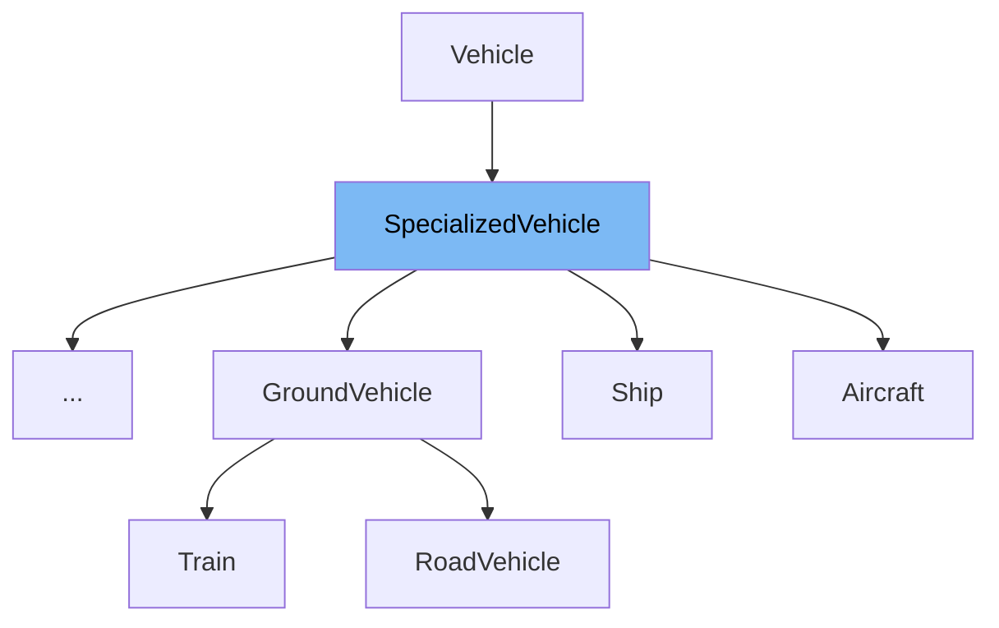

This document will cover the class <SwmToken path="src/vehicle_base.h" pos="1098:3:3" line-data="	typedef SpecializedVehicle&lt;T, Type&gt; SpecializedVehicleBase; ///&lt; Our type">`SpecializedVehicle`</SwmToken> in the <SwmPath>[src/vehicle_base.h](src/vehicle_base.h)</SwmPath> file. We will cover:

1. What <SwmToken path="src/vehicle_base.h" pos="1098:3:3" line-data="	typedef SpecializedVehicle&lt;T, Type&gt; SpecializedVehicleBase; ///&lt; Our type">`SpecializedVehicle`</SwmToken> is.
2. Variables and functions defined in <SwmToken path="src/vehicle_base.h" pos="1098:3:3" line-data="	typedef SpecializedVehicle&lt;T, Type&gt; SpecializedVehicleBase; ///&lt; Our type">`SpecializedVehicle`</SwmToken>.
3. An example of how to use <SwmToken path="src/vehicle_base.h" pos="1098:3:3" line-data="	typedef SpecializedVehicle&lt;T, Type&gt; SpecializedVehicleBase; ///&lt; Our type">`SpecializedVehicle`</SwmToken> in <SwmToken path="src/aircraft.h" pos="74:2:2" line-data="struct Aircraft final : public SpecializedVehicle&lt;Aircraft, VEH_AIRCRAFT&gt; {">`Aircraft`</SwmToken>.



# What is <SwmToken path="src/vehicle_base.h" pos="1098:3:3" line-data="	typedef SpecializedVehicle&lt;T, Type&gt; SpecializedVehicleBase; ///&lt; Our type">`SpecializedVehicle`</SwmToken>

The <SwmToken path="src/vehicle_base.h" pos="1098:3:3" line-data="	typedef SpecializedVehicle&lt;T, Type&gt; SpecializedVehicleBase; ///&lt; Our type">`SpecializedVehicle`</SwmToken> class template in <SwmPath>[src/vehicle_base.h](src/vehicle_base.h)</SwmPath> is a specialized type of <SwmToken path="src/vehicle_base.h" pos="1103:9:9" line-data="	inline SpecializedVehicle() : Vehicle(Type)">`Vehicle`</SwmToken> designed to handle specific vehicle types in the game. It provides type-safe accessors and methods to interact with vehicles of a particular type, ensuring that operations are performed correctly based on the vehicle's type.

<SwmSnippet path="/src/vehicle_base.h" line="1096">

---

# Variables and functions

The <SwmToken path="src/vehicle_base.h" pos="1096:7:7" line-data="	static const VehicleType EXPECTED_TYPE = Type; ///&lt; Specialized type">`EXPECTED_TYPE`</SwmToken> is a static constant that holds the specialized vehicle type. It ensures that the vehicle type is correctly identified.

```c
	static const VehicleType EXPECTED_TYPE = Type; ///< Specialized type
```

---

</SwmSnippet>

<SwmSnippet path="/src/vehicle_base.h" line="1098">

---

The <SwmToken path="src/vehicle_base.h" pos="1098:11:11" line-data="	typedef SpecializedVehicle&lt;T, Type&gt; SpecializedVehicleBase; ///&lt; Our type">`SpecializedVehicleBase`</SwmToken> typedef defines the base type for the specialized vehicle, making it easier to refer to the base type within the class.

```c
	typedef SpecializedVehicle<T, Type> SpecializedVehicleBase; ///< Our type
```

---

</SwmSnippet>

<SwmSnippet path="/src/vehicle_base.h" line="1103">

---

The constructor <SwmToken path="src/vehicle_base.h" pos="1103:3:5" line-data="	inline SpecializedVehicle() : Vehicle(Type)">`SpecializedVehicle()`</SwmToken> initializes the vehicle type and sets the sprite sequence count to 1. This ensures that the vehicle is correctly initialized with its type and sprite sequence.

```c
	inline SpecializedVehicle() : Vehicle(Type)
	{
		this->sprite_cache.sprite_seq.count = 1;
	}
```

---

</SwmSnippet>

<SwmSnippet path="/src/vehicle_base.h" line="1112">

---

The <SwmToken path="src/vehicle_base.h" pos="1112:6:8" line-data="	inline T *First() const { return (T *)this-&gt;Vehicle::First(); }">`First()`</SwmToken> function returns the first vehicle in the chain, cast to the specialized type <SwmToken path="src/vehicle_base.h" pos="1112:3:3" line-data="	inline T *First() const { return (T *)this-&gt;Vehicle::First(); }">`T`</SwmToken>.

```c
	inline T *First() const { return (T *)this->Vehicle::First(); }
```

---

</SwmSnippet>

<SwmSnippet path="/src/vehicle_base.h" line="1118">

---

The <SwmToken path="src/vehicle_base.h" pos="1118:6:8" line-data="	inline T *Last() { return (T *)this-&gt;Vehicle::Last(); }">`Last()`</SwmToken> function returns the last vehicle in the chain, cast to the specialized type <SwmToken path="src/vehicle_base.h" pos="1118:3:3" line-data="	inline T *Last() { return (T *)this-&gt;Vehicle::Last(); }">`T`</SwmToken>.

```c
	inline T *Last() { return (T *)this->Vehicle::Last(); }
```

---

</SwmSnippet>

<SwmSnippet path="/src/vehicle_base.h" line="1130">

---

The <SwmToken path="src/vehicle_base.h" pos="1130:6:8" line-data="	inline T *Next() const { return (T *)this-&gt;Vehicle::Next(); }">`Next()`</SwmToken> function returns the next vehicle in the chain, cast to the specialized type <SwmToken path="src/vehicle_base.h" pos="1130:3:3" line-data="	inline T *Next() const { return (T *)this-&gt;Vehicle::Next(); }">`T`</SwmToken>.

```c
	inline T *Next() const { return (T *)this->Vehicle::Next(); }
```

---

</SwmSnippet>

<SwmSnippet path="/src/vehicle_base.h" line="1136">

---

The <SwmToken path="src/vehicle_base.h" pos="1136:6:8" line-data="	inline T *Previous() const { return (T *)this-&gt;Vehicle::Previous(); }">`Previous()`</SwmToken> function returns the previous vehicle in the chain, cast to the specialized type <SwmToken path="src/vehicle_base.h" pos="1136:3:3" line-data="	inline T *Previous() const { return (T *)this-&gt;Vehicle::Previous(); }">`T`</SwmToken>.

```c
	inline T *Previous() const { return (T *)this->Vehicle::Previous(); }
```

---

</SwmSnippet>

<SwmSnippet path="/src/vehicle_base.h" line="1143">

---

The <SwmToken path="src/vehicle_base.h" pos="1143:6:8" line-data="	inline T *GetNextArticulatedPart() { return (T *)this-&gt;Vehicle::GetNextArticulatedPart(); }">`GetNextArticulatedPart()`</SwmToken> function returns the next part of an articulated engine, cast to the specialized type <SwmToken path="src/vehicle_base.h" pos="1143:3:3" line-data="	inline T *GetNextArticulatedPart() { return (T *)this-&gt;Vehicle::GetNextArticulatedPart(); }">`T`</SwmToken>.

```c
	inline T *GetNextArticulatedPart() { return (T *)this->Vehicle::GetNextArticulatedPart(); }
```

---

</SwmSnippet>

<SwmSnippet path="/src/vehicle_base.h" line="1156">

---

The <SwmToken path="src/vehicle_base.h" pos="1156:6:8" line-data="	inline T *GetFirstEnginePart() { return (T *)this-&gt;Vehicle::GetFirstEnginePart(); }">`GetFirstEnginePart()`</SwmToken> function returns the first part of an articulated engine, cast to the specialized type <SwmToken path="src/vehicle_base.h" pos="1156:3:3" line-data="	inline T *GetFirstEnginePart() { return (T *)this-&gt;Vehicle::GetFirstEnginePart(); }">`T`</SwmToken>.

```c
	inline T *GetFirstEnginePart() { return (T *)this->Vehicle::GetFirstEnginePart(); }
```

---

</SwmSnippet>

<SwmSnippet path="/src/vehicle_base.h" line="1174">

---

The <SwmToken path="src/vehicle_base.h" pos="1174:6:8" line-data="	inline T *GetNextVehicle() const { return (T *)this-&gt;Vehicle::GetNextVehicle(); }">`GetNextVehicle()`</SwmToken> function returns the next real <SwmToken path="src/vehicle_base.h" pos="1013:11:14" line-data="	 * Get the next real (non-articulated part) vehicle in the consist.">`(non-articulated`</SwmToken> part) vehicle in the consist, cast to the specialized type <SwmToken path="src/vehicle_base.h" pos="1174:3:3" line-data="	inline T *GetNextVehicle() const { return (T *)this-&gt;Vehicle::GetNextVehicle(); }">`T`</SwmToken>.

```c
	inline T *GetNextVehicle() const { return (T *)this->Vehicle::GetNextVehicle(); }
```

---

</SwmSnippet>

<SwmSnippet path="/src/vehicle_base.h" line="1187">

---

The `IsValidID()` function checks if a given index is a valid ID for a vehicle of the specialized type <SwmToken path="src/vehicle_base.h" pos="1098:5:5" line-data="	typedef SpecializedVehicle&lt;T, Type&gt; SpecializedVehicleBase; ///&lt; Our type">`T`</SwmToken>.

```c
	static inline bool IsValidID(size_t index)
	{
		return Vehicle::IsValidID(index) && Vehicle::Get(index)->type == Type;
	}
```

---

</SwmSnippet>

<SwmSnippet path="/src/vehicle_base.h" line="1196">

---

The `Get()` function returns a pointer to the vehicle with the given index, cast to the specialized type <SwmToken path="src/vehicle_base.h" pos="1196:5:5" line-data="	static inline T *Get(size_t index)">`T`</SwmToken>.

```c
	static inline T *Get(size_t index)
	{
		return (T *)Vehicle::Get(index);
	}
```

---

</SwmSnippet>

<SwmSnippet path="/src/vehicle_base.h" line="1215">

---

The `From()` function converts a <SwmToken path="src/vehicle_base.h" pos="1215:10:10" line-data="	static inline T *From(Vehicle *v)">`Vehicle`</SwmToken> pointer to a <SwmToken path="src/vehicle_base.h" pos="1098:3:3" line-data="	typedef SpecializedVehicle&lt;T, Type&gt; SpecializedVehicleBase; ///&lt; Our type">`SpecializedVehicle`</SwmToken> pointer with type checking.

```c
	static inline T *From(Vehicle *v)
	{
		assert(v->type == Type);
		return (T *)v;
	}
```

---

</SwmSnippet>

<SwmSnippet path="/src/vehicle_base.h" line="1237">

---

The `UpdateViewport()` function updates the vehicle's sprite and position caches, ensuring that the vehicle is correctly displayed on the viewport.

```c
	inline void UpdateViewport(bool force_update, bool update_delta)
	{
		bool sprite_has_changed = false;

		/* Skip updating sprites on dedicated servers without screen */
		if (_network_dedicated) return;

		/* Explicitly choose method to call to prevent vtable dereference -
		 * it gives ~3% runtime improvements in games with many vehicles */
		if (update_delta) ((T *)this)->T::UpdateDeltaXY();

		/*
		 * Only check for a new sprite sequence if the vehicle direction
		 * has changed since we last checked it, assuming that otherwise
		 * there won't be enough change in bounding box or offsets to need
		 * to resolve a new sprite.
		 */
		if (this->direction != this->sprite_cache.last_direction || this->sprite_cache.is_viewport_candidate) {
			VehicleSpriteSeq seq;

			((T*)this)->T::GetImage(this->direction, EIT_ON_MAP, &seq);
```

---

</SwmSnippet>

# Usage example

The <SwmToken path="src/aircraft.h" pos="74:2:2" line-data="struct Aircraft final : public SpecializedVehicle&lt;Aircraft, VEH_AIRCRAFT&gt; {">`Aircraft`</SwmToken> class in <SwmPath>[src/aircraft.h](src/aircraft.h)</SwmPath> is an example of a <SwmToken path="src/vehicle_base.h" pos="1098:3:3" line-data="	typedef SpecializedVehicle&lt;T, Type&gt; SpecializedVehicleBase; ///&lt; Our type">`SpecializedVehicle`</SwmToken>. It demonstrates how to use the <SwmToken path="src/vehicle_base.h" pos="1098:3:3" line-data="	typedef SpecializedVehicle&lt;T, Type&gt; SpecializedVehicleBase; ///&lt; Our type">`SpecializedVehicle`</SwmToken> template to create a specific type of vehicle.

<SwmSnippet path="/src/aircraft.h" line="74">

---

The <SwmToken path="src/aircraft.h" pos="74:2:2" line-data="struct Aircraft final : public SpecializedVehicle&lt;Aircraft, VEH_AIRCRAFT&gt; {">`Aircraft`</SwmToken> class is defined as a <SwmToken path="src/aircraft.h" pos="74:10:10" line-data="struct Aircraft final : public SpecializedVehicle&lt;Aircraft, VEH_AIRCRAFT&gt; {">`SpecializedVehicle`</SwmToken> with the type <SwmToken path="src/aircraft.h" pos="74:15:15" line-data="struct Aircraft final : public SpecializedVehicle&lt;Aircraft, VEH_AIRCRAFT&gt; {">`VEH_AIRCRAFT`</SwmToken>. This specialization allows the <SwmToken path="src/aircraft.h" pos="74:2:2" line-data="struct Aircraft final : public SpecializedVehicle&lt;Aircraft, VEH_AIRCRAFT&gt; {">`Aircraft`</SwmToken> class to inherit all the functionalities of <SwmToken path="src/aircraft.h" pos="74:10:10" line-data="struct Aircraft final : public SpecializedVehicle&lt;Aircraft, VEH_AIRCRAFT&gt; {">`SpecializedVehicle`</SwmToken> while being specific to aircraft.

```c
struct Aircraft final : public SpecializedVehicle<Aircraft, VEH_AIRCRAFT> {
	uint16_t crashed_counter;        ///< Timer for handling crash animations.
```

---

</SwmSnippet>

&nbsp;

*This is an auto-generated document by Swimm AI 🌊 and has not yet been verified by a human*

<SwmMeta version="3.0.0" repo-id="Z2l0aHViJTNBJTNBT3BlblRURC1jb3BpbG90LWRlbW8lM0ElM0Fzd2ltbWlv" repo-name="OpenTTD-copilot-demo"><sup>Powered by [Swimm](/)</sup></SwmMeta>
