```mermaid
graph TD;
  SpriteGroup:::currentBaseStyle
SpriteGroup --> TileLayoutSpriteGroup
SpriteGroup --> RealSpriteGroup
SpriteGroup --> CallbackResultSpriteGroup
SpriteGroup --> ResultSpriteGroup
SpriteGroup --> IndustryProductionSpriteGroup
SpriteGroup --> DeterministicSpriteGroup
SpriteGroup --> RandomizedSpriteGroup

 classDef currentBaseStyle color:#000000,fill:#7CB9F4

%% Swimm:
%% graph TD;
%%   SpriteGroup:::currentBaseStyle
%% <SwmToken path="src/newgrf_spritegroup.h" pos="73:5:5" line-data="	static const SpriteGroup *Resolve(const SpriteGroup *group, ResolverObject &amp;object, bool top_level = true);">`SpriteGroup`</SwmToken> --> <SwmToken path="src/newgrf_spritegroup.h" pos="260:2:2" line-data="struct TileLayoutSpriteGroup : SpriteGroup {">`TileLayoutSpriteGroup`</SwmToken>
%% <SwmToken path="src/newgrf_spritegroup.h" pos="73:5:5" line-data="	static const SpriteGroup *Resolve(const SpriteGroup *group, ResolverObject &amp;object, bool top_level = true);">`SpriteGroup`</SwmToken> --> <SwmToken path="src/newgrf_spritegroup.h" pos="79:2:2" line-data="struct RealSpriteGroup : SpriteGroup {">`RealSpriteGroup`</SwmToken>
%% <SwmToken path="src/newgrf_spritegroup.h" pos="73:5:5" line-data="	static const SpriteGroup *Resolve(const SpriteGroup *group, ResolverObject &amp;object, bool top_level = true);">`SpriteGroup`</SwmToken> --> <SwmToken path="src/newgrf_spritegroup.h" pos="210:2:2" line-data="struct CallbackResultSpriteGroup : SpriteGroup {">`CallbackResultSpriteGroup`</SwmToken>
%% <SwmToken path="src/newgrf_spritegroup.h" pos="73:5:5" line-data="	static const SpriteGroup *Resolve(const SpriteGroup *group, ResolverObject &amp;object, bool top_level = true);">`SpriteGroup`</SwmToken> --> <SwmToken path="src/newgrf_spritegroup.h" pos="236:2:2" line-data="struct ResultSpriteGroup : SpriteGroup {">`ResultSpriteGroup`</SwmToken>
%% <SwmToken path="src/newgrf_spritegroup.h" pos="73:5:5" line-data="	static const SpriteGroup *Resolve(const SpriteGroup *group, ResolverObject &amp;object, bool top_level = true);">`SpriteGroup`</SwmToken> --> <SwmToken path="src/newgrf_spritegroup.h" pos="269:2:2" line-data="struct IndustryProductionSpriteGroup : SpriteGroup {">`IndustryProductionSpriteGroup`</SwmToken>
%% <SwmToken path="src/newgrf_spritegroup.h" pos="73:5:5" line-data="	static const SpriteGroup *Resolve(const SpriteGroup *group, ResolverObject &amp;object, bool top_level = true);">`SpriteGroup`</SwmToken> --> <SwmToken path="src/newgrf_spritegroup.h" pos="167:2:2" line-data="struct DeterministicSpriteGroup : SpriteGroup {">`DeterministicSpriteGroup`</SwmToken>
%% <SwmToken path="src/newgrf_spritegroup.h" pos="73:5:5" line-data="	static const SpriteGroup *Resolve(const SpriteGroup *group, ResolverObject &amp;object, bool top_level = true);">`SpriteGroup`</SwmToken> --> <SwmToken path="src/newgrf_spritegroup.h" pos="190:2:2" line-data="struct RandomizedSpriteGroup : SpriteGroup {">`RandomizedSpriteGroup`</SwmToken>
%% 
%%  classDef currentBaseStyle color:#000000,fill:#7CB9F4
```

This document will cover the class <SwmToken path="src/newgrf_spritegroup.h" pos="73:5:5" line-data="	static const SpriteGroup *Resolve(const SpriteGroup *group, ResolverObject &amp;object, bool top_level = true);">`SpriteGroup`</SwmToken> in the <SwmToken path="src/newgrf_spritegroup.h" pos="2:13:13" line-data=" * This file is part of OpenTTD.">`OpenTTD`</SwmToken> project. We will cover:

1. What <SwmToken path="src/newgrf_spritegroup.h" pos="73:5:5" line-data="	static const SpriteGroup *Resolve(const SpriteGroup *group, ResolverObject &amp;object, bool top_level = true);">`SpriteGroup`</SwmToken> is.
2. Variables and functions in <SwmToken path="src/newgrf_spritegroup.h" pos="73:5:5" line-data="	static const SpriteGroup *Resolve(const SpriteGroup *group, ResolverObject &amp;object, bool top_level = true);">`SpriteGroup`</SwmToken>.
3. Usage example of <SwmToken path="src/newgrf_spritegroup.h" pos="73:5:5" line-data="	static const SpriteGroup *Resolve(const SpriteGroup *group, ResolverObject &amp;object, bool top_level = true);">`SpriteGroup`</SwmToken> in <SwmToken path="src/newgrf_spritegroup.h" pos="79:2:2" line-data="struct RealSpriteGroup : SpriteGroup {">`RealSpriteGroup`</SwmToken>.



# What is <SwmToken path="src/newgrf_spritegroup.h" pos="73:5:5" line-data="	static const SpriteGroup *Resolve(const SpriteGroup *group, ResolverObject &amp;object, bool top_level = true);">`SpriteGroup`</SwmToken>

The <SwmToken path="src/newgrf_spritegroup.h" pos="73:5:5" line-data="	static const SpriteGroup *Resolve(const SpriteGroup *group, ResolverObject &amp;object, bool top_level = true);">`SpriteGroup`</SwmToken> class in <SwmPath>[src/newgrf_spritegroup.h](src/newgrf_spritegroup.h)</SwmPath> is a common wrapper for different sprite group types in the <SwmToken path="src/newgrf_spritegroup.h" pos="2:13:13" line-data=" * This file is part of OpenTTD.">`OpenTTD`</SwmToken> game. It is used to manage and resolve various sprite groups, which are essential for rendering different game elements based on conditions and callbacks.

<SwmSnippet path="/src/newgrf_spritegroup.h" line="66">

---

# Variables and functions

The variable <SwmToken path="src/newgrf_spritegroup.h" pos="66:3:3" line-data="	uint32_t nfo_line;">`nfo_line`</SwmToken> is used to store the line number in the NFO file where the sprite group is defined.

```c
	uint32_t nfo_line;
	SpriteGroupType type;
```

---

</SwmSnippet>

<SwmSnippet path="/src/newgrf_spritegroup.h" line="67">

---

The variable <SwmToken path="src/newgrf_spritegroup.h" pos="67:3:3" line-data="	SpriteGroupType type;">`type`</SwmToken> is of type <SwmToken path="src/newgrf_spritegroup.h" pos="67:1:1" line-data="	SpriteGroupType type;">`SpriteGroupType`</SwmToken> and indicates the type of the sprite group (e.g., real, deterministic, randomized, etc.).

```c
	SpriteGroupType type;

```

---

</SwmSnippet>

<SwmSnippet path="/src/newgrf_spritegroup.h" line="69">

---

The function <SwmToken path="src/newgrf_spritegroup.h" pos="69:5:5" line-data="	virtual SpriteID GetResult() const { return 0; }">`GetResult`</SwmToken> returns the sprite ID of the result. By default, it returns 0.

```c
	virtual SpriteID GetResult() const { return 0; }
```

---

</SwmSnippet>

<SwmSnippet path="/src/newgrf_spritegroup.h" line="70">

---

The function <SwmToken path="src/newgrf_spritegroup.h" pos="70:5:5" line-data="	virtual uint8_t GetNumResults() const { return 0; }">`GetNumResults`</SwmToken> returns the number of results. By default, it returns 0.

```c
	virtual uint8_t GetNumResults() const { return 0; }
```

---

</SwmSnippet>

<SwmSnippet path="/src/newgrf_spritegroup.h" line="71">

---

The function <SwmToken path="src/newgrf_spritegroup.h" pos="71:5:5" line-data="	virtual uint16_t GetCallbackResult() const { return CALLBACK_FAILED; }">`GetCallbackResult`</SwmToken> returns the result of a callback. By default, it returns <SwmToken path="src/newgrf_spritegroup.h" pos="71:15:15" line-data="	virtual uint16_t GetCallbackResult() const { return CALLBACK_FAILED; }">`CALLBACK_FAILED`</SwmToken>.

```c
	virtual uint16_t GetCallbackResult() const { return CALLBACK_FAILED; }
```

---

</SwmSnippet>

<SwmSnippet path="/src/newgrf_spritegroup.h" line="73">

---

The static function <SwmToken path="src/newgrf_spritegroup.h" pos="73:8:8" line-data="	static const SpriteGroup *Resolve(const SpriteGroup *group, ResolverObject &amp;object, bool top_level = true);">`Resolve`</SwmToken> resolves a sprite group based on the provided <SwmToken path="src/newgrf_spritegroup.h" pos="73:18:18" line-data="	static const SpriteGroup *Resolve(const SpriteGroup *group, ResolverObject &amp;object, bool top_level = true);">`ResolverObject`</SwmToken>. It can be used to get the final sprite group after applying all conditions and callbacks.

```c
	static const SpriteGroup *Resolve(const SpriteGroup *group, ResolverObject &object, bool top_level = true);
};
```

---

</SwmSnippet>

# Usage example

The <SwmToken path="src/newgrf_spritegroup.h" pos="79:2:2" line-data="struct RealSpriteGroup : SpriteGroup {">`RealSpriteGroup`</SwmToken> class is an example of how <SwmToken path="src/newgrf_spritegroup.h" pos="73:5:5" line-data="	static const SpriteGroup *Resolve(const SpriteGroup *group, ResolverObject &amp;object, bool top_level = true);">`SpriteGroup`</SwmToken> is used. It contains lists of other sprite groups for different loading stages.

<SwmSnippet path="/src/newgrf_spritegroup.h" line="79">

---

The <SwmToken path="src/newgrf_spritegroup.h" pos="79:2:2" line-data="struct RealSpriteGroup : SpriteGroup {">`RealSpriteGroup`</SwmToken> class extends <SwmToken path="src/newgrf_spritegroup.h" pos="79:6:6" line-data="struct RealSpriteGroup : SpriteGroup {">`SpriteGroup`</SwmToken> and is used to manage sprite groups for different loading stages. It overrides the <SwmToken path="src/newgrf_spritegroup.h" pos="93:6:6" line-data="	const SpriteGroup *Resolve(ResolverObject &amp;object) const override;">`Resolve`</SwmToken> function to provide specific resolution logic for real sprite groups.

```c
struct RealSpriteGroup : SpriteGroup {
	RealSpriteGroup() : SpriteGroup(SGT_REAL) {}

	/* Loaded = in motion, loading = not moving
	 * Each group contains several spritesets, for various loading stages */

	/* XXX: For stations the meaning is different - loaded is for stations
	 * with small amount of cargo whilst loading is for stations with a lot
	 * of da stuff. */

	std::vector<const SpriteGroup *> loaded;  ///< List of loaded groups (can be SpriteIDs or Callback results)
	std::vector<const SpriteGroup *> loading; ///< List of loading groups (can be SpriteIDs or Callback results)

protected:
	const SpriteGroup *Resolve(ResolverObject &object) const override;
};
```

---

</SwmSnippet>

&nbsp;

*This is an auto-generated document by Swimm AI 🌊 and has not yet been verified by a human*

<SwmMeta version="3.0.0" repo-id="Z2l0aHViJTNBJTNBT3BlblRURC1jb3BpbG90LWRlbW8lM0ElM0Fzd2ltbWlv" repo-name="OpenTTD-copilot-demo"><sup>Powered by [Swimm](/)</sup></SwmMeta>
