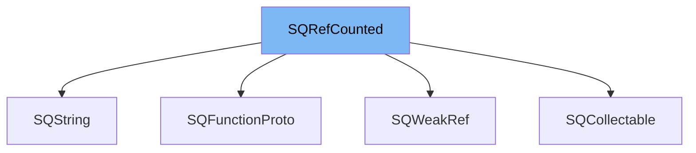

This document will cover the class <SwmToken path="src/3rdparty/squirrel/squirrel/sqobject.h" pos="59:1:1" line-data="	SQRefCounted() { _uiRef = 0; _weakref = nullptr; }">`SQRefCounted`</SwmToken> in detail. We will cover:

1. What <SwmToken path="src/3rdparty/squirrel/squirrel/sqobject.h" pos="59:1:1" line-data="	SQRefCounted() { _uiRef = 0; _weakref = nullptr; }">`SQRefCounted`</SwmToken> is.
2. Variables and functions in <SwmToken path="src/3rdparty/squirrel/squirrel/sqobject.h" pos="59:1:1" line-data="	SQRefCounted() { _uiRef = 0; _weakref = nullptr; }">`SQRefCounted`</SwmToken>.
3. Usage example of <SwmToken path="src/3rdparty/squirrel/squirrel/sqobject.h" pos="59:1:1" line-data="	SQRefCounted() { _uiRef = 0; _weakref = nullptr; }">`SQRefCounted`</SwmToken> in <SwmToken path="src/3rdparty/squirrel/squirrel/sqfuncproto.h" pos="60:2:2" line-data="struct SQFunctionProto : public SQRefCounted">`SQFunctionProto`</SwmToken>.



# What is <SwmToken path="src/3rdparty/squirrel/squirrel/sqobject.h" pos="59:1:1" line-data="	SQRefCounted() { _uiRef = 0; _weakref = nullptr; }">`SQRefCounted`</SwmToken>

<SwmToken path="src/3rdparty/squirrel/squirrel/sqobject.h" pos="59:1:1" line-data="	SQRefCounted() { _uiRef = 0; _weakref = nullptr; }">`SQRefCounted`</SwmToken> is a class defined in <SwmPath>[src/3rdparty/squirrel/squirrel/sqobject.h](src/3rdparty/squirrel/squirrel/sqobject.h)</SwmPath>. It is used for managing reference counting in the Squirrel language implementation. This class provides mechanisms to handle object lifetimes through reference counting, ensuring that objects are properly released when they are no longer needed.

<SwmSnippet path="/src/3rdparty/squirrel/squirrel/sqobject.h" line="62">

---

# Variables and functions

The variable <SwmToken path="src/3rdparty/squirrel/squirrel/sqobject.h" pos="62:3:3" line-data="	SQUnsignedInteger _uiRef;">`_uiRef`</SwmToken> is used to store the reference count of the object. It is incremented and decremented as references to the object are added or removed.

```c
	SQUnsignedInteger _uiRef;
```

---

</SwmSnippet>

<SwmSnippet path="/src/3rdparty/squirrel/squirrel/sqobject.h" line="63">

---

The variable <SwmToken path="src/3rdparty/squirrel/squirrel/sqobject.h" pos="63:6:6" line-data="	struct SQWeakRef *_weakref;">`_weakref`</SwmToken> is a pointer to an <SwmToken path="src/3rdparty/squirrel/squirrel/sqobject.h" pos="63:3:3" line-data="	struct SQWeakRef *_weakref;">`SQWeakRef`</SwmToken> object. It is used to manage weak references to the object, allowing the object to be referenced without preventing its destruction.

```c
	struct SQWeakRef *_weakref;
```

---

</SwmSnippet>

<SwmSnippet path="/src/3rdparty/squirrel/squirrel/sqobject.h" line="59">

---

The constructor <SwmToken path="src/3rdparty/squirrel/squirrel/sqobject.h" pos="59:1:3" line-data="	SQRefCounted() { _uiRef = 0; _weakref = nullptr; }">`SQRefCounted()`</SwmToken> initializes the reference count to 0 and the weak reference pointer to <SwmToken path="src/3rdparty/squirrel/squirrel/sqobject.h" pos="59:18:18" line-data="	SQRefCounted() { _uiRef = 0; _weakref = nullptr; }">`nullptr`</SwmToken>.

```c
	SQRefCounted() { _uiRef = 0; _weakref = nullptr; }
```

---

</SwmSnippet>

<SwmSnippet path="/src/3rdparty/squirrel/squirrel/sqobject.h" line="60">

---

The virtual destructor <SwmToken path="src/3rdparty/squirrel/squirrel/sqobject.h" pos="60:3:6" line-data="	virtual ~SQRefCounted();">`~SQRefCounted()`</SwmToken> ensures that derived classes can clean up resources properly when the object is destroyed.

```c
	virtual ~SQRefCounted();
```

---

</SwmSnippet>

<SwmSnippet path="/src/3rdparty/squirrel/squirrel/sqobject.h" line="61">

---

The function <SwmToken path="src/3rdparty/squirrel/squirrel/sqobject.h" pos="61:4:9" line-data="	SQWeakRef *GetWeakRef(SQObjectType type);">`GetWeakRef(SQObjectType type)`</SwmToken> returns a weak reference to the object. If the weak reference does not already exist, it creates a new <SwmToken path="src/3rdparty/squirrel/squirrel/sqobject.h" pos="61:1:1" line-data="	SQWeakRef *GetWeakRef(SQObjectType type);">`SQWeakRef`</SwmToken> object.

```c
	SQWeakRef *GetWeakRef(SQObjectType type);
```

---

</SwmSnippet>

<SwmSnippet path="/src/3rdparty/squirrel/squirrel/sqobject.h" line="64">

---

The pure virtual function <SwmToken path="src/3rdparty/squirrel/squirrel/sqobject.h" pos="64:5:7" line-data="	virtual void Release()=0;">`Release()`</SwmToken> must be implemented by derived classes to handle the release of the object when its reference count reaches zero.

```c
	virtual void Release()=0;
```

---

</SwmSnippet>

<SwmSnippet path="/src/3rdparty/squirrel/squirrel/sqobject.h" line="67">

---

The placement new operator <SwmToken path="src/3rdparty/squirrel/squirrel/sqobject.h" pos="67:6:19" line-data="	inline void *operator new(size_t size, SQRefCounted *place)">`operator new(size_t size, SQRefCounted *place)`</SwmToken> is used to allocate memory for the object at a specific location, preventing memory leaks if the constructor throws an exception.

```c
	inline void *operator new(size_t size, SQRefCounted *place)
	{
		place->size = size;
		return place;
	}
```

---

</SwmSnippet>

<SwmSnippet path="/src/3rdparty/squirrel/squirrel/sqobject.h" line="73">

---

The placement delete operator <SwmToken path="src/3rdparty/squirrel/squirrel/sqobject.h" pos="73:5:19" line-data="	inline void operator delete(void *ptr, SQRefCounted *place)">`operator delete(void *ptr, SQRefCounted *place)`</SwmToken> is used to deallocate memory for the object at a specific location.

```c
	inline void operator delete(void *ptr, SQRefCounted *place)
	{
		SQ_FREE(ptr, place->size);
	}
```

---

</SwmSnippet>

<SwmSnippet path="/src/3rdparty/squirrel/squirrel/sqobject.h" line="78">

---

The delete operator <SwmToken path="src/3rdparty/squirrel/squirrel/sqobject.h" pos="79:5:12" line-data="	inline void operator delete(void *) { NOT_REACHED(); }">`operator delete(void *)`</SwmToken> is defined but never used. It is required to prevent memory leaks.

```c
	/* Never used but required. */
	inline void operator delete(void *) { NOT_REACHED(); }
```

---

</SwmSnippet>

<SwmSnippet path="/src/3rdparty/squirrel/squirrel/sqobject.h" line="81">

---

The private variable <SwmToken path="src/3rdparty/squirrel/squirrel/sqobject.h" pos="82:3:3" line-data="	size_t size;">`size`</SwmToken> is used to store the size of the object. It is used in the placement new and delete operators.

```c
private:
	size_t size;
```

---

</SwmSnippet>

# Usage example

Here is an example of how to use <SwmToken path="src/3rdparty/squirrel/squirrel/sqobject.h" pos="59:1:1" line-data="	SQRefCounted() { _uiRef = 0; _weakref = nullptr; }">`SQRefCounted`</SwmToken> in <SwmToken path="src/3rdparty/squirrel/squirrel/sqfuncproto.h" pos="60:2:2" line-data="struct SQFunctionProto : public SQRefCounted">`SQFunctionProto`</SwmToken>.

<SwmSnippet path="/src/3rdparty/squirrel/squirrel/sqfuncproto.h" line="60">

---

<SwmToken path="src/3rdparty/squirrel/squirrel/sqfuncproto.h" pos="60:2:2" line-data="struct SQFunctionProto : public SQRefCounted">`SQFunctionProto`</SwmToken> is a class that inherits from <SwmToken path="src/3rdparty/squirrel/squirrel/sqfuncproto.h" pos="60:8:8" line-data="struct SQFunctionProto : public SQRefCounted">`SQRefCounted`</SwmToken>. It represents a function prototype in the Squirrel language.

```c
struct SQFunctionProto : public SQRefCounted
{
```

---

</SwmSnippet>

&nbsp;

*This is an auto-generated document by Swimm AI 🌊 and has not yet been verified by a human*

<SwmMeta version="3.0.0" repo-id="Z2l0aHViJTNBJTNBT3BlblRURC1jb3BpbG90LWRlbW8lM0ElM0Fzd2ltbWlv" repo-name="OpenTTD-copilot-demo"><sup>Powered by [Swimm](/)</sup></SwmMeta>
