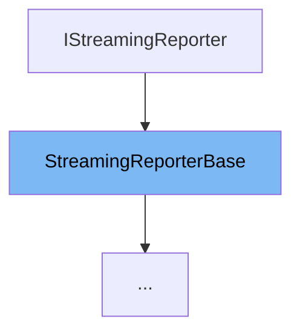

This document will cover the class <SwmToken path="src/3rdparty/catch2/catch.hpp" pos="5736:3:3" line-data="    struct StreamingReporterBase : IStreamingReporter {">`StreamingReporterBase`</SwmToken> in the <SwmPath>[src/3rdparty/catch2/catch.hpp](src/3rdparty/catch2/catch.hpp)</SwmPath> file. We will cover:

1. What <SwmToken path="src/3rdparty/catch2/catch.hpp" pos="5736:3:3" line-data="    struct StreamingReporterBase : IStreamingReporter {">`StreamingReporterBase`</SwmToken> is.
2. Variables and functions defined in <SwmToken path="src/3rdparty/catch2/catch.hpp" pos="5736:3:3" line-data="    struct StreamingReporterBase : IStreamingReporter {">`StreamingReporterBase`</SwmToken>.
3. An example of how to use <SwmToken path="src/3rdparty/catch2/catch.hpp" pos="5736:3:3" line-data="    struct StreamingReporterBase : IStreamingReporter {">`StreamingReporterBase`</SwmToken> in <SwmToken path="src/3rdparty/catch2/catch.hpp" pos="6155:3:3" line-data="    struct ConsoleReporter : StreamingReporterBase&lt;ConsoleReporter&gt; {">`ConsoleReporter`</SwmToken>.



# What is <SwmToken path="src/3rdparty/catch2/catch.hpp" pos="5736:3:3" line-data="    struct StreamingReporterBase : IStreamingReporter {">`StreamingReporterBase`</SwmToken>

<SwmToken path="src/3rdparty/catch2/catch.hpp" pos="5736:3:3" line-data="    struct StreamingReporterBase : IStreamingReporter {">`StreamingReporterBase`</SwmToken> is a class defined in the <SwmPath>[src/3rdparty/catch2/catch.hpp](src/3rdparty/catch2/catch.hpp)</SwmPath> file. It serves as a base class for reporters that output test results in a streaming manner. This class provides the foundational structure and common functionalities that other specific reporters can extend and build upon.

<SwmSnippet path="/src/3rdparty/catch2/catch.hpp" line="2260">

---

# Variables and functions

The variable <SwmToken path="src/3rdparty/catch2/catch.hpp" pos="2620:1:1" line-data="            m_stream &lt;&lt; value;">`m_stream`</SwmToken> is a protected member of the <SwmToken path="src/3rdparty/catch2/catch.hpp" pos="5736:3:3" line-data="    struct StreamingReporterBase : IStreamingReporter {">`StreamingReporterBase`</SwmToken> class. It is used to store the output stream where the test results will be written.

```c++
            "wrap the expression inside parentheses, or decompose it");
```

---

</SwmSnippet>

<SwmSnippet path="/src/3rdparty/catch2/catch.hpp" line="2262">

---

The constructor `StreamingReporterBase(ReporterConfig `<SwmToken path="src/3rdparty/catch2/catch.hpp" pos="492:6:7" line-data="        NonCopyable( NonCopyable const&amp; )              = delete;">`const&`</SwmToken>` `<SwmToken path="src/3rdparty/catch2/catch.hpp" pos="5738:9:9" line-data="        StreamingReporterBase( ReporterConfig const&amp; _config )">`_config`</SwmToken>`)` initializes the <SwmToken path="src/3rdparty/catch2/catch.hpp" pos="2620:1:1" line-data="            m_stream &lt;&lt; value;">`m_stream`</SwmToken> variable with the stream provided in the <SwmToken path="src/3rdparty/catch2/catch.hpp" pos="5738:9:9" line-data="        StreamingReporterBase( ReporterConfig const&amp; _config )">`_config`</SwmToken> parameter.

```c++

```

---

</SwmSnippet>

<SwmSnippet path="/src/3rdparty/catch2/catch.hpp" line="2264">

---

The function <SwmToken path="src/3rdparty/catch2/catch.hpp" pos="5655:9:11" line-data="        // static std::string getDescription();">`getDescription()`</SwmToken> returns a description of the reporter. It is a pure virtual function, meaning that derived classes must implement this function.

```c++
        auto operator != ( T ) const -> BinaryExpr<LhsT, RhsT const&> const {
```

---

</SwmSnippet>

<SwmSnippet path="/src/3rdparty/catch2/catch.hpp" line="2266">

---

The function <SwmToken path="src/3rdparty/catch2/catch.hpp" pos="5903:3:9" line-data="        void assertionStarting(AssertionInfo const&amp;) override {}">`assertionStarting(AssertionInfo const&)`</SwmToken> is called when an assertion is about to start. It is a virtual function that can be overridden by derived classes.

```c++
            "chained comparisons are not supported inside assertions, "
```

---

</SwmSnippet>

<SwmSnippet path="/src/3rdparty/catch2/catch.hpp" line="2268">

---

The function <SwmToken path="src/3rdparty/catch2/catch.hpp" pos="5980:3:9" line-data="        bool assertionEnded(AssertionStats const&amp;) override;">`assertionEnded(AssertionStats const&)`</SwmToken> is called when an assertion has ended. It is a virtual function that can be overridden by derived classes.

```c++
        }
```

---

</SwmSnippet>

<SwmSnippet path="/src/3rdparty/catch2/catch.hpp" line="2270">

---

The function <SwmToken path="src/3rdparty/catch2/catch.hpp" pos="5761:3:5" line-data="        void testRunStarting(TestRunInfo const&amp; _testRunInfo) override {">`testRunStarting(TestRunInfo`</SwmToken>` `<SwmToken path="src/3rdparty/catch2/catch.hpp" pos="492:6:7" line-data="        NonCopyable( NonCopyable const&amp; )              = delete;">`const&`</SwmToken>`)` is called when a test run is about to start. It is a virtual function that can be overridden by derived classes.

```c++
        template<typename T>
```

---

</SwmSnippet>

<SwmSnippet path="/src/3rdparty/catch2/catch.hpp" line="2272">

---

The function <SwmToken path="src/3rdparty/catch2/catch.hpp" pos="5785:3:5" line-data="        void testRunEnded(TestRunStats const&amp; /* _testRunStats */) override {">`testRunEnded(TestRunStats`</SwmToken>` `<SwmToken path="src/3rdparty/catch2/catch.hpp" pos="492:6:7" line-data="        NonCopyable( NonCopyable const&amp; )              = delete;">`const&`</SwmToken>`)` is called when a test run has ended. It is a virtual function that can be overridden by derived classes.

```c++
            static_assert(always_false<T>::value,
```

---

</SwmSnippet>

<SwmSnippet path="/src/3rdparty/catch2/catch.hpp" line="2274">

---

The function <SwmToken path="src/3rdparty/catch2/catch.hpp" pos="5769:3:5" line-data="        void testCaseStarting(TestCaseInfo const&amp; _testInfo) override  {">`testCaseStarting(TestCaseInfo`</SwmToken>` `<SwmToken path="src/3rdparty/catch2/catch.hpp" pos="492:6:7" line-data="        NonCopyable( NonCopyable const&amp; )              = delete;">`const&`</SwmToken>`)` is called when a test case is about to start. It is a virtual function that can be overridden by derived classes.

```c++
            "wrap the expression inside parentheses, or decompose it");
```

---

</SwmSnippet>

<SwmSnippet path="/src/3rdparty/catch2/catch.hpp" line="2276">

---

The function <SwmToken path="src/3rdparty/catch2/catch.hpp" pos="5779:3:5" line-data="        void testCaseEnded(TestCaseStats const&amp; /* _testCaseStats */) override {">`testCaseEnded(TestCaseStats`</SwmToken>` `<SwmToken path="src/3rdparty/catch2/catch.hpp" pos="492:6:7" line-data="        NonCopyable( NonCopyable const&amp; )              = delete;">`const&`</SwmToken>`)` is called when a test case has ended. It is a virtual function that can be overridden by derived classes.

```c++

```

---

</SwmSnippet>

# Usage example

Here is an example of how to use <SwmToken path="src/3rdparty/catch2/catch.hpp" pos="5736:3:3" line-data="    struct StreamingReporterBase : IStreamingReporter {">`StreamingReporterBase`</SwmToken> in <SwmToken path="src/3rdparty/catch2/catch.hpp" pos="6155:3:3" line-data="    struct ConsoleReporter : StreamingReporterBase&lt;ConsoleReporter&gt; {">`ConsoleReporter`</SwmToken>.

<SwmSnippet path="/src/3rdparty/catch2/catch.hpp" line="2300">

---

The <SwmToken path="src/3rdparty/catch2/catch.hpp" pos="6155:3:3" line-data="    struct ConsoleReporter : StreamingReporterBase&lt;ConsoleReporter&gt; {">`ConsoleReporter`</SwmToken> class extends <SwmToken path="src/3rdparty/catch2/catch.hpp" pos="5736:3:3" line-data="    struct StreamingReporterBase : IStreamingReporter {">`StreamingReporterBase`</SwmToken> and implements its virtual functions. It provides specific implementations for handling test run events and outputting results to the console.

```c++
    class UnaryExpr : public ITransientExpression {
        LhsT m_lhs;

        void streamReconstructedExpression( std::ostream &os ) const override {
            os << Catch::Detail::stringify( m_lhs );
        }

    public:
        explicit UnaryExpr( LhsT lhs )
        :   ITransientExpression{ false, static_cast<bool>(lhs) },
            m_lhs( lhs )
```

---

</SwmSnippet>

&nbsp;

*This is an auto-generated document by Swimm AI 🌊 and has not yet been verified by a human*

<SwmMeta version="3.0.0" repo-id="Z2l0aHViJTNBJTNBT3BlblRURC1jb3BpbG90LWRlbW8lM0ElM0Fzd2ltbWlv" repo-name="OpenTTD-copilot-demo"><sup>Powered by [Swimm](/)</sup></SwmMeta>
