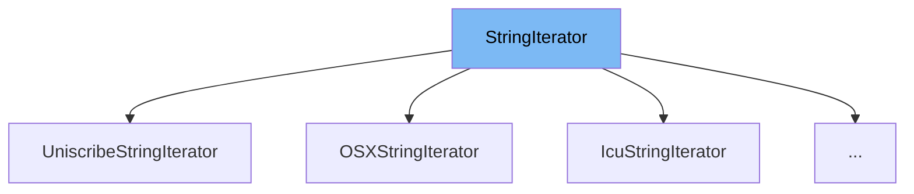

This document will cover the class <SwmToken path="src/string_base.h" pos="29:7:7" line-data="	static std::unique_ptr&lt;StringIterator&gt; Create();">`StringIterator`</SwmToken> in the <SwmToken path="src/string_base.h" pos="2:13:13" line-data=" * This file is part of OpenTTD.">`OpenTTD`</SwmToken> project. We will cover:

1. What <SwmToken path="src/string_base.h" pos="29:7:7" line-data="	static std::unique_ptr&lt;StringIterator&gt; Create();">`StringIterator`</SwmToken> is.
2. Variables and functions in <SwmToken path="src/string_base.h" pos="29:7:7" line-data="	static std::unique_ptr&lt;StringIterator&gt; Create();">`StringIterator`</SwmToken>.
3. Usage example of <SwmToken path="src/string_base.h" pos="29:7:7" line-data="	static std::unique_ptr&lt;StringIterator&gt; Create();">`StringIterator`</SwmToken> in <SwmToken path="src/os/windows/string_uniscribe.h" pos="67:2:2" line-data="class UniscribeStringIterator : public StringIterator {">`UniscribeStringIterator`</SwmToken>.



# What is <SwmToken path="src/string_base.h" pos="29:7:7" line-data="	static std::unique_ptr&lt;StringIterator&gt; Create();">`StringIterator`</SwmToken>

<SwmToken path="src/string_base.h" pos="29:7:7" line-data="	static std::unique_ptr&lt;StringIterator&gt; Create();">`StringIterator`</SwmToken> is a class defined in <SwmPath>[src/string_base.h](src/string_base.h)</SwmPath> for iterating over different parts of a string. It provides an interface for iterating over characters (grapheme clusters) or words within a string. This class is used to abstract the iteration logic, allowing different implementations to handle the specifics of string traversal.

<SwmSnippet path="/src/string_base.h" line="16">

---

# Variables and functions

The <SwmToken path="src/string_base.h" pos="17:3:3" line-data="	enum IterType {">`IterType`</SwmToken> enum defines the types of iterations that <SwmToken path="src/string_base.h" pos="29:7:7" line-data="	static std::unique_ptr&lt;StringIterator&gt; Create();">`StringIterator`</SwmToken> can perform. It includes <SwmToken path="src/string_base.h" pos="18:1:1" line-data="		ITER_CHARACTER, ///&lt; Iterate over characters (or more exactly grapheme clusters).">`ITER_CHARACTER`</SwmToken> for iterating over characters and <SwmToken path="src/string_base.h" pos="19:1:1" line-data="		ITER_WORD,      ///&lt; Iterate over words.">`ITER_WORD`</SwmToken> for iterating over words.

```c
	/** Type of the iterator. */
	enum IterType {
		ITER_CHARACTER, ///< Iterate over characters (or more exactly grapheme clusters).
		ITER_WORD,      ///< Iterate over words.
	};
```

---

</SwmSnippet>

<SwmSnippet path="/src/string_base.h" line="22">

---

The <SwmToken path="src/string_base.h" pos="22:9:9" line-data="	/** Sentinel to indicate end-of-iteration. */">`end`</SwmToken> constant is a sentinel value used to indicate the end of iteration. It is set to <SwmToken path="src/string_base.h" pos="23:11:11" line-data="	static const size_t END = SIZE_MAX;">`SIZE_MAX`</SwmToken>.

```c
	/** Sentinel to indicate end-of-iteration. */
	static const size_t END = SIZE_MAX;
```

---

</SwmSnippet>

<SwmSnippet path="/src/string_base.h" line="29">

---

The <SwmToken path="src/string_base.h" pos="29:10:10" line-data="	static std::unique_ptr&lt;StringIterator&gt; Create();">`Create`</SwmToken> function is a static method that creates a new instance of <SwmToken path="src/string_base.h" pos="29:7:7" line-data="	static std::unique_ptr&lt;StringIterator&gt; Create();">`StringIterator`</SwmToken>. It returns a <SwmToken path="src/string_base.h" pos="29:3:5" line-data="	static std::unique_ptr&lt;StringIterator&gt; Create();">`std::unique_ptr`</SwmToken> to the new instance.

```c
	static std::unique_ptr<StringIterator> Create();
```

---

</SwmSnippet>

<SwmSnippet path="/src/string_base.h" line="33">

---

The <SwmToken path="src/string_base.h" pos="38:5:5" line-data="	virtual void SetString(const char *s) = 0;">`SetString`</SwmToken> function is a pure virtual method that sets a new string for iteration. It resets the cursor to the start of the string.

```c
	/**
	 * Set a new iteration string. Must also be called if the string contents
	 * changed. The cursor is reset to the start of the string.
	 * @param s New string.
	 */
	virtual void SetString(const char *s) = 0;
```

---

</SwmSnippet>

<SwmSnippet path="/src/string_base.h" line="40">

---

The <SwmToken path="src/string_base.h" pos="46:5:5" line-data="	virtual size_t SetCurPosition(size_t pos) = 0;">`SetCurPosition`</SwmToken> function is a pure virtual method that changes the current cursor position within the string. It returns the new cursor position at the next valid character boundary.

```c
	/**
	 * Change the current string cursor.
	 * @param pos New cursor position.
	 * @return Actual new cursor position at the next valid character boundary.
	 * @pre pos has to be inside the current string.
	 */
	virtual size_t SetCurPosition(size_t pos) = 0;
```

---

</SwmSnippet>

<SwmSnippet path="/src/string_base.h" line="48">

---

The <SwmToken path="src/string_base.h" pos="52:5:5" line-data="	virtual size_t Next(IterType what = ITER_CHARACTER) = 0;">`Next`</SwmToken> function is a pure virtual method that advances the cursor by one iteration unit. It returns the new cursor position or <SwmToken path="src/string_base.h" pos="50:21:21" line-data="	 * @return New cursor position (in bytes) or #END if the cursor is already at the end of the string.">`END`</SwmToken> if the cursor is already at the end of the string.

```c
	/**
	 * Advance the cursor by one iteration unit.
	 * @return New cursor position (in bytes) or #END if the cursor is already at the end of the string.
	 */
	virtual size_t Next(IterType what = ITER_CHARACTER) = 0;
```

---

</SwmSnippet>

<SwmSnippet path="/src/string_base.h" line="54">

---

The <SwmToken path="src/string_base.h" pos="58:5:5" line-data="	virtual size_t Prev(IterType what = ITER_CHARACTER) = 0;">`Prev`</SwmToken> function is a pure virtual method that moves the cursor back by one iteration unit. It returns the new cursor position or <SwmToken path="src/string_base.h" pos="56:21:21" line-data="	 * @return New cursor position (in bytes) or #END if the cursor is already at the start of the string.">`END`</SwmToken> if the cursor is already at the start of the string.

```c
	/**
	 * Move the cursor back by one iteration unit.
	 * @return New cursor position (in bytes) or #END if the cursor is already at the start of the string.
	 */
	virtual size_t Prev(IterType what = ITER_CHARACTER) = 0;
```

---

</SwmSnippet>

<SwmSnippet path="/src/string_base.h" line="60">

---

The constructor <SwmToken path="src/string_base.h" pos="61:1:1" line-data="	StringIterator() {}">`StringIterator`</SwmToken> is protected, indicating that this class is intended to be used as a base class.

```c
protected:
	StringIterator() {}
```

---

</SwmSnippet>

# Usage example

Here is an example of how to use <SwmToken path="src/string_base.h" pos="29:7:7" line-data="	static std::unique_ptr&lt;StringIterator&gt; Create();">`StringIterator`</SwmToken> in <SwmToken path="src/os/windows/string_uniscribe.h" pos="67:2:2" line-data="class UniscribeStringIterator : public StringIterator {">`UniscribeStringIterator`</SwmToken>, which is a specific implementation of <SwmToken path="src/string_base.h" pos="29:7:7" line-data="	static std::unique_ptr&lt;StringIterator&gt; Create();">`StringIterator`</SwmToken>.

<SwmSnippet path="/src/os/windows/string_uniscribe.h" line="66">

---

<SwmToken path="src/os/windows/string_uniscribe.h" pos="67:2:2" line-data="class UniscribeStringIterator : public StringIterator {">`UniscribeStringIterator`</SwmToken> is a class that uses Uniscribe as a backend for string iteration. It inherits from <SwmToken path="src/os/windows/string_uniscribe.h" pos="67:8:8" line-data="class UniscribeStringIterator : public StringIterator {">`StringIterator`</SwmToken> and implements its virtual methods.

```c
/** String iterator using Uniscribe as a backend. */
class UniscribeStringIterator : public StringIterator {
```

---

</SwmSnippet>

&nbsp;

*This is an auto-generated document by Swimm AI 🌊 and has not yet been verified by a human*

<SwmMeta version="3.0.0" repo-id="Z2l0aHViJTNBJTNBT3BlblRURC1jb3BpbG90LWRlbW8lM0ElM0Fzd2ltbWlv" repo-name="OpenTTD-copilot-demo"><sup>Powered by [Swimm](/)</sup></SwmMeta>
