```mermaid
graph TD;
  TCPConnecter:::currentBaseStyle
TCPConnecter --> TCPServerConnecter
TCPServerConnecter --> TCPQueryConnecter
TCPServerConnecter --> 1[...]
TCPConnecter --> NetworkContentConnecter
TCPConnecter --> NetworkTurnConnecter
TCPConnecter --> 2[...]

 classDef currentBaseStyle color:#000000,fill:#7CB9F4

%% Swimm:
%% graph TD;
%%   TCPConnecter:::currentBaseStyle
%% <SwmToken path="src/network/core/tcp.h" pos="80:6:6" line-data="		Init,       ///&lt; TCPConnecter is created but resolving hasn&#39;t started.">`TCPConnecter`</SwmToken> --> <SwmToken path="src/network/core/tcp.h" pos="112:22:22" line-data="	 * access these private members, but it is okay for TCPServerConnecter. */">`TCPServerConnecter`</SwmToken>
%% <SwmToken path="src/network/core/tcp.h" pos="112:22:22" line-data="	 * access these private members, but it is okay for TCPServerConnecter. */">`TCPServerConnecter`</SwmToken> --> TCPQueryConnecter
%% <SwmToken path="src/network/core/tcp.h" pos="112:22:22" line-data="	 * access these private members, but it is okay for TCPServerConnecter. */">`TCPServerConnecter`</SwmToken> --> 1[...]
%% <SwmToken path="src/network/core/tcp.h" pos="80:6:6" line-data="		Init,       ///&lt; TCPConnecter is created but resolving hasn&#39;t started.">`TCPConnecter`</SwmToken> --> NetworkContentConnecter
%% <SwmToken path="src/network/core/tcp.h" pos="80:6:6" line-data="		Init,       ///&lt; TCPConnecter is created but resolving hasn&#39;t started.">`TCPConnecter`</SwmToken> --> NetworkTurnConnecter
%% <SwmToken path="src/network/core/tcp.h" pos="80:6:6" line-data="		Init,       ///&lt; TCPConnecter is created but resolving hasn&#39;t started.">`TCPConnecter`</SwmToken> --> 2[...]
%% 
%%  classDef currentBaseStyle color:#000000,fill:#7CB9F4
```

This document will cover the class <SwmToken path="src/network/core/tcp.h" pos="80:6:6" line-data="		Init,       ///&lt; TCPConnecter is created but resolving hasn&#39;t started.">`TCPConnecter`</SwmToken> in detail. We will cover:

1. What <SwmToken path="src/network/core/tcp.h" pos="80:6:6" line-data="		Init,       ///&lt; TCPConnecter is created but resolving hasn&#39;t started.">`TCPConnecter`</SwmToken> is.
2. Main variables and functions in <SwmToken path="src/network/core/tcp.h" pos="80:6:6" line-data="		Init,       ///&lt; TCPConnecter is created but resolving hasn&#39;t started.">`TCPConnecter`</SwmToken>.
3. Example of how to use <SwmToken path="src/network/core/tcp.h" pos="80:6:6" line-data="		Init,       ///&lt; TCPConnecter is created but resolving hasn&#39;t started.">`TCPConnecter`</SwmToken> in <SwmToken path="src/network/network_coordinator.cpp" pos="103:2:2" line-data="class NetworkCoordinatorConnecter : public TCPConnecter {">`NetworkCoordinatorConnecter`</SwmToken>.



# What is <SwmToken path="src/network/core/tcp.h" pos="80:6:6" line-data="		Init,       ///&lt; TCPConnecter is created but resolving hasn&#39;t started.">`TCPConnecter`</SwmToken>

The <SwmToken path="src/network/core/tcp.h" pos="80:6:6" line-data="		Init,       ///&lt; TCPConnecter is created but resolving hasn&#39;t started.">`TCPConnecter`</SwmToken> class is a helper class for creating TCP connections in a <SwmToken path="src/network/core/tcp.h" pos="68:21:23" line-data=" * &quot;Helper&quot; class for creating TCP connections in a non-blocking manner">`non-blocking`</SwmToken> manner. It is used to manage the process of establishing TCP connections, including resolving hostnames, attempting connections, and handling connection success or failure.

<SwmSnippet path="/src/network/core/tcp.h" line="79">

---

# Variables and functions

The <SwmToken path="src/network/core/tcp.h" pos="79:5:5" line-data="	enum class Status {">`Status`</SwmToken> enum class defines the various states of the <SwmToken path="src/network/core/tcp.h" pos="80:6:6" line-data="		Init,       ///&lt; TCPConnecter is created but resolving hasn&#39;t started.">`TCPConnecter`</SwmToken>, such as <SwmToken path="src/network/core/tcp.h" pos="80:1:1" line-data="		Init,       ///&lt; TCPConnecter is created but resolving hasn&#39;t started.">`Init`</SwmToken>, <SwmToken path="src/network/core/tcp.h" pos="80:14:14" line-data="		Init,       ///&lt; TCPConnecter is created but resolving hasn&#39;t started.">`resolving`</SwmToken>, <SwmToken path="src/network/core/tcp.h" pos="82:1:1" line-data="		Failure,    ///&lt; Resolving failed.">`Failure`</SwmToken>, <SwmToken path="src/network/core/tcp.h" pos="83:1:1" line-data="		Connecting, ///&lt; We are currently connecting.">`Connecting`</SwmToken>, and <SwmToken path="src/network/core/tcp.h" pos="84:1:1" line-data="		Connected,  ///&lt; The connection is established.">`Connected`</SwmToken>.

```c
	enum class Status {
		Init,       ///< TCPConnecter is created but resolving hasn't started.
		Resolving,  ///< The hostname is being resolved (threaded).
		Failure,    ///< Resolving failed.
		Connecting, ///< We are currently connecting.
		Connected,  ///< The connection is established.
	};
```

---

</SwmSnippet>

<SwmSnippet path="/src/network/core/tcp.h" line="87">

---

The <SwmToken path="src/network/core/tcp.h" pos="87:5:5" line-data="	std::thread resolve_thread;                         ///&lt; Thread used during resolving.">`resolve_thread`</SwmToken> variable is a <SwmToken path="src/network/core/tcp.h" pos="87:1:3" line-data="	std::thread resolve_thread;                         ///&lt; Thread used during resolving.">`std::thread`</SwmToken> used during the hostname resolving process.

```c
	std::thread resolve_thread;                         ///< Thread used during resolving.
```

---

</SwmSnippet>

<SwmSnippet path="/src/network/core/tcp.h" line="88">

---

The <SwmToken path="src/network/core/tcp.h" pos="88:5:5" line-data="	std::atomic&lt;Status&gt; status = Status::Init;          ///&lt; The current status of the connecter.">`Status`</SwmToken> variable is an <SwmToken path="src/network/core/tcp.h" pos="88:1:6" line-data="	std::atomic&lt;Status&gt; status = Status::Init;          ///&lt; The current status of the connecter.">`std::atomic<Status>`</SwmToken> that holds the current status of the connecter.

```c
	std::atomic<Status> status = Status::Init;          ///< The current status of the connecter.
```

---

</SwmSnippet>

<SwmSnippet path="/src/network/core/tcp.h" line="89">

---

The <SwmToken path="src/network/core/tcp.h" pos="89:8:8" line-data="	std::atomic&lt;bool&gt; killed = false;                   ///&lt; Whether this connecter is marked as killed.">`killed`</SwmToken> variable is an <SwmToken path="src/network/core/tcp.h" pos="89:1:6" line-data="	std::atomic&lt;bool&gt; killed = false;                   ///&lt; Whether this connecter is marked as killed.">`std::atomic<bool>`</SwmToken> that indicates whether the connecter is marked as killed.

```c
	std::atomic<bool> killed = false;                   ///< Whether this connecter is marked as killed.
```

---

</SwmSnippet>

<SwmSnippet path="/src/network/core/tcp.h" line="91">

---

The <SwmToken path="src/network/core/tcp.h" pos="91:4:4" line-data="	addrinfo *ai = nullptr;                             ///&lt; getaddrinfo() allocated linked-list of resolved addresses.">`ai`</SwmToken> variable is a pointer to an <SwmToken path="src/network/core/tcp.h" pos="91:1:1" line-data="	addrinfo *ai = nullptr;                             ///&lt; getaddrinfo() allocated linked-list of resolved addresses.">`addrinfo`</SwmToken> structure, which is a linked list of resolved addresses.

```c
	addrinfo *ai = nullptr;                             ///< getaddrinfo() allocated linked-list of resolved addresses.
```

---

</SwmSnippet>

<SwmSnippet path="/src/network/core/tcp.h" line="92">

---

The <SwmToken path="src/network/core/tcp.h" pos="92:9:9" line-data="	std::vector&lt;addrinfo *&gt; addresses;                  ///&lt; Addresses we can connect to.">`addresses`</SwmToken> variable is a <SwmToken path="src/network/core/tcp.h" pos="92:1:7" line-data="	std::vector&lt;addrinfo *&gt; addresses;                  ///&lt; Addresses we can connect to.">`std::vector<addrinfo *>`</SwmToken> that holds the addresses we can connect to.

```c
	std::vector<addrinfo *> addresses;                  ///< Addresses we can connect to.
```

---

</SwmSnippet>

<SwmSnippet path="/src/network/core/tcp.h" line="93">

---

The <SwmToken path="src/network/core/tcp.h" pos="93:11:11" line-data="	std::map&lt;SOCKET, NetworkAddress&gt; sock_to_address;   ///&lt; Mapping of a socket to the real address it is connecting to. USed for DEBUG statements.">`sock_to_address`</SwmToken> variable is a <SwmToken path="src/network/core/tcp.h" pos="93:1:9" line-data="	std::map&lt;SOCKET, NetworkAddress&gt; sock_to_address;   ///&lt; Mapping of a socket to the real address it is connecting to. USed for DEBUG statements.">`std::map<SOCKET, NetworkAddress>`</SwmToken> that maps a socket to the real address it is connecting to, used for debugging.

```c
	std::map<SOCKET, NetworkAddress> sock_to_address;   ///< Mapping of a socket to the real address it is connecting to. USed for DEBUG statements.
```

---

</SwmSnippet>

<SwmSnippet path="/src/network/core/tcp.h" line="94">

---

The <SwmToken path="src/network/core/tcp.h" pos="94:3:3" line-data="	size_t current_address = 0;                         ///&lt; Current index in addresses we are trying.">`current_address`</SwmToken> variable is a <SwmToken path="src/network/core/tcp.h" pos="94:1:1" line-data="	size_t current_address = 0;                         ///&lt; Current index in addresses we are trying.">`size_t`</SwmToken> that holds the current index in the addresses we are trying.

```c
	size_t current_address = 0;                         ///< Current index in addresses we are trying.
```

---

</SwmSnippet>

<SwmSnippet path="/src/network/core/tcp.h" line="96">

---

The <SwmToken path="src/network/core/tcp.h" pos="96:8:8" line-data="	std::vector&lt;SOCKET&gt; sockets;                        ///&lt; Pending connect() attempts.">`sockets`</SwmToken> variable is a <SwmToken path="src/network/core/tcp.h" pos="96:1:6" line-data="	std::vector&lt;SOCKET&gt; sockets;                        ///&lt; Pending connect() attempts.">`std::vector<SOCKET>`</SwmToken> that holds pending <SwmToken path="src/network/core/tcp.h" pos="96:15:17" line-data="	std::vector&lt;SOCKET&gt; sockets;                        ///&lt; Pending connect() attempts.">`connect()`</SwmToken> attempts.

```c
	std::vector<SOCKET> sockets;                        ///< Pending connect() attempts.
```

---

</SwmSnippet>

<SwmSnippet path="/src/network/core/tcp.h" line="97">

---

The <SwmToken path="src/network/core/tcp.h" pos="97:9:9" line-data="	std::chrono::steady_clock::time_point last_attempt; ///&lt; Time we last tried to connect.">`last_attempt`</SwmToken> variable is a <SwmToken path="src/network/core/tcp.h" pos="97:1:7" line-data="	std::chrono::steady_clock::time_point last_attempt; ///&lt; Time we last tried to connect.">`std::chrono::steady_clock::time_point`</SwmToken> that records the time we last tried to connect.

```c
	std::chrono::steady_clock::time_point last_attempt; ///< Time we last tried to connect.
```

---

</SwmSnippet>

<SwmSnippet path="/src/network/core/tcp.h" line="99">

---

The <SwmToken path="src/network/core/tcp.h" pos="99:5:5" line-data="	std::string connection_string;                      ///&lt; Current address we are connecting to (before resolving).">`connection_string`</SwmToken> variable is a <SwmToken path="src/network/core/tcp.h" pos="99:1:3" line-data="	std::string connection_string;                      ///&lt; Current address we are connecting to (before resolving).">`std::string`</SwmToken> that holds the current address we are connecting to before resolving.

```c
	std::string connection_string;                      ///< Current address we are connecting to (before resolving).
```

---

</SwmSnippet>

<SwmSnippet path="/src/network/core/tcp.h" line="100">

---

The <SwmToken path="src/network/core/tcp.h" pos="100:3:3" line-data="	NetworkAddress bind_address;                        ///&lt; Address we&#39;re binding to, if any.">`bind_address`</SwmToken> variable is a <SwmToken path="src/network/core/tcp.h" pos="100:1:1" line-data="	NetworkAddress bind_address;                        ///&lt; Address we&#39;re binding to, if any.">`NetworkAddress`</SwmToken> that holds the address we are binding to, if any.

```c
	NetworkAddress bind_address;                        ///< Address we're binding to, if any.
```

---

</SwmSnippet>

<SwmSnippet path="/src/network/core/tcp.h" line="101">

---

The <SwmToken path="src/network/core/tcp.h" pos="101:3:3" line-data="	int family = AF_UNSPEC;                             ///&lt; Family we are using to connect with.">`family`</SwmToken> variable is an `int` that specifies the family we are using to connect with, defaulting to <SwmToken path="src/network/core/tcp.h" pos="101:7:7" line-data="	int family = AF_UNSPEC;                             ///&lt; Family we are using to connect with.">`AF_UNSPEC`</SwmToken>.

```c
	int family = AF_UNSPEC;                             ///< Family we are using to connect with.
```

---

</SwmSnippet>

<SwmSnippet path="/src/network/core/tcp.h" line="103">

---

The <SwmToken path="src/network/core/tcp.h" pos="103:14:14" line-data="	static std::vector&lt;std::shared_ptr&lt;TCPConnecter&gt;&gt; connecters; ///&lt; List of connections that are currently being created.">`connecters`</SwmToken> variable is a static <SwmToken path="src/network/core/tcp.h" pos="103:3:12" line-data="	static std::vector&lt;std::shared_ptr&lt;TCPConnecter&gt;&gt; connecters; ///&lt; List of connections that are currently being created.">`std::vector<std::shared_ptr<TCPConnecter>>`</SwmToken> that holds a list of connections currently being created.

```c
	static std::vector<std::shared_ptr<TCPConnecter>> connecters; ///< List of connections that are currently being created.
```

---

</SwmSnippet>

<SwmSnippet path="/src/network/core/tcp.h" line="105">

---

The <SwmToken path="src/network/core/tcp.h" pos="105:3:3" line-data="	void Resolve();">`Resolve`</SwmToken> function is a private method that handles the hostname resolving process.

```c
	void Resolve();
```

---

</SwmSnippet>

<SwmSnippet path="/src/network/core/tcp.h" line="106">

---

The <SwmToken path="src/network/core/tcp.h" pos="106:3:3" line-data="	void OnResolved(addrinfo *ai);">`OnResolved`</SwmToken> function is a private method that is called when the hostname has been resolved.

```c
	void OnResolved(addrinfo *ai);
```

---

</SwmSnippet>

<SwmSnippet path="/src/network/core/tcp.h" line="107">

---

The <SwmToken path="src/network/core/tcp.h" pos="107:3:3" line-data="	bool TryNextAddress();">`TryNextAddress`</SwmToken> function is a private method that attempts to connect to the next address in the list.

```c
	bool TryNextAddress();
```

---

</SwmSnippet>

<SwmSnippet path="/src/network/core/tcp.h" line="108">

---

The <SwmToken path="src/network/core/tcp.h" pos="108:3:3" line-data="	void Connect(addrinfo *address);">`Connect`</SwmToken> function is a private method that initiates a connection to a given address.

```c
	void Connect(addrinfo *address);
```

---

</SwmSnippet>

<SwmSnippet path="/src/network/core/tcp.h" line="109">

---

The <SwmToken path="src/network/core/tcp.h" pos="109:5:5" line-data="	virtual bool CheckActivity();">`CheckActivity`</SwmToken> function is a virtual method that checks the activity of the connecter.

```c
	virtual bool CheckActivity();
```

---

</SwmSnippet>

<SwmSnippet path="/src/network/core/tcp.h" line="116">

---

The <SwmToken path="src/network/core/tcp.h" pos="115:5:5" line-data="	static void ResolveThunk(TCPConnecter *connecter);">`ResolveThunk`</SwmToken> function is a static method that serves as a thunk for the <SwmToken path="src/network/core/tcp.h" pos="105:3:3" line-data="	void Resolve();">`Resolve`</SwmToken> method.

```c

```

---

</SwmSnippet>

<SwmSnippet path="/src/network/core/tcp.h" line="118">

---

The default constructor for <SwmToken path="src/network/core/tcp.h" pos="118:1:1" line-data="	TCPConnecter() {};">`TCPConnecter`</SwmToken>.

```c
	TCPConnecter() {};
```

---

</SwmSnippet>

<SwmSnippet path="/src/network/core/tcp.h" line="119">

---

The parameterized constructor for <SwmToken path="src/network/core/tcp.h" pos="119:1:1" line-data="	TCPConnecter(const std::string &amp;connection_string, uint16_t default_port, const NetworkAddress &amp;bind_address = {}, int family = AF_UNSPEC);">`TCPConnecter`</SwmToken> that initializes the connection string, default port, bind address, and family.

```c
	TCPConnecter(const std::string &connection_string, uint16_t default_port, const NetworkAddress &bind_address = {}, int family = AF_UNSPEC);
```

---

</SwmSnippet>

<SwmSnippet path="/src/network/core/tcp.h" line="120">

---

The destructor for <SwmToken path="src/network/core/tcp.h" pos="120:4:4" line-data="	virtual ~TCPConnecter();">`TCPConnecter`</SwmToken>.

```c
	virtual ~TCPConnecter();
```

---

</SwmSnippet>

<SwmSnippet path="/src/network/core/tcp.h" line="126">

---

The <SwmToken path="src/network/core/tcp.h" pos="126:5:5" line-data="	virtual void OnConnect([[maybe_unused]] SOCKET s) {}">`OnConnect`</SwmToken> virtual method is a callback that is called when the connection succeeds.

```c
	virtual void OnConnect([[maybe_unused]] SOCKET s) {}
```

---

</SwmSnippet>

<SwmSnippet path="/src/network/core/tcp.h" line="130">

---

The <SwmToken path="src/network/core/tcp.h" pos="131:5:5" line-data="	virtual void OnFailure() {}">`OnFailure`</SwmToken> virtual method is a callback that is called when the connection attempt fails.

```c
	 */
```

---

</SwmSnippet>

<SwmSnippet path="/src/network/core/tcp.h" line="133">

---

The <SwmToken path="src/network/core/tcp.h" pos="133:3:3" line-data="	void Kill();">`Kill`</SwmToken> method marks the connecter as killed.

```c
	void Kill();
```

---

</SwmSnippet>

<SwmSnippet path="/src/network/core/tcp.h" line="135">

---

The <SwmToken path="src/network/core/tcp.h" pos="135:5:5" line-data="	static void CheckCallbacks();">`CheckCallbacks`</SwmToken> static method checks the callbacks for all connecters.

```c
	static void CheckCallbacks();
```

---

</SwmSnippet>

<SwmSnippet path="/src/network/core/tcp.h" line="136">

---

The <SwmToken path="src/network/core/tcp.h" pos="136:5:5" line-data="	static void KillAll();">`KillAll`</SwmToken> static method kills all connecters.

```c
	static void KillAll();
```

---

</SwmSnippet>

<SwmSnippet path="/src/network/core/tcp.h" line="145">

---

The <SwmToken path="src/network/core/tcp.h" pos="145:10:10" line-data="	static std::shared_ptr&lt;TCPConnecter&gt; Create(Args&amp;&amp; ... args)">`Create`</SwmToken> static template method creates a connecter and initiates connecting by putting it in the collection of TCP connections to make.

```c
	static std::shared_ptr<TCPConnecter> Create(Args&& ... args)
	{
		return TCPConnecter::connecters.emplace_back(std::make_shared<T>(std::forward<Args>(args)...));
	}
```

---

</SwmSnippet>

# Usage example

Here is an example of how to use <SwmToken path="src/network/core/tcp.h" pos="80:6:6" line-data="		Init,       ///&lt; TCPConnecter is created but resolving hasn&#39;t started.">`TCPConnecter`</SwmToken> in <SwmToken path="src/network/network_coordinator.cpp" pos="103:2:2" line-data="class NetworkCoordinatorConnecter : public TCPConnecter {">`NetworkCoordinatorConnecter`</SwmToken>.

<SwmSnippet path="/src/network/network_coordinator.cpp" line="30">

---

The <SwmToken path="src/network/network_coordinator.cpp" pos="103:2:2" line-data="class NetworkCoordinatorConnecter : public TCPConnecter {">`NetworkCoordinatorConnecter`</SwmToken> class extends <SwmToken path="src/network/network_coordinator.cpp" pos="35:8:8" line-data="class NetworkDirectConnecter : public TCPConnecter {">`TCPConnecter`</SwmToken> and demonstrates how to use it for network coordination.

```c++
ClientNetworkCoordinatorSocketHandler _network_coordinator_client; ///< The connection to the Game Coordinator.
ConnectionType _network_server_connection_type = CONNECTION_TYPE_UNKNOWN; ///< What type of connection the Game Coordinator detected we are on.
std::string _network_server_invite_code = ""; ///< Our invite code as indicated by the Game Coordinator.

/** Connect to a game server by IP:port. */
class NetworkDirectConnecter : public TCPConnecter {
```

---

</SwmSnippet>

&nbsp;

*This is an auto-generated document by Swimm AI 🌊 and has not yet been verified by a human*

<SwmMeta version="3.0.0" repo-id="Z2l0aHViJTNBJTNBT3BlblRURC1jb3BpbG90LWRlbW8lM0ElM0Fzd2ltbWlv" repo-name="OpenTTD-copilot-demo"><sup>Powered by [Swimm](/)</sup></SwmMeta>
