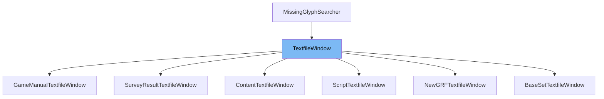

This document will cover the class <SwmToken path="src/textfile_gui.h" pos="43:1:1" line-data="	TextfileWindow(TextfileType file_type);">`TextfileWindow`</SwmToken> in the <SwmToken path="src/textfile_gui.h" pos="2:13:13" line-data=" * This file is part of OpenTTD.">`OpenTTD`</SwmToken> project. We will cover:

1. What <SwmToken path="src/textfile_gui.h" pos="43:1:1" line-data="	TextfileWindow(TextfileType file_type);">`TextfileWindow`</SwmToken> is.
2. Main variables and functions in <SwmToken path="src/textfile_gui.h" pos="43:1:1" line-data="	TextfileWindow(TextfileType file_type);">`TextfileWindow`</SwmToken>.
3. Example of how to use <SwmToken path="src/textfile_gui.h" pos="43:1:1" line-data="	TextfileWindow(TextfileType file_type);">`TextfileWindow`</SwmToken> in `GameManualTextfileWindow`.



# What is <SwmToken path="src/textfile_gui.h" pos="43:1:1" line-data="	TextfileWindow(TextfileType file_type);">`TextfileWindow`</SwmToken>

The <SwmToken path="src/textfile_gui.h" pos="43:1:1" line-data="	TextfileWindow(TextfileType file_type);">`TextfileWindow`</SwmToken> class is a GUI component in the <SwmToken path="src/textfile_gui.h" pos="2:13:13" line-data=" * This file is part of OpenTTD.">`OpenTTD`</SwmToken> project used for displaying text files. It extends the <SwmToken path="src/textfile_gui.h" pos="75:21:21" line-data="	std::vector&lt;HistoryEntry&gt; history;   ///&lt; Browsing history in this window.">`window`</SwmToken> class and implements the <SwmToken path="src/textfile_gui.h" pos="21:11:11" line-data="struct TextfileWindow : public Window, MissingGlyphSearcher {">`MissingGlyphSearcher`</SwmToken> interface. This class is responsible for rendering text files within a window, handling user interactions such as clicks and scrolls, and managing the display of hyperlinks and browsing history within the text file.

<SwmSnippet path="/src/textfile_gui.h" line="22">

---

# Variables and functions

The variable <SwmToken path="src/textfile_gui.h" pos="22:3:3" line-data="	TextfileType file_type;          ///&lt; Type of textfile to view.">`file_type`</SwmToken> is used to store the type of text file being viewed.

```c
	TextfileType file_type;          ///< Type of textfile to view.
```

---

</SwmSnippet>

<SwmSnippet path="/src/textfile_gui.h" line="23">

---

The variable <SwmToken path="src/textfile_gui.h" pos="23:4:4" line-data="	Scrollbar *vscroll;              ///&lt; Vertical scrollbar.">`vscroll`</SwmToken> is a pointer to the vertical scrollbar used in the window.

```c
	Scrollbar *vscroll;              ///< Vertical scrollbar.
```

---

</SwmSnippet>

<SwmSnippet path="/src/textfile_gui.h" line="24">

---

The variable <SwmToken path="src/textfile_gui.h" pos="24:4:4" line-data="	Scrollbar *hscroll;              ///&lt; Horizontal scrollbar.">`hscroll`</SwmToken> is a pointer to the horizontal scrollbar used in the window.

```c
	Scrollbar *hscroll;              ///< Horizontal scrollbar.
```

---

</SwmSnippet>

<SwmSnippet path="/src/textfile_gui.h" line="26">

---

The function <SwmToken path="src/textfile_gui.h" pos="26:3:3" line-data="	void UpdateWidgetSize(WidgetID widget, Dimension &amp;size, [[maybe_unused]] const Dimension &amp;padding, [[maybe_unused]] Dimension &amp;fill, [[maybe_unused]] Dimension &amp;resize) override;">`UpdateWidgetSize`</SwmToken> is used to update the size of a widget within the window.

```c
	void UpdateWidgetSize(WidgetID widget, Dimension &size, [[maybe_unused]] const Dimension &padding, [[maybe_unused]] Dimension &fill, [[maybe_unused]] Dimension &resize) override;
```

---

</SwmSnippet>

<SwmSnippet path="/src/textfile_gui.h" line="27">

---

The function <SwmToken path="src/textfile_gui.h" pos="27:3:3" line-data="	void OnClick([[maybe_unused]] Point pt, WidgetID widget, [[maybe_unused]] int click_count) override;">`OnClick`</SwmToken> handles click events on the window's widgets.

```c
	void OnClick([[maybe_unused]] Point pt, WidgetID widget, [[maybe_unused]] int click_count) override;
```

---

</SwmSnippet>

<SwmSnippet path="/src/textfile_gui.h" line="28">

---

The function <SwmToken path="src/textfile_gui.h" pos="28:3:3" line-data="	void DrawWidget(const Rect &amp;r, WidgetID widget) const override;">`DrawWidget`</SwmToken> is responsible for drawing a widget within the window.

```c
	void DrawWidget(const Rect &r, WidgetID widget) const override;
```

---

</SwmSnippet>

<SwmSnippet path="/src/textfile_gui.h" line="29">

---

The function <SwmToken path="src/textfile_gui.h" pos="29:3:3" line-data="	void OnResize() override;">`OnResize`</SwmToken> handles the resizing of the window.

```c
	void OnResize() override;
```

---

</SwmSnippet>

<SwmSnippet path="/src/textfile_gui.h" line="30">

---

The function <SwmToken path="src/textfile_gui.h" pos="30:3:3" line-data="	void OnInvalidateData(int data = 0, bool gui_scope = true) override;">`OnInvalidateData`</SwmToken> is called when the data in the window needs to be invalidated and refreshed.

```c
	void OnInvalidateData(int data = 0, bool gui_scope = true) override;
```

---

</SwmSnippet>

<SwmSnippet path="/src/textfile_gui.h" line="31">

---

The function <SwmToken path="src/textfile_gui.h" pos="31:3:3" line-data="	void OnDropdownSelect(WidgetID widget, int index) override;">`OnDropdownSelect`</SwmToken> handles the selection of items in dropdown menus within the window.

```c
	void OnDropdownSelect(WidgetID widget, int index) override;
```

---

</SwmSnippet>

<SwmSnippet path="/src/textfile_gui.h" line="33">

---

The function <SwmToken path="src/textfile_gui.h" pos="33:3:3" line-data="	void Reset() override;">`Reset`</SwmToken> resets the state of the window.

```c
	void Reset() override;
```

---

</SwmSnippet>

<SwmSnippet path="/src/textfile_gui.h" line="34">

---

The function <SwmToken path="src/textfile_gui.h" pos="34:3:3" line-data="	FontSize DefaultSize() override;">`DefaultSize`</SwmToken> returns the default font size for the text in the window.

```c
	FontSize DefaultSize() override;
```

---

</SwmSnippet>

<SwmSnippet path="/src/textfile_gui.h" line="35">

---

The function <SwmToken path="src/textfile_gui.h" pos="35:10:10" line-data="	std::optional&lt;std::string_view&gt; NextString() override;">`NextString`</SwmToken> returns the next string to be displayed in the window.

```c
	std::optional<std::string_view> NextString() override;
```

---

</SwmSnippet>

<SwmSnippet path="/src/textfile_gui.h" line="36">

---

The function <SwmToken path="src/textfile_gui.h" pos="36:3:3" line-data="	bool Monospace() override;">`Monospace`</SwmToken> returns whether the text in the window should be displayed in a monospace font.

```c
	bool Monospace() override;
```

---

</SwmSnippet>

<SwmSnippet path="/src/textfile_gui.h" line="37">

---

The function <SwmToken path="src/textfile_gui.h" pos="37:3:3" line-data="	void SetFontNames(FontCacheSettings *settings, const char *font_name, const void *os_data) override;">`SetFontNames`</SwmToken> sets the font names to be used in the window.

```c
	void SetFontNames(FontCacheSettings *settings, const char *font_name, const void *os_data) override;
```

---

</SwmSnippet>

<SwmSnippet path="/src/textfile_gui.h" line="38">

---

The function <SwmToken path="src/textfile_gui.h" pos="38:3:3" line-data="	void ScrollToLine(size_t line);">`ScrollToLine`</SwmToken> scrolls the window to a specific line.

```c
	void ScrollToLine(size_t line);
```

---

</SwmSnippet>

<SwmSnippet path="/src/textfile_gui.h" line="40">

---

The function <SwmToken path="src/textfile_gui.h" pos="40:5:5" line-data="	virtual void LoadTextfile(const std::string &amp;textfile, Subdirectory dir);">`LoadTextfile`</SwmToken> loads a text file into the window.

```c
	virtual void LoadTextfile(const std::string &textfile, Subdirectory dir);
```

---

</SwmSnippet>

<SwmSnippet path="/src/textfile_gui.h" line="43">

---

The constructor <SwmToken path="src/textfile_gui.h" pos="43:1:1" line-data="	TextfileWindow(TextfileType file_type);">`TextfileWindow`</SwmToken> initializes the window with a specific text file type.

```c
	TextfileWindow(TextfileType file_type);
```

---

</SwmSnippet>

<SwmSnippet path="/src/textfile_gui.h" line="44">

---

The function <SwmToken path="src/textfile_gui.h" pos="44:3:3" line-data="	void ConstructWindow();">`ConstructWindow`</SwmToken> constructs the window layout and initializes its components.

```c
	void ConstructWindow();
```

---

</SwmSnippet>

<SwmSnippet path="/src/textfile_gui.h" line="46">

---

The struct <SwmToken path="src/textfile_gui.h" pos="46:3:3" line-data="	struct Line {">`Line`</SwmToken> represents a line of text in the window, including its top and bottom scroll positions, text content, and color.

```c
	struct Line {
		int top = 0;                  ///< Top scroll position in visual lines.
		int bottom = 0;               ///< Bottom scroll position in visual lines.
		std::string text{};           ///< Contents of the line.
		TextColour colour = TC_WHITE; ///< Colour to render text line in.

		Line(int top, std::string_view text) : top(top), bottom(top + 1), text(text) {}
		Line() {}
	};
```

---

</SwmSnippet>

<SwmSnippet path="/src/textfile_gui.h" line="56">

---

The struct <SwmToken path="src/textfile_gui.h" pos="56:3:3" line-data="	struct Hyperlink {">`Hyperlink`</SwmToken> represents a hyperlink within the text, including its line number, start and end positions, and destination.

```c
	struct Hyperlink {
		size_t line;             ///< Which line the link is on.
		size_t begin;            ///< Character position on line the link begins.
		size_t end;              ///< Character position on line the link end.
		std::string destination; ///< Destination for the link.
	};
```

---

</SwmSnippet>

<SwmSnippet path="/src/textfile_gui.h" line="63">

---

The struct <SwmToken path="src/textfile_gui.h" pos="63:3:3" line-data="	struct HistoryEntry {">`HistoryEntry`</SwmToken> represents an entry in the browsing history, including the file path and scroll position.

```c
	struct HistoryEntry {
		std::string filepath;    ///< File the history entry is in.
		int scrollpos;           ///< Scrolling position the file was at at navigation time.
	};
```

---

</SwmSnippet>

<SwmSnippet path="/src/textfile_gui.h" line="68">

---

The variable <SwmToken path="src/textfile_gui.h" pos="68:5:5" line-data="	std::string filename{};              ///&lt; Filename of the textfile.">`filename`</SwmToken> stores the name of the text file being displayed.

```c
	std::string filename{};              ///< Filename of the textfile.
	std::string filepath{};              ///< Full path to the filename.
```

---

</SwmSnippet>

<SwmSnippet path="/src/textfile_gui.h" line="69">

---

The variable <SwmToken path="src/textfile_gui.h" pos="69:5:5" line-data="	std::string filepath{};              ///&lt; Full path to the filename.">`filepath`</SwmToken> stores the full path to the text file being displayed.

```c
	std::string filepath{};              ///< Full path to the filename.

```

---

</SwmSnippet>

<SwmSnippet path="/src/textfile_gui.h" line="71">

---

The variable <SwmToken path="src/textfile_gui.h" pos="71:8:8" line-data="	std::vector&lt;Line&gt; lines;             ///&lt; #text, split into lines in a table with lines.">`lines`</SwmToken> is a vector that stores the lines of text in the window.

```c
	std::vector<Line> lines;             ///< #text, split into lines in a table with lines.
```

---

</SwmSnippet>

<SwmSnippet path="/src/textfile_gui.h" line="72">

---

The variable <SwmToken path="src/textfile_gui.h" pos="72:8:8" line-data="	std::vector&lt;size_t&gt; jumplist;        ///&lt; Table of contents list, line numbers.">`jumplist`</SwmToken> is a vector that stores the table of contents list, including line numbers.

```c
	std::vector<size_t> jumplist;        ///< Table of contents list, line numbers.
```

---

</SwmSnippet>

<SwmSnippet path="/src/textfile_gui.h" line="73">

---

The variable <SwmToken path="src/textfile_gui.h" pos="73:8:8" line-data="	std::vector&lt;Hyperlink&gt; links;        ///&lt; Clickable links in lines.">`links`</SwmToken> is a vector that stores the clickable links within the text.

```c
	std::vector<Hyperlink> links;        ///< Clickable links in lines.
```

---

</SwmSnippet>

<SwmSnippet path="/src/textfile_gui.h" line="74">

---

The variable <SwmToken path="src/textfile_gui.h" pos="74:8:8" line-data="	std::vector&lt;Hyperlink&gt; link_anchors; ///&lt; Anchor names of headings that can be linked to.">`link_anchors`</SwmToken> is a vector that stores the anchor names of headings that can be linked to.

```c
	std::vector<Hyperlink> link_anchors; ///< Anchor names of headings that can be linked to.
```

---

</SwmSnippet>

<SwmSnippet path="/src/textfile_gui.h" line="75">

---

The variable <SwmToken path="src/textfile_gui.h" pos="75:8:8" line-data="	std::vector&lt;HistoryEntry&gt; history;   ///&lt; Browsing history in this window.">`history`</SwmToken> is a vector that stores the browsing history in the window.

```c
	std::vector<HistoryEntry> history;   ///< Browsing history in this window.
```

---

</SwmSnippet>

<SwmSnippet path="/src/textfile_gui.h" line="76">

---

The variable <SwmToken path="src/textfile_gui.h" pos="76:3:3" line-data="	size_t history_pos = 0;              ///&lt; Position in browsing history (for forward movement).">`history_pos`</SwmToken> stores the current position in the browsing history.

```c
	size_t history_pos = 0;              ///< Position in browsing history (for forward movement).
```

---

</SwmSnippet>

<SwmSnippet path="/src/textfile_gui.h" line="77">

---

The variable <SwmToken path="src/textfile_gui.h" pos="77:3:3" line-data="	bool trusted = false;                ///&lt; Whether the content is trusted (read: not from content like NewGRFs, etc).">`trusted`</SwmToken> indicates whether the content is trusted (e.g., not from external sources like <SwmToken path="src/textfile_gui.h" pos="77:34:34" line-data="	bool trusted = false;                ///&lt; Whether the content is trusted (read: not from content like NewGRFs, etc).">`NewGRFs`</SwmToken>).

```c
	bool trusted = false;                ///< Whether the content is trusted (read: not from content like NewGRFs, etc).
```

---

</SwmSnippet>

<SwmSnippet path="/src/textfile_gui.h" line="79">

---

The function <SwmToken path="src/textfile_gui.h" pos="79:3:3" line-data="	void LoadText(std::string_view buf);">`LoadText`</SwmToken> loads the text content into the window.

```c
	void LoadText(std::string_view buf);
```

---

</SwmSnippet>

<SwmSnippet path="/src/textfile_gui.h" line="80">

---

The function <SwmToken path="src/textfile_gui.h" pos="80:3:3" line-data="	void FindHyperlinksInMarkdown(Line &amp;line, size_t line_index);">`FindHyperlinksInMarkdown`</SwmToken> finds and processes hyperlinks within a markdown line.

```c
	void FindHyperlinksInMarkdown(Line &line, size_t line_index);
```

---

</SwmSnippet>

<SwmSnippet path="/src/textfile_gui.h" line="87">

---

The function <SwmToken path="src/textfile_gui.h" pos="87:5:5" line-data="	virtual void OnHyperlinkClick(const Hyperlink &amp;link);">`OnHyperlinkClick`</SwmToken> handles the clicking of a hyperlink.

```c
	virtual void OnHyperlinkClick(const Hyperlink &link);
```

---

</SwmSnippet>

&nbsp;

*This is an auto-generated document by Swimm AI 🌊 and has not yet been verified by a human*

<SwmMeta version="3.0.0" repo-id="Z2l0aHViJTNBJTNBT3BlblRURC1jb3BpbG90LWRlbW8lM0ElM0Fzd2ltbWlv" repo-name="OpenTTD-copilot-demo"><sup>Powered by [Swimm](/)</sup></SwmMeta>
