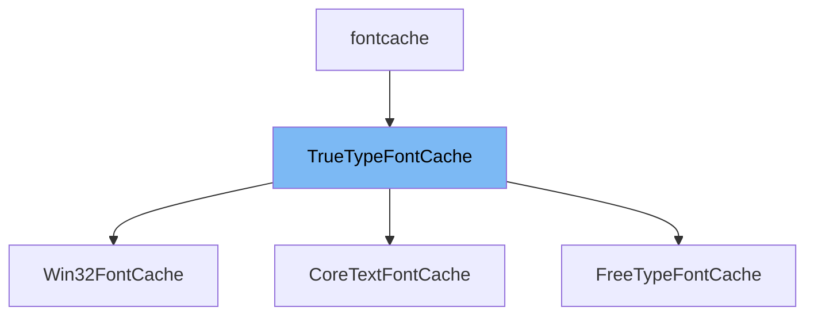

This document will cover the <SwmToken path="src/fontcache/truetypefontcache.h" pos="46:1:1" line-data="	TrueTypeFontCache(FontSize fs, int pixels);">`TrueTypeFontCache`</SwmToken> class. We will cover:

1. What <SwmToken path="src/fontcache/truetypefontcache.h" pos="46:1:1" line-data="	TrueTypeFontCache(FontSize fs, int pixels);">`TrueTypeFontCache`</SwmToken> is.
2. Main variables and functions in <SwmToken path="src/fontcache/truetypefontcache.h" pos="46:1:1" line-data="	TrueTypeFontCache(FontSize fs, int pixels);">`TrueTypeFontCache`</SwmToken>.
3. Example of how to use <SwmToken path="src/fontcache/truetypefontcache.h" pos="46:1:1" line-data="	TrueTypeFontCache(FontSize fs, int pixels);">`TrueTypeFontCache`</SwmToken> in <SwmToken path="src/os/windows/font_win32.cpp" pos="109:0:0" line-data="Win32FontCache::Win32FontCache(FontSize fs, const LOGFONT &amp;logfont, int pixels) : TrueTypeFontCache(fs, pixels), logfont(logfont)">`Win32FontCache`</SwmToken>.



# What is <SwmToken path="src/fontcache/truetypefontcache.h" pos="46:1:1" line-data="	TrueTypeFontCache(FontSize fs, int pixels);">`TrueTypeFontCache`</SwmToken>

<SwmToken path="src/fontcache/truetypefontcache.h" pos="46:1:1" line-data="	TrueTypeFontCache(FontSize fs, int pixels);">`TrueTypeFontCache`</SwmToken> is a class defined in <SwmPath>[src/fontcache/truetypefontcache.h](src/fontcache/truetypefontcache.h)</SwmPath>. It serves as a font cache for fonts that are based on a <SwmToken path="src/fontcache/truetypefontcache.h" pos="21:20:20" line-data="/** Font cache for fonts that are based on a TrueType font. */">`TrueType`</SwmToken> font. This class is used to manage and cache glyphs (characters) for <SwmToken path="src/fontcache/truetypefontcache.h" pos="21:20:20" line-data="/** Font cache for fonts that are based on a TrueType font. */">`TrueType`</SwmToken> fonts, ensuring efficient rendering and reuse of font data.

<SwmSnippet path="/src/fontcache/truetypefontcache.h" line="24">

---

# Variables and functions

The variable <SwmToken path="src/fontcache/truetypefontcache.h" pos="24:7:7" line-data="	static constexpr int MAX_GLYPH_DIM = 256;          ///&lt; Maximum glyph dimensions.">`MAX_GLYPH_DIM`</SwmToken> is a constant that defines the maximum dimensions for a glyph.

```c
	static constexpr int MAX_GLYPH_DIM = 256;          ///< Maximum glyph dimensions.
```

---

</SwmSnippet>

<SwmSnippet path="/src/fontcache/truetypefontcache.h" line="25">

---

The variable <SwmToken path="src/fontcache/truetypefontcache.h" pos="25:7:7" line-data="	static constexpr uint MAX_FONT_MIN_REC_SIZE = 20u; ///&lt; Upper limit for the recommended font size in case a font file contains nonsensical values.">`MAX_FONT_MIN_REC_SIZE`</SwmToken> is a constant that sets an upper limit for the recommended font size in case a font file contains nonsensical values.

```c
	static constexpr uint MAX_FONT_MIN_REC_SIZE = 20u; ///< Upper limit for the recommended font size in case a font file contains nonsensical values.
```

---

</SwmSnippet>

<SwmSnippet path="/src/fontcache/truetypefontcache.h" line="27">

---

The variable <SwmToken path="src/fontcache/truetypefontcache.h" pos="27:3:3" line-data="	int req_size;  ///&lt; Requested font size.">`req_size`</SwmToken> stores the requested font size.

```c
	int req_size;  ///< Requested font size.
```

---

</SwmSnippet>

<SwmSnippet path="/src/fontcache/truetypefontcache.h" line="28">

---

The variable <SwmToken path="src/fontcache/truetypefontcache.h" pos="28:3:3" line-data="	int used_size; ///&lt; Used font size.">`used_size`</SwmToken> stores the used font size.

```c
	int used_size; ///< Used font size.
```

---

</SwmSnippet>

<SwmSnippet path="/src/fontcache/truetypefontcache.h" line="32">

---

The variable <SwmToken path="src/fontcache/truetypefontcache.h" pos="32:10:10" line-data="		std::unique_ptr&lt;uint8_t[]&gt; data; ///&lt; The loaded sprite.">`data`</SwmToken> in the <SwmToken path="src/fontcache/truetypefontcache.h" pos="38:8:8" line-data="	std::unordered_map&lt;GlyphID, GlyphEntry&gt; glyph_to_sprite_map{};">`GlyphEntry`</SwmToken> struct is a unique pointer to an array of <SwmToken path="src/fontcache/truetypefontcache.h" pos="32:5:5" line-data="		std::unique_ptr&lt;uint8_t[]&gt; data; ///&lt; The loaded sprite.">`uint8_t`</SwmToken> that holds the loaded sprite data for a glyph.

```c
		std::unique_ptr<uint8_t[]> data; ///< The loaded sprite.
```

---

</SwmSnippet>

<SwmSnippet path="/src/fontcache/truetypefontcache.h" line="33">

---

The variable <SwmToken path="src/fontcache/truetypefontcache.h" pos="33:3:3" line-data="		uint8_t width = 0; ///&lt; The width of the glyph.">`width`</SwmToken> in the <SwmToken path="src/fontcache/truetypefontcache.h" pos="38:8:8" line-data="	std::unordered_map&lt;GlyphID, GlyphEntry&gt; glyph_to_sprite_map{};">`GlyphEntry`</SwmToken> struct stores the width of the glyph.

```c
		uint8_t width = 0; ///< The width of the glyph.
```

---

</SwmSnippet>

<SwmSnippet path="/src/fontcache/truetypefontcache.h" line="38">

---

The variable <SwmToken path="src/fontcache/truetypefontcache.h" pos="38:11:11" line-data="	std::unordered_map&lt;GlyphID, GlyphEntry&gt; glyph_to_sprite_map{};">`glyph_to_sprite_map`</SwmToken> is an unordered map that maps <SwmToken path="src/fontcache/truetypefontcache.h" pos="38:5:5" line-data="	std::unordered_map&lt;GlyphID, GlyphEntry&gt; glyph_to_sprite_map{};">`GlyphID`</SwmToken> to <SwmToken path="src/fontcache/truetypefontcache.h" pos="38:8:8" line-data="	std::unordered_map&lt;GlyphID, GlyphEntry&gt; glyph_to_sprite_map{};">`GlyphEntry`</SwmToken>.

```c
	std::unordered_map<GlyphID, GlyphEntry> glyph_to_sprite_map{};
```

---

</SwmSnippet>

<SwmSnippet path="/src/fontcache/truetypefontcache.h" line="35">

---

The function <SwmToken path="src/fontcache/truetypefontcache.h" pos="35:4:4" line-data="		Sprite *GetSprite() { return reinterpret_cast&lt;Sprite *&gt;(data.get()); }">`GetSprite`</SwmToken> in the <SwmToken path="src/fontcache/truetypefontcache.h" pos="38:8:8" line-data="	std::unordered_map&lt;GlyphID, GlyphEntry&gt; glyph_to_sprite_map{};">`GlyphEntry`</SwmToken> struct returns a pointer to a <SwmToken path="src/fontcache/truetypefontcache.h" pos="35:1:1" line-data="		Sprite *GetSprite() { return reinterpret_cast&lt;Sprite *&gt;(data.get()); }">`Sprite`</SwmToken> by interpreting the <SwmToken path="src/fontcache/truetypefontcache.h" pos="35:18:18" line-data="		Sprite *GetSprite() { return reinterpret_cast&lt;Sprite *&gt;(data.get()); }">`data`</SwmToken> pointer.

```c
		Sprite *GetSprite() { return reinterpret_cast<Sprite *>(data.get()); }
```

---

</SwmSnippet>

<SwmSnippet path="/src/fontcache/truetypefontcache.h" line="40">

---

The function <SwmToken path="src/fontcache/truetypefontcache.h" pos="40:4:4" line-data="	GlyphEntry *GetGlyphPtr(GlyphID key);">`GetGlyphPtr`</SwmToken> returns a pointer to a <SwmToken path="src/fontcache/truetypefontcache.h" pos="40:1:1" line-data="	GlyphEntry *GetGlyphPtr(GlyphID key);">`GlyphEntry`</SwmToken> for a given <SwmToken path="src/fontcache/truetypefontcache.h" pos="40:6:6" line-data="	GlyphEntry *GetGlyphPtr(GlyphID key);">`GlyphID`</SwmToken>.

```c
	GlyphEntry *GetGlyphPtr(GlyphID key);
```

---

</SwmSnippet>

<SwmSnippet path="/src/fontcache/truetypefontcache.h" line="41">

---

The function <SwmToken path="src/fontcache/truetypefontcache.h" pos="41:4:4" line-data="	GlyphEntry &amp;SetGlyphPtr(GlyphID key, GlyphEntry &amp;&amp;glyph);">`SetGlyphPtr`</SwmToken> sets a <SwmToken path="src/fontcache/truetypefontcache.h" pos="41:1:1" line-data="	GlyphEntry &amp;SetGlyphPtr(GlyphID key, GlyphEntry &amp;&amp;glyph);">`GlyphEntry`</SwmToken> for a given <SwmToken path="src/fontcache/truetypefontcache.h" pos="41:6:6" line-data="	GlyphEntry &amp;SetGlyphPtr(GlyphID key, GlyphEntry &amp;&amp;glyph);">`GlyphID`</SwmToken> and returns a reference to the <SwmToken path="src/fontcache/truetypefontcache.h" pos="41:1:1" line-data="	GlyphEntry &amp;SetGlyphPtr(GlyphID key, GlyphEntry &amp;&amp;glyph);">`GlyphEntry`</SwmToken>.

```c
	GlyphEntry &SetGlyphPtr(GlyphID key, GlyphEntry &&glyph);
```

---

</SwmSnippet>

<SwmSnippet path="/src/fontcache/truetypefontcache.h" line="43">

---

The function <SwmToken path="src/fontcache/truetypefontcache.h" pos="43:8:8" line-data="	virtual const Sprite *InternalGetGlyph(GlyphID key, bool aa) = 0;">`InternalGetGlyph`</SwmToken> is a pure virtual function that must be implemented by derived classes to return a <SwmToken path="src/fontcache/truetypefontcache.h" pos="43:5:5" line-data="	virtual const Sprite *InternalGetGlyph(GlyphID key, bool aa) = 0;">`Sprite`</SwmToken> for a given <SwmToken path="src/fontcache/truetypefontcache.h" pos="43:10:10" line-data="	virtual const Sprite *InternalGetGlyph(GlyphID key, bool aa) = 0;">`GlyphID`</SwmToken>.

```c
	virtual const Sprite *InternalGetGlyph(GlyphID key, bool aa) = 0;
```

---

</SwmSnippet>

<SwmSnippet path="/src/fontcache/truetypefontcache.h" line="46">

---

The constructor <SwmToken path="src/fontcache/truetypefontcache.h" pos="46:1:1" line-data="	TrueTypeFontCache(FontSize fs, int pixels);">`TrueTypeFontCache`</SwmToken> initializes the font cache with a given <SwmToken path="src/fontcache/truetypefontcache.h" pos="46:3:3" line-data="	TrueTypeFontCache(FontSize fs, int pixels);">`FontSize`</SwmToken> and pixel size.

```c
	TrueTypeFontCache(FontSize fs, int pixels);
```

---

</SwmSnippet>

<SwmSnippet path="/src/fontcache/truetypefontcache.h" line="47">

---

The destructor <SwmToken path="src/fontcache/truetypefontcache.h" pos="47:3:4" line-data="	virtual ~TrueTypeFontCache();">`~TrueTypeFontCache`</SwmToken> is a virtual destructor for the class.

```c
	virtual ~TrueTypeFontCache();
```

---

</SwmSnippet>

<SwmSnippet path="/src/fontcache/truetypefontcache.h" line="48">

---

The function <SwmToken path="src/fontcache/truetypefontcache.h" pos="48:3:3" line-data="	int GetFontSize() const override { return this-&gt;used_size; }">`GetFontSize`</SwmToken> returns the used font size.

```c
	int GetFontSize() const override { return this->used_size; }
```

---

</SwmSnippet>

<SwmSnippet path="/src/fontcache/truetypefontcache.h" line="49">

---

The function <SwmToken path="src/fontcache/truetypefontcache.h" pos="49:3:3" line-data="	void SetUnicodeGlyph(char32_t key, SpriteID sprite) override { this-&gt;parent-&gt;SetUnicodeGlyph(key, sprite); }">`SetUnicodeGlyph`</SwmToken> sets a Unicode glyph for a given <SwmToken path="src/fontcache/truetypefontcache.h" pos="49:5:5" line-data="	void SetUnicodeGlyph(char32_t key, SpriteID sprite) override { this-&gt;parent-&gt;SetUnicodeGlyph(key, sprite); }">`char32_t`</SwmToken> key and <SwmToken path="src/fontcache/truetypefontcache.h" pos="49:10:10" line-data="	void SetUnicodeGlyph(char32_t key, SpriteID sprite) override { this-&gt;parent-&gt;SetUnicodeGlyph(key, sprite); }">`SpriteID`</SwmToken>.

```c
	void SetUnicodeGlyph(char32_t key, SpriteID sprite) override { this->parent->SetUnicodeGlyph(key, sprite); }
```

---

</SwmSnippet>

<SwmSnippet path="/src/fontcache/truetypefontcache.h" line="50">

---

The function <SwmToken path="src/fontcache/truetypefontcache.h" pos="50:3:3" line-data="	void InitializeUnicodeGlyphMap() override { this-&gt;parent-&gt;InitializeUnicodeGlyphMap(); }">`InitializeUnicodeGlyphMap`</SwmToken> initializes the Unicode glyph map.

```c
	void InitializeUnicodeGlyphMap() override { this->parent->InitializeUnicodeGlyphMap(); }
```

---

</SwmSnippet>

<SwmSnippet path="/src/fontcache/truetypefontcache.h" line="51">

---

The function <SwmToken path="src/fontcache/truetypefontcache.h" pos="51:6:6" line-data="	const Sprite *GetGlyph(GlyphID key) override;">`GetGlyph`</SwmToken> returns a <SwmToken path="src/fontcache/truetypefontcache.h" pos="51:3:3" line-data="	const Sprite *GetGlyph(GlyphID key) override;">`Sprite`</SwmToken> for a given <SwmToken path="src/fontcache/truetypefontcache.h" pos="51:8:8" line-data="	const Sprite *GetGlyph(GlyphID key) override;">`GlyphID`</SwmToken>.

```c
	const Sprite *GetGlyph(GlyphID key) override;
```

---

</SwmSnippet>

<SwmSnippet path="/src/fontcache/truetypefontcache.h" line="52">

---

The function <SwmToken path="src/fontcache/truetypefontcache.h" pos="52:3:3" line-data="	void ClearFontCache() override;">`ClearFontCache`</SwmToken> clears the font cache.

```c
	void ClearFontCache() override;
```

---

</SwmSnippet>

<SwmSnippet path="/src/fontcache/truetypefontcache.h" line="53">

---

The function <SwmToken path="src/fontcache/truetypefontcache.h" pos="53:3:3" line-data="	uint GetGlyphWidth(GlyphID key) override;">`GetGlyphWidth`</SwmToken> returns the width of a glyph for a given <SwmToken path="src/fontcache/truetypefontcache.h" pos="53:5:5" line-data="	uint GetGlyphWidth(GlyphID key) override;">`GlyphID`</SwmToken>.

```c
	uint GetGlyphWidth(GlyphID key) override;
```

---

</SwmSnippet>

<SwmSnippet path="/src/fontcache/truetypefontcache.h" line="54">

---

The function <SwmToken path="src/fontcache/truetypefontcache.h" pos="54:3:3" line-data="	bool GetDrawGlyphShadow() override;">`GetDrawGlyphShadow`</SwmToken> returns whether to draw a shadow for the glyph.

```c
	bool GetDrawGlyphShadow() override;
```

---

</SwmSnippet>

<SwmSnippet path="/src/fontcache/truetypefontcache.h" line="55">

---

The function <SwmToken path="src/fontcache/truetypefontcache.h" pos="55:3:3" line-data="	bool IsBuiltInFont() override { return false; }">`IsBuiltInFont`</SwmToken> returns false, indicating that this is not a built-in font.

```c
	bool IsBuiltInFont() override { return false; }
```

---

</SwmSnippet>

# Usage example

Here is an example of how to use <SwmToken path="src/fontcache/truetypefontcache.h" pos="46:1:1" line-data="	TrueTypeFontCache(FontSize fs, int pixels);">`TrueTypeFontCache`</SwmToken> in <SwmToken path="src/os/windows/font_win32.cpp" pos="109:0:0" line-data="Win32FontCache::Win32FontCache(FontSize fs, const LOGFONT &amp;logfont, int pixels) : TrueTypeFontCache(fs, pixels), logfont(logfont)">`Win32FontCache`</SwmToken>.

<SwmSnippet path="/src/os/windows/font_win32.cpp" line="109">

---

The constructor <SwmToken path="src/os/windows/font_win32.cpp" pos="109:0:0" line-data="Win32FontCache::Win32FontCache(FontSize fs, const LOGFONT &amp;logfont, int pixels) : TrueTypeFontCache(fs, pixels), logfont(logfont)">`Win32FontCache`</SwmToken> initializes the font cache with a given <SwmToken path="src/os/windows/font_win32.cpp" pos="109:4:4" line-data="Win32FontCache::Win32FontCache(FontSize fs, const LOGFONT &amp;logfont, int pixels) : TrueTypeFontCache(fs, pixels), logfont(logfont)">`FontSize`</SwmToken>, <SwmToken path="src/os/windows/font_win32.cpp" pos="109:11:11" line-data="Win32FontCache::Win32FontCache(FontSize fs, const LOGFONT &amp;logfont, int pixels) : TrueTypeFontCache(fs, pixels), logfont(logfont)">`LOGFONT`</SwmToken>, and pixel size by calling the <SwmToken path="src/os/windows/font_win32.cpp" pos="109:24:24" line-data="Win32FontCache::Win32FontCache(FontSize fs, const LOGFONT &amp;logfont, int pixels) : TrueTypeFontCache(fs, pixels), logfont(logfont)">`TrueTypeFontCache`</SwmToken> constructor.

```c++
Win32FontCache::Win32FontCache(FontSize fs, const LOGFONT &logfont, int pixels) : TrueTypeFontCache(fs, pixels), logfont(logfont)
{
```

---

</SwmSnippet>

<SwmSnippet path="/src/os/windows/font_win32.cpp" line="190">

---

The <SwmToken path="src/os/windows/font_win32.cpp" pos="190:5:5" line-data="	this-&gt;TrueTypeFontCache::ClearFontCache();">`ClearFontCache`</SwmToken> function in <SwmToken path="src/os/windows/font_win32.cpp" pos="109:0:0" line-data="Win32FontCache::Win32FontCache(FontSize fs, const LOGFONT &amp;logfont, int pixels) : TrueTypeFontCache(fs, pixels), logfont(logfont)">`Win32FontCache`</SwmToken> calls the <SwmToken path="src/os/windows/font_win32.cpp" pos="190:5:5" line-data="	this-&gt;TrueTypeFontCache::ClearFontCache();">`ClearFontCache`</SwmToken> function from <SwmToken path="src/os/windows/font_win32.cpp" pos="190:3:3" line-data="	this-&gt;TrueTypeFontCache::ClearFontCache();">`TrueTypeFontCache`</SwmToken>.

```c++
	this->TrueTypeFontCache::ClearFontCache();
}
```

---

</SwmSnippet>

&nbsp;

*This is an auto-generated document by Swimm AI 🌊 and has not yet been verified by a human*

<SwmMeta version="3.0.0" repo-id="Z2l0aHViJTNBJTNBT3BlblRURC1jb3BpbG90LWRlbW8lM0ElM0Fzd2ltbWlv" repo-name="OpenTTD-copilot-demo"><sup>Powered by [Swimm](/)</sup></SwmMeta>
