```mermaid
graph TD;
  VideoDriver:::currentBaseStyle
VideoDriver --> VideoDriver_SDL_Base
VideoDriver_SDL_Base --> VideoDriver_SDL_OpenGL
VideoDriver_SDL_Base --> VideoDriver_SDL_Default
VideoDriver --> VideoDriver_Win32Base
VideoDriver_Win32Base --> VideoDriver_Win32GDI
VideoDriver_Win32Base --> 1[...]
VideoDriver --> VideoDriver_Cocoa
VideoDriver_Cocoa --> VideoDriver_CocoaQuartz
VideoDriver_Cocoa --> VideoDriver_CocoaOpenGL
VideoDriver --> 2[...]

 classDef currentBaseStyle color:#000000,fill:#7CB9F4

%% Swimm:
%% graph TD;
%%   VideoDriver:::currentBaseStyle
%% <SwmToken path="src/video/video_driver.hpp" pos="39:1:1" line-data="	VideoDriver(bool uses_hardware_acceleration = false) : fast_forward_key_pressed(false), fast_forward_via_key(false), is_game_threaded(true), uses_hardware_acceleration(uses_hardware_acceleration) {}">`VideoDriver`</SwmToken> --> VideoDriver_SDL_Base
%% VideoDriver_SDL_Base --> VideoDriver_SDL_OpenGL
%% VideoDriver_SDL_Base --> VideoDriver_SDL_Default
%% <SwmToken path="src/video/video_driver.hpp" pos="39:1:1" line-data="	VideoDriver(bool uses_hardware_acceleration = false) : fast_forward_key_pressed(false), fast_forward_via_key(false), is_game_threaded(true), uses_hardware_acceleration(uses_hardware_acceleration) {}">`VideoDriver`</SwmToken> --> VideoDriver_Win32Base
%% VideoDriver_Win32Base --> VideoDriver_Win32GDI
%% VideoDriver_Win32Base --> 1[...]
%% <SwmToken path="src/video/video_driver.hpp" pos="39:1:1" line-data="	VideoDriver(bool uses_hardware_acceleration = false) : fast_forward_key_pressed(false), fast_forward_via_key(false), is_game_threaded(true), uses_hardware_acceleration(uses_hardware_acceleration) {}">`VideoDriver`</SwmToken> --> VideoDriver_Cocoa
%% VideoDriver_Cocoa --> VideoDriver_CocoaQuartz
%% VideoDriver_Cocoa --> VideoDriver_CocoaOpenGL
%% <SwmToken path="src/video/video_driver.hpp" pos="39:1:1" line-data="	VideoDriver(bool uses_hardware_acceleration = false) : fast_forward_key_pressed(false), fast_forward_via_key(false), is_game_threaded(true), uses_hardware_acceleration(uses_hardware_acceleration) {}">`VideoDriver`</SwmToken> --> 2[...]
%% 
%%  classDef currentBaseStyle color:#000000,fill:#7CB9F4
```

This document will cover the <SwmToken path="src/video/video_driver.hpp" pos="39:1:1" line-data="	VideoDriver(bool uses_hardware_acceleration = false) : fast_forward_key_pressed(false), fast_forward_via_key(false), is_game_threaded(true), uses_hardware_acceleration(uses_hardware_acceleration) {}">`VideoDriver`</SwmToken> class in detail. We will cover:

1. What <SwmToken path="src/video/video_driver.hpp" pos="39:1:1" line-data="	VideoDriver(bool uses_hardware_acceleration = false) : fast_forward_key_pressed(false), fast_forward_via_key(false), is_game_threaded(true), uses_hardware_acceleration(uses_hardware_acceleration) {}">`VideoDriver`</SwmToken> is.
2. Variables and functions in <SwmToken path="src/video/video_driver.hpp" pos="39:1:1" line-data="	VideoDriver(bool uses_hardware_acceleration = false) : fast_forward_key_pressed(false), fast_forward_via_key(false), is_game_threaded(true), uses_hardware_acceleration(uses_hardware_acceleration) {}">`VideoDriver`</SwmToken>.
3. Usage example of <SwmToken path="src/video/video_driver.hpp" pos="39:1:1" line-data="	VideoDriver(bool uses_hardware_acceleration = false) : fast_forward_key_pressed(false), fast_forward_via_key(false), is_game_threaded(true), uses_hardware_acceleration(uses_hardware_acceleration) {}">`VideoDriver`</SwmToken> in `VideoDriver_Dedicated`.



# What is <SwmToken path="src/video/video_driver.hpp" pos="39:1:1" line-data="	VideoDriver(bool uses_hardware_acceleration = false) : fast_forward_key_pressed(false), fast_forward_via_key(false), is_game_threaded(true), uses_hardware_acceleration(uses_hardware_acceleration) {}">`VideoDriver`</SwmToken>

The <SwmToken path="src/video/video_driver.hpp" pos="39:1:1" line-data="	VideoDriver(bool uses_hardware_acceleration = false) : fast_forward_key_pressed(false), fast_forward_via_key(false), is_game_threaded(true), uses_hardware_acceleration(uses_hardware_acceleration) {}">`VideoDriver`</SwmToken> class in <SwmPath>[src/video/video_driver.hpp](src/video/video_driver.hpp)</SwmPath> is the base class for all video drivers in the <SwmToken path="src/video/video_driver.hpp" pos="2:13:13" line-data=" * This file is part of OpenTTD.">`OpenTTD`</SwmToken> project. It provides a common interface and shared functionality for different types of video drivers, such as those handling hardware acceleration, resolution changes, and graphical user interfaces.

<SwmSnippet path="/src/video/video_driver.hpp" line="35">

---

# Variables and functions

The variable <SwmToken path="src/video/video_driver.hpp" pos="35:5:5" line-data="	const uint DEFAULT_WINDOW_WIDTH = 640u;  ///&lt; Default window width.">`DEFAULT_WINDOW_WIDTH`</SwmToken> is used to store the default window width, which is set to 640 units.

```c++
	const uint DEFAULT_WINDOW_WIDTH = 640u;  ///< Default window width.
	const uint DEFAULT_WINDOW_HEIGHT = 480u; ///< Default window height.
```

---

</SwmSnippet>

<SwmSnippet path="/src/video/video_driver.hpp" line="36">

---

The variable <SwmToken path="src/video/video_driver.hpp" pos="36:5:5" line-data="	const uint DEFAULT_WINDOW_HEIGHT = 480u; ///&lt; Default window height.">`DEFAULT_WINDOW_HEIGHT`</SwmToken> is used to store the default window height, which is set to 480 units.

```c++
	const uint DEFAULT_WINDOW_HEIGHT = 480u; ///< Default window height.

```

---

</SwmSnippet>

<SwmSnippet path="/src/video/video_driver.hpp" line="39">

---

The constructor <SwmToken path="src/video/video_driver.hpp" pos="39:1:10" line-data="	VideoDriver(bool uses_hardware_acceleration = false) : fast_forward_key_pressed(false), fast_forward_via_key(false), is_game_threaded(true), uses_hardware_acceleration(uses_hardware_acceleration) {}">`VideoDriver(bool uses_hardware_acceleration = false)`</SwmToken> initializes the <SwmToken path="src/video/video_driver.hpp" pos="39:1:1" line-data="	VideoDriver(bool uses_hardware_acceleration = false) : fast_forward_key_pressed(false), fast_forward_via_key(false), is_game_threaded(true), uses_hardware_acceleration(uses_hardware_acceleration) {}">`VideoDriver`</SwmToken> object with optional hardware acceleration.

```c++
	VideoDriver(bool uses_hardware_acceleration = false) : fast_forward_key_pressed(false), fast_forward_via_key(false), is_game_threaded(true), uses_hardware_acceleration(uses_hardware_acceleration) {}
```

---

</SwmSnippet>

<SwmSnippet path="/src/video/video_driver.hpp" line="48">

---

The function <SwmToken path="src/video/video_driver.hpp" pos="48:1:29" line-data="	virtual void MakeDirty(int left, int top, int width, int height) = 0;">`virtual void MakeDirty(int left, int top, int width, int height) = 0`</SwmToken> marks a particular area of the screen as dirty, meaning it needs to be redrawn.

```c++
	virtual void MakeDirty(int left, int top, int width, int height) = 0;
```

---

</SwmSnippet>

<SwmSnippet path="/src/video/video_driver.hpp" line="53">

---

The function <SwmToken path="src/video/video_driver.hpp" pos="53:1:11" line-data="	virtual void MainLoop() = 0;">`virtual void MainLoop() = 0`</SwmToken> is responsible for performing the actual drawing operations.

```c++
	virtual void MainLoop() = 0;
```

---

</SwmSnippet>

<SwmSnippet path="/src/video/video_driver.hpp" line="61">

---

The function <SwmToken path="src/video/video_driver.hpp" pos="61:1:19" line-data="	virtual bool ChangeResolution(int w, int h) = 0;">`virtual bool ChangeResolution(int w, int h) = 0`</SwmToken> changes the resolution of the window and returns true if the change succeeded.

```c++
	virtual bool ChangeResolution(int w, int h) = 0;
```

---

</SwmSnippet>

<SwmSnippet path="/src/video/video_driver.hpp" line="68">

---

The function <SwmToken path="src/video/video_driver.hpp" pos="68:1:14" line-data="	virtual bool ToggleFullscreen(bool fullscreen) = 0;">`virtual bool ToggleFullscreen(bool fullscreen) = 0`</SwmToken> changes the full screen setting and returns true if the change succeeded.

```c++
	virtual bool ToggleFullscreen(bool fullscreen) = 0;
```

---

</SwmSnippet>

<SwmSnippet path="/src/video/video_driver.hpp" line="74">

---

The function <SwmToken path="src/video/video_driver.hpp" pos="74:1:16" line-data="	virtual void ToggleVsync([[maybe_unused]] bool vsync) {}">`virtual void ToggleVsync([[maybe_unused]] bool vsync)`</SwmToken> changes the vsync setting.

```c++
	virtual void ToggleVsync([[maybe_unused]] bool vsync) {}
```

---

</SwmSnippet>

<SwmSnippet path="/src/video/video_driver.hpp" line="80">

---

The function <SwmToken path="src/video/video_driver.hpp" pos="80:1:7" line-data="	virtual bool AfterBlitterChange()">`virtual bool AfterBlitterChange()`</SwmToken> is a callback invoked after the blitter was changed and returns true if no error occurred.

```c++
	virtual bool AfterBlitterChange()
	{
		return true;
	}
```

---

</SwmSnippet>

<SwmSnippet path="/src/video/video_driver.hpp" line="85">

---

The function <SwmToken path="src/video/video_driver.hpp" pos="85:1:7" line-data="	virtual bool ClaimMousePointer()">`virtual bool ClaimMousePointer()`</SwmToken> returns true if the mouse pointer is claimed by the video driver.

```c++
	virtual bool ClaimMousePointer()
	{
		return true;
	}
```

---

</SwmSnippet>

<SwmSnippet path="/src/video/video_driver.hpp" line="94">

---

The function <SwmToken path="src/video/video_driver.hpp" pos="94:1:7" line-data="	virtual bool UseSystemCursor()">`virtual bool UseSystemCursor()`</SwmToken> returns true if the mouse cursor is drawn by the video driver.

```c++
	virtual bool UseSystemCursor()
	{
		return false;
	}
```

---

</SwmSnippet>

<SwmSnippet path="/src/video/video_driver.hpp" line="102">

---

The function <SwmToken path="src/video/video_driver.hpp" pos="102:1:7" line-data="	virtual void PopulateSystemSprites() {}">`virtual void PopulateSystemSprites()`</SwmToken> populates all sprites in the cache.

```c++
	virtual void PopulateSystemSprites() {}

```

---

</SwmSnippet>

<SwmSnippet path="/src/video/video_driver.hpp" line="104">

---

The function <SwmToken path="src/video/video_driver.hpp" pos="107:1:7" line-data="	virtual void ClearSystemSprites() {}">`virtual void ClearSystemSprites()`</SwmToken> clears all cached sprites.

```c++
	/**
	 * Clear all cached sprites.
	 */
	virtual void ClearSystemSprites() {}
```

---

</SwmSnippet>

<SwmSnippet path="/src/video/video_driver.hpp" line="117">

---

The function <SwmToken path="src/video/video_driver.hpp" pos="117:1:9" line-data="	virtual bool HasGUI() const">`virtual bool HasGUI() const`</SwmToken> returns true if the video driver has a graphical user interface with the end user.

```c++
	virtual bool HasGUI() const
	{
		return true;
	}
```

---

</SwmSnippet>

<SwmSnippet path="/src/video/video_driver.hpp" line="126">

---

The function <SwmToken path="src/video/video_driver.hpp" pos="126:1:9" line-data="	virtual bool HasEfficient8Bpp() const">`virtual bool HasEfficient8Bpp() const`</SwmToken> returns true if the driver has an efficient code path for palette animated <SwmToken path="src/video/video_driver.hpp" pos="123:25:27" line-data="	 * Has this video driver an efficient code path for palette animated 8-bpp sprites?">`8-bpp`</SwmToken> sprites.

```c++
	virtual bool HasEfficient8Bpp() const
	{
		return false;
	}
```

---

</SwmSnippet>

<SwmSnippet path="/src/video/video_driver.hpp" line="135">

---

The function <SwmToken path="src/video/video_driver.hpp" pos="135:1:7" line-data="	virtual bool HasAnimBuffer()">`virtual bool HasAnimBuffer()`</SwmToken> returns true if a separate animation buffer is supported.

```c++
	virtual bool HasAnimBuffer()
	{
		return false;
	}
```

---

</SwmSnippet>

<SwmSnippet path="/src/video/video_driver.hpp" line="144">

---

The function <SwmToken path="src/video/video_driver.hpp" pos="144:1:8" line-data="	virtual uint8_t *GetAnimBuffer()">`virtual uint8_t *GetAnimBuffer()`</SwmToken> returns a pointer to the animation buffer of the video <SwmToken path="src/video/video_driver.hpp" pos="141:23:25" line-data="	 * Get a pointer to the animation buffer of the video back-end.">`back-end`</SwmToken> or nullptr if no animation buffer is supported.

```c++
	virtual uint8_t *GetAnimBuffer()
	{
		return nullptr;
	}
```

---

</SwmSnippet>

<SwmSnippet path="/src/video/video_driver.hpp" line="152">

---

The function <SwmToken path="src/video/video_driver.hpp" pos="152:1:7" line-data="	virtual void EditBoxLostFocus() {}">`virtual void EditBoxLostFocus()`</SwmToken> is called when an edit box loses the input focus.

```c++
	virtual void EditBoxLostFocus() {}

```

---

</SwmSnippet>

<SwmSnippet path="/src/video/video_driver.hpp" line="157">

---

The function <SwmToken path="src/video/video_driver.hpp" pos="157:1:7" line-data="	virtual void EditBoxGainedFocus() {}">`virtual void EditBoxGainedFocus()`</SwmToken> is called when an edit box gains the input focus.

```c++
	virtual void EditBoxGainedFocus() {}

```

---

</SwmSnippet>

<SwmSnippet path="/src/video/video_driver.hpp" line="163">

---

The function <SwmToken path="src/video/video_driver.hpp" pos="163:1:12" line-data="	virtual std::vector&lt;int&gt; GetListOfMonitorRefreshRates()">`virtual std::vector<int> GetListOfMonitorRefreshRates()`</SwmToken> returns a vector of the refresh rates of all available monitors.

```c++
	virtual std::vector<int> GetListOfMonitorRefreshRates()
	{
		return {};
	}
```

---

</SwmSnippet>

<SwmSnippet path="/src/video/video_driver.hpp" line="172">

---

The function <SwmToken path="src/video/video_driver.hpp" pos="171:1:7" line-data="	virtual int GetSuggestedUIScale()">`virtual int GetSuggestedUIScale()`</SwmToken> returns a suggested default GUI scale taking screen DPI into account.

```c++
	{
		float dpi_scale = this->GetDPIScale();

		return Clamp(dpi_scale * 100, MIN_INTERFACE_SCALE, MAX_INTERFACE_SCALE);
	}
```

---

</SwmSnippet>

<SwmSnippet path="/src/video/video_driver.hpp" line="178">

---

The function <SwmToken path="src/video/video_driver.hpp" pos="178:1:11" line-data="	virtual std::string_view GetInfoString() const">`virtual std::string_view GetInfoString() const`</SwmToken> returns an information string about the video driver.

```c++
	virtual std::string_view GetInfoString() const
	{
		return this->GetName();
	}
```

---

</SwmSnippet>

<SwmSnippet path="/src/video/video_driver.hpp" line="189">

---

The function <SwmToken path="src/video/video_driver.hpp" pos="189:1:16" line-data="	void QueueOnMainThread(std::function&lt;void()&gt; &amp;&amp;func)">`void QueueOnMainThread(std::function<void()> &&func)`</SwmToken> queues a function to be called on the main thread with the game state lock held and video buffer locked.

```c++
	void QueueOnMainThread(std::function<void()> &&func)
	{
		std::lock_guard<std::mutex> lock(this->cmd_queue_mutex);

		this->cmd_queue.emplace_back(std::forward<std::function<void()>>(func));
	}
```

---

</SwmSnippet>

<SwmSnippet path="/src/video/video_driver.hpp" line="201">

---

The function <SwmToken path="src/video/video_driver.hpp" pos="201:1:8" line-data="	static VideoDriver *GetInstance()">`static VideoDriver *GetInstance()`</SwmToken> returns the currently active instance of the video driver.

```c++
	static VideoDriver *GetInstance()
	{
		return static_cast<VideoDriver*>(*DriverFactoryBase::GetActiveDriver(Driver::DT_VIDEO));
	}
```

---

</SwmSnippet>

<SwmSnippet path="/src/video/video_driver.hpp" line="206">

---

The function <SwmToken path="src/video/video_driver.hpp" pos="206:1:9" line-data="	static std::string GetCaption();">`static std::string GetCaption()`</SwmToken> returns the caption of the video driver.

```c++
	static std::string GetCaption();
```

---

</SwmSnippet>

<SwmSnippet path="/src/video/video_driver.hpp" line="213">

---

The struct <SwmToken path="src/video/video_driver.hpp" pos="213:1:1" line-data="		VideoBufferLocker()">`VideoBufferLocker`</SwmToken> ensures the video buffer is locked and ready for drawing. The destructor ensures the buffer is unlocked no matter how the scope is exited.

```c++
		VideoBufferLocker()
		{
			this->unlock = VideoDriver::GetInstance()->LockVideoBuffer();
		}

		~VideoBufferLocker()
		{
			if (this->unlock) VideoDriver::GetInstance()->UnlockVideoBuffer();
		}
```

---

</SwmSnippet>

<SwmSnippet path="/src/video/video_driver.hpp" line="228">

---

The variable <SwmToken path="src/video/video_driver.hpp" pos="228:5:5" line-data="	const uint ALLOWED_DRIFT = 5; ///&lt; How many times videodriver can miss deadlines without it being overly compensated.">`ALLOWED_DRIFT`</SwmToken> defines how many times the video driver can miss deadlines without being overly compensated.

```c++
	const uint ALLOWED_DRIFT = 5; ///< How many times videodriver can miss deadlines without it being overly compensated.

```

---

</SwmSnippet>

<SwmSnippet path="/src/video/video_driver.hpp" line="233">

---

The function <SwmToken path="src/video/video_driver.hpp" pos="233:1:9" line-data="	virtual Dimension GetScreenSize() const { return { DEFAULT_WINDOW_WIDTH, DEFAULT_WINDOW_HEIGHT }; }">`virtual Dimension GetScreenSize() const`</SwmToken> returns the resolution of the main screen.

```c++
	virtual Dimension GetScreenSize() const { return { DEFAULT_WINDOW_WIDTH, DEFAULT_WINDOW_HEIGHT }; }
```

---

</SwmSnippet>

<SwmSnippet path="/src/video/video_driver.hpp" line="239">

---

The function <SwmToken path="src/video/video_driver.hpp" pos="239:1:7" line-data="	virtual float GetDPIScale() { return 1.0f; }">`virtual float GetDPIScale()`</SwmToken> returns the DPI scaling factor of the screen OTTD is displayed on.

```c++
	virtual float GetDPIScale() { return 1.0f; }
```

---

</SwmSnippet>

<SwmSnippet path="/src/video/video_driver.hpp" line="244">

---

The function <SwmToken path="src/video/video_driver.hpp" pos="244:1:5" line-data="	void UpdateAutoResolution()">`void UpdateAutoResolution()`</SwmToken> applies resolution <SwmToken path="src/video/video_driver.hpp" pos="242:7:9" line-data="	 * Apply resolution auto-detection and clamp to sensible defaults.">`auto-detection`</SwmToken> and clamps to sensible defaults.

```c++
	void UpdateAutoResolution()
	{
		if (_cur_resolution.width == 0 || _cur_resolution.height == 0) {
			/* Auto-detect a good resolution. We aim for 75% of the screen size.
			 * Limit width times height times bytes per pixel to fit a 32 bit
			 * integer, This way all internal drawing routines work correctly. */
			Dimension res = this->GetScreenSize();
			_cur_resolution.width  = ClampU(res.width  * 3 / 4, DEFAULT_WINDOW_WIDTH, UINT16_MAX / 2);
			_cur_resolution.height = ClampU(res.height * 3 / 4, DEFAULT_WINDOW_HEIGHT, UINT16_MAX / 2);
		}
	}
```

---

</SwmSnippet>

&nbsp;

*This is an auto-generated document by Swimm AI 🌊 and has not yet been verified by a human*

<SwmMeta version="3.0.0" repo-id="Z2l0aHViJTNBJTNBT3BlblRURC1jb3BpbG90LWRlbW8lM0ElM0Fzd2ltbWlv" repo-name="OpenTTD-copilot-demo"><sup>Powered by [Swimm](/)</sup></SwmMeta>
