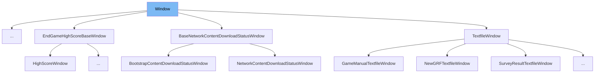

This document will cover the class <SwmToken path="src/window_gui.h" pos="1000:0:0" line-data="Window *BringWindowToFrontById(WindowClass cls, WindowNumber number);">`Window`</SwmToken> in the file <SwmPath>[src/window_gui.h](src/window_gui.h)</SwmPath>. We will cover:

1. What <SwmToken path="src/window_gui.h" pos="1000:0:0" line-data="Window *BringWindowToFrontById(WindowClass cls, WindowNumber number);">`Window`</SwmToken> is and its purpose.
2. Variables and functions defined in <SwmToken path="src/window_gui.h" pos="1000:0:0" line-data="Window *BringWindowToFrontById(WindowClass cls, WindowNumber number);">`Window`</SwmToken>.
3. An example of how to use <SwmToken path="src/window_gui.h" pos="1000:0:0" line-data="Window *BringWindowToFrontById(WindowClass cls, WindowNumber number);">`Window`</SwmToken> in `MusicTrackSelectionWindow`.



# What is Window

The <SwmToken path="src/window_gui.h" pos="1000:0:0" line-data="Window *BringWindowToFrontById(WindowClass cls, WindowNumber number);">`Window`</SwmToken> class in <SwmPath>[src/window_gui.h](src/window_gui.h)</SwmPath> is a core component of the GUI system in <SwmToken path="src/window_gui.h" pos="2:13:13" line-data=" * This file is part of OpenTTD.">`OpenTTD`</SwmToken>. It represents an open window in the game, managing its position, size, content, and interactions. The class provides a wide range of functionalities to handle window behavior, including initialization, resizing, drawing, and event handling.

<SwmSnippet path="/src/window_gui.h" line="335">

---

# Variables and functions

The function <SwmToken path="src/window_gui.h" pos="335:8:8" line-data="	inline const NWID *GetWidget(WidgetID widnum) const;">`GetWidget`</SwmToken> is a template function that retrieves a nested widget with a given widget ID from the nested widget tree. It returns the requested widget if it is instantiated, or <SwmToken path="src/window_gui.h" pos="1021:8:8" line-data="	if (w != nullptr) return return_existing ? w : nullptr;">`nullptr`</SwmToken> otherwise.

```c
	inline const NWID *GetWidget(WidgetID widnum) const;
	template <class NWID>
	inline NWID *GetWidget(WidgetID widnum);
```

---

</SwmSnippet>

<SwmSnippet path="/src/window_gui.h" line="1000">

---

The function <SwmToken path="src/window_gui.h" pos="1000:3:3" line-data="Window *BringWindowToFrontById(WindowClass cls, WindowNumber number);">`BringWindowToFrontById`</SwmToken> brings a window with a specific class and window number to the front. It returns a pointer to the window.

```c
Window *BringWindowToFrontById(WindowClass cls, WindowNumber number);
Window *FindWindowFromPt(int x, int y);
```

---

</SwmSnippet>

<SwmSnippet path="/src/window_gui.h" line="1017">

---

The function <SwmToken path="src/window_gui.h" pos="1018:3:3" line-data="Wcls *AllocateWindowDescFront(WindowDesc &amp;desc, int window_number, bool return_existing = false)">`AllocateWindowDescFront`</SwmToken> is a template function that opens a new window. If the window already exists and <SwmToken path="src/window_gui.h" pos="1018:18:18" line-data="Wcls *AllocateWindowDescFront(WindowDesc &amp;desc, int window_number, bool return_existing = false)">`return_existing`</SwmToken> is set, it returns the existing window. Otherwise, it creates a new window and returns a pointer to it.

```c
template <typename Wcls>
Wcls *AllocateWindowDescFront(WindowDesc &desc, int window_number, bool return_existing = false)
{
	Wcls *w = static_cast<Wcls *>(BringWindowToFrontById(desc.cls, window_number));
	if (w != nullptr) return return_existing ? w : nullptr;
	return new Wcls(desc, window_number);
}
```

---

</SwmSnippet>

# Usage example

The `MusicTrackSelectionWindow` in <SwmPath>[src/music_gui.cpp](src/music_gui.cpp)</SwmPath> is an example of how to use the <SwmToken path="src/window_gui.h" pos="1000:0:0" line-data="Window *BringWindowToFrontById(WindowClass cls, WindowNumber number);">`Window`</SwmToken> class. This window allows users to select music tracks within the game. It demonstrates how to initialize a window, set its properties, and handle user interactions.

&nbsp;

*This is an auto-generated document by Swimm AI 🌊 and has not yet been verified by a human*

<SwmMeta version="3.0.0" repo-id="Z2l0aHViJTNBJTNBT3BlblRURC1jb3BpbG90LWRlbW8lM0ElM0Fzd2ltbWlv" repo-name="OpenTTD-copilot-demo"><sup>Powered by [Swimm](/)</sup></SwmMeta>
